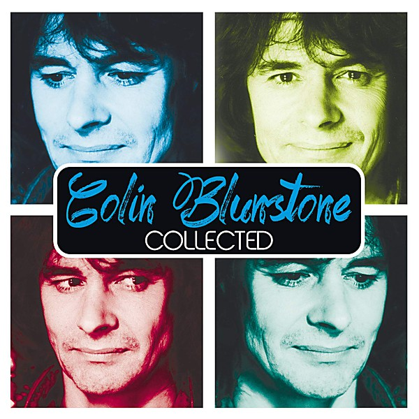

# Collected

By **Colin Blunstone**

## Album Data

- **Catalog:** Beets
- **Format:** Digital, Album
- **Album:** Collected
- **Artist:** Colin Blunstone
- **Albumartist:** Colin Blunstone
- **Genre:** Psychedelic Pop
- **MusicBrainz Album Artist ID:** [59cc681e-becf-4df3-992a-24d8ac99e492](https://musicbrainz.org/artist/59cc681e-becf-4df3-992a-24d8ac99e492)
- **MusicBrainz Album ID:** [49565206-900d-4dc0-8135-a52b3eb317ce](https://musicbrainz.org/release/49565206-900d-4dc0-8135-a52b3eb317ce)
- **MusicBrainz Release Group ID:** [79bfb0dc-2aba-42c4-a906-4e31f04e5b98](https://musicbrainz.org/release-group/79bfb0dc-2aba-42c4-a906-4e31f04e5b98)
- **Year:** 2014
- **Catalog #:** 534 274-4
- **Label:** Universal Music
- **Total Tracks:** 60

## Album Tracks

### Track 53 - Julie (If You Leave Me)

- **Artist:** Don Airey
- **Format:** ALAC
- **Genre:** Progressive Rock
- **Length:** 4:19
- **MusicBrainz Track ID:** [d058daf9-1c9a-4a09-886b-0809e44c74df](https://musicbrainz.org/recording/d058daf9-1c9a-4a09-886b-0809e44c74df)
- **Title:** Julie (If You Leave Me)
- **Track:** 53
- **Year:** 2014

### Track 56 - Losing Your Way in the Rain

- **Artist:** Mike Batt
- **Format:** ALAC
- **Genre:** Progressive Rock
- **Length:** 3:39
- **MusicBrainz Track ID:** [03e9af9c-ec95-42ff-b79a-eb598b8607ff](https://musicbrainz.org/recording/03e9af9c-ec95-42ff-b79a-eb598b8607ff)
- **Title:** Losing Your Way in the Rain
- **Track:** 56
- **Year:** 2014

### Track 44 - Tiger in the Night

- **Artist:** Mike Batt & Royal Philharmonic Orchestra
- **Format:** ALAC
- **Genre:** Psychedelic Pop
- **Length:** 3:03
- **MusicBrainz Track ID:** [728468ec-5a67-426f-82b5-8f3021f7b5b3](https://musicbrainz.org/recording/728468ec-5a67-426f-82b5-8f3021f7b5b3)
- **Title:** Tiger in the Night
- **Track:** 44
- **Year:** 2014

### Track 05 - Say You Don’t Mind

- **Artist:** Colin Blunstone
- **Format:** ALAC
- **Genre:** Psychedelic Pop
- **Length:** 3:20
- **MusicBrainz Track ID:** [b6bc7f06-aa63-4a62-a3fb-b441980a996a](https://musicbrainz.org/recording/b6bc7f06-aa63-4a62-a3fb-b441980a996a)
- **Title:** Say You Don’t Mind
- **Track:** 05
- **Year:** 2014

### Track 06 - Caroline Goodbye

- **Artist:** Colin Blunstone
- **Format:** ALAC
- **Genre:** Rock
- **Length:** 2:55
- **MusicBrainz Track ID:** [503481e2-5e41-4a7b-9a76-74b46361d78e](https://musicbrainz.org/recording/503481e2-5e41-4a7b-9a76-74b46361d78e)
- **Title:** Caroline Goodbye
- **Track:** 06
- **Year:** 2014

### Track 07 - Misty Roses

- **Artist:** Colin Blunstone
- **Format:** ALAC
- **Genre:** Rock
- **Length:** 5:07
- **MusicBrainz Track ID:** [90b29fe9-a1ff-49eb-a1de-6ab34f57b629](https://musicbrainz.org/recording/90b29fe9-a1ff-49eb-a1de-6ab34f57b629)
- **Title:** Misty Roses
- **Track:** 07
- **Year:** 2014

### Track 08 - I Don’t Believe in Miracles

- **Artist:** Colin Blunstone
- **Format:** ALAC
- **Genre:** Psychedelic Pop
- **Length:** 3:02
- **MusicBrainz Track ID:** [adc4bd69-9e69-4be5-a5ec-69fa600dcd9d](https://musicbrainz.org/recording/adc4bd69-9e69-4be5-a5ec-69fa600dcd9d)
- **Title:** I Don’t Believe in Miracles
- **Track:** 08
- **Year:** 2014

### Track 09 - How Could We Dare to Be Wrong

- **Artist:** Colin Blunstone
- **Format:** ALAC
- **Genre:** Pop
- **Length:** 3:24
- **MusicBrainz Track ID:** [be658821-2145-4ec0-b1da-0f7492a64d0a](https://musicbrainz.org/recording/be658821-2145-4ec0-b1da-0f7492a64d0a)
- **Title:** How Could We Dare to Be Wrong
- **Track:** 09
- **Year:** 2014

### Track 10 - Andorra

- **Artist:** Colin Blunstone
- **Format:** ALAC
- **Genre:** Psychedelic Pop
- **Length:** 3:16
- **MusicBrainz Track ID:** [9da1ae4d-ac25-4973-a2e7-5997be2682e5](https://musicbrainz.org/recording/9da1ae4d-ac25-4973-a2e7-5997be2682e5)
- **Title:** Andorra
- **Track:** 10
- **Year:** 2014

### Track 11 - Keep the Curtains Closed Today

- **Artist:** Colin Blunstone
- **Format:** ALAC
- **Genre:** Pop
- **Length:** 3:17
- **MusicBrainz Track ID:** [ae794c08-a184-4479-acd9-b7d061eef408](https://musicbrainz.org/recording/ae794c08-a184-4479-acd9-b7d061eef408)
- **Title:** Keep the Curtains Closed Today
- **Track:** 11
- **Year:** 2014

### Track 12 - Exclusively for Me

- **Artist:** Colin Blunstone
- **Format:** ALAC
- **Genre:** Psychedelic Pop
- **Length:** 2:32
- **MusicBrainz Track ID:** [894a5a16-8e50-4806-8564-60239d5a8485](https://musicbrainz.org/recording/894a5a16-8e50-4806-8564-60239d5a8485)
- **Title:** Exclusively for Me
- **Track:** 12
- **Year:** 2014

### Track 13 - Weak for You

- **Artist:** Colin Blunstone
- **Format:** ALAC
- **Genre:** Psychedelic Pop
- **Length:** 5:22
- **MusicBrainz Track ID:** [bd2b4d8d-8c83-4954-be1d-c72a38df615d](https://musicbrainz.org/recording/bd2b4d8d-8c83-4954-be1d-c72a38df615d)
- **Title:** Weak for You
- **Track:** 13
- **Year:** 2014

### Track 14 - Planes

- **Artist:** Colin Blunstone
- **Format:** ALAC
- **Genre:** Psychedelic Pop
- **Length:** 4:07
- **MusicBrainz Track ID:** [6d16b08a-f08a-4c80-a5ec-63d5bbc67457](https://musicbrainz.org/recording/6d16b08a-f08a-4c80-a5ec-63d5bbc67457)
- **Title:** Planes
- **Track:** 14
- **Year:** 2014

### Track 15 - Dancing in the Dark

- **Artist:** Colin Blunstone
- **Format:** ALAC
- **Genre:** Psychedelic Pop
- **Length:** 2:04
- **MusicBrainz Track ID:** [7291f08d-f016-45ba-9aab-5049ad0ccd9d](https://musicbrainz.org/recording/7291f08d-f016-45ba-9aab-5049ad0ccd9d)
- **Title:** Dancing in the Dark
- **Track:** 15
- **Year:** 2014

### Track 16 - Ain’t It Funny

- **Artist:** Colin Blunstone
- **Format:** ALAC
- **Genre:** Psychedelic Pop
- **Length:** 3:33
- **MusicBrainz Track ID:** [a80f0c7c-2256-491d-933b-2a3089ef7228](https://musicbrainz.org/recording/a80f0c7c-2256-491d-933b-2a3089ef7228)
- **Title:** Ain’t It Funny
- **Track:** 16
- **Year:** 2014

### Track 17 - If I Said

- **Artist:** Colin Blunstone
- **Format:** ALAC
- **Genre:** Psychedelic Pop
- **Length:** 3:17
- **MusicBrainz Track ID:** [044f46f0-d0ac-4e55-b3cc-7bd087fc4a1c](https://musicbrainz.org/recording/044f46f0-d0ac-4e55-b3cc-7bd087fc4a1c)
- **Title:** If I Said
- **Track:** 17
- **Year:** 2014

### Track 18 - Tearing the Good Things Down

- **Artist:** Colin Blunstone
- **Format:** ALAC
- **Genre:** Psychedelic Pop
- **Length:** 4:59
- **MusicBrainz Track ID:** [d55262b2-af9b-47a6-acd0-728d96842aeb](https://musicbrainz.org/recording/d55262b2-af9b-47a6-acd0-728d96842aeb)
- **Title:** Tearing the Good Things Down
- **Track:** 18
- **Year:** 2014

### Track 19 - What Is Love

- **Artist:** Colin Blunstone
- **Format:** ALAC
- **Genre:** Psychedelic Pop
- **Length:** 5:11
- **MusicBrainz Track ID:** [1dbd7968-053f-46f4-a6e0-07e51ae7a451](https://musicbrainz.org/recording/1dbd7968-053f-46f4-a6e0-07e51ae7a451)
- **Title:** What Is Love
- **Track:** 19
- **Year:** 2014

### Track 20 - You Make Love So Good

- **Artist:** Colin Blunstone
- **Format:** ALAC
- **Genre:** Pop
- **Length:** 4:26
- **MusicBrainz Track ID:** [b6822321-512a-46d9-bb5c-aef49aa6ce43](https://musicbrainz.org/recording/b6822321-512a-46d9-bb5c-aef49aa6ce43)
- **Title:** You Make Love So Good
- **Track:** 20
- **Year:** 2014

### Track 21 - Slowburn

- **Artist:** Colin Blunstone
- **Format:** ALAC
- **Genre:** Psychedelic Pop
- **Length:** 4:18
- **MusicBrainz Track ID:** [9d30137a-54a6-4bae-bd03-d0b07aceb6ad](https://musicbrainz.org/recording/9d30137a-54a6-4bae-bd03-d0b07aceb6ad)
- **Title:** Slowburn
- **Track:** 21
- **Year:** 2014

### Track 22 - Second Avenue

- **Artist:** Colin Blunstone
- **Format:** ALAC
- **Genre:** Pop
- **Length:** 3:57
- **MusicBrainz Track ID:** [5bfa9114-be2c-48b6-8a44-2f7a226e9d6f](https://musicbrainz.org/recording/5bfa9114-be2c-48b6-8a44-2f7a226e9d6f)
- **Title:** Second Avenue
- **Track:** 22
- **Year:** 2014

### Track 23 - I Want Some More

- **Artist:** Colin Blunstone
- **Format:** ALAC
- **Genre:** Rock
- **Length:** 3:03
- **MusicBrainz Track ID:** [941db278-7dfa-4695-9e15-fdcac4678d4b](https://musicbrainz.org/recording/941db278-7dfa-4695-9e15-fdcac4678d4b)
- **Title:** I Want Some More
- **Track:** 23
- **Year:** 2014

### Track 25 - Wonderful

- **Artist:** Colin Blunstone
- **Format:** ALAC
- **Genre:** Pop
- **Length:** 5:03
- **MusicBrainz Track ID:** [9c349028-8e5a-47ff-a277-77d734f4feaf](https://musicbrainz.org/recording/9c349028-8e5a-47ff-a277-77d734f4feaf)
- **Title:** Wonderful
- **Track:** 25
- **Year:** 2014

### Track 26 - The Tracks of My Tears

- **Artist:** Colin Blunstone
- **Format:** ALAC
- **Genre:** Psychedelic Pop
- **Length:** 3:14
- **MusicBrainz Track ID:** [cab3f867-9661-4981-8882-8a64d61c1a8f](https://musicbrainz.org/recording/cab3f867-9661-4981-8882-8a64d61c1a8f)
- **Title:** The Tracks of My Tears
- **Track:** 26
- **Year:** 2014

### Track 30 - Losing You

- **Artist:** Colin Blunstone
- **Format:** ALAC
- **Genre:** Psychedelic Pop
- **Length:** 4:22
- **MusicBrainz Track ID:** [ff5de832-8139-4100-828c-c816890e1de1](https://musicbrainz.org/recording/ff5de832-8139-4100-828c-c816890e1de1)
- **Title:** Losing You
- **Track:** 30
- **Year:** 2014

### Track 31 - I’ve Always Had You

- **Artist:** Colin Blunstone
- **Format:** ALAC
- **Genre:** Psychedelic Pop
- **Length:** 2:33
- **MusicBrainz Track ID:** [5bd9fc2e-4958-4704-90ca-27162ece3d45](https://musicbrainz.org/recording/5bd9fc2e-4958-4704-90ca-27162ece3d45)
- **Title:** I’ve Always Had You
- **Track:** 31
- **Year:** 2014

### Track 38 - Love Left a Long Time Ago

- **Artist:** Colin Blunstone
- **Format:** ALAC
- **Genre:** Psychedelic Pop
- **Length:** 3:13
- **MusicBrainz Track ID:** [d09974ac-a095-43f7-984b-f64dfaa5da8c](https://musicbrainz.org/recording/d09974ac-a095-43f7-984b-f64dfaa5da8c)
- **Title:** Love Left a Long Time Ago
- **Track:** 38
- **Year:** 2014

### Track 40 - The Ghost of You and Me

- **Artist:** Colin Blunstone
- **Format:** ALAC
- **Genre:** Psychedelic Pop
- **Length:** 4:01
- **MusicBrainz Track ID:** [d98585a5-068b-479f-b992-fa6e90d56258](https://musicbrainz.org/recording/d98585a5-068b-479f-b992-fa6e90d56258)
- **Title:** The Ghost of You and Me
- **Track:** 40
- **Year:** 2014

### Track 41 - Though You Are Far Away

- **Artist:** Colin Blunstone
- **Format:** ALAC
- **Genre:** Psychedelic Pop
- **Length:** 3:35
- **MusicBrainz Track ID:** [a8f012cc-a49c-401c-9f1f-a538acef9544](https://musicbrainz.org/recording/a8f012cc-a49c-401c-9f1f-a538acef9544)
- **Title:** Though You Are Far Away
- **Track:** 41
- **Year:** 2014

### Track 42 - So Much More

- **Artist:** Colin Blunstone
- **Format:** ALAC
- **Genre:** Psychedelic Pop
- **Length:** 2:47
- **MusicBrainz Track ID:** [f0a17add-7633-4797-91cd-3ede91083dd6](https://musicbrainz.org/recording/f0a17add-7633-4797-91cd-3ede91083dd6)
- **Title:** So Much More
- **Track:** 42
- **Year:** 2014

### Track 43 - Turn Your Heart Around

- **Artist:** Colin Blunstone
- **Format:** ALAC
- **Genre:** Psychedelic Pop
- **Length:** 3:54
- **MusicBrainz Track ID:** [5470b1a5-15a5-442e-8774-b82e0b8e8791](https://musicbrainz.org/recording/5470b1a5-15a5-442e-8774-b82e0b8e8791)
- **Title:** Turn Your Heart Around
- **Track:** 43
- **Year:** 2014

### Track 58 - Politics of Love

- **Artist:** Colin Blunstone
- **Format:** ALAC
- **Genre:** Psychedelic Pop
- **Length:** 4:00
- **MusicBrainz Track ID:** [7bb9d1d2-428f-4a76-a68f-d1535e88ecc3](https://musicbrainz.org/recording/7bb9d1d2-428f-4a76-a68f-d1535e88ecc3)
- **Title:** Politics of Love
- **Track:** 58
- **Year:** 2014

### Track 32 - Home

- **Artist:** Colin Blunstone & Rod Argent
- **Format:** ALAC
- **Genre:** Progressive Rock
- **Length:** 4:04
- **MusicBrainz Track ID:** [714fc722-08ba-4693-9f6f-81362127c1d6](https://musicbrainz.org/recording/714fc722-08ba-4693-9f6f-81362127c1d6)
- **Title:** Home
- **Track:** 32
- **Year:** 2014

### Track 33 - Mystified

- **Artist:** Colin Blunstone & Rod Argent
- **Format:** ALAC
- **Genre:** Progressive Rock
- **Length:** 4:28
- **MusicBrainz Track ID:** [a36ccdc8-c34f-4f54-be2d-179a477cb28e](https://musicbrainz.org/recording/a36ccdc8-c34f-4f54-be2d-179a477cb28e)
- **Title:** Mystified
- **Track:** 33
- **Year:** 2014

### Track 34 - Sanctuary

- **Artist:** Colin Blunstone & Rod Argent
- **Format:** ALAC
- **Genre:** Progressive Rock
- **Length:** 4:39
- **MusicBrainz Track ID:** [c3b579af-aace-42b4-ad99-5deb21c38dc8](https://musicbrainz.org/recording/c3b579af-aace-42b4-ad99-5deb21c38dc8)
- **Title:** Sanctuary
- **Track:** 34
- **Year:** 2014

### Track 45 - Emma, My Dear (Love Theme)

- **Artist:** The Bolland Project feat. Colin Blunstone
- **Format:** ALAC
- **Genre:** Psychedelic Pop
- **Length:** 5:25
- **MusicBrainz Track ID:** [4f8300f0-7663-4a27-8b2b-de71f0e1fcc7](https://musicbrainz.org/recording/4f8300f0-7663-4a27-8b2b-de71f0e1fcc7)
- **Title:** Emma, My Dear (Love Theme)
- **Track:** 45
- **Year:** 2014

### Track 60 - Way of the Evolution

- **Artist:** The Bolland Project feat. Colin Blunstone
- **Format:** ALAC
- **Genre:** Psychedelic Pop
- **Length:** 6:30
- **MusicBrainz Track ID:** [0de363dc-f930-49a7-a5da-92543c4cee13](https://musicbrainz.org/recording/0de363dc-f930-49a7-a5da-92543c4cee13)
- **Title:** Way of the Evolution
- **Track:** 60
- **Year:** 2014

### Track 46 - Love Leads You

- **Artist:** Duncan Browne
- **Format:** ALAC
- **Genre:** Folk Rock
- **Length:** 4:18
- **MusicBrainz Track ID:** [ba30a7c3-9994-406d-86f6-3639835a5741](https://musicbrainz.org/recording/ba30a7c3-9994-406d-86f6-3639835a5741)
- **Title:** Love Leads You
- **Track:** 46
- **Year:** 2014

### Track 47 - Misunderstood

- **Artist:** Duncan Browne
- **Format:** ALAC
- **Genre:** Folk Rock
- **Length:** 4:22
- **MusicBrainz Track ID:** [3620a375-92f4-48dc-92f3-4f3d5d81043b](https://musicbrainz.org/recording/3620a375-92f4-48dc-92f3-4f3d5d81043b)
- **Title:** Misunderstood
- **Track:** 47
- **Year:** 2014

### Track 57 - I Fall Again

- **Artist:** Duncan Browne
- **Format:** ALAC
- **Genre:** Folk Rock
- **Length:** 4:13
- **MusicBrainz Track ID:** [18a126a3-cd8c-49ba-97b5-c356349a5e68](https://musicbrainz.org/recording/18a126a3-cd8c-49ba-97b5-c356349a5e68)
- **Title:** I Fall Again
- **Track:** 57
- **Year:** 2014

### Track 48 - For Absent Friends

- **Artist:** Steve Hackett
- **Format:** ALAC
- **Genre:** Progressive Rock
- **Length:** 3:04
- **MusicBrainz Track ID:** [f839a804-d529-4aa5-917b-fb560e75471a](https://musicbrainz.org/recording/f839a804-d529-4aa5-917b-fb560e75471a)
- **Title:** For Absent Friends
- **Track:** 48
- **Year:** 2014

### Track 55 - Night Full of Voices

- **Artist:** Keats
- **Format:** ALAC
- **Genre:** Progressive Rock
- **Length:** 3:56
- **MusicBrainz Track ID:** [5ede5293-a68b-4ad2-bb34-a0c022a9edf4](https://musicbrainz.org/recording/5ede5293-a68b-4ad2-bb34-a0c022a9edf4)
- **Title:** Night Full of Voices
- **Track:** 55
- **Year:** 2014

### Track 49 - She’s Not There

- **Artist:** Neil MacArthur
- **Format:** ALAC
- **Genre:** Pop
- **Length:** 3:19
- **MusicBrainz Track ID:** [95bfbdb0-6768-4736-9aaf-bc1b2dc80563](https://musicbrainz.org/recording/95bfbdb0-6768-4736-9aaf-bc1b2dc80563)
- **Title:** She’s Not There
- **Track:** 49
- **Year:** 2014

### Track 50 - Don’t Try to Explain

- **Artist:** Neil MacArthur
- **Format:** ALAC
- **Genre:** Pop
- **Length:** 3:22
- **MusicBrainz Track ID:** [710aedfa-76e6-41b8-bff0-606970d3cd87](https://musicbrainz.org/recording/710aedfa-76e6-41b8-bff0-606970d3cd87)
- **Title:** Don’t Try to Explain
- **Track:** 50
- **Year:** 2014

### Track 29 - Miles Away

- **Artist:** Bob Mitchell
- **Format:** ALAC
- **Genre:** Psychedelic Pop
- **Length:** 3:11
- **MusicBrainz Track ID:** [290de786-0d56-4d5a-8857-b3177c1aa0ef](https://musicbrainz.org/recording/290de786-0d56-4d5a-8857-b3177c1aa0ef)
- **Title:** Miles Away
- **Track:** 29
- **Year:** 2014

### Track 52 - Splendid Morning

- **Artist:** Nadieh
- **Format:** ALAC
- **Genre:** Psychedelic Pop
- **Length:** 3:24
- **MusicBrainz Track ID:** [97bb0af4-de1f-4bfa-826f-db5c78d20cf9](https://musicbrainz.org/recording/97bb0af4-de1f-4bfa-826f-db5c78d20cf9)
- **Title:** Splendid Morning
- **Track:** 52
- **Year:** 2014

### Track 51 - Ignorance Is Bliss

- **Artist:** Alan Parsons
- **Format:** ALAC
- **Genre:** Progressive Rock
- **Length:** 6:47
- **MusicBrainz Track ID:** [505a4ba3-6b2e-43c1-bab3-3f9c190119fd](https://musicbrainz.org/recording/505a4ba3-6b2e-43c1-bab3-3f9c190119fd)
- **Title:** Ignorance Is Bliss
- **Track:** 51
- **Year:** 2014

### Track 27 - Old and Wise

- **Artist:** The Alan Parsons Project
- **Format:** ALAC
- **Genre:** Progressive Rock
- **Length:** 4:55
- **MusicBrainz Track ID:** [c271832e-b69e-47a8-bafd-14582ac8c69d](https://musicbrainz.org/recording/c271832e-b69e-47a8-bafd-14582ac8c69d)
- **Title:** Old and Wise
- **Track:** 27
- **Year:** 2014

### Track 28 - The Eagle Will Rise Again

- **Artist:** The Alan Parsons Project
- **Format:** ALAC
- **Genre:** Psychedelic Rock
- **Length:** 4:23
- **MusicBrainz Track ID:** [ee5d809f-ef26-468f-859d-b22e76aef06a](https://musicbrainz.org/recording/ee5d809f-ef26-468f-859d-b22e76aef06a)
- **Title:** The Eagle Will Rise Again
- **Track:** 28
- **Year:** 2014

### Track 54 - Somebody Out There

- **Artist:** The Alan Parsons Project
- **Format:** ALAC
- **Genre:** Psychedelic Rock
- **Length:** 4:54
- **MusicBrainz Track ID:** [853fbab7-1fec-45fb-9069-0695fdbe5e54](https://musicbrainz.org/recording/853fbab7-1fec-45fb-9069-0695fdbe5e54)
- **Title:** Somebody Out There
- **Track:** 54
- **Year:** 2014

### Track 59 - Dancing on a High Wire

- **Artist:** The Alan Parsons Project
- **Format:** ALAC
- **Genre:** Psychedelic Rock
- **Length:** 4:24
- **MusicBrainz Track ID:** [c2fde9ca-e7de-4d11-a6d4-158185aa32d7](https://musicbrainz.org/recording/c2fde9ca-e7de-4d11-a6d4-158185aa32d7)
- **Title:** Dancing on a High Wire
- **Track:** 59
- **Year:** 2014

### Track 24 - What Becomes of the Broken Hearted

- **Artist:** Dave Stewart & Colin Blunstone
- **Format:** ALAC
- **Genre:** Power Pop
- **Length:** 3:57
- **MusicBrainz Track ID:** [824795f5-5de6-40ee-86d9-e0ed4c44b8f2](https://musicbrainz.org/recording/824795f5-5de6-40ee-86d9-e0ed4c44b8f2)
- **Title:** What Becomes of the Broken Hearted
- **Track:** 24
- **Year:** 2014

### Track 01 - She’s Not There

- **Artist:** The Zombies
- **Format:** ALAC
- **Genre:** Psychedelic Rock
- **Length:** 2:25
- **MusicBrainz Track ID:** [693d18f6-2e8d-4bf2-9853-2bab50adcb75](https://musicbrainz.org/recording/693d18f6-2e8d-4bf2-9853-2bab50adcb75)
- **Title:** She’s Not There
- **Track:** 01
- **Year:** 2014

### Track 02 - Tell Her No

- **Artist:** The Zombies
- **Format:** ALAC
- **Genre:** Baroque Pop
- **Length:** 2:08
- **MusicBrainz Track ID:** [5b0d385d-afa2-47b2-a8d7-6280ca7fbd59](https://musicbrainz.org/recording/5b0d385d-afa2-47b2-a8d7-6280ca7fbd59)
- **Title:** Tell Her No
- **Track:** 02
- **Year:** 2014

### Track 03 - Summertime

- **Artist:** The Zombies
- **Format:** ALAC
- **Genre:** Baroque Pop
- **Length:** 2:18
- **MusicBrainz Track ID:** [5da306ec-bcd9-48a6-bff5-f181ea9745ce](https://musicbrainz.org/recording/5da306ec-bcd9-48a6-bff5-f181ea9745ce)
- **Title:** Summertime
- **Track:** 03
- **Year:** 2014

### Track 04 - Time of the Season

- **Artist:** The Zombies
- **Format:** ALAC
- **Genre:** Psychedelic Rock
- **Length:** 3:33
- **MusicBrainz Track ID:** [c3ea199b-7578-4d2f-a35f-6ef4b32a72c0](https://musicbrainz.org/recording/c3ea199b-7578-4d2f-a35f-6ef4b32a72c0)
- **Title:** Time of the Season
- **Track:** 04
- **Year:** 2014

### Track 35 - In My Mind a Miracle

- **Artist:** The Zombies
- **Format:** ALAC
- **Genre:** Freakbeat
- **Length:** 4:43
- **MusicBrainz Track ID:** [089d1be0-b53f-4f32-8e1a-a7b712a0a327](https://musicbrainz.org/recording/089d1be0-b53f-4f32-8e1a-a7b712a0a327)
- **Title:** In My Mind a Miracle
- **Track:** 35
- **Year:** 2014

### Track 36 - I Want to Fly

- **Artist:** The Zombies
- **Format:** ALAC
- **Genre:** Psychedelic Rock
- **Length:** 4:15
- **MusicBrainz Track ID:** [e11a9e4e-944f-4922-8f30-88b0578b6e1d](https://musicbrainz.org/recording/e11a9e4e-944f-4922-8f30-88b0578b6e1d)
- **Title:** I Want to Fly
- **Track:** 36
- **Year:** 2014

### Track 37 - Memphis

- **Artist:** The Zombies
- **Format:** ALAC
- **Genre:** Rock
- **Length:** 5:01
- **MusicBrainz Track ID:** [239f3bf7-46b1-457c-8d4a-030475197fe5](https://musicbrainz.org/recording/239f3bf7-46b1-457c-8d4a-030475197fe5)
- **Title:** Memphis
- **Track:** 37
- **Year:** 2014

### Track 39 - Any Other Way

- **Artist:** The Zombies
- **Format:** ALAC
- **Genre:** Psychedelic Rock
- **Length:** 3:25
- **MusicBrainz Track ID:** [b548eac3-5efd-460d-a65e-51717f17d41d](https://musicbrainz.org/recording/b548eac3-5efd-460d-a65e-51717f17d41d)
- **Title:** Any Other Way
- **Track:** 39
- **Year:** 2014

## See also

- [Roon: Collected](../../Roon/Colin_Blunstone/Collected.md)
