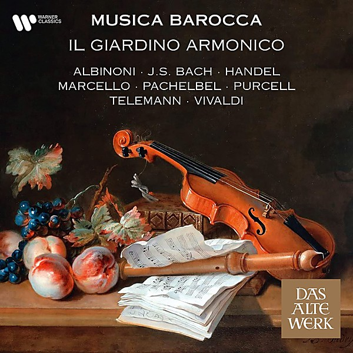

# Opera Classics

By **Concerto Armonico**

## Album Data

- **Catalog:** Beets
- **Format:** Digital, Album
- **Album:** Opera Classics
- **Artist:** Concerto Armonico
- **Albumartist:** Concerto Armonico
- **Genre:** Unknown
- **MusicBrainz Album Artist ID:** 
- **MusicBrainz Album ID:** 
- **MusicBrainz Release Group ID:** 
- **Year:** 0000
- **Catalog #:** 
- **Label:** 
- **Total Tracks:** 00

## Album Tracks

### Track 09 - Mozart

- **Artist:** Concerto Armonico
- **Format:** AAC
- **Genre:** Unknown
- **Length:** 4:09
- **MusicBrainz Track ID:** 
- **Title:** Mozart
- **Track:** 09
- **Year:** 0000

