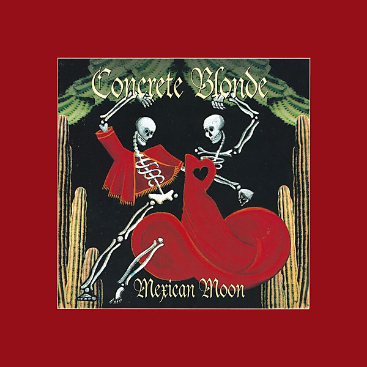

# Mexican Moon

By **Concrete Blonde**

## Album Data

- **Catalog:** Beets
- **Format:** Digital, Album
- **Album:** Mexican Moon
- **Artist:** Concrete Blonde
- **Albumartist:** Concrete Blonde
- **Genre:** Post-Punk
- **MusicBrainz Album Artist ID:** [701fc524-b5f2-42f2-9db7-8198cdd6839c](https://musicbrainz.org/artist/701fc524-b5f2-42f2-9db7-8198cdd6839c)
- **MusicBrainz Album ID:** [b38cf694-5447-42a7-a6ad-c434bdc0cbc8](https://musicbrainz.org/release/b38cf694-5447-42a7-a6ad-c434bdc0cbc8)
- **MusicBrainz Release Group ID:** [7862268a-5399-3bd6-87b8-0beccb154abb](https://musicbrainz.org/release-group/7862268a-5399-3bd6-87b8-0beccb154abb)
- **Year:** 1993
- **Catalog #:** CDP 0777 7 81129 2 1
- **Label:** Capitol Records
- **Total Tracks:** 13

## Album Tracks

### Track 01 - Jenny I Read

- **Artist:** Concrete Blonde
- **Format:** ALAC
- **Genre:** Alternative Rock
- **Length:** 5:20
- **MusicBrainz Track ID:** [0d52b0d9-db09-447e-a35d-eec1a2389475](https://musicbrainz.org/recording/0d52b0d9-db09-447e-a35d-eec1a2389475)
- **Title:** Jenny I Read
- **Track:** 01
- **Year:** 1993

### Track 02 - Mexican Moon

- **Artist:** Concrete Blonde
- **Format:** ALAC
- **Genre:** Alternative Rock
- **Length:** 5:03
- **MusicBrainz Track ID:** [e0edd54d-a45d-4ed6-a8d7-7edab8a223e9](https://musicbrainz.org/recording/e0edd54d-a45d-4ed6-a8d7-7edab8a223e9)
- **Title:** Mexican Moon
- **Track:** 02
- **Year:** 1993

### Track 03 - Heal It Up

- **Artist:** Concrete Blonde
- **Format:** ALAC
- **Genre:** Rock And Roll
- **Length:** 4:21
- **MusicBrainz Track ID:** [c7653ea8-8580-460f-97a0-38fc1dd14d74](https://musicbrainz.org/recording/c7653ea8-8580-460f-97a0-38fc1dd14d74)
- **Title:** Heal It Up
- **Track:** 03
- **Year:** 1993

### Track 04 - Jonestown

- **Artist:** Concrete Blonde
- **Format:** ALAC
- **Genre:** Post-Punk
- **Length:** 6:09
- **MusicBrainz Track ID:** [e861f085-3ac1-443e-aa7a-762827efe519](https://musicbrainz.org/recording/e861f085-3ac1-443e-aa7a-762827efe519)
- **Title:** Jonestown
- **Track:** 04
- **Year:** 1993

### Track 05 - Rain

- **Artist:** Concrete Blonde
- **Format:** ALAC
- **Genre:** Alternative Rock
- **Length:** 3:30
- **MusicBrainz Track ID:** [4dfc3dc2-bd96-4dfd-98b1-8d17fe9ffa72](https://musicbrainz.org/recording/4dfc3dc2-bd96-4dfd-98b1-8d17fe9ffa72)
- **Title:** Rain
- **Track:** 05
- **Year:** 1993

### Track 06 - I Call It Love

- **Artist:** Concrete Blonde
- **Format:** ALAC
- **Genre:** Rock
- **Length:** 5:17
- **MusicBrainz Track ID:** [1c848098-1e5a-4f56-abb6-5b7a29745932](https://musicbrainz.org/recording/1c848098-1e5a-4f56-abb6-5b7a29745932)
- **Title:** I Call It Love
- **Track:** 06
- **Year:** 1993

### Track 07 - Jesus Forgive Me (For the Things I'm About to Say)

- **Artist:** Concrete Blonde
- **Format:** ALAC
- **Genre:** Rock
- **Length:** 5:17
- **MusicBrainz Track ID:** [b92b76a1-e89d-4dce-aa54-759cbc3c4116](https://musicbrainz.org/recording/b92b76a1-e89d-4dce-aa54-759cbc3c4116)
- **Title:** Jesus Forgive Me (For the Things I'm About to Say)
- **Track:** 07
- **Year:** 1993

### Track 08 - When You Smile

- **Artist:** Concrete Blonde
- **Format:** ALAC
- **Genre:** Rock
- **Length:** 4:21
- **MusicBrainz Track ID:** [beaeff49-c564-4bc9-803c-2e9172ec2d1e](https://musicbrainz.org/recording/beaeff49-c564-4bc9-803c-2e9172ec2d1e)
- **Title:** When You Smile
- **Track:** 08
- **Year:** 1993

### Track 09 - Close to Home

- **Artist:** Concrete Blonde
- **Format:** ALAC
- **Genre:** Rock
- **Length:** 3:32
- **MusicBrainz Track ID:** [cdcba6ba-2309-4066-86e4-dce64caeb6df](https://musicbrainz.org/recording/cdcba6ba-2309-4066-86e4-dce64caeb6df)
- **Title:** Close to Home
- **Track:** 09
- **Year:** 1993

### Track 10 - One of My Kind

- **Artist:** Concrete Blonde
- **Format:** ALAC
- **Genre:** Alternative Rock
- **Length:** 3:59
- **MusicBrainz Track ID:** [c3f15b46-7ff6-431c-831c-86eb3a8fe644](https://musicbrainz.org/recording/c3f15b46-7ff6-431c-831c-86eb3a8fe644)
- **Title:** One of My Kind
- **Track:** 10
- **Year:** 1993

### Track 11 - End of the Line

- **Artist:** Concrete Blonde
- **Format:** ALAC
- **Genre:** Rock
- **Length:** 4:41
- **MusicBrainz Track ID:** [449e9602-6a0e-499a-93be-62b2aa5e0c8e](https://musicbrainz.org/recording/449e9602-6a0e-499a-93be-62b2aa5e0c8e)
- **Title:** End of the Line
- **Track:** 11
- **Year:** 1993

### Track 12 - (Love Is a) Blind Ambition

- **Artist:** Concrete Blonde
- **Format:** ALAC
- **Genre:** Rock
- **Length:** 6:15
- **MusicBrainz Track ID:** [f5b5b754-bd6e-4656-8a6e-ca25f424e9f0](https://musicbrainz.org/recording/f5b5b754-bd6e-4656-8a6e-ca25f424e9f0)
- **Title:** (Love Is a) Blind Ambition
- **Track:** 12
- **Year:** 1993

### Track 13 - Bajo la Lune Mexicana

- **Artist:** Concrete Blonde
- **Format:** ALAC
- **Genre:** Rock
- **Length:** 5:07
- **MusicBrainz Track ID:** [5721a6cb-bb85-4574-96df-7d292525cec1](https://musicbrainz.org/recording/5721a6cb-bb85-4574-96df-7d292525cec1)
- **Title:** Bajo la Lune Mexicana
- **Track:** 13
- **Year:** 1993

## See also

- [Roon: Bloodletting](../../Roon/Concrete_Blonde/Bloodletting.md)
- [Roon: Free](../../Roon/Concrete_Blonde/Free.md)
- [Roon: Mexican Moon](../../Roon/Concrete_Blonde/Mexican_Moon.md)
