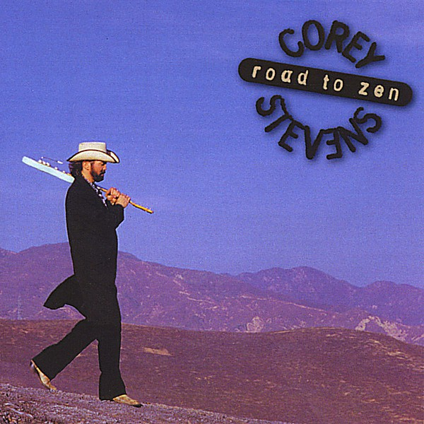

# Road To Zen

By **Corey Stevens**

## Album Data

- **Catalog:** Beets
- **Format:** Digital, Album
- **Album:** Road To Zen
- **Artist:** Corey Stevens
- **Albumartist:** Corey Stevens
- **Genre:** Rock
- **MusicBrainz Album Artist ID:** [3b19447b-ddea-4a67-8fae-32a683b87fe7](https://musicbrainz.org/artist/3b19447b-ddea-4a67-8fae-32a683b87fe7)
- **MusicBrainz Album ID:** [a6640a55-a5c1-4dda-a686-c56c30d10b47](https://musicbrainz.org/release/a6640a55-a5c1-4dda-a686-c56c30d10b47)
- **MusicBrainz Release Group ID:** [24557b4e-d714-310b-9824-09111c131560](https://musicbrainz.org/release-group/24557b4e-d714-310b-9824-09111c131560)
- **Year:** 1997
- **Catalog #:** 77061
- **Label:** Discovery Records
- **Total Tracks:** 10

## Album Tracks

### Track 01 - Only One For You

- **Artist:** Corey Stevens
- **Format:** MP3
- **Genre:** Texas Blues
- **Length:** 4:36
- **MusicBrainz Track ID:** [85e70ba2-f866-47e7-8b54-f721b5311078](https://musicbrainz.org/recording/85e70ba2-f866-47e7-8b54-f721b5311078)
- **Title:** Only One For You
- **Track:** 01
- **Year:** 1997

### Track 02 - Too Much Fun?

- **Artist:** Corey Stevens
- **Format:** MP3
- **Genre:** Blues
- **Length:** 4:21
- **MusicBrainz Track ID:** [a9eb2a40-9ffd-420e-8dbf-8c0894740148](https://musicbrainz.org/recording/a9eb2a40-9ffd-420e-8dbf-8c0894740148)
- **Title:** Too Much Fun?
- **Track:** 02
- **Year:** 1997

### Track 03 - Lessons Of Love

- **Artist:** Corey Stevens
- **Format:** MP3
- **Genre:** Rock
- **Length:** 4:24
- **MusicBrainz Track ID:** [1f44512d-425e-4b4a-a9d9-df009393a90d](https://musicbrainz.org/recording/1f44512d-425e-4b4a-a9d9-df009393a90d)
- **Title:** Lessons Of Love
- **Track:** 03
- **Year:** 1997

### Track 04 - My Neighborhood

- **Artist:** Corey Stevens
- **Format:** MP3
- **Genre:** Blues
- **Length:** 4:14
- **MusicBrainz Track ID:** [919f6441-38c3-46e8-a9a9-303db7ffc70a](https://musicbrainz.org/recording/919f6441-38c3-46e8-a9a9-303db7ffc70a)
- **Title:** My Neighborhood
- **Track:** 04
- **Year:** 1997

### Track 05 - One More Time

- **Artist:** Corey Stevens
- **Format:** MP3
- **Genre:** Blues
- **Length:** 4:13
- **MusicBrainz Track ID:** [515785b3-d1d2-4618-a62f-f78a531a5885](https://musicbrainz.org/recording/515785b3-d1d2-4618-a62f-f78a531a5885)
- **Title:** One More Time
- **Track:** 05
- **Year:** 1997

### Track 06 - Road To Zen

- **Artist:** Corey Stevens
- **Format:** MP3
- **Genre:** Rock
- **Length:** 6:54
- **MusicBrainz Track ID:** [91817fa0-1aa6-4308-90b1-d32f13e06803](https://musicbrainz.org/recording/91817fa0-1aa6-4308-90b1-d32f13e06803)
- **Title:** Road To Zen
- **Track:** 06
- **Year:** 1997

### Track 07 - Take It Back

- **Artist:** Corey Stevens
- **Format:** MP3
- **Genre:** Rock
- **Length:** 4:31
- **MusicBrainz Track ID:** [697cb01c-c0c5-456e-9a1e-5763ee373dec](https://musicbrainz.org/recording/697cb01c-c0c5-456e-9a1e-5763ee373dec)
- **Title:** Take It Back
- **Track:** 07
- **Year:** 1997

### Track 08 - Big House Blues

- **Artist:** Corey Stevens
- **Format:** MP3
- **Genre:** Southern Rock
- **Length:** 4:06
- **MusicBrainz Track ID:** [f614f2db-5727-4cf9-bc7a-201692418d1c](https://musicbrainz.org/recording/f614f2db-5727-4cf9-bc7a-201692418d1c)
- **Title:** Big House Blues
- **Track:** 08
- **Year:** 1997

### Track 09 - Blues Are Here To Stay

- **Artist:** Corey Stevens
- **Format:** MP3
- **Genre:** Blues
- **Length:** 6:08
- **MusicBrainz Track ID:** [82fb60dd-0d86-43be-ad75-97f21a9b726f](https://musicbrainz.org/recording/82fb60dd-0d86-43be-ad75-97f21a9b726f)
- **Title:** Blues Are Here To Stay
- **Track:** 09
- **Year:** 1997

### Track 10 - Charles Bronson Vibe

- **Artist:** Corey Stevens
- **Format:** MP3
- **Genre:** Rock
- **Length:** 3:20
- **MusicBrainz Track ID:** [fb885539-fbd5-44ed-8dbf-67acabaab9ec](https://musicbrainz.org/recording/fb885539-fbd5-44ed-8dbf-67acabaab9ec)
- **Title:** Charles Bronson Vibe
- **Track:** 10
- **Year:** 1997

