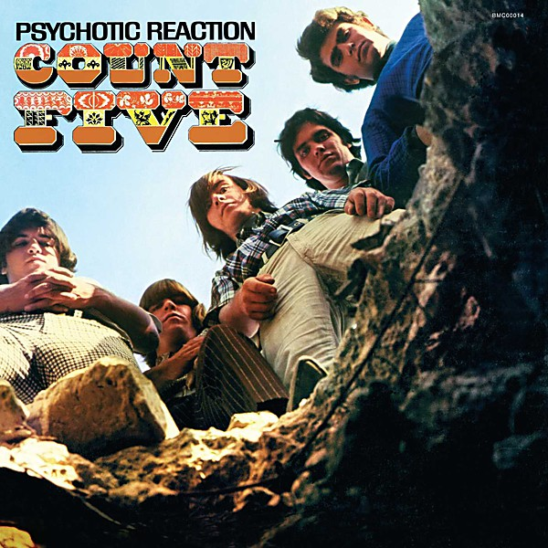

# Psychotic Reaction

By **Count Five**

## Album Data

- **Catalog:** Beets
- **Format:** Digital, Album
- **Album:** Psychotic Reaction
- **Artist:** Count Five
- **Albumartist:** Count Five
- **Genre:** Psychedelic Rock
- **MusicBrainz Album Artist ID:** [cf20a6c7-822b-4c54-9600-c75bee6a296c](https://musicbrainz.org/artist/cf20a6c7-822b-4c54-9600-c75bee6a296c)
- **MusicBrainz Album ID:** [9cf34f78-f2a9-47cd-be18-38c0c2e5a0c1](https://musicbrainz.org/release/9cf34f78-f2a9-47cd-be18-38c0c2e5a0c1)
- **MusicBrainz Release Group ID:** [c26bf5e3-90a0-3a83-9950-dcfadcbf68e2](https://musicbrainz.org/release-group/c26bf5e3-90a0-3a83-9950-dcfadcbf68e2)
- **Year:** 1966
- **Catalog #:** LP-DSS-5001
- **Label:** Double Shot Records
- **Total Tracks:** 11

## Album Tracks

### Track 01 - Double-Decker Bus

- **Artist:** Count Five
- **Format:** MP3
- **Genre:** Punk Rock
- **Length:** 2:00
- **MusicBrainz Track ID:** [56c6f4b6-b2d5-482e-bbea-69f54ce2a3fb](https://musicbrainz.org/recording/56c6f4b6-b2d5-482e-bbea-69f54ce2a3fb)
- **Title:** Double-Decker Bus
- **Track:** 01
- **Year:** 1966

### Track 02 - Pretty Big Mouth

- **Artist:** Count Five
- **Format:** MP3
- **Genre:** Psychedelic Rock
- **Length:** 2:11
- **MusicBrainz Track ID:** [d1c32fb8-6d7d-4197-afed-e639b299dc39](https://musicbrainz.org/recording/d1c32fb8-6d7d-4197-afed-e639b299dc39)
- **Title:** Pretty Big Mouth
- **Track:** 02
- **Year:** 1966

### Track 03 - The World

- **Artist:** Count Five
- **Format:** MP3
- **Genre:** Psychedelic Rock
- **Length:** 2:15
- **MusicBrainz Track ID:** [93af9b0f-741f-4597-b095-3a98584d9568](https://musicbrainz.org/recording/93af9b0f-741f-4597-b095-3a98584d9568)
- **Title:** The World
- **Track:** 03
- **Year:** 1966

### Track 04 - My Generation

- **Artist:** Count Five
- **Format:** MP3
- **Genre:** Close Harmony
- **Length:** 2:30
- **MusicBrainz Track ID:** [e2a16e41-c3fd-43d9-94e1-bea404d65af2](https://musicbrainz.org/recording/e2a16e41-c3fd-43d9-94e1-bea404d65af2)
- **Title:** My Generation
- **Track:** 04
- **Year:** 1966

### Track 05 - She's Fine

- **Artist:** Count Five
- **Format:** MP3
- **Genre:** Rock
- **Length:** 2:15
- **MusicBrainz Track ID:** [9ebbdee4-981a-4c91-9078-b8368d8dc523](https://musicbrainz.org/recording/9ebbdee4-981a-4c91-9078-b8368d8dc523)
- **Title:** She's Fine
- **Track:** 05
- **Year:** 1966

### Track 06 - Psychotic Reaction

- **Artist:** Count Five
- **Format:** MP3
- **Genre:** Psychedelic Rock
- **Length:** 3:06
- **MusicBrainz Track ID:** [454e3b0c-0501-4663-a283-7ef627a4621a](https://musicbrainz.org/recording/454e3b0c-0501-4663-a283-7ef627a4621a)
- **Title:** Psychotic Reaction
- **Track:** 06
- **Year:** 1966

### Track 07 - Peace of Mind

- **Artist:** Count Five
- **Format:** MP3
- **Genre:** Acid Rock
- **Length:** 2:24
- **MusicBrainz Track ID:** [bf567c68-c5bf-4a69-a130-25b3d036d28c](https://musicbrainz.org/recording/bf567c68-c5bf-4a69-a130-25b3d036d28c)
- **Title:** Peace of Mind
- **Track:** 07
- **Year:** 1966

### Track 08 - They're Gonna Get You

- **Artist:** Count Five
- **Format:** MP3
- **Genre:** Psychedelic Rock
- **Length:** 2:28
- **MusicBrainz Track ID:** [75fda277-4002-4fd0-8d8e-25a599f3c396](https://musicbrainz.org/recording/75fda277-4002-4fd0-8d8e-25a599f3c396)
- **Title:** They're Gonna Get You
- **Track:** 08
- **Year:** 1966

### Track 09 - The Morning After

- **Artist:** Count Five
- **Format:** MP3
- **Genre:** Garage Rock
- **Length:** 1:59
- **MusicBrainz Track ID:** [fe33d46c-623f-4b3b-b4c9-17b759319ec9](https://musicbrainz.org/recording/fe33d46c-623f-4b3b-b4c9-17b759319ec9)
- **Title:** The Morning After
- **Track:** 09
- **Year:** 1966

### Track 10 - Can't Get Your Lovin'

- **Artist:** Count Five
- **Format:** MP3
- **Genre:** Garage Rock
- **Length:** 1:49
- **MusicBrainz Track ID:** [010f53c9-4b9a-4b47-a275-3d2c0b4d9b82](https://musicbrainz.org/recording/010f53c9-4b9a-4b47-a275-3d2c0b4d9b82)
- **Title:** Can't Get Your Lovin'
- **Track:** 10
- **Year:** 1966

### Track 11 - Out in the Street

- **Artist:** Count Five
- **Format:** MP3
- **Genre:** Garage Rock
- **Length:** 2:29
- **MusicBrainz Track ID:** [ba06f050-31f0-4cbf-ac0c-156b1aa2a4da](https://musicbrainz.org/recording/ba06f050-31f0-4cbf-ac0c-156b1aa2a4da)
- **Title:** Out in the Street
- **Track:** 11
- **Year:** 1966

## See also

- [Vinyl: ](../../Vinyl/Count_Five/Count_Five.md)
- [Vinyl: Psychotic Reaction](../../Vinyl/Count_Five/Psychotic_Reaction.md)
