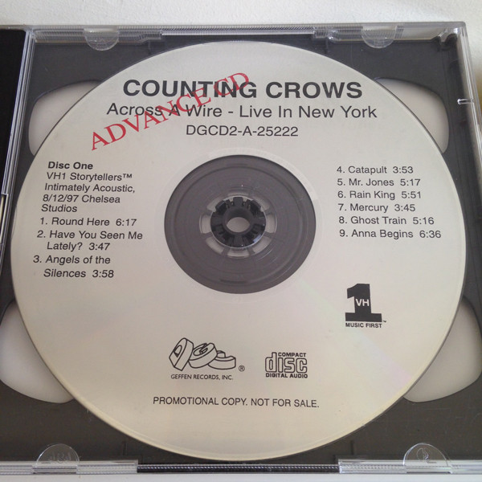

# Across a Wire - live in New Yo

By **Counting Crows**

## Album Data

- **Catalog:** Beets
- **Format:** Digital, Album
- **Album:** Across a Wire - live in New Yo
- **Artist:** Counting Crows
- **Albumartist:** Counting Crows
- **Genre:** Alternative Rock
- **MusicBrainz Album Artist ID:** 
- **MusicBrainz Album ID:** 
- **MusicBrainz Release Group ID:** 
- **Year:** 2000
- **Catalog #:** DGCD-24528
- **Label:** DGC Records
- **Total Tracks:** 11

## Album Tracks

### Track 01 - Round Here

- **Artist:** Counting Crows
- **Format:** ALAC
- **Genre:** Alternative Rock
- **Length:** 5:31
- **MusicBrainz Track ID:** [57279754-ab46-4c44-a018-0578673a6299](https://musicbrainz.org/recording/57279754-ab46-4c44-a018-0578673a6299)
- **Title:** Round Here
- **Track:** 01
- **Year:** 1993

### Track 02 - Omaha

- **Artist:** Counting Crows
- **Format:** ALAC
- **Genre:** Alternative Rock
- **Length:** 3:39
- **MusicBrainz Track ID:** [25003b5c-617c-428e-803a-8671cf854c3a](https://musicbrainz.org/recording/25003b5c-617c-428e-803a-8671cf854c3a)
- **Title:** Omaha
- **Track:** 02
- **Year:** 1993

### Track 03 - Mr. Jones

- **Artist:** Counting Crows
- **Format:** ALAC
- **Genre:** Alternative Rock
- **Length:** 4:32
- **MusicBrainz Track ID:** [14d9c468-551a-490c-b99d-c6f42fcd4bb7](https://musicbrainz.org/recording/14d9c468-551a-490c-b99d-c6f42fcd4bb7)
- **Title:** Mr. Jones
- **Track:** 03
- **Year:** 1993

### Track 04 - Perfect Blue Buildings

- **Artist:** Counting Crows
- **Format:** ALAC
- **Genre:** Alternative Rock
- **Length:** 5:00
- **MusicBrainz Track ID:** [a0e8226f-26c7-4fe6-a767-dead7229e23f](https://musicbrainz.org/recording/a0e8226f-26c7-4fe6-a767-dead7229e23f)
- **Title:** Perfect Blue Buildings
- **Track:** 04
- **Year:** 1993

### Track 05 - Anna Begins

- **Artist:** Counting Crows
- **Format:** ALAC
- **Genre:** Alternative Rock
- **Length:** 4:31
- **MusicBrainz Track ID:** [887dc032-7e5f-4989-8f6b-a3fc0c5986ad](https://musicbrainz.org/recording/887dc032-7e5f-4989-8f6b-a3fc0c5986ad)
- **Title:** Anna Begins
- **Track:** 05
- **Year:** 1993

### Track 06 - Time and Time Again

- **Artist:** Counting Crows
- **Format:** ALAC
- **Genre:** Soft Rock
- **Length:** 5:14
- **MusicBrainz Track ID:** [74e775f9-2642-450b-83b9-a7962fff57d4](https://musicbrainz.org/recording/74e775f9-2642-450b-83b9-a7962fff57d4)
- **Title:** Time and Time Again
- **Track:** 06
- **Year:** 1993

### Track 07 - Rain King

- **Artist:** Counting Crows
- **Format:** ALAC
- **Genre:** Alternative Rock
- **Length:** 4:15
- **MusicBrainz Track ID:** [f7658468-fd24-4b2b-b508-4fb71fed177b](https://musicbrainz.org/recording/f7658468-fd24-4b2b-b508-4fb71fed177b)
- **Title:** Rain King
- **Track:** 07
- **Year:** 1993

### Track 08 - Sullivan Street

- **Artist:** Counting Crows
- **Format:** ALAC
- **Genre:** Alternative Rock
- **Length:** 4:29
- **MusicBrainz Track ID:** [fe52f7ff-769e-4fc8-9831-f6c3d488f60d](https://musicbrainz.org/recording/fe52f7ff-769e-4fc8-9831-f6c3d488f60d)
- **Title:** Sullivan Street
- **Track:** 08
- **Year:** 1993

### Track 09 - Ghost Train

- **Artist:** Counting Crows
- **Format:** ALAC
- **Genre:** Southern Rock
- **Length:** 4:02
- **MusicBrainz Track ID:** [df8f0729-9610-473d-b48e-3beb48c5a702](https://musicbrainz.org/recording/df8f0729-9610-473d-b48e-3beb48c5a702)
- **Title:** Ghost Train
- **Track:** 09
- **Year:** 1993

### Track 10 - Raining in Baltimore

- **Artist:** Counting Crows
- **Format:** ALAC
- **Genre:** Alternative Rock
- **Length:** 4:41
- **MusicBrainz Track ID:** [7be7e687-38b3-432f-b161-b42f70a7fcaf](https://musicbrainz.org/recording/7be7e687-38b3-432f-b161-b42f70a7fcaf)
- **Title:** Raining in Baltimore
- **Track:** 10
- **Year:** 1993

### Track 11 - A Murder of One

- **Artist:** Counting Crows
- **Format:** ALAC
- **Genre:** Soft Rock
- **Length:** 5:43
- **MusicBrainz Track ID:** [91ec472c-a997-4b57-969c-1bd7c3e514ab](https://musicbrainz.org/recording/91ec472c-a997-4b57-969c-1bd7c3e514ab)
- **Title:** A Murder of One
- **Track:** 11
- **Year:** 1993

## See also

- [August and Everything After](August_and_Everything_After.md)
- [Hard Candy](Hard_Candy.md)
- [Somewhere Under Wonderland](Somewhere_Under_Wonderland.md)
- [CD: August And Everything After](../../CD/Counting_Crows/August_And_Everything_After.md)
- [CD: ](../../CD/Counting_Crows/Counting_Crows.md)
- [Roon: August And Everything After](../../Roon/Counting_Crows/August_And_Everything_After.md)
- [Vinyl: August And Everything After](../../Vinyl/Counting_Crows/August_And_Everything_After.md)
- [Vinyl: ](../../Vinyl/Counting_Crows/Counting_Crows.md)
