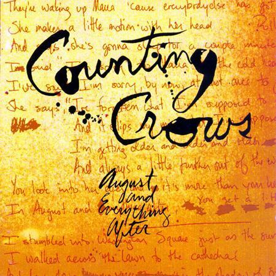

# August and Everything After

By **Counting Crows**

## Album Data

- **Catalog:** Beets
- **Format:** Digital, Album
- **Album:** August and Everything After
- **Artist:** Counting Crows
- **Albumartist:** Counting Crows
- **Genre:** Alternative Rock
- **MusicBrainz Album Artist ID:** [a0327dc2-dc76-44d5-aec6-47cd2dff1469](https://musicbrainz.org/artist/a0327dc2-dc76-44d5-aec6-47cd2dff1469)
- **MusicBrainz Album ID:** [3738da94-663e-44c1-84af-f850b0bdb763](https://musicbrainz.org/release/3738da94-663e-44c1-84af-f850b0bdb763)
- **MusicBrainz Release Group ID:** [7c2e8889-0050-3b1f-862f-60d1a8f2cf74](https://musicbrainz.org/release-group/7c2e8889-0050-3b1f-862f-60d1a8f2cf74)
- **Year:** 1993
- **Catalog #:** 069493356-2
- **Label:** Geffen Records
- **Total Tracks:** 13

## Album Tracks

### Track 01 - Hard Candy

- **Artist:** Counting Crows
- **Format:** MP3
- **Genre:** Alternative Rock
- **Length:** 4:20
- **MusicBrainz Track ID:** [e8c628f0-0976-4f3d-8c97-a38d6c9828ca](https://musicbrainz.org/recording/e8c628f0-0976-4f3d-8c97-a38d6c9828ca)
- **Title:** Hard Candy
- **Track:** 01
- **Year:** 2002

### Track 02 - American Girls

- **Artist:** Counting Crows
- **Format:** MP3
- **Genre:** Alternative Rock
- **Length:** 4:32
- **MusicBrainz Track ID:** [bba0c8d4-87c9-4c23-8f2e-ec463c00c005](https://musicbrainz.org/recording/bba0c8d4-87c9-4c23-8f2e-ec463c00c005)
- **Title:** American Girls
- **Track:** 02
- **Year:** 2002

### Track 03 - Good Time

- **Artist:** Counting Crows
- **Format:** MP3
- **Genre:** Alternative Rock
- **Length:** 4:23
- **MusicBrainz Track ID:** [aec68f03-8760-4f9c-9682-a9e5d1981768](https://musicbrainz.org/recording/aec68f03-8760-4f9c-9682-a9e5d1981768)
- **Title:** Good Time
- **Track:** 03
- **Year:** 2002

### Track 04 - If I Could Give All My Love -or- Richard Manuel Is Dead

- **Artist:** Counting Crows
- **Format:** MP3
- **Genre:** Indie Rock
- **Length:** 3:52
- **MusicBrainz Track ID:** [a6397dbe-2a38-4afd-96d4-315102b5370e](https://musicbrainz.org/recording/a6397dbe-2a38-4afd-96d4-315102b5370e)
- **Title:** If I Could Give All My Love -or- Richard Manuel Is Dead
- **Track:** 04
- **Year:** 2002

### Track 05 - Goodnight L.A.

- **Artist:** Counting Crows
- **Format:** MP3
- **Genre:** Soft Rock
- **Length:** 4:17
- **MusicBrainz Track ID:** [6c6976c9-872d-4c9c-b5fa-68295d4aaa9a](https://musicbrainz.org/recording/6c6976c9-872d-4c9c-b5fa-68295d4aaa9a)
- **Title:** Goodnight L.A.
- **Track:** 05
- **Year:** 2002

### Track 06 - Butterfly in Reverse

- **Artist:** Counting Crows
- **Format:** MP3
- **Genre:** Orchestral
- **Length:** 2:48
- **MusicBrainz Track ID:** [11f9cf22-fcd7-4bea-adb7-56aabca83617](https://musicbrainz.org/recording/11f9cf22-fcd7-4bea-adb7-56aabca83617)
- **Title:** Butterfly in Reverse
- **Track:** 06
- **Year:** 2002

### Track 07 - Miami

- **Artist:** Counting Crows
- **Format:** MP3
- **Genre:** Americana
- **Length:** 5:00
- **MusicBrainz Track ID:** [0f37d662-41f9-4c84-8708-a5c50b642141](https://musicbrainz.org/recording/0f37d662-41f9-4c84-8708-a5c50b642141)
- **Title:** Miami
- **Track:** 07
- **Year:** 2002

### Track 08 - New Frontier

- **Artist:** Counting Crows
- **Format:** MP3
- **Genre:** Indie Rock
- **Length:** 3:51
- **MusicBrainz Track ID:** [2bca2632-c41d-4f7e-b788-32f1088db2db](https://musicbrainz.org/recording/2bca2632-c41d-4f7e-b788-32f1088db2db)
- **Title:** New Frontier
- **Track:** 08
- **Year:** 2002

### Track 09 - Carriage

- **Artist:** Counting Crows
- **Format:** MP3
- **Genre:** Swing
- **Length:** 4:04
- **MusicBrainz Track ID:** [00f46c6c-9d06-4479-8c4a-fc21e16e7345](https://musicbrainz.org/recording/00f46c6c-9d06-4479-8c4a-fc21e16e7345)
- **Title:** Carriage
- **Track:** 09
- **Year:** 2002

### Track 10 - Black and Blue

- **Artist:** Counting Crows
- **Format:** MP3
- **Genre:** Indie Rock
- **Length:** 3:53
- **MusicBrainz Track ID:** [dc7494ab-ba0d-4586-91d9-36cb7f062be0](https://musicbrainz.org/recording/dc7494ab-ba0d-4586-91d9-36cb7f062be0)
- **Title:** Black and Blue
- **Track:** 10
- **Year:** 2002

### Track 11 - Why Should You Come When I Call?

- **Artist:** Counting Crows
- **Format:** MP3
- **Genre:** Emo
- **Length:** 4:38
- **MusicBrainz Track ID:** [c38d754f-756c-4cc6-bf89-a674abc0d13f](https://musicbrainz.org/recording/c38d754f-756c-4cc6-bf89-a674abc0d13f)
- **Title:** Why Should You Come When I Call?
- **Track:** 11
- **Year:** 2002

### Track 12 - Up All Night (Frankie Miller Goes to Hollywood)

- **Artist:** Counting Crows
- **Format:** MP3
- **Genre:** Indie Rock
- **Length:** 5:07
- **MusicBrainz Track ID:** [15d6e8bb-2ad2-4c6b-8be1-d63806d5f12b](https://musicbrainz.org/recording/15d6e8bb-2ad2-4c6b-8be1-d63806d5f12b)
- **Title:** Up All Night (Frankie Miller Goes to Hollywood)
- **Track:** 12
- **Year:** 2002

### Track 13 - Holiday in Spain / Big Yellow Taxi

- **Artist:** Counting Crows
- **Format:** MP3
- **Genre:** Pop Rock
- **Length:** 8:44
- **MusicBrainz Track ID:** [fa46b664-465c-48c7-985a-6c2e0fed322d](https://musicbrainz.org/recording/fa46b664-465c-48c7-985a-6c2e0fed322d)
- **Title:** Holiday in Spain / Big Yellow Taxi
- **Track:** 13
- **Year:** 2002

## See also

- [Across a Wire - live in New Yo](Across_a_Wire_-_live_in_New_Yo.md)
- [Hard Candy](Hard_Candy.md)
- [Somewhere Under Wonderland](Somewhere_Under_Wonderland.md)
- [CD: August And Everything After](../../CD/Counting_Crows/August_And_Everything_After.md)
- [CD: ](../../CD/Counting_Crows/Counting_Crows.md)
- [Roon: August And Everything After](../../Roon/Counting_Crows/August_And_Everything_After.md)
- [Vinyl: August And Everything After](../../Vinyl/Counting_Crows/August_And_Everything_After.md)
- [Vinyl: ](../../Vinyl/Counting_Crows/Counting_Crows.md)
