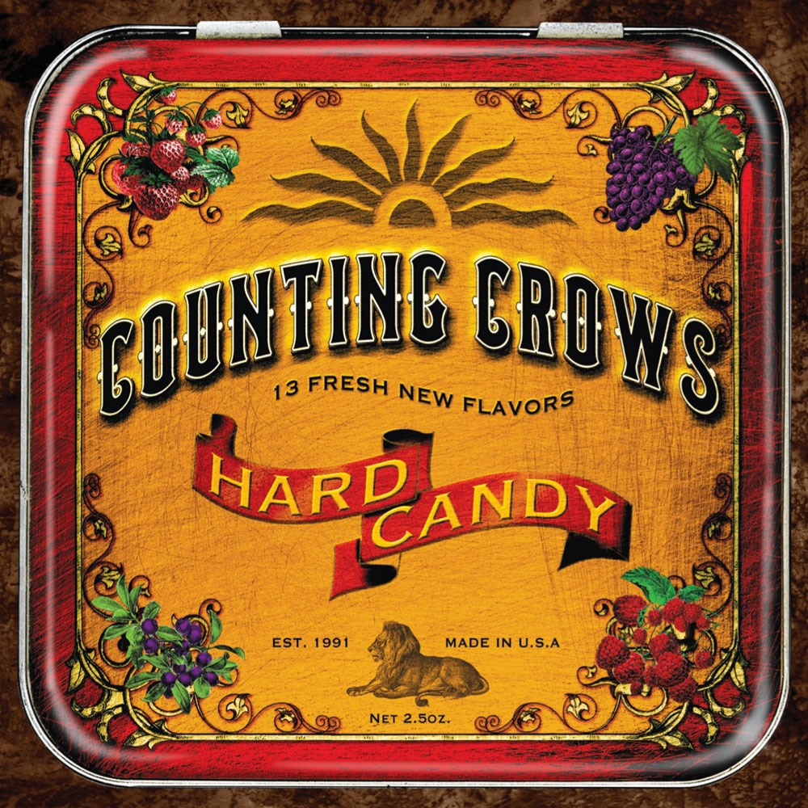

# Hard Candy

By **Counting Crows**

## Album Data

- **Catalog:** Beets
- **Format:** Digital, Album
- **Album:** Hard Candy
- **Artist:** Counting Crows
- **Albumartist:** Counting Crows
- **Genre:** Pop Rock
- **MusicBrainz Album Artist ID:** [a0327dc2-dc76-44d5-aec6-47cd2dff1469](https://musicbrainz.org/artist/a0327dc2-dc76-44d5-aec6-47cd2dff1469)
- **MusicBrainz Album ID:** [a840e69a-3a92-4bf9-843c-e2b1fec44e3c](https://musicbrainz.org/release/a840e69a-3a92-4bf9-843c-e2b1fec44e3c)
- **MusicBrainz Release Group ID:** [155b90ec-183a-399f-b686-585a41dc0b93](https://musicbrainz.org/release-group/155b90ec-183a-399f-b686-585a41dc0b93)
- **Year:** 2002
- **Catalog #:** 
- **Label:** Capitol Records
- **Total Tracks:** 11

## Album Tracks

### Track 01 - Palisades Park

- **Artist:** Counting Crows
- **Format:** ALAC
- **Genre:** Alternative Rock
- **Length:** 8:21
- **MusicBrainz Track ID:** [d7113fd6-fe4b-498e-8c03-28ce80e653a6](https://musicbrainz.org/recording/d7113fd6-fe4b-498e-8c03-28ce80e653a6)
- **Title:** Palisades Park
- **Track:** 01
- **Year:** 2014

### Track 02 - Earthquake Driver

- **Artist:** Counting Crows
- **Format:** ALAC
- **Genre:** Rock
- **Length:** 3:31
- **MusicBrainz Track ID:** [d9fe7624-c8c0-4844-93e9-6edb619b0fca](https://musicbrainz.org/recording/d9fe7624-c8c0-4844-93e9-6edb619b0fca)
- **Title:** Earthquake Driver
- **Track:** 02
- **Year:** 2014

### Track 03 - Dislocation

- **Artist:** Counting Crows
- **Format:** ALAC
- **Genre:** Alternative Rock
- **Length:** 4:55
- **MusicBrainz Track ID:** [410eddcb-4684-48e5-9988-c097de484abc](https://musicbrainz.org/recording/410eddcb-4684-48e5-9988-c097de484abc)
- **Title:** Dislocation
- **Track:** 03
- **Year:** 2014

### Track 04 - God of Ocean Tides

- **Artist:** Counting Crows
- **Format:** ALAC
- **Genre:** Alternative Rock
- **Length:** 3:12
- **MusicBrainz Track ID:** [e960baa9-b542-4b40-b9f8-ed204c787200](https://musicbrainz.org/recording/e960baa9-b542-4b40-b9f8-ed204c787200)
- **Title:** God of Ocean Tides
- **Track:** 04
- **Year:** 2014

### Track 05 - Scarecrow

- **Artist:** Counting Crows
- **Format:** ALAC
- **Genre:** Alternative Rock
- **Length:** 4:47
- **MusicBrainz Track ID:** [d5d4c10b-46ea-42fc-ad33-a8bf52a7ee34](https://musicbrainz.org/recording/d5d4c10b-46ea-42fc-ad33-a8bf52a7ee34)
- **Title:** Scarecrow
- **Track:** 05
- **Year:** 2014

### Track 06 - Elvis Went to Hollywood

- **Artist:** Counting Crows
- **Format:** ALAC
- **Genre:** Alternative Rock
- **Length:** 3:56
- **MusicBrainz Track ID:** [b2596e9d-6ab5-4f72-bf44-b8862040c07c](https://musicbrainz.org/recording/b2596e9d-6ab5-4f72-bf44-b8862040c07c)
- **Title:** Elvis Went to Hollywood
- **Track:** 06
- **Year:** 2014

### Track 07 - Cover Up the Sun

- **Artist:** Counting Crows
- **Format:** ALAC
- **Genre:** Alternative Rock
- **Length:** 3:46
- **MusicBrainz Track ID:** [fba0618f-fe63-463f-921a-a86504f3b50c](https://musicbrainz.org/recording/fba0618f-fe63-463f-921a-a86504f3b50c)
- **Title:** Cover Up the Sun
- **Track:** 07
- **Year:** 2014

### Track 08 - John Appleseed’s Lament

- **Artist:** Counting Crows
- **Format:** ALAC
- **Genre:** Alternative Rock
- **Length:** 4:43
- **MusicBrainz Track ID:** [84d12e06-a519-41cf-864a-f56e977d62a2](https://musicbrainz.org/recording/84d12e06-a519-41cf-864a-f56e977d62a2)
- **Title:** John Appleseed’s Lament
- **Track:** 08
- **Year:** 2014

### Track 09 - Possibility Days

- **Artist:** Counting Crows
- **Format:** ALAC
- **Genre:** Alternative Rock
- **Length:** 4:12
- **MusicBrainz Track ID:** [b1758987-ea04-4bd5-8e27-9850b562e1eb](https://musicbrainz.org/recording/b1758987-ea04-4bd5-8e27-9850b562e1eb)
- **Title:** Possibility Days
- **Track:** 09
- **Year:** 2014

### Track 10 - Earthquake Driver (demo)

- **Artist:** Counting Crows
- **Format:** ALAC
- **Genre:** Alternative Rock
- **Length:** 3:32
- **MusicBrainz Track ID:** [ed367d97-6b8c-4ef3-a3e9-78534f512b23](https://musicbrainz.org/recording/ed367d97-6b8c-4ef3-a3e9-78534f512b23)
- **Title:** Earthquake Driver (demo)
- **Track:** 10
- **Year:** 2014

### Track 11 - Scarecrow (demo)

- **Artist:** Counting Crows
- **Format:** ALAC
- **Genre:** Alternative Rock
- **Length:** 4:15
- **MusicBrainz Track ID:** [9cbd5ad8-8e3e-49b8-a357-2a99fe714736](https://musicbrainz.org/recording/9cbd5ad8-8e3e-49b8-a357-2a99fe714736)
- **Title:** Scarecrow (demo)
- **Track:** 11
- **Year:** 2014

## See also

- [Across a Wire - live in New Yo](Across_a_Wire_-_live_in_New_Yo.md)
- [August and Everything After](August_and_Everything_After.md)
- [Somewhere Under Wonderland](Somewhere_Under_Wonderland.md)
- [CD: August And Everything After](../../CD/Counting_Crows/August_And_Everything_After.md)
- [CD: ](../../CD/Counting_Crows/Counting_Crows.md)
- [Roon: August And Everything After](../../Roon/Counting_Crows/August_And_Everything_After.md)
- [Vinyl: August And Everything After](../../Vinyl/Counting_Crows/August_And_Everything_After.md)
- [Vinyl: ](../../Vinyl/Counting_Crows/Counting_Crows.md)
