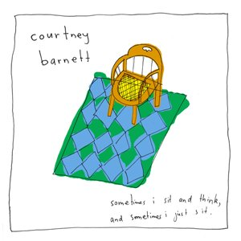

# Sometimes I Sit And Think, And Sometimes I Just Sit

By **Courtney Barnett**

## Album Data

- **Catalog:** Beets
- **Format:** Digital, Album
- **Album:** Sometimes I Sit And Think, And Sometimes I Just Sit
- **Artist:** Courtney Barnett
- **Albumartist:** Courtney Barnett
- **Genre:** Indie Rock
- **MusicBrainz Album Artist ID:** 
- **MusicBrainz Album ID:** 
- **MusicBrainz Release Group ID:** 
- **Year:** 2015
- **Catalog #:** 
- **Label:** 
- **Total Tracks:** 11

## Album Tracks

### Track 08 - Nobody Really Cares If You Don’t Go to the Party

- **Artist:** Courtney Barnett
- **Format:** ALAC
- **Genre:** Indie Rock
- **Length:** 2:46
- **MusicBrainz Track ID:** [3dd8f4da-5e98-4aae-b093-7a34f321f97d](https://musicbrainz.org/recording/3dd8f4da-5e98-4aae-b093-7a34f321f97d)
- **Title:** Nobody Really Cares If You Don’t Go to the Party
- **Track:** 08
- **Year:** 2015

### Track 10 - Kim’s Caravan

- **Artist:** Courtney Barnett
- **Format:** ALAC
- **Genre:** Indie Rock
- **Length:** 6:47
- **MusicBrainz Track ID:** [ae8ae564-efb3-4ec0-b78b-3d427fd39460](https://musicbrainz.org/recording/ae8ae564-efb3-4ec0-b78b-3d427fd39460)
- **Title:** Kim’s Caravan
- **Track:** 10
- **Year:** 2015

### Track 01 - Elevator Operator

- **Artist:** Courtney Barnett
- **Format:** ALAC
- **Genre:** Indie Rock
- **Length:** 3:14
- **MusicBrainz Track ID:** 
- **Title:** Elevator Operator
- **Track:** 01
- **Year:** 2015

### Track 01 - Elevator Operator

- **Artist:** Courtney Barnett
- **Format:** MP3
- **Genre:** Indie Rock
- **Length:** 3:14
- **MusicBrainz Track ID:** 
- **Title:** Elevator Operator
- **Track:** 01
- **Year:** 2015

### Track 02 - Pedestrian At Best

- **Artist:** Courtney Barnett
- **Format:** ALAC
- **Genre:** Post-Grunge
- **Length:** 3:50
- **MusicBrainz Track ID:** 
- **Title:** Pedestrian At Best
- **Track:** 02
- **Year:** 2015

### Track 02 - Pedestrian at Best

- **Artist:** Courtney Barnett
- **Format:** MP3
- **Genre:** Post-Grunge
- **Length:** 3:50
- **MusicBrainz Track ID:** 
- **Title:** Pedestrian at Best
- **Track:** 02
- **Year:** 2015

### Track 03 - An Illustration of Loneliness (Sleepless in New York)

- **Artist:** Courtney Barnett
- **Format:** MP3
- **Genre:** Indie Rock
- **Length:** 3:10
- **MusicBrainz Track ID:** 
- **Title:** An Illustration of Loneliness (Sleepless in New York)
- **Track:** 03
- **Year:** 2015

### Track 03 - An Illustration Of Loneliness (Sleepless In NY)

- **Artist:** Courtney Barnett
- **Format:** ALAC
- **Genre:** Indie Rock
- **Length:** 3:10
- **MusicBrainz Track ID:** 
- **Title:** An Illustration Of Loneliness (Sleepless In NY)
- **Track:** 03
- **Year:** 2015

### Track 04 - Small Poppies

- **Artist:** Courtney Barnett
- **Format:** ALAC
- **Genre:** Post-Grunge
- **Length:** 6:59
- **MusicBrainz Track ID:** 
- **Title:** Small Poppies
- **Track:** 04
- **Year:** 2015

### Track 04 - Small Poppies

- **Artist:** Courtney Barnett
- **Format:** MP3
- **Genre:** Post-Grunge
- **Length:** 6:59
- **MusicBrainz Track ID:** 
- **Title:** Small Poppies
- **Track:** 04
- **Year:** 2015

### Track 05 - Depreston

- **Artist:** Courtney Barnett
- **Format:** ALAC
- **Genre:** Indie Rock
- **Length:** 4:52
- **MusicBrainz Track ID:** 
- **Title:** Depreston
- **Track:** 05
- **Year:** 2015

### Track 05 - Depreston

- **Artist:** Courtney Barnett
- **Format:** MP3
- **Genre:** Indie Rock
- **Length:** 4:52
- **MusicBrainz Track ID:** 
- **Title:** Depreston
- **Track:** 05
- **Year:** 2015

### Track 06 - Aqua Profunda!

- **Artist:** Courtney Barnett
- **Format:** ALAC
- **Genre:** Indie Rock
- **Length:** 1:59
- **MusicBrainz Track ID:** 
- **Title:** Aqua Profunda!
- **Track:** 06
- **Year:** 2015

### Track 07 - Dead Fox

- **Artist:** Courtney Barnett
- **Format:** ALAC
- **Genre:** Indie Rock
- **Length:** 3:33
- **MusicBrainz Track ID:** 
- **Title:** Dead Fox
- **Track:** 07
- **Year:** 2015

### Track 07 - Dead Fox

- **Artist:** Courtney Barnett
- **Format:** MP3
- **Genre:** Indie Rock
- **Length:** 3:33
- **MusicBrainz Track ID:** 
- **Title:** Dead Fox
- **Track:** 07
- **Year:** 2015

### Track 08 - Nobody Really Cares If You Don't Go to the Party

- **Artist:** Courtney Barnett
- **Format:** MP3
- **Genre:** Post-Grunge
- **Length:** 2:46
- **MusicBrainz Track ID:** 
- **Title:** Nobody Really Cares If You Don't Go to the Party
- **Track:** 08
- **Year:** 2015

### Track 09 - Debbie Downer

- **Artist:** Courtney Barnett
- **Format:** ALAC
- **Genre:** Indie Rock
- **Length:** 3:17
- **MusicBrainz Track ID:** 
- **Title:** Debbie Downer
- **Track:** 09
- **Year:** 2015

### Track 09 - Debbie Downer

- **Artist:** Courtney Barnett
- **Format:** MP3
- **Genre:** Indie Rock
- **Length:** 3:17
- **MusicBrainz Track ID:** 
- **Title:** Debbie Downer
- **Track:** 09
- **Year:** 2015

### Track 10 - Kim's Caravan

- **Artist:** Courtney Barnett
- **Format:** MP3
- **Genre:** Indie Rock
- **Length:** 6:47
- **MusicBrainz Track ID:** 
- **Title:** Kim's Caravan
- **Track:** 10
- **Year:** 2015

### Track 11 - Boxing Day Blues

- **Artist:** Courtney Barnett
- **Format:** ALAC
- **Genre:** Indie Rock
- **Length:** 3:02
- **MusicBrainz Track ID:** 
- **Title:** Boxing Day Blues
- **Track:** 11
- **Year:** 2015

### Track 11 - Boxing Day Blues

- **Artist:** Courtney Barnett
- **Format:** MP3
- **Genre:** Indie Rock
- **Length:** 3:02
- **MusicBrainz Track ID:** 
- **Title:** Boxing Day Blues
- **Track:** 11
- **Year:** 2015

## See also

- [Sometimes I Sit and Think, And Sometimes I Just Sit](Sometimes_I_Sit_and_Think__And_Sometimes_I_Just_Sit.md)
- [CD: ](../../CD/Courtney_Barnett/Courtney_Barnett.md)
- [CD: "Sometimes I Sit And Think, And Sometimes I Just Sit"](../../CD/Courtney_Barnett/Sometimes_I_Sit_And_Think__And_Sometimes_I_Just_Sit.md)
- [Roon: Lotta Sea Lice](../../Roon/Courtney_Barnett/Lotta_Sea_Lice.md)
- [Roon: Sometimes I Sit and Think, and Sometimes I Just Sit (Special Edition)](../../Roon/Courtney_Barnett/Sometimes_I_Sit_and_Think__and_Sometimes_I_Just_Sit_Special_Edition.md)
- [Roon: The Double EP](../../Roon/Courtney_Barnett/The_Double_EP-_A_Sea_of_Split_Peas.md)
- [Roon: Things Take Time, Take Time](../../Roon/Courtney_Barnett/Things_Take_Time__Take_Time.md)
