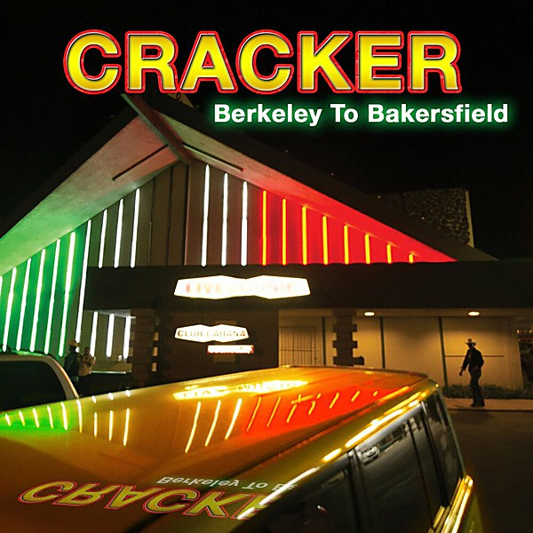

# Berkeley to Bakersfield

By **Cracker**

## Album Data

- **Catalog:** Beets
- **Format:** Digital, Album
- **Album:** Berkeley to Bakersfield
- **Artist:** Cracker
- **Albumartist:** Cracker
- **Genre:** Americana
- **MusicBrainz Album Artist ID:** [ca48bfb8-37c5-4a04-9837-a07975ee0cd3](https://musicbrainz.org/artist/ca48bfb8-37c5-4a04-9837-a07975ee0cd3)
- **MusicBrainz Album ID:** [5988fcea-9c72-49b5-8e48-b015d339aefd](https://musicbrainz.org/release/5988fcea-9c72-49b5-8e48-b015d339aefd)
- **MusicBrainz Release Group ID:** [af12258b-b68c-4d31-8495-f8fadd42068a](https://musicbrainz.org/release-group/af12258b-b68c-4d31-8495-f8fadd42068a)
- **Year:** 2014
- **Catalog #:** 2-91816
- **Label:** Virgin
- **Total Tracks:** 12

## Album Tracks

### Track 01 - Teen Angst (What the World Needs Now)

- **Artist:** Cracker
- **Format:** ALAC
- **Genre:** Alternative Rock
- **Length:** 4:14
- **MusicBrainz Track ID:** [fd29800d-7494-4c14-a156-df877b789909](https://musicbrainz.org/recording/fd29800d-7494-4c14-a156-df877b789909)
- **Title:** Teen Angst (What the World Needs Now)
- **Track:** 01
- **Year:** 1992

### Track 02 - Happy Birthday to Me

- **Artist:** Cracker
- **Format:** ALAC
- **Genre:** Hard Rock
- **Length:** 3:31
- **MusicBrainz Track ID:** [18d41236-c934-490d-b10a-eda7c4cbb462](https://musicbrainz.org/recording/18d41236-c934-490d-b10a-eda7c4cbb462)
- **Title:** Happy Birthday to Me
- **Track:** 02
- **Year:** 1992

### Track 03 - This Is Cracker Soul

- **Artist:** Cracker
- **Format:** ALAC
- **Genre:** Country Rock
- **Length:** 3:40
- **MusicBrainz Track ID:** [b54c573e-ff1a-4d17-8718-aeee134f1c83](https://musicbrainz.org/recording/b54c573e-ff1a-4d17-8718-aeee134f1c83)
- **Title:** This Is Cracker Soul
- **Track:** 03
- **Year:** 1992

### Track 04 - I See the Light

- **Artist:** Cracker
- **Format:** ALAC
- **Genre:** Americana
- **Length:** 5:13
- **MusicBrainz Track ID:** [9798ca1d-fa70-4b0e-8002-396066fb00cc](https://musicbrainz.org/recording/9798ca1d-fa70-4b0e-8002-396066fb00cc)
- **Title:** I See the Light
- **Track:** 04
- **Year:** 1992

### Track 05 - St. Cajetan

- **Artist:** Cracker
- **Format:** ALAC
- **Genre:** Rock
- **Length:** 5:26
- **MusicBrainz Track ID:** [49ed8678-a68d-4ae8-aaa3-27d838f16148](https://musicbrainz.org/recording/49ed8678-a68d-4ae8-aaa3-27d838f16148)
- **Title:** St. Cajetan
- **Track:** 05
- **Year:** 1992

### Track 06 - Mr. Wrong

- **Artist:** Cracker
- **Format:** ALAC
- **Genre:** Rock
- **Length:** 4:37
- **MusicBrainz Track ID:** [dcfd88b9-5e0a-41ca-8bf7-2061668b34f3](https://musicbrainz.org/recording/dcfd88b9-5e0a-41ca-8bf7-2061668b34f3)
- **Title:** Mr. Wrong
- **Track:** 06
- **Year:** 1992

### Track 07 - Someday

- **Artist:** Cracker
- **Format:** ALAC
- **Genre:** Country Rock
- **Length:** 3:22
- **MusicBrainz Track ID:** [b958abd0-84a0-493e-988d-dc5ddca3311e](https://musicbrainz.org/recording/b958abd0-84a0-493e-988d-dc5ddca3311e)
- **Title:** Someday
- **Track:** 07
- **Year:** 1992

### Track 08 - Can I Take My Gun to Heaven?

- **Artist:** Cracker
- **Format:** ALAC
- **Genre:** Hard Rock
- **Length:** 4:01
- **MusicBrainz Track ID:** [4715d6c6-70dd-4f4f-a0ec-519d8eea697f](https://musicbrainz.org/recording/4715d6c6-70dd-4f4f-a0ec-519d8eea697f)
- **Title:** Can I Take My Gun to Heaven?
- **Track:** 08
- **Year:** 1992

### Track 09 - Satisfy You

- **Artist:** Cracker
- **Format:** ALAC
- **Genre:** Country Rock
- **Length:** 3:29
- **MusicBrainz Track ID:** [daae198d-001e-405c-8c8b-d09e67b740e9](https://musicbrainz.org/recording/daae198d-001e-405c-8c8b-d09e67b740e9)
- **Title:** Satisfy You
- **Track:** 09
- **Year:** 1992

### Track 10 - Another Song About the Rain

- **Artist:** Cracker
- **Format:** ALAC
- **Genre:** Folk Rock
- **Length:** 5:50
- **MusicBrainz Track ID:** [d26db3e6-f332-48dd-918e-41af353e2dd3](https://musicbrainz.org/recording/d26db3e6-f332-48dd-918e-41af353e2dd3)
- **Title:** Another Song About the Rain
- **Track:** 10
- **Year:** 1992

### Track 11 - Don’t Fuck Me Up (With Peace and Love)

- **Artist:** Cracker
- **Format:** ALAC
- **Genre:** Hard Rock
- **Length:** 3:12
- **MusicBrainz Track ID:** [6c830322-6df3-4bf2-999f-48d6f327b81b](https://musicbrainz.org/recording/6c830322-6df3-4bf2-999f-48d6f327b81b)
- **Title:** Don’t Fuck Me Up (With Peace and Love)
- **Track:** 11
- **Year:** 1992

### Track 12 - Dr. Bernice

- **Artist:** Cracker
- **Format:** ALAC
- **Genre:** Rock
- **Length:** 6:21
- **MusicBrainz Track ID:** [7c5ff5d3-8488-4839-bc64-e8e8bddf6cf8](https://musicbrainz.org/recording/7c5ff5d3-8488-4839-bc64-e8e8bddf6cf8)
- **Title:** Dr. Bernice
- **Track:** 12
- **Year:** 1992

## See also

- [Cracker](Cracker.md)
- [Forever](Forever.md)
- [Hello Cleveland! (Live From The Metro)](Hello_Cleveland!_Live_From_The_Metro.md)
- [Sunrise in the Land of Milk and Honey](Sunrise_in_the_Land_of_Milk_and_Honey.md)
- [The Golden Age](The_Golden_Age.md)
- [CD: ](../../CD/Cracker/Cracker_index.md)
- [CD: Cracker](../../CD/Cracker/Cracker.md)
- [CD: Forever](../../CD/Cracker/Forever.md)
- [CD: The Golden Age](../../CD/Cracker/The_Golden_Age.md)
- [Roon: Cracker](../../Roon/Cracker/Cracker.md)
- [Roon: Forever](../../Roon/Cracker/Forever.md)
- [Roon: Kerosene Hat](../../Roon/Cracker/Kerosene_Hat.md)
- [Roon: The Golden Age](../../Roon/Cracker/The_Golden_Age.md)
