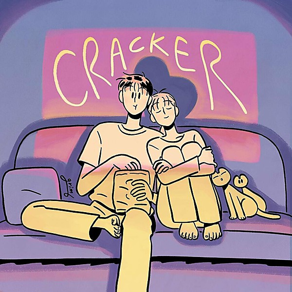

# Cracker

By **Cracker**

## Album Data

- **Catalog:** Beets
- **Format:** Digital, Album
- **Album:** Cracker
- **Artist:** Cracker
- **Albumartist:** Cracker
- **Genre:** Hard Rock
- **MusicBrainz Album Artist ID:** [ca48bfb8-37c5-4a04-9837-a07975ee0cd3](https://musicbrainz.org/artist/ca48bfb8-37c5-4a04-9837-a07975ee0cd3)
- **MusicBrainz Album ID:** [bdec842c-6dd2-3d7d-bd45-997beda85623](https://musicbrainz.org/release/bdec842c-6dd2-3d7d-bd45-997beda85623)
- **MusicBrainz Release Group ID:** [38540fff-77c3-33b1-8d79-18ea3880b8c0](https://musicbrainz.org/release-group/38540fff-77c3-33b1-8d79-18ea3880b8c0)
- **Year:** 1992
- **Catalog #:** 72438-11341-2-2
- **Label:** Back Porch
- **Total Tracks:** 13

## Album Tracks

### Track 01 - Brides of Neptune

- **Artist:** Cracker
- **Format:** ALAC
- **Genre:** Rock
- **Length:** 4:57
- **MusicBrainz Track ID:** [558cc307-c7ce-495d-abe8-720bba867bdb](https://musicbrainz.org/recording/558cc307-c7ce-495d-abe8-720bba867bdb)
- **Title:** Brides of Neptune
- **Track:** 01
- **Year:** 2002

### Track 02 - Shine

- **Artist:** Cracker
- **Format:** ALAC
- **Genre:** Americana
- **Length:** 4:20
- **MusicBrainz Track ID:** [f91406d6-154d-429b-a3a1-2aaf48204787](https://musicbrainz.org/recording/f91406d6-154d-429b-a3a1-2aaf48204787)
- **Title:** Shine
- **Track:** 02
- **Year:** 2002

### Track 03 - Don't Bring Us Down

- **Artist:** Cracker
- **Format:** ALAC
- **Genre:** Americana
- **Length:** 4:02
- **MusicBrainz Track ID:** [5867631c-d58d-4b0d-9653-d4dbc5fa1d84](https://musicbrainz.org/recording/5867631c-d58d-4b0d-9653-d4dbc5fa1d84)
- **Title:** Don't Bring Us Down
- **Track:** 03
- **Year:** 2002

### Track 04 - Guarded by Monkeys

- **Artist:** Cracker
- **Format:** ALAC
- **Genre:** Stoner Rock
- **Length:** 4:22
- **MusicBrainz Track ID:** [459fe226-3d75-4545-980a-92ba630ab437](https://musicbrainz.org/recording/459fe226-3d75-4545-980a-92ba630ab437)
- **Title:** Guarded by Monkeys
- **Track:** 04
- **Year:** 2002

### Track 05 - Ain't That Strange

- **Artist:** Cracker
- **Format:** ALAC
- **Genre:** Americana
- **Length:** 4:07
- **MusicBrainz Track ID:** [b0806104-4e0a-44a9-91ea-7930c8aa6d77](https://musicbrainz.org/recording/b0806104-4e0a-44a9-91ea-7930c8aa6d77)
- **Title:** Ain't That Strange
- **Track:** 05
- **Year:** 2002

### Track 06 - Miss Santa Cruz County

- **Artist:** Cracker
- **Format:** ALAC
- **Genre:** Americana
- **Length:** 4:29
- **MusicBrainz Track ID:** [cf748233-972b-4ba2-a627-c3a575ef9edf](https://musicbrainz.org/recording/cf748233-972b-4ba2-a627-c3a575ef9edf)
- **Title:** Miss Santa Cruz County
- **Track:** 06
- **Year:** 2002

### Track 07 - Superfan

- **Artist:** Cracker
- **Format:** ALAC
- **Genre:** Americana
- **Length:** 3:56
- **MusicBrainz Track ID:** [88405971-9bef-43b2-a964-42602b0bd2d3](https://musicbrainz.org/recording/88405971-9bef-43b2-a964-42602b0bd2d3)
- **Title:** Superfan
- **Track:** 07
- **Year:** 2002

### Track 08 - Sweet Magdalena of My Misfortune

- **Artist:** Cracker
- **Format:** ALAC
- **Genre:** Americana
- **Length:** 3:35
- **MusicBrainz Track ID:** [2980926d-e3f7-486b-b428-cc61e7bb69a3](https://musicbrainz.org/recording/2980926d-e3f7-486b-b428-cc61e7bb69a3)
- **Title:** Sweet Magdalena of My Misfortune
- **Track:** 08
- **Year:** 2002

### Track 09 - Merry Christmas Emily

- **Artist:** Cracker
- **Format:** ALAC
- **Genre:** Rock
- **Length:** 3:56
- **MusicBrainz Track ID:** [fcd95941-8a84-4f5b-ae25-2425c621f489](https://musicbrainz.org/recording/fcd95941-8a84-4f5b-ae25-2425c621f489)
- **Title:** Merry Christmas Emily
- **Track:** 09
- **Year:** 2002

### Track 10 - Forever

- **Artist:** Cracker
- **Format:** ALAC
- **Genre:** Indie Rock
- **Length:** 4:13
- **MusicBrainz Track ID:** [b7467994-c07b-431b-b3a4-992ab9c9bca0](https://musicbrainz.org/recording/b7467994-c07b-431b-b3a4-992ab9c9bca0)
- **Title:** Forever
- **Track:** 10
- **Year:** 2002

### Track 11 - Shameless

- **Artist:** Cracker
- **Format:** ALAC
- **Genre:** Americana
- **Length:** 3:44
- **MusicBrainz Track ID:** [df1a86bd-cf93-4013-8374-20d50bce4f28](https://musicbrainz.org/recording/df1a86bd-cf93-4013-8374-20d50bce4f28)
- **Title:** Shameless
- **Track:** 11
- **Year:** 2002

### Track 12 - One Fine Day

- **Artist:** Cracker
- **Format:** ALAC
- **Genre:** Americana
- **Length:** 6:54
- **MusicBrainz Track ID:** [4dc0eea6-af3b-4cdf-b292-960163e802f2](https://musicbrainz.org/recording/4dc0eea6-af3b-4cdf-b292-960163e802f2)
- **Title:** One Fine Day
- **Track:** 12
- **Year:** 2002

### Track 13 - What You're Missing

- **Artist:** Cracker
- **Format:** ALAC
- **Genre:** Southern Rock
- **Length:** 5:42
- **MusicBrainz Track ID:** [d986cdcb-235c-436a-a708-fa2e3d6fe33d](https://musicbrainz.org/recording/d986cdcb-235c-436a-a708-fa2e3d6fe33d)
- **Title:** What You're Missing
- **Track:** 13
- **Year:** 2002

## See also

- [Berkeley to Bakersfield](Berkeley_to_Bakersfield.md)
- [Forever](Forever.md)
- [Hello Cleveland! (Live From The Metro)](Hello_Cleveland!_Live_From_The_Metro.md)
- [Sunrise in the Land of Milk and Honey](Sunrise_in_the_Land_of_Milk_and_Honey.md)
- [The Golden Age](The_Golden_Age.md)
- [CD: ](../../CD/Cracker/Cracker_index.md)
- [CD: Cracker](../../CD/Cracker/Cracker.md)
- [CD: Forever](../../CD/Cracker/Forever.md)
- [CD: The Golden Age](../../CD/Cracker/The_Golden_Age.md)
- [Roon: Cracker](../../Roon/Cracker/Cracker.md)
- [Roon: Forever](../../Roon/Cracker/Forever.md)
- [Roon: Kerosene Hat](../../Roon/Cracker/Kerosene_Hat.md)
- [Roon: The Golden Age](../../Roon/Cracker/The_Golden_Age.md)
