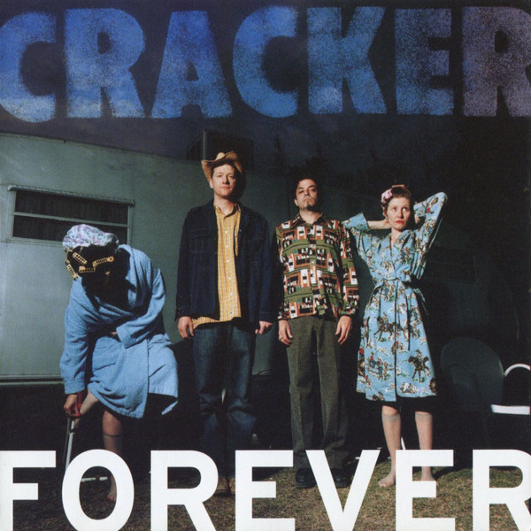

# Forever

By **Cracker**

## Album Data

- **Catalog:** Beets
- **Format:** Digital, Album
- **Album:** Forever
- **Artist:** Cracker
- **Albumartist:** Cracker
- **Genre:** Americana
- **MusicBrainz Album Artist ID:** [ca48bfb8-37c5-4a04-9837-a07975ee0cd3](https://musicbrainz.org/artist/ca48bfb8-37c5-4a04-9837-a07975ee0cd3)
- **MusicBrainz Album ID:** [e3cef525-b342-4e0c-97bd-27c11ec8a016](https://musicbrainz.org/release/e3cef525-b342-4e0c-97bd-27c11ec8a016)
- **MusicBrainz Release Group ID:** [5c03b51a-6753-3e4c-ba86-f1bc1831e60b](https://musicbrainz.org/release-group/5c03b51a-6753-3e4c-ba86-f1bc1831e60b)
- **Year:** 2002
- **Catalog #:** 
- **Label:** 
- **Total Tracks:** 11

## Album Tracks

### Track 01 - Seven Days

- **Artist:** Cracker
- **Format:** ALAC
- **Genre:** Indie Rock
- **Length:** 4:38
- **MusicBrainz Track ID:** [8b6179ec-6a74-4278-aaea-b3be15471e6f](https://musicbrainz.org/recording/8b6179ec-6a74-4278-aaea-b3be15471e6f)
- **Title:** Seven Days
- **Track:** 01
- **Year:** 2002

### Track 02 - The Good Life

- **Artist:** Cracker
- **Format:** ALAC
- **Genre:** Rock
- **Length:** 3:49
- **MusicBrainz Track ID:** [2c7b5b74-c31a-4a4b-95c7-e767115e1bb6](https://musicbrainz.org/recording/2c7b5b74-c31a-4a4b-95c7-e767115e1bb6)
- **Title:** The Good Life
- **Track:** 02
- **Year:** 2002

### Track 03 - Lonesome Johnny Blues

- **Artist:** Cracker
- **Format:** ALAC
- **Genre:** Bluegrass
- **Length:** 2:58
- **MusicBrainz Track ID:** [fdfe410a-e194-4ff3-ada2-40d352f2a44b](https://musicbrainz.org/recording/fdfe410a-e194-4ff3-ada2-40d352f2a44b)
- **Title:** Lonesome Johnny Blues
- **Track:** 03
- **Year:** 2002

### Track 04 - Big Dipper

- **Artist:** Cracker
- **Format:** ALAC
- **Genre:** Slowcore
- **Length:** 5:36
- **MusicBrainz Track ID:** [22e7a713-f091-4f87-943a-7bcee837f6ea](https://musicbrainz.org/recording/22e7a713-f091-4f87-943a-7bcee837f6ea)
- **Title:** Big Dipper
- **Track:** 04
- **Year:** 2002

### Track 05 - Around The World

- **Artist:** Cracker
- **Format:** ALAC
- **Genre:** Americana
- **Length:** 5:19
- **MusicBrainz Track ID:** [4ca1625b-f02e-4652-8781-885bad5c8cb1](https://musicbrainz.org/recording/4ca1625b-f02e-4652-8781-885bad5c8cb1)
- **Title:** Around The World
- **Track:** 05
- **Year:** 2002

### Track 06 - Teen Angst

- **Artist:** Cracker
- **Format:** ALAC
- **Genre:** Rock
- **Length:** 4:12
- **MusicBrainz Track ID:** [6f73aa1c-82e1-4aed-bc9d-51459ed0276d](https://musicbrainz.org/recording/6f73aa1c-82e1-4aed-bc9d-51459ed0276d)
- **Title:** Teen Angst
- **Track:** 06
- **Year:** 2002

### Track 07 - Crackersoul

- **Artist:** Cracker
- **Format:** ALAC
- **Genre:** Rock
- **Length:** 3:53
- **MusicBrainz Track ID:** [dfdb7a4b-b820-4f18-b2ab-a85c76121e61](https://musicbrainz.org/recording/dfdb7a4b-b820-4f18-b2ab-a85c76121e61)
- **Title:** Crackersoul
- **Track:** 07
- **Year:** 2002

### Track 08 - Sweet Thistle Pie

- **Artist:** Cracker
- **Format:** ALAC
- **Genre:** Rock
- **Length:** 5:15
- **MusicBrainz Track ID:** [7a487ee6-0f70-42f7-9eb2-13261b771a1b](https://musicbrainz.org/recording/7a487ee6-0f70-42f7-9eb2-13261b771a1b)
- **Title:** Sweet Thistle Pie
- **Track:** 08
- **Year:** 2002

### Track 09 - The World Is Mine

- **Artist:** Cracker
- **Format:** ALAC
- **Genre:** Alternative Rock
- **Length:** 3:58
- **MusicBrainz Track ID:** [01a7c9b8-c9f3-4f2b-ac2b-af57f0fd100e](https://musicbrainz.org/recording/01a7c9b8-c9f3-4f2b-ac2b-af57f0fd100e)
- **Title:** The World Is Mine
- **Track:** 09
- **Year:** 2002

### Track 10 - Low

- **Artist:** Cracker
- **Format:** ALAC
- **Genre:** Country Rock
- **Length:** 4:45
- **MusicBrainz Track ID:** [c58a8325-196a-4dcd-bdf2-925131faf0f5](https://musicbrainz.org/recording/c58a8325-196a-4dcd-bdf2-925131faf0f5)
- **Title:** Low
- **Track:** 10
- **Year:** 2002

### Track 11 - Pictures Of Matchstick Men

- **Artist:** Cracker
- **Format:** ALAC
- **Genre:** Americana
- **Length:** 4:33
- **MusicBrainz Track ID:** [0f02688e-a2d5-4290-9206-2caf667529c7](https://musicbrainz.org/recording/0f02688e-a2d5-4290-9206-2caf667529c7)
- **Title:** Pictures Of Matchstick Men
- **Track:** 11
- **Year:** 2002

## See also

- [Berkeley to Bakersfield](Berkeley_to_Bakersfield.md)
- [Cracker](Cracker.md)
- [Hello Cleveland! (Live From The Metro)](Hello_Cleveland!_Live_From_The_Metro.md)
- [Sunrise in the Land of Milk and Honey](Sunrise_in_the_Land_of_Milk_and_Honey.md)
- [The Golden Age](The_Golden_Age.md)
- [CD: ](../../CD/Cracker/Cracker_index.md)
- [CD: Cracker](../../CD/Cracker/Cracker.md)
- [CD: Forever](../../CD/Cracker/Forever.md)
- [CD: The Golden Age](../../CD/Cracker/The_Golden_Age.md)
- [Roon: Cracker](../../Roon/Cracker/Cracker.md)
- [Roon: Forever](../../Roon/Cracker/Forever.md)
- [Roon: Kerosene Hat](../../Roon/Cracker/Kerosene_Hat.md)
- [Roon: The Golden Age](../../Roon/Cracker/The_Golden_Age.md)
