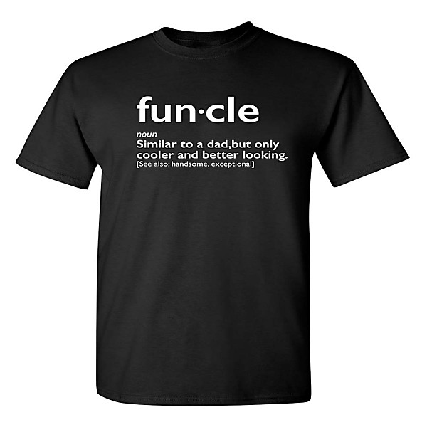

# Hello Cleveland! (Live From The Metro)

By **Cracker**

## Album Data

- **Catalog:** Beets
- **Format:** Digital, Album
- **Album:** Hello Cleveland! (Live From The Metro)
- **Artist:** Cracker
- **Albumartist:** Cracker
- **Genre:** Americana
- **MusicBrainz Album Artist ID:** [ca48bfb8-37c5-4a04-9837-a07975ee0cd3](https://musicbrainz.org/artist/ca48bfb8-37c5-4a04-9837-a07975ee0cd3)
- **MusicBrainz Album ID:** [7feb8733-de90-4195-827a-50a36fe6f9df](https://musicbrainz.org/release/7feb8733-de90-4195-827a-50a36fe6f9df)
- **MusicBrainz Release Group ID:** [3234b862-3756-3815-927a-5890e571629f](https://musicbrainz.org/release-group/3234b862-3756-3815-927a-5890e571629f)
- **Year:** 2002
- **Catalog #:** 
- **Label:** 429 Records
- **Total Tracks:** 11

## Album Tracks

### Track 01 - Yalla Yalla (Let's Go)

- **Artist:** Cracker
- **Format:** ALAC
- **Genre:** Americana
- **Length:** 3:16
- **MusicBrainz Track ID:** [fc38c5f2-9303-4963-9cd5-0fc12a767d73](https://musicbrainz.org/recording/fc38c5f2-9303-4963-9cd5-0fc12a767d73)
- **Title:** Yalla Yalla (Let's Go)
- **Track:** 01
- **Year:** 2009

### Track 02 - Show Me How This Thing Works

- **Artist:** Cracker
- **Format:** ALAC
- **Genre:** Americana
- **Length:** 2:50
- **MusicBrainz Track ID:** [ccab9e9c-d604-45fa-bd11-2f2e24b8e868](https://musicbrainz.org/recording/ccab9e9c-d604-45fa-bd11-2f2e24b8e868)
- **Title:** Show Me How This Thing Works
- **Track:** 02
- **Year:** 2009

### Track 03 - Turn on, Tune in, Drop Out With Me

- **Artist:** Cracker
- **Format:** ALAC
- **Genre:** Americana
- **Length:** 4:11
- **MusicBrainz Track ID:** [1e9c4f2a-282c-49e7-a65d-b7c6c0356ffc](https://musicbrainz.org/recording/1e9c4f2a-282c-49e7-a65d-b7c6c0356ffc)
- **Title:** Turn on, Tune in, Drop Out With Me
- **Track:** 03
- **Year:** 2009

### Track 04 - We All Shine a Light

- **Artist:** Cracker
- **Format:** ALAC
- **Genre:** Americana
- **Length:** 3:38
- **MusicBrainz Track ID:** [2c030143-e195-412a-8227-a41d45c497c7](https://musicbrainz.org/recording/2c030143-e195-412a-8227-a41d45c497c7)
- **Title:** We All Shine a Light
- **Track:** 04
- **Year:** 2009

### Track 05 - Hand Me My Inhaler

- **Artist:** Cracker
- **Format:** ALAC
- **Genre:** Indie Rock
- **Length:** 1:31
- **MusicBrainz Track ID:** [525156e2-9063-4aa4-ab5a-77d83a4d8287](https://musicbrainz.org/recording/525156e2-9063-4aa4-ab5a-77d83a4d8287)
- **Title:** Hand Me My Inhaler
- **Track:** 05
- **Year:** 2009

### Track 06 - Friends

- **Artist:** Cracker
- **Format:** ALAC
- **Genre:** Americana
- **Length:** 4:14
- **MusicBrainz Track ID:** [81d8e807-6637-4a64-9166-58539f95cfb7](https://musicbrainz.org/recording/81d8e807-6637-4a64-9166-58539f95cfb7)
- **Title:** Friends
- **Track:** 06
- **Year:** 2009

### Track 07 - I Could Be Wrong, I Could Be Right

- **Artist:** Cracker
- **Format:** ALAC
- **Genre:** Rock
- **Length:** 4:51
- **MusicBrainz Track ID:** [28e48632-9810-4fbb-9168-fff763d142f8](https://musicbrainz.org/recording/28e48632-9810-4fbb-9168-fff763d142f8)
- **Title:** I Could Be Wrong, I Could Be Right
- **Track:** 07
- **Year:** 2009

### Track 08 - Time Machine

- **Artist:** Cracker
- **Format:** ALAC
- **Genre:** Americana
- **Length:** 2:05
- **MusicBrainz Track ID:** [be5b20c8-1aea-4f46-b0d3-f8a0402be789](https://musicbrainz.org/recording/be5b20c8-1aea-4f46-b0d3-f8a0402be789)
- **Title:** Time Machine
- **Track:** 08
- **Year:** 2009

### Track 09 - Hey Bret (You Know What Time) It Is

- **Artist:** Cracker
- **Format:** ALAC
- **Genre:** Americana
- **Length:** 4:51
- **MusicBrainz Track ID:** [f15a541a-3fe0-412e-896c-c2288ba30ad8](https://musicbrainz.org/recording/f15a541a-3fe0-412e-896c-c2288ba30ad8)
- **Title:** Hey Bret (You Know What Time) It Is
- **Track:** 09
- **Year:** 2009

### Track 10 - Darling One

- **Artist:** Cracker
- **Format:** ALAC
- **Genre:** Americana
- **Length:** 4:43
- **MusicBrainz Track ID:** [0b1d2521-4836-48b9-8d26-a55724a38723](https://musicbrainz.org/recording/0b1d2521-4836-48b9-8d26-a55724a38723)
- **Title:** Darling One
- **Track:** 10
- **Year:** 2009

### Track 11 - Sunrise in the Land of Milk and Honey

- **Artist:** Cracker
- **Format:** ALAC
- **Genre:** Americana
- **Length:** 3:26
- **MusicBrainz Track ID:** [adc01d94-92dd-430a-a2df-18a025ad2965](https://musicbrainz.org/recording/adc01d94-92dd-430a-a2df-18a025ad2965)
- **Title:** Sunrise in the Land of Milk and Honey
- **Track:** 11
- **Year:** 2009

## See also

- [Berkeley to Bakersfield](Berkeley_to_Bakersfield.md)
- [Cracker](Cracker.md)
- [Forever](Forever.md)
- [Sunrise in the Land of Milk and Honey](Sunrise_in_the_Land_of_Milk_and_Honey.md)
- [The Golden Age](The_Golden_Age.md)
- [CD: ](../../CD/Cracker/Cracker_index.md)
- [CD: Cracker](../../CD/Cracker/Cracker.md)
- [CD: Forever](../../CD/Cracker/Forever.md)
- [CD: The Golden Age](../../CD/Cracker/The_Golden_Age.md)
- [Roon: Cracker](../../Roon/Cracker/Cracker.md)
- [Roon: Forever](../../Roon/Cracker/Forever.md)
- [Roon: Kerosene Hat](../../Roon/Cracker/Kerosene_Hat.md)
- [Roon: The Golden Age](../../Roon/Cracker/The_Golden_Age.md)
