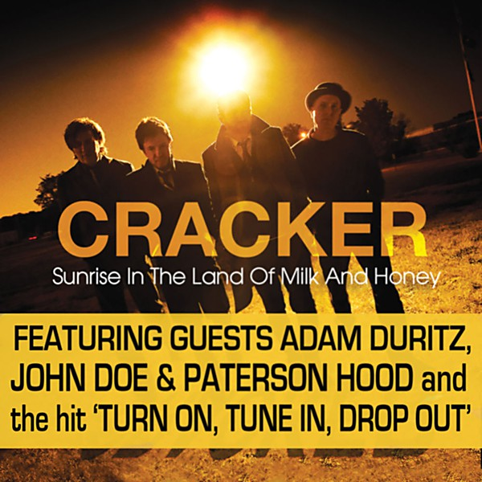

# Sunrise in the Land of Milk and Honey

By **Cracker**

## Album Data

- **Catalog:** Beets
- **Format:** Digital, Album
- **Album:** Sunrise in the Land of Milk and Honey
- **Artist:** Cracker
- **Albumartist:** Cracker
- **Genre:** Americana
- **MusicBrainz Album Artist ID:** [ca48bfb8-37c5-4a04-9837-a07975ee0cd3](https://musicbrainz.org/artist/ca48bfb8-37c5-4a04-9837-a07975ee0cd3)
- **MusicBrainz Album ID:** [e5a27ef2-228d-4c8d-a4e3-4ab06f4b4bd0](https://musicbrainz.org/release/e5a27ef2-228d-4c8d-a4e3-4ab06f4b4bd0)
- **MusicBrainz Release Group ID:** [b7b50a78-5517-397c-b24e-4cca2b6b639a](https://musicbrainz.org/release-group/b7b50a78-5517-397c-b24e-4cca2b6b639a)
- **Year:** 2009
- **Catalog #:** 7243 8 41498 2 6
- **Label:** Virgin
- **Total Tracks:** 12

## Album Tracks

### Track 01 - I Hate My Generation

- **Artist:** Cracker
- **Format:** ALAC
- **Genre:** Grunge
- **Length:** 2:56
- **MusicBrainz Track ID:** [42951de6-0cd4-4db9-8127-bafb3e71345b](https://musicbrainz.org/recording/42951de6-0cd4-4db9-8127-bafb3e71345b)
- **Title:** I Hate My Generation
- **Track:** 01
- **Year:** 1996

### Track 02 - I’m a Little Rocket Ship

- **Artist:** Cracker
- **Format:** ALAC
- **Genre:** Hard Rock
- **Length:** 3:25
- **MusicBrainz Track ID:** [65e80b80-914b-4590-920b-a99fa188e7ea](https://musicbrainz.org/recording/65e80b80-914b-4590-920b-a99fa188e7ea)
- **Title:** I’m a Little Rocket Ship
- **Track:** 02
- **Year:** 1996

### Track 03 - Big Dipper

- **Artist:** Cracker
- **Format:** ALAC
- **Genre:** Slowcore
- **Length:** 5:40
- **MusicBrainz Track ID:** [64b4188e-3233-4437-a089-aa14c25d4f96](https://musicbrainz.org/recording/64b4188e-3233-4437-a089-aa14c25d4f96)
- **Title:** Big Dipper
- **Track:** 03
- **Year:** 1996

### Track 04 - Nothing to Believe In

- **Artist:** Cracker
- **Format:** ALAC
- **Genre:** Hard Rock
- **Length:** 3:24
- **MusicBrainz Track ID:** [1cb32687-7a58-44db-9342-da2057b291ef](https://musicbrainz.org/recording/1cb32687-7a58-44db-9342-da2057b291ef)
- **Title:** Nothing to Believe In
- **Track:** 04
- **Year:** 1996

### Track 05 - The Golden Age

- **Artist:** Cracker
- **Format:** ALAC
- **Genre:** Hard Rock
- **Length:** 3:43
- **MusicBrainz Track ID:** [190dbadf-70d6-41e8-bc66-fe7aaba68be7](https://musicbrainz.org/recording/190dbadf-70d6-41e8-bc66-fe7aaba68be7)
- **Title:** The Golden Age
- **Track:** 05
- **Year:** 1996

### Track 06 - 100 Flower Power Maximum

- **Artist:** Cracker
- **Format:** ALAC
- **Genre:** Rock
- **Length:** 2:46
- **MusicBrainz Track ID:** [ec144edb-a876-4ce8-b882-a31fcce9f790](https://musicbrainz.org/recording/ec144edb-a876-4ce8-b882-a31fcce9f790)
- **Title:** 100 Flower Power Maximum
- **Track:** 06
- **Year:** 1996

### Track 07 - Dixie Babylon

- **Artist:** Cracker
- **Format:** ALAC
- **Genre:** Rock
- **Length:** 7:09
- **MusicBrainz Track ID:** [74120784-fa5f-4c8a-9e9a-f3e397fa34e2](https://musicbrainz.org/recording/74120784-fa5f-4c8a-9e9a-f3e397fa34e2)
- **Title:** Dixie Babylon
- **Track:** 07
- **Year:** 1996

### Track 08 - I Can’t Forget You

- **Artist:** Cracker
- **Format:** ALAC
- **Genre:** Hard Rock
- **Length:** 4:13
- **MusicBrainz Track ID:** [1fcd3d4c-2192-4ada-9d55-15f05a34915c](https://musicbrainz.org/recording/1fcd3d4c-2192-4ada-9d55-15f05a34915c)
- **Title:** I Can’t Forget You
- **Track:** 08
- **Year:** 1996

### Track 09 - Sweet Thistle Pie

- **Artist:** Cracker
- **Format:** ALAC
- **Genre:** Rock
- **Length:** 5:01
- **MusicBrainz Track ID:** [17224523-096b-4435-a4fc-938b3be5f117](https://musicbrainz.org/recording/17224523-096b-4435-a4fc-938b3be5f117)
- **Title:** Sweet Thistle Pie
- **Track:** 09
- **Year:** 1996

### Track 10 - Useless Stuff

- **Artist:** Cracker
- **Format:** ALAC
- **Genre:** Hard Rock
- **Length:** 2:19
- **MusicBrainz Track ID:** [d8126b48-1abe-4d8f-900f-14e9f58ac3de](https://musicbrainz.org/recording/d8126b48-1abe-4d8f-900f-14e9f58ac3de)
- **Title:** Useless Stuff
- **Track:** 10
- **Year:** 1996

### Track 11 - How Can I Live Without You

- **Artist:** Cracker
- **Format:** ALAC
- **Genre:** Rock
- **Length:** 3:27
- **MusicBrainz Track ID:** [ec7a50f1-3db8-4cd5-8aea-7a246f305b29](https://musicbrainz.org/recording/ec7a50f1-3db8-4cd5-8aea-7a246f305b29)
- **Title:** How Can I Live Without You
- **Track:** 11
- **Year:** 1996

### Track 12 - Bicycle Spaniard

- **Artist:** Cracker
- **Format:** ALAC
- **Genre:** Americana
- **Length:** 4:25
- **MusicBrainz Track ID:** [08066f47-a0f3-4099-a293-77d090151d5e](https://musicbrainz.org/recording/08066f47-a0f3-4099-a293-77d090151d5e)
- **Title:** Bicycle Spaniard
- **Track:** 12
- **Year:** 1996

## See also

- [Berkeley to Bakersfield](Berkeley_to_Bakersfield.md)
- [Cracker](Cracker.md)
- [Forever](Forever.md)
- [Hello Cleveland! (Live From The Metro)](Hello_Cleveland!_Live_From_The_Metro.md)
- [The Golden Age](The_Golden_Age.md)
- [CD: ](../../CD/Cracker/Cracker_index.md)
- [CD: Cracker](../../CD/Cracker/Cracker.md)
- [CD: Forever](../../CD/Cracker/Forever.md)
- [CD: The Golden Age](../../CD/Cracker/The_Golden_Age.md)
- [Roon: Cracker](../../Roon/Cracker/Cracker.md)
- [Roon: Forever](../../Roon/Cracker/Forever.md)
- [Roon: Kerosene Hat](../../Roon/Cracker/Kerosene_Hat.md)
- [Roon: The Golden Age](../../Roon/Cracker/The_Golden_Age.md)
