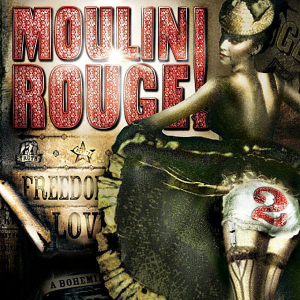

# Moulin Rouge 2

By **Craig Armstrong**

## Album Data

- **Catalog:** Beets
- **Format:** Digital, Album
- **Album:** Moulin Rouge 2
- **Artist:** Craig Armstrong
- **Albumartist:** Craig Armstrong
- **Genre:** Electronica
- **MusicBrainz Album Artist ID:** 
- **MusicBrainz Album ID:** 
- **MusicBrainz Release Group ID:** 
- **Year:** 2002
- **Catalog #:** 
- **Label:** 
- **Total Tracks:** 11

## Album Tracks

### Track 07 - Meet Me In The Red Room [Original Film Version]

- **Artist:** Amiel
- **Format:** ALAC
- **Genre:** Pop
- **Length:** 2:38
- **MusicBrainz Track ID:** 
- **Title:** Meet Me In The Red Room [Original Film Version]
- **Track:** 07
- **Year:** 2002

### Track 01 - Your Song [Instrumental]

- **Artist:** Craig Armstrong
- **Format:** ALAC
- **Genre:** Electronica
- **Length:** 2:28
- **MusicBrainz Track ID:** 
- **Title:** Your Song [Instrumental]
- **Track:** 01
- **Year:** 2002

### Track 08 - Your Song [Instrumental]

- **Artist:** Craig Armstrong
- **Format:** ALAC
- **Genre:** Electronica
- **Length:** 4:55
- **MusicBrainz Track ID:** 
- **Title:** Your Song [Instrumental]
- **Track:** 08
- **Year:** 2002

### Track 11 - Closing Credits

- **Artist:** Craig Armstrong
- **Format:** ALAC
- **Genre:** Electronica
- **Length:** 6:53
- **MusicBrainz Track ID:** 
- **Title:** Closing Credits
- **Track:** 11
- **Year:** 2002

### Track 06 - Like A Virgin [Original Film Version]

- **Artist:** Jim Broadbent & Richard Roxburgh
- **Format:** ALAC
- **Genre:** Electronica
- **Length:** 3:10
- **MusicBrainz Track ID:** 
- **Title:** Like A Virgin [Original Film Version]
- **Track:** 06
- **Year:** 2002

### Track 09 - The Show Must Go On [Original Film Version]

- **Artist:** Jim Broadbent, Nicole Kidman & Cast
- **Format:** ALAC
- **Genre:** Electronica
- **Length:** 3:04
- **MusicBrainz Track ID:** 
- **Title:** The Show Must Go On [Original Film Version]
- **Track:** 09
- **Year:** 2002

### Track 10 - Ascension / Nature Boy

- **Artist:** John Leguizamo
- **Format:** ALAC
- **Genre:** Comedy
- **Length:** 4:09
- **MusicBrainz Track ID:** 
- **Title:** Ascension / Nature Boy
- **Track:** 10
- **Year:** 2002

### Track 03 - One Day I'll Fly Away (Tony Phillips Remix)

- **Artist:** Nicole Kidman
- **Format:** ALAC
- **Genre:** Electronica
- **Length:** 5:10
- **MusicBrainz Track ID:** 
- **Title:** One Day I'll Fly Away (Tony Phillips Remix)
- **Track:** 03
- **Year:** 2002

### Track 05 - Come What May [Original Film Version]

- **Artist:** Nicole Kidman & Ewan McGregor
- **Format:** ALAC
- **Genre:** Electronica
- **Length:** 4:38
- **MusicBrainz Track ID:** 
- **Title:** Come What May [Original Film Version]
- **Track:** 05
- **Year:** 2002

### Track 14 - Sparkling Diamonds [Original Film Version]

- **Artist:** Various Artists
- **Format:** ALAC
- **Genre:** Emo
- **Length:** 2:52
- **MusicBrainz Track ID:** 
- **Title:** Sparkling Diamonds [Original Film Version]
- **Track:** 14
- **Year:** 2002

### Track 02 - Sparkling Diamonds [Original Film Version]

- **Artist:** Various Artists
- **Format:** ALAC
- **Genre:** Emo
- **Length:** 2:52
- **MusicBrainz Track ID:** 
- **Title:** Sparkling Diamonds [Original Film Version]
- **Track:** 02
- **Year:** 2002

### Track 04 - The Pitch (Spectacular Spectacular) [Original Film Version]

- **Artist:** Various Artists
- **Format:** ALAC
- **Genre:** Emo
- **Length:** 2:50
- **MusicBrainz Track ID:** 
- **Title:** The Pitch (Spectacular Spectacular) [Original Film Version]
- **Track:** 04
- **Year:** 2002

