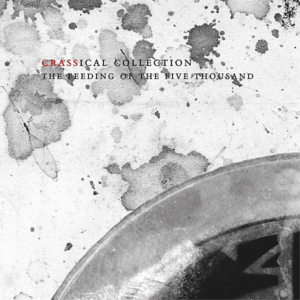

# The Feeding of the 5000

By **Crass**

## Album Data

- **Catalog:** Beets
- **Format:** Digital, Album
- **Album:** The Feeding of the 5000
- **Artist:** Crass
- **Albumartist:** Crass
- **Genre:** Anarcho Punk
- **MusicBrainz Album Artist ID:** [c7437df4-6fac-4c89-99ae-f8640f268222](https://musicbrainz.org/artist/c7437df4-6fac-4c89-99ae-f8640f268222)
- **MusicBrainz Album ID:** [c7d90daf-1152-4fa4-9d8b-a269d1a1ea7d](https://musicbrainz.org/release/c7d90daf-1152-4fa4-9d8b-a269d1a1ea7d)
- **MusicBrainz Release Group ID:** [98e1c658-228a-3b29-8a15-3937ff6964fe](https://musicbrainz.org/release-group/98e1c658-228a-3b29-8a15-3937ff6964fe)
- **Year:** 1995
- **Catalog #:** 621984 CD
- **Label:** Crass Records
- **Total Tracks:** 18

## Album Tracks

### Track 01 - Asylum

- **Artist:** Crass
- **Format:** AAC
- **Genre:** Anarcho Punk
- **Length:** 2:06
- **MusicBrainz Track ID:** [9adf8691-3651-4632-b0f6-9ded08ed42ac](https://musicbrainz.org/recording/9adf8691-3651-4632-b0f6-9ded08ed42ac)
- **Title:** Asylum
- **Track:** 01
- **Year:** 1995

### Track 02 - Do They Owe Us a Living?

- **Artist:** Crass
- **Format:** AAC
- **Genre:** Punk Rock
- **Length:** 1:24
- **MusicBrainz Track ID:** [0e669c91-5d2d-46a5-ae3f-e56d0a4bf055](https://musicbrainz.org/recording/0e669c91-5d2d-46a5-ae3f-e56d0a4bf055)
- **Title:** Do They Owe Us a Living?
- **Track:** 02
- **Year:** 1995

### Track 03 - End Result

- **Artist:** Crass
- **Format:** AAC
- **Genre:** Hardcore Punk
- **Length:** 2:04
- **MusicBrainz Track ID:** [a1606ac2-b683-4506-99f7-dd2e4542473d](https://musicbrainz.org/recording/a1606ac2-b683-4506-99f7-dd2e4542473d)
- **Title:** End Result
- **Track:** 03
- **Year:** 1995

### Track 04 - They’ve Got a Bomb

- **Artist:** Crass
- **Format:** AAC
- **Genre:** Anarcho Punk
- **Length:** 3:48
- **MusicBrainz Track ID:** [27846a67-9fd5-4055-ac1c-714b3b179bf1](https://musicbrainz.org/recording/27846a67-9fd5-4055-ac1c-714b3b179bf1)
- **Title:** They’ve Got a Bomb
- **Track:** 04
- **Year:** 1995

### Track 05 - Punk Is Dead

- **Artist:** Crass
- **Format:** AAC
- **Genre:** Hardcore Punk
- **Length:** 1:47
- **MusicBrainz Track ID:** [2a64d6a4-6c31-4f6d-a480-1c3234eca354](https://musicbrainz.org/recording/2a64d6a4-6c31-4f6d-a480-1c3234eca354)
- **Title:** Punk Is Dead
- **Track:** 05
- **Year:** 1995

### Track 06 - Reject of Society

- **Artist:** Crass
- **Format:** AAC
- **Genre:** Punk Rock
- **Length:** 1:08
- **MusicBrainz Track ID:** [3f64dabc-cbb2-4df0-9678-03789840d6a8](https://musicbrainz.org/recording/3f64dabc-cbb2-4df0-9678-03789840d6a8)
- **Title:** Reject of Society
- **Track:** 06
- **Year:** 1995

### Track 07 - General Bacardi

- **Artist:** Crass
- **Format:** AAC
- **Genre:** Grindcore
- **Length:** 0:59
- **MusicBrainz Track ID:** [47fbc5b4-dea7-47a8-915e-cfa54f4558b5](https://musicbrainz.org/recording/47fbc5b4-dea7-47a8-915e-cfa54f4558b5)
- **Title:** General Bacardi
- **Track:** 07
- **Year:** 1995

### Track 08 - Banned From the Roxy

- **Artist:** Crass
- **Format:** AAC
- **Genre:** Anarcho Punk
- **Length:** 2:14
- **MusicBrainz Track ID:** [faca0310-bc65-4db3-aeb0-6b16303105e7](https://musicbrainz.org/recording/faca0310-bc65-4db3-aeb0-6b16303105e7)
- **Title:** Banned From the Roxy
- **Track:** 08
- **Year:** 1995

### Track 09 - G’s Song

- **Artist:** Crass
- **Format:** AAC
- **Genre:** Anarcho Punk
- **Length:** 0:36
- **MusicBrainz Track ID:** [2c9bcbfc-5c44-4d19-b21d-391cc50f8db8](https://musicbrainz.org/recording/2c9bcbfc-5c44-4d19-b21d-391cc50f8db8)
- **Title:** G’s Song
- **Track:** 09
- **Year:** 1995

### Track 10 - Fight War, Not Wars

- **Artist:** Crass
- **Format:** AAC
- **Genre:** Punk Rock
- **Length:** 0:42
- **MusicBrainz Track ID:** [dbc56956-b728-4010-a99c-02491c81d08b](https://musicbrainz.org/recording/dbc56956-b728-4010-a99c-02491c81d08b)
- **Title:** Fight War, Not Wars
- **Track:** 10
- **Year:** 1995

### Track 11 - Women

- **Artist:** Crass
- **Format:** AAC
- **Genre:** Punk Rock
- **Length:** 1:15
- **MusicBrainz Track ID:** [f0ceafaf-98f9-4537-bd4b-650854679fc6](https://musicbrainz.org/recording/f0ceafaf-98f9-4537-bd4b-650854679fc6)
- **Title:** Women
- **Track:** 11
- **Year:** 1995

### Track 12 - Securicor

- **Artist:** Crass
- **Format:** AAC
- **Genre:** Hardcore Punk
- **Length:** 2:28
- **MusicBrainz Track ID:** [4c42e0b5-145c-430c-b889-c8e1f4cca90b](https://musicbrainz.org/recording/4c42e0b5-145c-430c-b889-c8e1f4cca90b)
- **Title:** Securicor
- **Track:** 12
- **Year:** 1995

### Track 13 - Sucks

- **Artist:** Crass
- **Format:** AAC
- **Genre:** Anarcho Punk
- **Length:** 1:38
- **MusicBrainz Track ID:** [ef66b2ab-98c6-4497-aafd-f0b6c759ab22](https://musicbrainz.org/recording/ef66b2ab-98c6-4497-aafd-f0b6c759ab22)
- **Title:** Sucks
- **Track:** 13
- **Year:** 1995

### Track 14 - You Pay

- **Artist:** Crass
- **Format:** AAC
- **Genre:** Punk Rock
- **Length:** 1:44
- **MusicBrainz Track ID:** [6730612a-a644-415b-82f5-796b4b80a028](https://musicbrainz.org/recording/6730612a-a644-415b-82f5-796b4b80a028)
- **Title:** You Pay
- **Track:** 14
- **Year:** 1995

### Track 15 - Angels

- **Artist:** Crass
- **Format:** AAC
- **Genre:** Punk Rock
- **Length:** 2:08
- **MusicBrainz Track ID:** [474b87d8-3912-4b6c-93df-00ba472f0368](https://musicbrainz.org/recording/474b87d8-3912-4b6c-93df-00ba472f0368)
- **Title:** Angels
- **Track:** 15
- **Year:** 1995

### Track 16 - What a Shame

- **Artist:** Crass
- **Format:** AAC
- **Genre:** Anarcho Punk
- **Length:** 1:11
- **MusicBrainz Track ID:** [2baad825-a8cf-4183-844c-287af4de93bc](https://musicbrainz.org/recording/2baad825-a8cf-4183-844c-287af4de93bc)
- **Title:** What a Shame
- **Track:** 16
- **Year:** 1995

### Track 17 - So What

- **Artist:** Crass
- **Format:** AAC
- **Genre:** Hardcore Punk
- **Length:** 3:05
- **MusicBrainz Track ID:** [ebf17588-b869-494c-a5f2-83c0c57675d0](https://musicbrainz.org/recording/ebf17588-b869-494c-a5f2-83c0c57675d0)
- **Title:** So What
- **Track:** 17
- **Year:** 1995

### Track 18 - Well? ... Do They?

- **Artist:** Crass
- **Format:** MP3
- **Genre:** Punk Rock
- **Length:** 1:32
- **MusicBrainz Track ID:** [6d5c55aa-4454-495a-b4f0-2c7d6775913e](https://musicbrainz.org/recording/6d5c55aa-4454-495a-b4f0-2c7d6775913e)
- **Title:** Well? ... Do They?
- **Track:** 18
- **Year:** 1995

