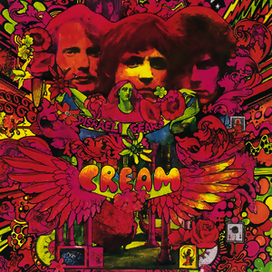

# Disraeli Gears

By **Cream**

## Album Data

- **Catalog:** Beets
- **Format:** Digital, Album
- **Album:** Disraeli Gears
- **Artist:** Cream
- **Albumartist:** Cream
- **Genre:** Psychedelic Rock
- **MusicBrainz Album Artist ID:** 
- **MusicBrainz Album ID:** 
- **MusicBrainz Release Group ID:** 
- **Year:** 0000
- **Catalog #:** 31453 1810-2
- **Label:** Polydor
- **Total Tracks:** 11

## Album Tracks

### Track 01 - I Feel Free

- **Artist:** Cream
- **Format:** ALAC
- **Genre:** Psychedelic Rock
- **Length:** 2:53
- **MusicBrainz Track ID:** [93001859-aad8-44c3-95fa-453a5bc695da](https://musicbrainz.org/recording/93001859-aad8-44c3-95fa-453a5bc695da)
- **Title:** I Feel Free
- **Track:** 01
- **Year:** 1998

### Track 02 - N.S.U.

- **Artist:** Cream
- **Format:** ALAC
- **Genre:** Psychedelic Rock
- **Length:** 2:47
- **MusicBrainz Track ID:** [1022e948-b66f-43e8-bb47-e91c64fc6f40](https://musicbrainz.org/recording/1022e948-b66f-43e8-bb47-e91c64fc6f40)
- **Title:** N.S.U.
- **Track:** 02
- **Year:** 1998

### Track 03 - Sleepy Time Time

- **Artist:** Cream
- **Format:** ALAC
- **Genre:** Acid Rock
- **Length:** 4:22
- **MusicBrainz Track ID:** [fdb99f69-6b29-4501-b26d-98707ad98a3f](https://musicbrainz.org/recording/fdb99f69-6b29-4501-b26d-98707ad98a3f)
- **Title:** Sleepy Time Time
- **Track:** 03
- **Year:** 1998

### Track 04 - Dreaming

- **Artist:** Cream
- **Format:** ALAC
- **Genre:** Acid Rock
- **Length:** 2:01
- **MusicBrainz Track ID:** [6a8d9a6f-f8e7-415c-9a48-0061fe696280](https://musicbrainz.org/recording/6a8d9a6f-f8e7-415c-9a48-0061fe696280)
- **Title:** Dreaming
- **Track:** 04
- **Year:** 1998

### Track 05 - Sweet Wine

- **Artist:** Cream
- **Format:** ALAC
- **Genre:** Acid Rock
- **Length:** 3:20
- **MusicBrainz Track ID:** [f3155ea2-8f03-4332-972f-d7cbef96bac9](https://musicbrainz.org/recording/f3155ea2-8f03-4332-972f-d7cbef96bac9)
- **Title:** Sweet Wine
- **Track:** 05
- **Year:** 1998

### Track 06 - Spoonful

- **Artist:** Cream
- **Format:** ALAC
- **Genre:** Psychedelic Rock
- **Length:** 6:33
- **MusicBrainz Track ID:** [4b35ffe4-1793-4a41-85c6-d7fc2385f33f](https://musicbrainz.org/recording/4b35ffe4-1793-4a41-85c6-d7fc2385f33f)
- **Title:** Spoonful
- **Track:** 06
- **Year:** 1998

### Track 07 - Cat’s Squirrel

- **Artist:** Cream
- **Format:** ALAC
- **Genre:** Psychedelic Rock
- **Length:** 3:05
- **MusicBrainz Track ID:** [c5ea98a3-4f04-4256-8b45-d837f0758c01](https://musicbrainz.org/recording/c5ea98a3-4f04-4256-8b45-d837f0758c01)
- **Title:** Cat’s Squirrel
- **Track:** 07
- **Year:** 1998

### Track 08 - Four Until Late

- **Artist:** Cream
- **Format:** ALAC
- **Genre:** Acid Rock
- **Length:** 2:10
- **MusicBrainz Track ID:** [e46869e6-8397-4b62-a635-e2c558b3ecbc](https://musicbrainz.org/recording/e46869e6-8397-4b62-a635-e2c558b3ecbc)
- **Title:** Four Until Late
- **Track:** 08
- **Year:** 1998

### Track 09 - Rollin’ and Tumblin’

- **Artist:** Cream
- **Format:** ALAC
- **Genre:** Psychedelic Rock
- **Length:** 4:43
- **MusicBrainz Track ID:** [68cf04bb-f55c-455a-9e75-6a9bee9c3b92](https://musicbrainz.org/recording/68cf04bb-f55c-455a-9e75-6a9bee9c3b92)
- **Title:** Rollin’ and Tumblin’
- **Track:** 09
- **Year:** 1998

### Track 10 - I’m So Glad

- **Artist:** Cream
- **Format:** ALAC
- **Genre:** Psychedelic Rock
- **Length:** 3:59
- **MusicBrainz Track ID:** [4adf9054-3ae2-4354-9f2b-97ee94a9463a](https://musicbrainz.org/recording/4adf9054-3ae2-4354-9f2b-97ee94a9463a)
- **Title:** I’m So Glad
- **Track:** 10
- **Year:** 1998

### Track 11 - Toad

- **Artist:** Cream
- **Format:** ALAC
- **Genre:** Psychedelic Rock
- **Length:** 5:09
- **MusicBrainz Track ID:** [a401aa84-c75b-462d-9d65-07e0c7bfa3d9](https://musicbrainz.org/recording/a401aa84-c75b-462d-9d65-07e0c7bfa3d9)
- **Title:** Toad
- **Track:** 11
- **Year:** 1998

## See also

- [Fresh Cream](Fresh_Cream.md)
- [Goodbye](Goodbye.md)
- [Wheels of Fire](Wheels_of_Fire.md)
- [CD: ](../../CD/Cream/Cream.md)
- [CD: Goodbye [1998 Re-Master]](../../CD/Cream/Goodbye_[1998_Re-Master].md)
- [Roon: Disraeli Gears](../../Roon/Cream/Disraeli_Gears.md)
- [Roon: Wheels Of Fire](../../Roon/Cream/Wheels_Of_Fire.md)
- [Vinyl: ](../../Vinyl/Cream/Cream.md)
- [Vinyl: Disraeli Gears](../../Vinyl/Cream/Disraeli_Gears.md)
- [Vinyl: Wheels Of Fire](../../Vinyl/Cream/Wheels_Of_Fire.md)
