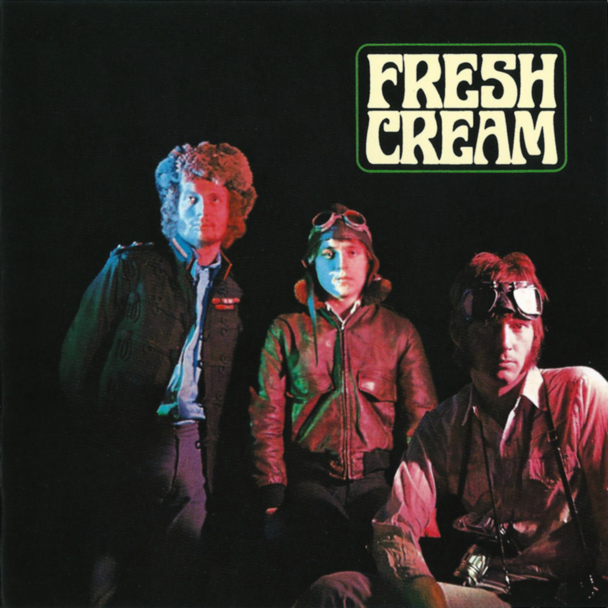

# Fresh Cream

By **Cream**

## Album Data

- **Catalog:** Beets
- **Format:** Digital, Album
- **Album:** Fresh Cream
- **Artist:** Cream
- **Albumartist:** Cream
- **Genre:** Psychedelic Rock
- **MusicBrainz Album Artist ID:** [04cd0cfd-bfd1-4c36-bc38-95c35e2c045f](https://musicbrainz.org/artist/04cd0cfd-bfd1-4c36-bc38-95c35e2c045f)
- **MusicBrainz Album ID:** [e33f748d-bc5b-4b32-b45d-022ed8e75d37](https://musicbrainz.org/release/e33f748d-bc5b-4b32-b45d-022ed8e75d37)
- **MusicBrainz Release Group ID:** [38d65202-a589-38ad-bf19-6161193340ee](https://musicbrainz.org/release-group/38d65202-a589-38ad-bf19-6161193340ee)
- **Year:** 1998
- **Catalog #:** 31453 1815-2
- **Label:** Polydor
- **Total Tracks:** 06

## Album Tracks

### Track 01 - I’m So Glad (live)

- **Artist:** Cream
- **Format:** ALAC
- **Genre:** Psychedelic Rock
- **Length:** 9:13
- **MusicBrainz Track ID:** [77dbd688-cdda-4883-9080-afe97248ef4b](https://musicbrainz.org/recording/77dbd688-cdda-4883-9080-afe97248ef4b)
- **Title:** I’m So Glad (live)
- **Track:** 01
- **Year:** 1998

### Track 02 - Politician (live)

- **Artist:** Cream
- **Format:** ALAC
- **Genre:** Acid Rock
- **Length:** 6:20
- **MusicBrainz Track ID:** [820c411e-9697-420c-96f4-bbf18f336503](https://musicbrainz.org/recording/820c411e-9697-420c-96f4-bbf18f336503)
- **Title:** Politician (live)
- **Track:** 02
- **Year:** 1998

### Track 03 - Sitting on Top of the World (live)

- **Artist:** Cream
- **Format:** ALAC
- **Genre:** Hard Rock
- **Length:** 5:04
- **MusicBrainz Track ID:** [8bfd580d-ac6c-47da-b5b5-8d71fa75bddd](https://musicbrainz.org/recording/8bfd580d-ac6c-47da-b5b5-8d71fa75bddd)
- **Title:** Sitting on Top of the World (live)
- **Track:** 03
- **Year:** 1998

### Track 04 - Badge

- **Artist:** Cream
- **Format:** ALAC
- **Genre:** Rock
- **Length:** 2:47
- **MusicBrainz Track ID:** [f32c1b56-a41a-4d00-9ccf-2f380380b39c](https://musicbrainz.org/recording/f32c1b56-a41a-4d00-9ccf-2f380380b39c)
- **Title:** Badge
- **Track:** 04
- **Year:** 1998

### Track 05 - Doing That Scrapyard Thing

- **Artist:** Cream
- **Format:** ALAC
- **Genre:** Psychedelic Rock
- **Length:** 3:18
- **MusicBrainz Track ID:** [65fdbe7e-f4bd-41ea-85f9-b0f95624f8db](https://musicbrainz.org/recording/65fdbe7e-f4bd-41ea-85f9-b0f95624f8db)
- **Title:** Doing That Scrapyard Thing
- **Track:** 05
- **Year:** 1998

### Track 06 - What a Bringdown

- **Artist:** Cream
- **Format:** ALAC
- **Genre:** Psychedelic Rock
- **Length:** 3:57
- **MusicBrainz Track ID:** [29e6b9b2-d9a1-47c7-8d3e-235a26039a84](https://musicbrainz.org/recording/29e6b9b2-d9a1-47c7-8d3e-235a26039a84)
- **Title:** What a Bringdown
- **Track:** 06
- **Year:** 1998

## See also

- [Disraeli Gears](Disraeli_Gears.md)
- [Goodbye](Goodbye.md)
- [Wheels of Fire](Wheels_of_Fire.md)
- [CD: ](../../CD/Cream/Cream.md)
- [CD: Goodbye [1998 Re-Master]](../../CD/Cream/Goodbye_[1998_Re-Master].md)
- [Roon: Disraeli Gears](../../Roon/Cream/Disraeli_Gears.md)
- [Roon: Wheels Of Fire](../../Roon/Cream/Wheels_Of_Fire.md)
- [Vinyl: ](../../Vinyl/Cream/Cream.md)
- [Vinyl: Disraeli Gears](../../Vinyl/Cream/Disraeli_Gears.md)
- [Vinyl: Wheels Of Fire](../../Vinyl/Cream/Wheels_Of_Fire.md)
