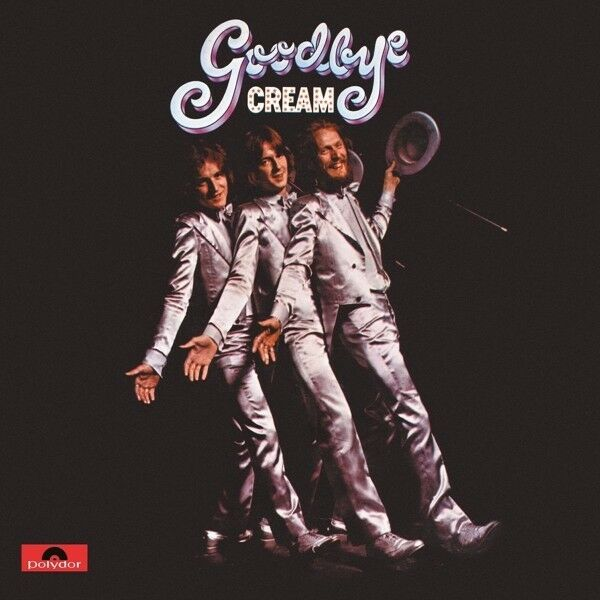

# Goodbye

By **Cream**

## Album Data

- **Catalog:** Beets
- **Format:** Digital, Album
- **Album:** Goodbye
- **Artist:** Cream
- **Albumartist:** Cream
- **Genre:** Psychedelic Rock
- **MusicBrainz Album Artist ID:** [04cd0cfd-bfd1-4c36-bc38-95c35e2c045f](https://musicbrainz.org/artist/04cd0cfd-bfd1-4c36-bc38-95c35e2c045f)
- **MusicBrainz Album ID:** [8e3a412e-5363-3148-ad3d-273d4235229d](https://musicbrainz.org/release/8e3a412e-5363-3148-ad3d-273d4235229d)
- **MusicBrainz Release Group ID:** [40c4e2e3-e256-3b59-94b3-778d9ae2c759](https://musicbrainz.org/release-group/40c4e2e3-e256-3b59-94b3-778d9ae2c759)
- **Year:** 1998
- **Catalog #:** SD 2-700
- **Label:** ATCO Records
- **Total Tracks:** 13

## Album Tracks

### Track 01 - White Room

- **Artist:** Cream
- **Format:** ALAC
- **Genre:** Psychedelic Rock
- **Length:** 5:03
- **MusicBrainz Track ID:** [d15ba2bd-f227-415f-9c8a-4245a51a6d8f](https://musicbrainz.org/recording/d15ba2bd-f227-415f-9c8a-4245a51a6d8f)
- **Title:** White Room
- **Track:** 01
- **Year:** 1968

### Track 02 - Sitting on Top of the World

- **Artist:** Cream
- **Format:** ALAC
- **Genre:** Psychedelic Rock
- **Length:** 5:01
- **MusicBrainz Track ID:** [4c468ccd-48c7-4f09-977d-aea3200f1c66](https://musicbrainz.org/recording/4c468ccd-48c7-4f09-977d-aea3200f1c66)
- **Title:** Sitting on Top of the World
- **Track:** 02
- **Year:** 1968

### Track 03 - Passing the Time

- **Artist:** Cream
- **Format:** ALAC
- **Genre:** Acid Rock
- **Length:** 4:37
- **MusicBrainz Track ID:** [010f66d9-8b76-43e6-9336-5f953e8e7fa7](https://musicbrainz.org/recording/010f66d9-8b76-43e6-9336-5f953e8e7fa7)
- **Title:** Passing the Time
- **Track:** 03
- **Year:** 1968

### Track 04 - As You Said

- **Artist:** Cream
- **Format:** ALAC
- **Genre:** Psychedelic Rock
- **Length:** 4:22
- **MusicBrainz Track ID:** [df7f4ca4-9cf9-44b2-ad04-09c02e1dab96](https://musicbrainz.org/recording/df7f4ca4-9cf9-44b2-ad04-09c02e1dab96)
- **Title:** As You Said
- **Track:** 04
- **Year:** 1968

### Track 05 - Pressed Rat and Warthog

- **Artist:** Cream
- **Format:** ALAC
- **Genre:** Acid Rock
- **Length:** 3:18
- **MusicBrainz Track ID:** [a37e12a7-5160-4992-a2aa-d9a216d1270b](https://musicbrainz.org/recording/a37e12a7-5160-4992-a2aa-d9a216d1270b)
- **Title:** Pressed Rat and Warthog
- **Track:** 05
- **Year:** 1968

### Track 06 - Politician

- **Artist:** Cream
- **Format:** ALAC
- **Genre:** Psychedelic Rock
- **Length:** 4:16
- **MusicBrainz Track ID:** [bc36b357-05e3-4636-8166-85cb5d8266ff](https://musicbrainz.org/recording/bc36b357-05e3-4636-8166-85cb5d8266ff)
- **Title:** Politician
- **Track:** 06
- **Year:** 1968

### Track 07 - Those Were the Days

- **Artist:** Cream
- **Format:** ALAC
- **Genre:** Psychedelic Rock
- **Length:** 2:57
- **MusicBrainz Track ID:** [2d4a35e8-4718-447a-bd61-afa4fe1fa9e5](https://musicbrainz.org/recording/2d4a35e8-4718-447a-bd61-afa4fe1fa9e5)
- **Title:** Those Were the Days
- **Track:** 07
- **Year:** 1968

### Track 08 - Born Under a Bad Sign

- **Artist:** Cream
- **Format:** ALAC
- **Genre:** Psychedelic Rock
- **Length:** 3:13
- **MusicBrainz Track ID:** [5032a0a0-f6a3-4dbd-a891-307c54ba8e57](https://musicbrainz.org/recording/5032a0a0-f6a3-4dbd-a891-307c54ba8e57)
- **Title:** Born Under a Bad Sign
- **Track:** 08
- **Year:** 1968

### Track 09 - Deserted Cities of the Heart

- **Artist:** Cream
- **Format:** ALAC
- **Genre:** Psychedelic Rock
- **Length:** 3:38
- **MusicBrainz Track ID:** [32f83be6-60fd-4430-bd00-29f024861c1b](https://musicbrainz.org/recording/32f83be6-60fd-4430-bd00-29f024861c1b)
- **Title:** Deserted Cities of the Heart
- **Track:** 09
- **Year:** 1968

### Track 10 - Crossroads

- **Artist:** Cream
- **Format:** ALAC
- **Genre:** Psychedelic Rock
- **Length:** 4:18
- **MusicBrainz Track ID:** [b44f7256-7ffa-4290-bffb-0b9288baca6a](https://musicbrainz.org/recording/b44f7256-7ffa-4290-bffb-0b9288baca6a)
- **Title:** Crossroads
- **Track:** 10
- **Year:** 1968

### Track 11 - Spoonful

- **Artist:** Cream
- **Format:** ALAC
- **Genre:** Psychedelic Rock
- **Length:** 16:46
- **MusicBrainz Track ID:** [75683c66-419c-4ef7-a00d-bcfc37bb994f](https://musicbrainz.org/recording/75683c66-419c-4ef7-a00d-bcfc37bb994f)
- **Title:** Spoonful
- **Track:** 11
- **Year:** 1968

### Track 12 - Traintime

- **Artist:** Cream
- **Format:** ALAC
- **Genre:** Acid Rock
- **Length:** 7:01
- **MusicBrainz Track ID:** [37e93dec-647a-4cc2-90d5-6a0447b99428](https://musicbrainz.org/recording/37e93dec-647a-4cc2-90d5-6a0447b99428)
- **Title:** Traintime
- **Track:** 12
- **Year:** 1968

### Track 13 - Toad

- **Artist:** Cream
- **Format:** ALAC
- **Genre:** Psychedelic Rock
- **Length:** 16:15
- **MusicBrainz Track ID:** [9dda1553-9d47-48bd-acf9-5df2720fa807](https://musicbrainz.org/recording/9dda1553-9d47-48bd-acf9-5df2720fa807)
- **Title:** Toad
- **Track:** 13
- **Year:** 1968

## See also

- [Disraeli Gears](Disraeli_Gears.md)
- [Fresh Cream](Fresh_Cream.md)
- [Wheels of Fire](Wheels_of_Fire.md)
- [CD: ](../../CD/Cream/Cream.md)
- [CD: Goodbye [1998 Re-Master]](../../CD/Cream/Goodbye_[1998_Re-Master].md)
- [Roon: Disraeli Gears](../../Roon/Cream/Disraeli_Gears.md)
- [Roon: Wheels Of Fire](../../Roon/Cream/Wheels_Of_Fire.md)
- [Vinyl: ](../../Vinyl/Cream/Cream.md)
- [Vinyl: Disraeli Gears](../../Vinyl/Cream/Disraeli_Gears.md)
- [Vinyl: Wheels Of Fire](../../Vinyl/Cream/Wheels_Of_Fire.md)
