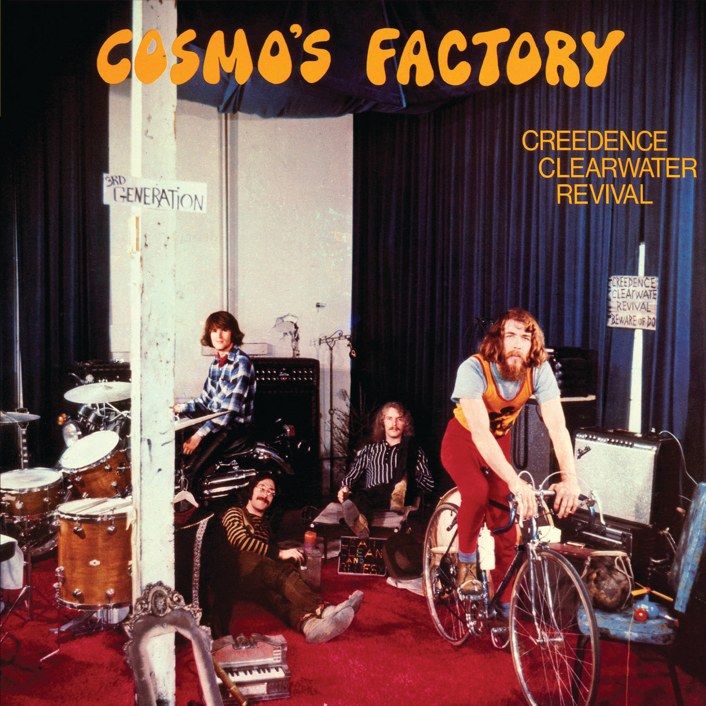

# Cosmo’s Factory

By **Creedence Clearwater Revival**

## Album Data

- **Catalog:** Beets
- **Format:** Digital, Album
- **Album:** Cosmo’s Factory
- **Artist:** Creedence Clearwater Revival
- **Albumartist:** Creedence Clearwater Revival
- **Genre:** Southern Rock
- **MusicBrainz Album Artist ID:** [109958eb-a335-4c5e-907e-597ff4c6af46](https://musicbrainz.org/artist/109958eb-a335-4c5e-907e-597ff4c6af46)
- **MusicBrainz Album ID:** [520cba9a-a640-48f7-875a-fd39aa622133](https://musicbrainz.org/release/520cba9a-a640-48f7-875a-fd39aa622133)
- **MusicBrainz Release Group ID:** [3a31800f-1916-3f4c-a7ae-26b783d00670](https://musicbrainz.org/release-group/3a31800f-1916-3f4c-a7ae-26b783d00670)
- **Year:** 2008
- **Catalog #:** FAN-34162
- **Label:** Concord Music Group
- **Total Tracks:** 52

## Album Tracks

### Track 01 - Proud Mary

- **Artist:** Creedence Clearwater Revival
- **Format:** ALAC
- **Genre:** Southern Rock
- **Length:** 3:07
- **MusicBrainz Track ID:** [1632ee2b-4f4b-42eb-909f-8279e66dc1ce](https://musicbrainz.org/recording/1632ee2b-4f4b-42eb-909f-8279e66dc1ce)
- **Title:** Proud Mary
- **Track:** 01
- **Year:** 2012

### Track 02 - Born on the Bayou

- **Artist:** Creedence Clearwater Revival
- **Format:** ALAC
- **Genre:** Southern Rock
- **Length:** 5:14
- **MusicBrainz Track ID:** [94b57b09-73dd-49f4-b20a-0104108c68ff](https://musicbrainz.org/recording/94b57b09-73dd-49f4-b20a-0104108c68ff)
- **Title:** Born on the Bayou
- **Track:** 02
- **Year:** 2012

### Track 03 - Bad Moon Rising

- **Artist:** Creedence Clearwater Revival
- **Format:** ALAC
- **Genre:** Southern Rock
- **Length:** 2:20
- **MusicBrainz Track ID:** [d845b4c5-bc3a-471c-a0a6-fedf66966d36](https://musicbrainz.org/recording/d845b4c5-bc3a-471c-a0a6-fedf66966d36)
- **Title:** Bad Moon Rising
- **Track:** 03
- **Year:** 2012

### Track 04 - Good Golly Miss Molly

- **Artist:** Creedence Clearwater Revival
- **Format:** ALAC
- **Genre:** Southern Rock
- **Length:** 2:41
- **MusicBrainz Track ID:** [20e24f87-46c7-4f59-a20e-82f6f2b8a7c2](https://musicbrainz.org/recording/20e24f87-46c7-4f59-a20e-82f6f2b8a7c2)
- **Title:** Good Golly Miss Molly
- **Track:** 04
- **Year:** 2012

### Track 05 - Up Around the Bend

- **Artist:** Creedence Clearwater Revival
- **Format:** ALAC
- **Genre:** Southern Rock
- **Length:** 2:41
- **MusicBrainz Track ID:** [ae06cdc5-f662-47f4-8284-cfe5bae8cb3f](https://musicbrainz.org/recording/ae06cdc5-f662-47f4-8284-cfe5bae8cb3f)
- **Title:** Up Around the Bend
- **Track:** 05
- **Year:** 2012

### Track 06 - Suzie-Q

- **Artist:** Creedence Clearwater Revival
- **Format:** ALAC
- **Genre:** Southern Rock
- **Length:** 8:35
- **MusicBrainz Track ID:** [5eeaf592-92eb-46ff-be24-e9b250854e56](https://musicbrainz.org/recording/5eeaf592-92eb-46ff-be24-e9b250854e56)
- **Title:** Suzie-Q
- **Track:** 06
- **Year:** 2012

### Track 07 - Fortunate Son

- **Artist:** Creedence Clearwater Revival
- **Format:** ALAC
- **Genre:** Southern Rock
- **Length:** 2:18
- **MusicBrainz Track ID:** [a278228c-a97a-4e72-a632-25738da8397b](https://musicbrainz.org/recording/a278228c-a97a-4e72-a632-25738da8397b)
- **Title:** Fortunate Son
- **Track:** 07
- **Year:** 2012

### Track 08 - The Midnight Special

- **Artist:** Creedence Clearwater Revival
- **Format:** ALAC
- **Genre:** Southern Rock
- **Length:** 4:12
- **MusicBrainz Track ID:** [94f4082b-d578-4cb7-ae8e-f6f500774908](https://musicbrainz.org/recording/94f4082b-d578-4cb7-ae8e-f6f500774908)
- **Title:** The Midnight Special
- **Track:** 08
- **Year:** 2012

### Track 09 - Who'll Stop the Rain

- **Artist:** Creedence Clearwater Revival
- **Format:** ALAC
- **Genre:** Southern Rock
- **Length:** 2:27
- **MusicBrainz Track ID:** [61d90458-d529-4b2d-92b5-a1971c45a75e](https://musicbrainz.org/recording/61d90458-d529-4b2d-92b5-a1971c45a75e)
- **Title:** Who'll Stop the Rain
- **Track:** 09
- **Year:** 2012

### Track 10 - Run Through the Jungle

- **Artist:** Creedence Clearwater Revival
- **Format:** ALAC
- **Genre:** Southern Rock
- **Length:** 3:04
- **MusicBrainz Track ID:** [acfbe1ab-b897-433d-bbb6-ac43273f218c](https://musicbrainz.org/recording/acfbe1ab-b897-433d-bbb6-ac43273f218c)
- **Title:** Run Through the Jungle
- **Track:** 10
- **Year:** 2012

### Track 11 - Hey Tonight

- **Artist:** Creedence Clearwater Revival
- **Format:** ALAC
- **Genre:** Southern Rock
- **Length:** 2:42
- **MusicBrainz Track ID:** [2bd94ef0-2295-469c-aaf5-9e2bee4f4814](https://musicbrainz.org/recording/2bd94ef0-2295-469c-aaf5-9e2bee4f4814)
- **Title:** Hey Tonight
- **Track:** 11
- **Year:** 2012

### Track 12 - Wrote a Song for Everyone

- **Artist:** Creedence Clearwater Revival
- **Format:** ALAC
- **Genre:** Southern Rock
- **Length:** 4:53
- **MusicBrainz Track ID:** [7887245f-f451-4deb-b069-1646e81a5ae9](https://musicbrainz.org/recording/7887245f-f451-4deb-b069-1646e81a5ae9)
- **Title:** Wrote a Song for Everyone
- **Track:** 12
- **Year:** 2012

### Track 13 - Sweet Hitch-Hiker

- **Artist:** Creedence Clearwater Revival
- **Format:** ALAC
- **Genre:** Southern Rock
- **Length:** 2:55
- **MusicBrainz Track ID:** [418ece25-fa4a-4834-98ff-338a5cc289d2](https://musicbrainz.org/recording/418ece25-fa4a-4834-98ff-338a5cc289d2)
- **Title:** Sweet Hitch-Hiker
- **Track:** 13
- **Year:** 2012

### Track 14 - Before You Accuse Me

- **Artist:** Creedence Clearwater Revival
- **Format:** ALAC
- **Genre:** Southern Rock
- **Length:** 3:26
- **MusicBrainz Track ID:** [df9333dd-0bd0-4a75-adb7-f955a5d69440](https://musicbrainz.org/recording/df9333dd-0bd0-4a75-adb7-f955a5d69440)
- **Title:** Before You Accuse Me
- **Track:** 14
- **Year:** 2012

### Track 15 - Commotion

- **Artist:** Creedence Clearwater Revival
- **Format:** ALAC
- **Genre:** Southern Rock
- **Length:** 2:42
- **MusicBrainz Track ID:** [333bcfd0-1483-4b37-a136-872ed1dfca35](https://musicbrainz.org/recording/333bcfd0-1483-4b37-a136-872ed1dfca35)
- **Title:** Commotion
- **Track:** 15
- **Year:** 2012

### Track 16 - My Baby Left Me

- **Artist:** Creedence Clearwater Revival
- **Format:** ALAC
- **Genre:** Southern Rock
- **Length:** 2:18
- **MusicBrainz Track ID:** [44e14982-3a81-4806-a68d-5eedcbf4622c](https://musicbrainz.org/recording/44e14982-3a81-4806-a68d-5eedcbf4622c)
- **Title:** My Baby Left Me
- **Track:** 16
- **Year:** 2012

### Track 17 - Bootleg

- **Artist:** Creedence Clearwater Revival
- **Format:** ALAC
- **Genre:** Southern Rock
- **Length:** 3:01
- **MusicBrainz Track ID:** [35223652-101d-4f82-b887-d9ea3ae5a1d3](https://musicbrainz.org/recording/35223652-101d-4f82-b887-d9ea3ae5a1d3)
- **Title:** Bootleg
- **Track:** 17
- **Year:** 2012

### Track 18 - Pagan Baby

- **Artist:** Creedence Clearwater Revival
- **Format:** ALAC
- **Genre:** Southern Rock
- **Length:** 6:23
- **MusicBrainz Track ID:** [80faa3e5-af2d-412c-8031-b7a2a4cfb391](https://musicbrainz.org/recording/80faa3e5-af2d-412c-8031-b7a2a4cfb391)
- **Title:** Pagan Baby
- **Track:** 18
- **Year:** 2012

### Track 19 - (Wish I Could) Hideaway

- **Artist:** Creedence Clearwater Revival
- **Format:** ALAC
- **Genre:** Southern Rock
- **Length:** 3:43
- **MusicBrainz Track ID:** [73371c61-683c-4b1d-8bf1-0071f26539a0](https://musicbrainz.org/recording/73371c61-683c-4b1d-8bf1-0071f26539a0)
- **Title:** (Wish I Could) Hideaway
- **Track:** 19
- **Year:** 2012

### Track 20 - Cotton Fields

- **Artist:** Creedence Clearwater Revival
- **Format:** ALAC
- **Genre:** Southern Rock
- **Length:** 2:57
- **MusicBrainz Track ID:** [60d495a8-2a6e-46fa-94c7-7cce05b945ed](https://musicbrainz.org/recording/60d495a8-2a6e-46fa-94c7-7cce05b945ed)
- **Title:** Cotton Fields
- **Track:** 20
- **Year:** 2012

### Track 21 - Travelin' Band

- **Artist:** Creedence Clearwater Revival
- **Format:** ALAC
- **Genre:** Southern Rock
- **Length:** 2:07
- **MusicBrainz Track ID:** [0660bd9d-a865-43f4-8ade-53fcf6c371de](https://musicbrainz.org/recording/0660bd9d-a865-43f4-8ade-53fcf6c371de)
- **Title:** Travelin' Band
- **Track:** 21
- **Year:** 2012

### Track 22 - Don't Look Now

- **Artist:** Creedence Clearwater Revival
- **Format:** ALAC
- **Genre:** Southern Rock
- **Length:** 2:10
- **MusicBrainz Track ID:** [4fe2a878-e63e-4db3-a6a0-b604a285fe56](https://musicbrainz.org/recording/4fe2a878-e63e-4db3-a6a0-b604a285fe56)
- **Title:** Don't Look Now
- **Track:** 22
- **Year:** 2012

### Track 23 - Down on the Corner

- **Artist:** Creedence Clearwater Revival
- **Format:** ALAC
- **Genre:** Southern Rock
- **Length:** 2:44
- **MusicBrainz Track ID:** [2b8c691e-f669-4571-b78a-07ef47963dbf](https://musicbrainz.org/recording/2b8c691e-f669-4571-b78a-07ef47963dbf)
- **Title:** Down on the Corner
- **Track:** 23
- **Year:** 2012

### Track 24 - It Came Out of the Sky

- **Artist:** Creedence Clearwater Revival
- **Format:** ALAC
- **Genre:** Southern Rock
- **Length:** 2:54
- **MusicBrainz Track ID:** [5f7f9746-7c98-4b00-aebf-0fc87e822264](https://musicbrainz.org/recording/5f7f9746-7c98-4b00-aebf-0fc87e822264)
- **Title:** It Came Out of the Sky
- **Track:** 24
- **Year:** 2012

### Track 25 - Lookin' Out My Back Door

- **Artist:** Creedence Clearwater Revival
- **Format:** ALAC
- **Genre:** Southern Rock
- **Length:** 2:32
- **MusicBrainz Track ID:** [962dc1be-6d73-4c4b-990e-01193319e34b](https://musicbrainz.org/recording/962dc1be-6d73-4c4b-990e-01193319e34b)
- **Title:** Lookin' Out My Back Door
- **Track:** 25
- **Year:** 2012

### Track 26 - Born to Move

- **Artist:** Creedence Clearwater Revival
- **Format:** ALAC
- **Genre:** Southern Rock
- **Length:** 5:40
- **MusicBrainz Track ID:** [f2b09d61-cd06-4d2b-8d11-11831b6a4f83](https://musicbrainz.org/recording/f2b09d61-cd06-4d2b-8d11-11831b6a4f83)
- **Title:** Born to Move
- **Track:** 26
- **Year:** 2012

### Track 27 - Green River

- **Artist:** Creedence Clearwater Revival
- **Format:** ALAC
- **Genre:** Southern Rock
- **Length:** 2:33
- **MusicBrainz Track ID:** [9934bf7f-143c-4d9e-93e0-d55408027521](https://musicbrainz.org/recording/9934bf7f-143c-4d9e-93e0-d55408027521)
- **Title:** Green River
- **Track:** 27
- **Year:** 2012

### Track 28 - I Put a Spell on You

- **Artist:** Creedence Clearwater Revival
- **Format:** ALAC
- **Genre:** Southern Rock
- **Length:** 4:31
- **MusicBrainz Track ID:** [9fc08709-9eec-40a7-a87a-b8d783654548](https://musicbrainz.org/recording/9fc08709-9eec-40a7-a87a-b8d783654548)
- **Title:** I Put a Spell on You
- **Track:** 28
- **Year:** 2012

### Track 29 - Have You Ever Seen the Rain?

- **Artist:** Creedence Clearwater Revival
- **Format:** ALAC
- **Genre:** Southern Rock
- **Length:** 2:40
- **MusicBrainz Track ID:** [b5634bbd-cf5c-4206-8063-f7f5079eaa29](https://musicbrainz.org/recording/b5634bbd-cf5c-4206-8063-f7f5079eaa29)
- **Title:** Have You Ever Seen the Rain?
- **Track:** 29
- **Year:** 2012

### Track 30 - Molina

- **Artist:** Creedence Clearwater Revival
- **Format:** ALAC
- **Genre:** Southern Rock
- **Length:** 2:42
- **MusicBrainz Track ID:** [32e08099-5a52-4c51-95e8-3e3367cf834c](https://musicbrainz.org/recording/32e08099-5a52-4c51-95e8-3e3367cf834c)
- **Title:** Molina
- **Track:** 30
- **Year:** 2012

### Track 31 - Long as I Can See the Light

- **Artist:** Creedence Clearwater Revival
- **Format:** ALAC
- **Genre:** Southern Rock
- **Length:** 3:30
- **MusicBrainz Track ID:** [94de0225-caee-48cd-9f59-429fd69e1824](https://musicbrainz.org/recording/94de0225-caee-48cd-9f59-429fd69e1824)
- **Title:** Long as I Can See the Light
- **Track:** 31
- **Year:** 2012

### Track 32 - Hello Mary Lou

- **Artist:** Creedence Clearwater Revival
- **Format:** ALAC
- **Genre:** Southern Rock
- **Length:** 2:13
- **MusicBrainz Track ID:** [7f8d43db-aae6-44a8-b0c2-254586d4ca8e](https://musicbrainz.org/recording/7f8d43db-aae6-44a8-b0c2-254586d4ca8e)
- **Title:** Hello Mary Lou
- **Track:** 32
- **Year:** 2012

### Track 33 - Tombstone Shadow

- **Artist:** Creedence Clearwater Revival
- **Format:** ALAC
- **Genre:** Southern Rock
- **Length:** 3:37
- **MusicBrainz Track ID:** [63137644-545f-40f0-8b43-369f37516e05](https://musicbrainz.org/recording/63137644-545f-40f0-8b43-369f37516e05)
- **Title:** Tombstone Shadow
- **Track:** 33
- **Year:** 2012

### Track 34 - Lodi

- **Artist:** Creedence Clearwater Revival
- **Format:** ALAC
- **Genre:** Southern Rock
- **Length:** 3:12
- **MusicBrainz Track ID:** [d056823a-2da6-4bd6-94dd-0aabfdea48ba](https://musicbrainz.org/recording/d056823a-2da6-4bd6-94dd-0aabfdea48ba)
- **Title:** Lodi
- **Track:** 34
- **Year:** 2012

### Track 35 - Walking on the Water

- **Artist:** Creedence Clearwater Revival
- **Format:** ALAC
- **Genre:** Southern Rock
- **Length:** 4:38
- **MusicBrainz Track ID:** [801fc475-4e1b-495e-8e70-639f42ba1a10](https://musicbrainz.org/recording/801fc475-4e1b-495e-8e70-639f42ba1a10)
- **Title:** Walking on the Water
- **Track:** 35
- **Year:** 2012

### Track 36 - The Night Time Is the Right Time

- **Artist:** Creedence Clearwater Revival
- **Format:** ALAC
- **Genre:** Southern Rock
- **Length:** 3:07
- **MusicBrainz Track ID:** [0ed44705-1682-46c5-be9d-feeb3f69a004](https://musicbrainz.org/recording/0ed44705-1682-46c5-be9d-feeb3f69a004)
- **Title:** The Night Time Is the Right Time
- **Track:** 36
- **Year:** 2012

### Track 37 - Someday Never Comes

- **Artist:** Creedence Clearwater Revival
- **Format:** ALAC
- **Genre:** Southern Rock
- **Length:** 3:58
- **MusicBrainz Track ID:** [4a35270f-fca0-46c6-926e-c5011f826833](https://musicbrainz.org/recording/4a35270f-fca0-46c6-926e-c5011f826833)
- **Title:** Someday Never Comes
- **Track:** 37
- **Year:** 2012

### Track 38 - Porterville

- **Artist:** Creedence Clearwater Revival
- **Format:** ALAC
- **Genre:** Southern Rock
- **Length:** 2:21
- **MusicBrainz Track ID:** [48c557b8-f5b1-4efe-9508-3aabf44a561f](https://musicbrainz.org/recording/48c557b8-f5b1-4efe-9508-3aabf44a561f)
- **Title:** Porterville
- **Track:** 38
- **Year:** 2012

### Track 39 - Lookin' for a Reason

- **Artist:** Creedence Clearwater Revival
- **Format:** ALAC
- **Genre:** Southern Rock
- **Length:** 3:26
- **MusicBrainz Track ID:** [cdd77a41-454d-40c6-9a20-bb8d007698d6](https://musicbrainz.org/recording/cdd77a41-454d-40c6-9a20-bb8d007698d6)
- **Title:** Lookin' for a Reason
- **Track:** 39
- **Year:** 2012

### Track 40 - I Heard It Through the Grapevine

- **Artist:** Creedence Clearwater Revival
- **Format:** ALAC
- **Genre:** Southern Rock
- **Length:** 11:03
- **MusicBrainz Track ID:** [d4f21aa9-c3ad-416d-9936-05e4487ce50f](https://musicbrainz.org/recording/d4f21aa9-c3ad-416d-9936-05e4487ce50f)
- **Title:** I Heard It Through the Grapevine
- **Track:** 40
- **Year:** 2012

### Track 41 - Travelin' Band

- **Artist:** Creedence Clearwater Revival
- **Format:** ALAC
- **Genre:** Southern Rock
- **Length:** 2:06
- **MusicBrainz Track ID:** [df96e0d9-2ca7-4a98-8be1-d4765f39a09a](https://musicbrainz.org/recording/df96e0d9-2ca7-4a98-8be1-d4765f39a09a)
- **Title:** Travelin' Band
- **Track:** 41
- **Year:** 2012

### Track 42 - Proud Mary

- **Artist:** Creedence Clearwater Revival
- **Format:** ALAC
- **Genre:** Southern Rock
- **Length:** 2:48
- **MusicBrainz Track ID:** [4852f83a-9ed0-42ed-8255-d1f1157867fc](https://musicbrainz.org/recording/4852f83a-9ed0-42ed-8255-d1f1157867fc)
- **Title:** Proud Mary
- **Track:** 42
- **Year:** 2012

### Track 43 - Born on the Bayou

- **Artist:** Creedence Clearwater Revival
- **Format:** ALAC
- **Genre:** Southern Rock
- **Length:** 4:44
- **MusicBrainz Track ID:** [e17e425b-e58b-4d75-b185-a9f7f4967d64](https://musicbrainz.org/recording/e17e425b-e58b-4d75-b185-a9f7f4967d64)
- **Title:** Born on the Bayou
- **Track:** 43
- **Year:** 2012

### Track 44 - Bad Moon Rising

- **Artist:** Creedence Clearwater Revival
- **Format:** ALAC
- **Genre:** Southern Rock
- **Length:** 2:06
- **MusicBrainz Track ID:** [787d84d8-3cd4-4185-87ae-a57932c5d7ab](https://musicbrainz.org/recording/787d84d8-3cd4-4185-87ae-a57932c5d7ab)
- **Title:** Bad Moon Rising
- **Track:** 44
- **Year:** 2012

### Track 45 - Fortunate Son

- **Artist:** Creedence Clearwater Revival
- **Format:** ALAC
- **Genre:** Southern Rock
- **Length:** 2:12
- **MusicBrainz Track ID:** [d2b07cf0-8ab2-4b18-b31f-2f3a3eea37c1](https://musicbrainz.org/recording/d2b07cf0-8ab2-4b18-b31f-2f3a3eea37c1)
- **Title:** Fortunate Son
- **Track:** 45
- **Year:** 2012

### Track 46 - Hey Tonight

- **Artist:** Creedence Clearwater Revival
- **Format:** ALAC
- **Genre:** Southern Rock
- **Length:** 2:28
- **MusicBrainz Track ID:** [fcd4acb1-729a-48d7-97de-747419beb97a](https://musicbrainz.org/recording/fcd4acb1-729a-48d7-97de-747419beb97a)
- **Title:** Hey Tonight
- **Track:** 46
- **Year:** 2012

### Track 47 - Up Around the Bend

- **Artist:** Creedence Clearwater Revival
- **Format:** ALAC
- **Genre:** Southern Rock
- **Length:** 2:41
- **MusicBrainz Track ID:** [decbcf5a-eb6b-44e1-b523-0c0bb6da0b10](https://musicbrainz.org/recording/decbcf5a-eb6b-44e1-b523-0c0bb6da0b10)
- **Title:** Up Around the Bend
- **Track:** 47
- **Year:** 2012

### Track 48 - Lodi

- **Artist:** Creedence Clearwater Revival
- **Format:** ALAC
- **Genre:** Southern Rock
- **Length:** 3:16
- **MusicBrainz Track ID:** [95d30e3d-d124-4ab0-828d-57ed9e001924](https://musicbrainz.org/recording/95d30e3d-d124-4ab0-828d-57ed9e001924)
- **Title:** Lodi
- **Track:** 48
- **Year:** 2012

### Track 49 - Down on the Corner

- **Artist:** Creedence Clearwater Revival
- **Format:** ALAC
- **Genre:** Southern Rock
- **Length:** 2:44
- **MusicBrainz Track ID:** [cfd4a5d3-513d-43d1-9f15-3fd6840fe2f8](https://musicbrainz.org/recording/cfd4a5d3-513d-43d1-9f15-3fd6840fe2f8)
- **Title:** Down on the Corner
- **Track:** 49
- **Year:** 2012

### Track 50 - Who'll Stop the Rain

- **Artist:** Creedence Clearwater Revival
- **Format:** ALAC
- **Genre:** Southern Rock
- **Length:** 2:26
- **MusicBrainz Track ID:** [ec5585c5-fcac-432a-bf4f-d96b132eed6e](https://musicbrainz.org/recording/ec5585c5-fcac-432a-bf4f-d96b132eed6e)
- **Title:** Who'll Stop the Rain
- **Track:** 50
- **Year:** 2012

### Track 51 - Suzie-Q

- **Artist:** Creedence Clearwater Revival
- **Format:** ALAC
- **Genre:** Southern Rock
- **Length:** 11:43
- **MusicBrainz Track ID:** [5a98d854-a4ba-4cca-aa91-e095eab76f97](https://musicbrainz.org/recording/5a98d854-a4ba-4cca-aa91-e095eab76f97)
- **Title:** Suzie-Q
- **Track:** 51
- **Year:** 2012

### Track 52 - Keep On Chooglin'

- **Artist:** Creedence Clearwater Revival
- **Format:** ALAC
- **Genre:** Southern Rock
- **Length:** 9:10
- **MusicBrainz Track ID:** [9d0beee1-787d-46ae-aba5-405e0ee06605](https://musicbrainz.org/recording/9d0beee1-787d-46ae-aba5-405e0ee06605)
- **Title:** Keep On Chooglin'
- **Track:** 52
- **Year:** 2012

## See also

- [Ultimate Creedence Clearwater Revival](Ultimate_Creedence_Clearwater_Revival.md)
- [Willy and the Poor Boys](Willy_and_the_Poor_Boys.md)
- [CD: ](../../CD/Creedence_Clearwater_Revival/Creedence_Clearwater_Revival.md)
- [CD: Ultimate ( Greatest Hits & All-Time Classics ) (Disc 1)](../../CD/Creedence_Clearwater_Revival/Ultimate__Greatest_Hits_and_All-Time_Classics__Disc_1.md)
- [CD: Ultimate ( Greatest Hits & All-Time Classics ) (Disc 2)](../../CD/Creedence_Clearwater_Revival/Ultimate__Greatest_Hits_and_All-Time_Classics__Disc_2.md)
- [Roon: Bayou Country](../../Roon/Creedence_Clearwater_Revival/Bayou_Country.md)
- [Roon: Chronicle](../../Roon/Creedence_Clearwater_Revival/Chronicle-_20_Greatest_Hits.md)
- [Roon: Cosmo's Factory](../../Roon/Creedence_Clearwater_Revival/Cosmos_Factory.md)
- [Roon: Creedence Clearwater Revival](../../Roon/Creedence_Clearwater_Revival/Creedence_Clearwater_Revival.md)
- [Roon: Willy And The Poor Boys](../../Roon/Creedence_Clearwater_Revival/Willy_And_The_Poor_Boys.md)
- [Vinyl: Cosmo's Factory](../../Vinyl/Creedence_Clearwater_Revival/Cosmos_Factory.md)
- [Vinyl: ](../../Vinyl/Creedence_Clearwater_Revival/Creedence_Clearwater_Revival.md)
- [Vinyl: Green River](../../Vinyl/Creedence_Clearwater_Revival/Green_River.md)
- [Vinyl: Willy And The Poor Boys](../../Vinyl/Creedence_Clearwater_Revival/Willy_And_The_Poor_Boys.md)
