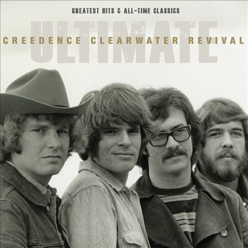

# Ultimate Creedence Clearwater Revival

By **Creedence Clearwater Revival**

## Album Data

- **Catalog:** Beets
- **Format:** Digital, Album
- **Album:** Ultimate Creedence Clearwater Revival
- **Artist:** Creedence Clearwater Revival
- **Albumartist:** Creedence Clearwater Revival
- **Genre:** Southern Rock
- **MusicBrainz Album Artist ID:** [109958eb-a335-4c5e-907e-597ff4c6af46](https://musicbrainz.org/artist/109958eb-a335-4c5e-907e-597ff4c6af46)
- **MusicBrainz Album ID:** [49e765e0-35ab-4ed7-a746-1d0714f13f7b](https://musicbrainz.org/release/49e765e0-35ab-4ed7-a746-1d0714f13f7b)
- **MusicBrainz Release Group ID:** [6c413cc5-172c-41d9-bc75-73d8ca879ce1](https://musicbrainz.org/release-group/6c413cc5-172c-41d9-bc75-73d8ca879ce1)
- **Year:** 2012
- **Catalog #:** FAN-30879
- **Label:** Fantasy
- **Total Tracks:** 13

## Album Tracks

### Track 01 - Down on the Corner

- **Artist:** Creedence Clearwater Revival
- **Format:** MP3
- **Genre:** Southern Rock
- **Length:** 2:46
- **MusicBrainz Track ID:** [2b8c691e-f669-4571-b78a-07ef47963dbf](https://musicbrainz.org/recording/2b8c691e-f669-4571-b78a-07ef47963dbf)
- **Title:** Down on the Corner
- **Track:** 01
- **Year:** 2008

### Track 02 - It Came out of the Sky

- **Artist:** Creedence Clearwater Revival
- **Format:** MP3
- **Genre:** Southern Rock
- **Length:** 2:55
- **MusicBrainz Track ID:** [1ab9b4fa-d6df-4968-9e60-fdff227259f1](https://musicbrainz.org/recording/1ab9b4fa-d6df-4968-9e60-fdff227259f1)
- **Title:** It Came out of the Sky
- **Track:** 02
- **Year:** 2008

### Track 03 - Cotton Fields

- **Artist:** Creedence Clearwater Revival
- **Format:** MP3
- **Genre:** Southern Rock
- **Length:** 2:57
- **MusicBrainz Track ID:** [60d495a8-2a6e-46fa-94c7-7cce05b945ed](https://musicbrainz.org/recording/60d495a8-2a6e-46fa-94c7-7cce05b945ed)
- **Title:** Cotton Fields
- **Track:** 03
- **Year:** 2008

### Track 04 - Poorboy Shuffle

- **Artist:** Creedence Clearwater Revival
- **Format:** MP3
- **Genre:** Southern Rock
- **Length:** 2:24
- **MusicBrainz Track ID:** [fbc24e09-0e8b-4567-8794-b3b24dcf957d](https://musicbrainz.org/recording/fbc24e09-0e8b-4567-8794-b3b24dcf957d)
- **Title:** Poorboy Shuffle
- **Track:** 04
- **Year:** 2008

### Track 05 - Feelin’ Blue

- **Artist:** Creedence Clearwater Revival
- **Format:** MP3
- **Genre:** Southern Rock
- **Length:** 5:06
- **MusicBrainz Track ID:** [0aae4b56-7b89-464c-acc8-3c7ca1d140b5](https://musicbrainz.org/recording/0aae4b56-7b89-464c-acc8-3c7ca1d140b5)
- **Title:** Feelin’ Blue
- **Track:** 05
- **Year:** 2008

### Track 06 - Fortunate Son

- **Artist:** Creedence Clearwater Revival
- **Format:** MP3
- **Genre:** Southern Rock
- **Length:** 2:20
- **MusicBrainz Track ID:** [a278228c-a97a-4e72-a632-25738da8397b](https://musicbrainz.org/recording/a278228c-a97a-4e72-a632-25738da8397b)
- **Title:** Fortunate Son
- **Track:** 06
- **Year:** 2008

### Track 07 - Don’t Look Now

- **Artist:** Creedence Clearwater Revival
- **Format:** MP3
- **Genre:** Southern Rock
- **Length:** 2:11
- **MusicBrainz Track ID:** [4ea95b86-1cf9-490b-bb1f-e7f110153a1e](https://musicbrainz.org/recording/4ea95b86-1cf9-490b-bb1f-e7f110153a1e)
- **Title:** Don’t Look Now
- **Track:** 07
- **Year:** 2008

### Track 08 - The Midnight Special

- **Artist:** Creedence Clearwater Revival
- **Format:** MP3
- **Genre:** Southern Rock
- **Length:** 4:13
- **MusicBrainz Track ID:** [94f4082b-d578-4cb7-ae8e-f6f500774908](https://musicbrainz.org/recording/94f4082b-d578-4cb7-ae8e-f6f500774908)
- **Title:** The Midnight Special
- **Track:** 08
- **Year:** 2008

### Track 09 - Side o’ the Road

- **Artist:** Creedence Clearwater Revival
- **Format:** MP3
- **Genre:** Southern Rock
- **Length:** 3:24
- **MusicBrainz Track ID:** [ee9763d6-a3b7-430c-ad48-cfb2891937f9](https://musicbrainz.org/recording/ee9763d6-a3b7-430c-ad48-cfb2891937f9)
- **Title:** Side o’ the Road
- **Track:** 09
- **Year:** 2008

### Track 10 - Effigy

- **Artist:** Creedence Clearwater Revival
- **Format:** MP3
- **Genre:** Southern Rock
- **Length:** 6:27
- **MusicBrainz Track ID:** [423b0bf6-b598-4d54-b89a-eb36f4a3a9ea](https://musicbrainz.org/recording/423b0bf6-b598-4d54-b89a-eb36f4a3a9ea)
- **Title:** Effigy
- **Track:** 10
- **Year:** 2008

### Track 11 - Fortunate Son (live)

- **Artist:** Creedence Clearwater Revival
- **Format:** MP3
- **Genre:** Southern Rock
- **Length:** 2:15
- **MusicBrainz Track ID:** [33842126-b738-4b71-a058-391e0b82faad](https://musicbrainz.org/recording/33842126-b738-4b71-a058-391e0b82faad)
- **Title:** Fortunate Son (live)
- **Track:** 11
- **Year:** 2008

### Track 12 - It Came out of the Sky (live)

- **Artist:** Creedence Clearwater Revival
- **Format:** MP3
- **Genre:** Southern Rock
- **Length:** 3:27
- **MusicBrainz Track ID:** [5a004ca8-2d7f-4477-ba22-bb9a864f077a](https://musicbrainz.org/recording/5a004ca8-2d7f-4477-ba22-bb9a864f077a)
- **Title:** It Came out of the Sky (live)
- **Track:** 12
- **Year:** 2008

### Track 13 - Down on the Corner

- **Artist:** Creedence Clearwater Revival jam with Booker T. Jones
- **Format:** MP3
- **Genre:** Southern Rock
- **Length:** 2:48
- **MusicBrainz Track ID:** [e873f15c-28d4-46ba-9e3e-d5cb068d59ff](https://musicbrainz.org/recording/e873f15c-28d4-46ba-9e3e-d5cb068d59ff)
- **Title:** Down on the Corner
- **Track:** 13
- **Year:** 2008

## See also

- [Cosmo’s Factory](Cosmo’s_Factory.md)
- [Willy and the Poor Boys](Willy_and_the_Poor_Boys.md)
- [CD: ](../../CD/Creedence_Clearwater_Revival/Creedence_Clearwater_Revival.md)
- [CD: Ultimate ( Greatest Hits & All-Time Classics ) (Disc 1)](../../CD/Creedence_Clearwater_Revival/Ultimate__Greatest_Hits_and_All-Time_Classics__Disc_1.md)
- [CD: Ultimate ( Greatest Hits & All-Time Classics ) (Disc 2)](../../CD/Creedence_Clearwater_Revival/Ultimate__Greatest_Hits_and_All-Time_Classics__Disc_2.md)
- [Roon: Bayou Country](../../Roon/Creedence_Clearwater_Revival/Bayou_Country.md)
- [Roon: Chronicle](../../Roon/Creedence_Clearwater_Revival/Chronicle-_20_Greatest_Hits.md)
- [Roon: Cosmo's Factory](../../Roon/Creedence_Clearwater_Revival/Cosmos_Factory.md)
- [Roon: Creedence Clearwater Revival](../../Roon/Creedence_Clearwater_Revival/Creedence_Clearwater_Revival.md)
- [Roon: Willy And The Poor Boys](../../Roon/Creedence_Clearwater_Revival/Willy_And_The_Poor_Boys.md)
- [Vinyl: Cosmo's Factory](../../Vinyl/Creedence_Clearwater_Revival/Cosmos_Factory.md)
- [Vinyl: ](../../Vinyl/Creedence_Clearwater_Revival/Creedence_Clearwater_Revival.md)
- [Vinyl: Green River](../../Vinyl/Creedence_Clearwater_Revival/Green_River.md)
- [Vinyl: Willy And The Poor Boys](../../Vinyl/Creedence_Clearwater_Revival/Willy_And_The_Poor_Boys.md)
