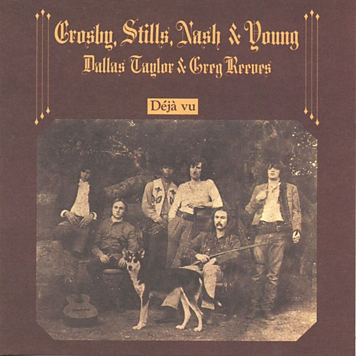

# Déjà vu

By **Crosby, Stills, Nash & Young**

## Album Data

- **Catalog:** Beets
- **Format:** Digital, Album
- **Album:** Déjà vu
- **Artist:** Crosby, Stills, Nash & Young
- **Albumartist:** Crosby, Stills, Nash & Young
- **Genre:** Folk Rock
- **MusicBrainz Album Artist ID:** [46a782ea-4308-476b-abd1-a91b197f3037](https://musicbrainz.org/artist/46a782ea-4308-476b-abd1-a91b197f3037)
- **MusicBrainz Album ID:** [8469abdf-5eff-35db-a8fe-3dd16a284df9](https://musicbrainz.org/release/8469abdf-5eff-35db-a8fe-3dd16a284df9)
- **MusicBrainz Release Group ID:** [3412fd44-c6e6-3a3b-b91a-964a055192ec](https://musicbrainz.org/release-group/3412fd44-c6e6-3a3b-b91a-964a055192ec)
- **Year:** 1994
- **Catalog #:** 82649-2
- **Label:** Atlantic
- **Total Tracks:** 10

## Album Tracks

### Track 01 - Carry On

- **Artist:** Crosby, Stills, Nash & Young
- **Format:** MP3
- **Genre:** Folk Rock
- **Length:** 4:16
- **MusicBrainz Track ID:** [34786ae6-45a8-47c0-b14e-a6620a3016cb](https://musicbrainz.org/recording/34786ae6-45a8-47c0-b14e-a6620a3016cb)
- **Title:** Carry On
- **Track:** 01
- **Year:** 1994

### Track 02 - Teach Your Children

- **Artist:** Crosby, Stills, Nash & Young
- **Format:** MP3
- **Genre:** Folk Rock
- **Length:** 2:53
- **MusicBrainz Track ID:** [545f36d4-9bbc-45a6-9ef9-48069a3c92c9](https://musicbrainz.org/recording/545f36d4-9bbc-45a6-9ef9-48069a3c92c9)
- **Title:** Teach Your Children
- **Track:** 02
- **Year:** 1994

### Track 03 - Almost Cut My Hair

- **Artist:** Crosby, Stills, Nash & Young
- **Format:** MP3
- **Genre:** Folk Rock
- **Length:** 4:23
- **MusicBrainz Track ID:** [cff2e9ef-c4dc-4ee0-b6f9-90bdb41a915e](https://musicbrainz.org/recording/cff2e9ef-c4dc-4ee0-b6f9-90bdb41a915e)
- **Title:** Almost Cut My Hair
- **Track:** 03
- **Year:** 1994

### Track 04 - Helpless

- **Artist:** Crosby, Stills, Nash & Young
- **Format:** MP3
- **Genre:** Folk Rock
- **Length:** 3:34
- **MusicBrainz Track ID:** [2d5bd5b4-9d6a-40a0-a708-216da280f837](https://musicbrainz.org/recording/2d5bd5b4-9d6a-40a0-a708-216da280f837)
- **Title:** Helpless
- **Track:** 04
- **Year:** 1994

### Track 05 - Woodstock

- **Artist:** Crosby, Stills, Nash & Young
- **Format:** MP3
- **Genre:** Folk Rock
- **Length:** 3:52
- **MusicBrainz Track ID:** [8a2f0375-f126-4e24-9afc-7aea53cf7932](https://musicbrainz.org/recording/8a2f0375-f126-4e24-9afc-7aea53cf7932)
- **Title:** Woodstock
- **Track:** 05
- **Year:** 1994

### Track 06 - Déjà vu

- **Artist:** Crosby, Stills, Nash & Young
- **Format:** MP3
- **Genre:** Psychedelic Rock
- **Length:** 4:08
- **MusicBrainz Track ID:** [121c5dfd-f2e1-40b1-82ce-2c704c23cc09](https://musicbrainz.org/recording/121c5dfd-f2e1-40b1-82ce-2c704c23cc09)
- **Title:** Déjà vu
- **Track:** 06
- **Year:** 1994

### Track 07 - Our House

- **Artist:** Crosby, Stills, Nash & Young
- **Format:** MP3
- **Genre:** Folk Rock
- **Length:** 2:59
- **MusicBrainz Track ID:** [69fac423-419e-4142-9beb-5347e608cea3](https://musicbrainz.org/recording/69fac423-419e-4142-9beb-5347e608cea3)
- **Title:** Our House
- **Track:** 07
- **Year:** 1994

### Track 08 - 4 + 20

- **Artist:** Crosby, Stills, Nash & Young
- **Format:** MP3
- **Genre:** Soft Rock
- **Length:** 2:04
- **MusicBrainz Track ID:** [d9099fba-6236-4238-82c4-4acf774e05b6](https://musicbrainz.org/recording/d9099fba-6236-4238-82c4-4acf774e05b6)
- **Title:** 4 + 20
- **Track:** 08
- **Year:** 1994

### Track 09 - Country Girl

- **Artist:** Crosby, Stills, Nash & Young
- **Format:** MP3
- **Genre:** Folk Rock
- **Length:** 5:05
- **MusicBrainz Track ID:** [81ec824e-ae2c-4d34-a43c-f98f02912a9a](https://musicbrainz.org/recording/81ec824e-ae2c-4d34-a43c-f98f02912a9a)
- **Title:** Country Girl
- **Track:** 09
- **Year:** 1994

### Track 10 - Everybody I Love You

- **Artist:** Crosby, Stills, Nash & Young
- **Format:** MP3
- **Genre:** Psychedelic Rock
- **Length:** 2:21
- **MusicBrainz Track ID:** [16869823-1b0b-42cb-9681-593d8a9dc0d4](https://musicbrainz.org/recording/16869823-1b0b-42cb-9681-593d8a9dc0d4)
- **Title:** Everybody I Love You
- **Track:** 10
- **Year:** 1994

## See also

- [4 Way Street](4_Way_Street.md)
- [Roon: Deja Vu](../../Roon/Crosby__Stills__Nash_and_Young/Deja_Vu.md)
- [Roon: Déjà Vu](../../Roon/Crosby__Stills__Nash_and_Young/Déjà_Vu.md)
- [Vinyl: ](../../Vinyl/Crosby__Stills__Nash_and_Young/Crosby__Stills__Nash_and_Young.md)
- [Vinyl: Déjà Vu](../../Vinyl/Crosby__Stills__Nash_and_Young/Déjà_Vu.md)
- [Vinyl: Teach Your Children / Carry On](../../Vinyl/Crosby__Stills__Nash_and_Young/Teach_Your_Children_-_Carry_On.md)
