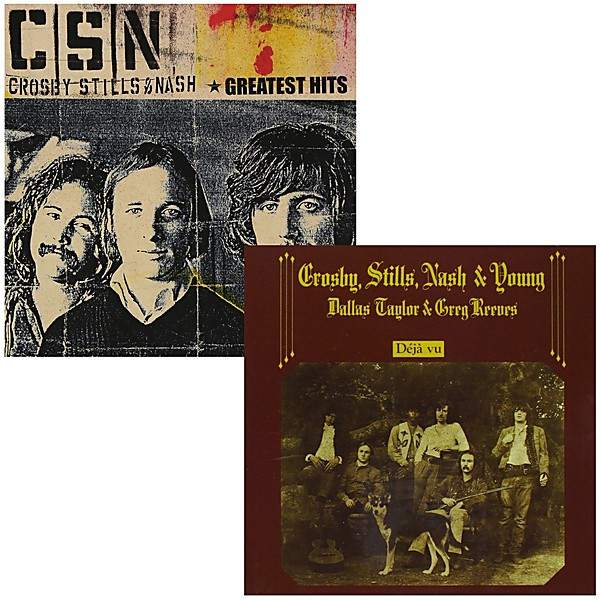

# Crosby, Stills & Nash (Disc 2)

By **Crosby, Stills & Nash**

## Album Data

- **Catalog:** Beets
- **Format:** Digital, Album
- **Album:** Crosby, Stills & Nash (Disc 2)
- **Artist:** Crosby, Stills & Nash
- **Albumartist:** Crosby, Stills & Nash
- **Genre:** Folk Rock
- **MusicBrainz Album Artist ID:** 
- **MusicBrainz Album ID:** 
- **MusicBrainz Release Group ID:** 
- **Year:** 0000
- **Catalog #:** 
- **Label:** 
- **Total Tracks:** 00

## Album Tracks

### Track 01 - Shadow Captain

- **Artist:** Crosby, Stills & Nash
- **Format:** MP3
- **Genre:** Soft Rock
- **Length:** 4:33
- **MusicBrainz Track ID:** 
- **Title:** Shadow Captain
- **Track:** 01
- **Year:** 1977

### Track 02 - See the Changes

- **Artist:** Crosby, Stills & Nash
- **Format:** MP3
- **Genre:** Folk Rock
- **Length:** 2:58
- **MusicBrainz Track ID:** 
- **Title:** See the Changes
- **Track:** 02
- **Year:** 1977

### Track 03 - Carried Away

- **Artist:** Crosby, Stills & Nash
- **Format:** MP3
- **Genre:** Soft Rock
- **Length:** 2:32
- **MusicBrainz Track ID:** 
- **Title:** Carried Away
- **Track:** 03
- **Year:** 1977

### Track 04 - Fair Game

- **Artist:** Crosby, Stills & Nash
- **Format:** MP3
- **Genre:** Soft Rock
- **Length:** 3:31
- **MusicBrainz Track ID:** 
- **Title:** Fair Game
- **Track:** 04
- **Year:** 1977

### Track 05 - Anything at All

- **Artist:** Crosby, Stills & Nash
- **Format:** MP3
- **Genre:** Folk Rock
- **Length:** 3:06
- **MusicBrainz Track ID:** 
- **Title:** Anything at All
- **Track:** 05
- **Year:** 1977

### Track 06 - Cathedral

- **Artist:** Crosby, Stills & Nash
- **Format:** MP3
- **Genre:** Folk Rock
- **Length:** 5:17
- **MusicBrainz Track ID:** 
- **Title:** Cathedral
- **Track:** 06
- **Year:** 1977

### Track 07 - Dark Star

- **Artist:** Crosby, Stills & Nash
- **Format:** MP3
- **Genre:** Soft Rock
- **Length:** 4:46
- **MusicBrainz Track ID:** 
- **Title:** Dark Star
- **Track:** 07
- **Year:** 1977

### Track 08 - Just A Song Before I Go

- **Artist:** Crosby, Stills & Nash
- **Format:** MP3
- **Genre:** Soft Rock
- **Length:** 2:14
- **MusicBrainz Track ID:** 
- **Title:** Just A Song Before I Go
- **Track:** 08
- **Year:** 1977

### Track 09 - Run from Tears

- **Artist:** Crosby, Stills & Nash
- **Format:** MP3
- **Genre:** Folk Rock
- **Length:** 4:02
- **MusicBrainz Track ID:** 
- **Title:** Run from Tears
- **Track:** 09
- **Year:** 1977

### Track 10 - Cold Rain

- **Artist:** Crosby, Stills & Nash
- **Format:** MP3
- **Genre:** Soft Rock
- **Length:** 2:34
- **MusicBrainz Track ID:** 
- **Title:** Cold Rain
- **Track:** 10
- **Year:** 1977

### Track 11 - In My Dreams

- **Artist:** Crosby, Stills & Nash
- **Format:** MP3
- **Genre:** Folk Rock
- **Length:** 5:12
- **MusicBrainz Track ID:** 
- **Title:** In My Dreams
- **Track:** 11
- **Year:** 1977

### Track 12 - I Give You Give Blind

- **Artist:** Crosby, Stills & Nash
- **Format:** MP3
- **Genre:** Folk Rock
- **Length:** 3:21
- **MusicBrainz Track ID:** 
- **Title:** I Give You Give Blind
- **Track:** 12
- **Year:** 1977

## See also

- [Crosby, Stills & Nash](Crosby__Stills_and_Nash.md)
- [CSN](CSN.md)
- [Roon: Crosby, Stills & Nash](../../Roon/Crosby__Stills_and_Nash/Crosby__Stills_and_Nash.md)
- [Roon: Daylight Again (Hi-Res Version) (2012 Remaster)](../../Roon/Crosby__Stills_and_Nash/Daylight_Again_Hi-Res_Version_2012_Remaster.md)
- [Vinyl: ](../../Vinyl/Crosby__Stills_and_Nash/Crosby__Stills_and_Nash_index.md)
- [Vinyl: "Crosby, Stills & Nash"](../../Vinyl/Crosby__Stills_and_Nash/Crosby__Stills_and_Nash.md)
