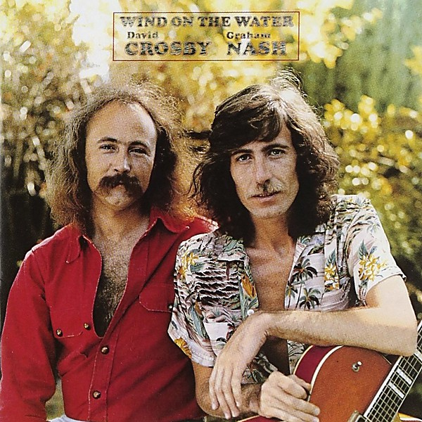

# Wind on the Water

By **Crosby & Nash**

## Album Data

- **Catalog:** Beets
- **Format:** Digital, Album
- **Album:** Wind on the Water
- **Artist:** Crosby & Nash
- **Albumartist:** Crosby & Nash
- **Genre:** Soft Rock
- **MusicBrainz Album Artist ID:** [ed944321-63d7-4275-a272-3e856d42a7bf](https://musicbrainz.org/artist/ed944321-63d7-4275-a272-3e856d42a7bf)
- **MusicBrainz Album ID:** [5757085e-d39e-301e-8c6c-b547f50617f8](https://musicbrainz.org/release/5757085e-d39e-301e-8c6c-b547f50617f8)
- **MusicBrainz Release Group ID:** [d62f5c3b-fa8d-3549-924a-e21dfef685d8](https://musicbrainz.org/release-group/d62f5c3b-fa8d-3549-924a-e21dfef685d8)
- **Year:** 1988
- **Catalog #:** MCAD-31251
- **Label:** MCA Records
- **Total Tracks:** 11

## Album Tracks

### Track 01 - Carry Me

- **Artist:** Crosby & Nash
- **Format:** ALAC
- **Genre:** Soft Rock
- **Length:** 3:34
- **MusicBrainz Track ID:** [a58a6121-916f-4dfa-a37d-8ecc2828828b](https://musicbrainz.org/recording/a58a6121-916f-4dfa-a37d-8ecc2828828b)
- **Title:** Carry Me
- **Track:** 01
- **Year:** 1988

### Track 02 - Mama Lion

- **Artist:** Crosby & Nash
- **Format:** ALAC
- **Genre:** Folk Rock
- **Length:** 3:16
- **MusicBrainz Track ID:** [e87a85f4-6c3f-4282-89f5-c9700be4c9bd](https://musicbrainz.org/recording/e87a85f4-6c3f-4282-89f5-c9700be4c9bd)
- **Title:** Mama Lion
- **Track:** 02
- **Year:** 1988

### Track 03 - Bittersweet

- **Artist:** Crosby & Nash
- **Format:** ALAC
- **Genre:** Folk Rock
- **Length:** 2:40
- **MusicBrainz Track ID:** [72e5f0c6-6256-4ca4-9bf7-073a4542526b](https://musicbrainz.org/recording/72e5f0c6-6256-4ca4-9bf7-073a4542526b)
- **Title:** Bittersweet
- **Track:** 03
- **Year:** 1988

### Track 04 - Take the Money and Run

- **Artist:** Crosby & Nash
- **Format:** ALAC
- **Genre:** Soft Rock
- **Length:** 3:23
- **MusicBrainz Track ID:** [88e08892-c443-4b84-a62f-1d7487135745](https://musicbrainz.org/recording/88e08892-c443-4b84-a62f-1d7487135745)
- **Title:** Take the Money and Run
- **Track:** 04
- **Year:** 1988

### Track 05 - Naked in the Rain

- **Artist:** Crosby & Nash
- **Format:** ALAC
- **Genre:** Folk Rock
- **Length:** 2:29
- **MusicBrainz Track ID:** [26d91711-cb9b-44b4-9b85-90cde022394e](https://musicbrainz.org/recording/26d91711-cb9b-44b4-9b85-90cde022394e)
- **Title:** Naked in the Rain
- **Track:** 05
- **Year:** 1988

### Track 06 - Love Work Out

- **Artist:** Crosby & Nash
- **Format:** ALAC
- **Genre:** Soft Rock
- **Length:** 4:50
- **MusicBrainz Track ID:** [18531fc5-4bc7-4861-87de-ff50f1816227](https://musicbrainz.org/recording/18531fc5-4bc7-4861-87de-ff50f1816227)
- **Title:** Love Work Out
- **Track:** 06
- **Year:** 1988

### Track 07 - Low Down Payment

- **Artist:** Crosby & Nash
- **Format:** ALAC
- **Genre:** Folk Rock
- **Length:** 4:55
- **MusicBrainz Track ID:** [3bb6b735-2421-4d3b-a47b-4bb705cc16af](https://musicbrainz.org/recording/3bb6b735-2421-4d3b-a47b-4bb705cc16af)
- **Title:** Low Down Payment
- **Track:** 07
- **Year:** 1988

### Track 08 - Cowboy of Dreams

- **Artist:** Crosby & Nash
- **Format:** ALAC
- **Genre:** Folk Rock
- **Length:** 3:29
- **MusicBrainz Track ID:** [b67a46d9-5de1-427b-bf1c-04b016e75acf](https://musicbrainz.org/recording/b67a46d9-5de1-427b-bf1c-04b016e75acf)
- **Title:** Cowboy of Dreams
- **Track:** 08
- **Year:** 1988

### Track 09 - Homeward Through the Haze

- **Artist:** Crosby & Nash
- **Format:** ALAC
- **Genre:** Soft Rock
- **Length:** 4:05
- **MusicBrainz Track ID:** [ca405509-7253-4e67-b03b-3053da52bf06](https://musicbrainz.org/recording/ca405509-7253-4e67-b03b-3053da52bf06)
- **Title:** Homeward Through the Haze
- **Track:** 09
- **Year:** 1988

### Track 10 - Fieldworker

- **Artist:** Crosby & Nash
- **Format:** ALAC
- **Genre:** Soft Rock
- **Length:** 2:46
- **MusicBrainz Track ID:** [b85eb532-8659-4c46-beba-9b90e21fe9ce](https://musicbrainz.org/recording/b85eb532-8659-4c46-beba-9b90e21fe9ce)
- **Title:** Fieldworker
- **Track:** 10
- **Year:** 1988

### Track 11 - To the Last Whale

- **Artist:** Crosby & Nash
- **Format:** ALAC
- **Genre:** Soft Rock
- **Length:** 5:30
- **MusicBrainz Track ID:** [83d7998d-0ee6-42ae-aafe-5ce7be0eef7e](https://musicbrainz.org/recording/83d7998d-0ee6-42ae-aafe-5ce7be0eef7e)
- **Title:** To the Last Whale
- **Track:** 11
- **Year:** 1988

## See also

- [Roon: Graham Nash David Crosby](../../Roon/Crosby_and_Nash/Graham_Nash_David_Crosby.md)
