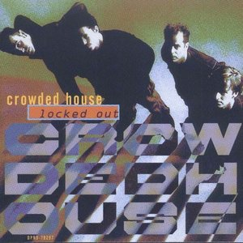

# Locked Out

By **Crowded House**

## Album Data

- **Catalog:** Beets
- **Format:** Digital, Album
- **Album:** Locked Out
- **Artist:** Crowded House
- **Albumartist:** Crowded House
- **Genre:** Pop Rock
- **MusicBrainz Album Artist ID:** [9854d99f-d954-4c0f-9ae5-58a0cdd885f5](https://musicbrainz.org/artist/9854d99f-d954-4c0f-9ae5-58a0cdd885f5)
- **MusicBrainz Album ID:** [c9d37706-328c-4ec3-96f7-5348a9162bfa](https://musicbrainz.org/release/c9d37706-328c-4ec3-96f7-5348a9162bfa)
- **MusicBrainz Release Group ID:** [623aeca5-676a-3085-bb49-40ebbd5d2ff1](https://musicbrainz.org/release-group/623aeca5-676a-3085-bb49-40ebbd5d2ff1)
- **Year:** 1993
- **Catalog #:** CDP 7243 8 27048 2 9
- **Label:** Capitol Records
- **Total Tracks:** 13

## Album Tracks

### Track 01 - Kare Kare

- **Artist:** Crowded House
- **Format:** MP3
- **Genre:** Indie Rock
- **Length:** 3:35
- **MusicBrainz Track ID:** [85fbb96c-6342-4968-b2f1-6433170a9e12](https://musicbrainz.org/recording/85fbb96c-6342-4968-b2f1-6433170a9e12)
- **Title:** Kare Kare
- **Track:** 01
- **Year:** 1993

### Track 02 - In My Command

- **Artist:** Crowded House
- **Format:** MP3
- **Genre:** Soft Rock
- **Length:** 3:43
- **MusicBrainz Track ID:** [3bdfd57f-4dc9-47d0-afa9-3f174df5dc0a](https://musicbrainz.org/recording/3bdfd57f-4dc9-47d0-afa9-3f174df5dc0a)
- **Title:** In My Command
- **Track:** 02
- **Year:** 1993

### Track 03 - Nails In My Feet

- **Artist:** Crowded House
- **Format:** MP3
- **Genre:** Indie Rock
- **Length:** 3:38
- **MusicBrainz Track ID:** [82984309-efa0-487f-85ba-34c5c69292d5](https://musicbrainz.org/recording/82984309-efa0-487f-85ba-34c5c69292d5)
- **Title:** Nails In My Feet
- **Track:** 03
- **Year:** 1993

### Track 04 - Black & White Boy

- **Artist:** Crowded House
- **Format:** MP3
- **Genre:** Rock
- **Length:** 4:00
- **MusicBrainz Track ID:** [38c7de44-593f-4c10-8a33-3621d000cf71](https://musicbrainz.org/recording/38c7de44-593f-4c10-8a33-3621d000cf71)
- **Title:** Black & White Boy
- **Track:** 04
- **Year:** 1993

### Track 05 - Fingers Of Love

- **Artist:** Crowded House
- **Format:** MP3
- **Genre:** Indie Rock
- **Length:** 4:26
- **MusicBrainz Track ID:** [7967cb18-c4db-46cc-83ba-1395a3f5bf3e](https://musicbrainz.org/recording/7967cb18-c4db-46cc-83ba-1395a3f5bf3e)
- **Title:** Fingers Of Love
- **Track:** 05
- **Year:** 1993

### Track 06 - Pineapple Head

- **Artist:** Crowded House
- **Format:** MP3
- **Genre:** Soft Rock
- **Length:** 3:27
- **MusicBrainz Track ID:** [7a7571f3-c241-4042-b916-841e85438cac](https://musicbrainz.org/recording/7a7571f3-c241-4042-b916-841e85438cac)
- **Title:** Pineapple Head
- **Track:** 06
- **Year:** 1993

### Track 07 - Locked Out

- **Artist:** Crowded House
- **Format:** MP3
- **Genre:** Alternative Rock
- **Length:** 3:17
- **MusicBrainz Track ID:** [96d553d5-2b3a-41a8-b2dd-1287549682d4](https://musicbrainz.org/recording/96d553d5-2b3a-41a8-b2dd-1287549682d4)
- **Title:** Locked Out
- **Track:** 07
- **Year:** 1993

### Track 08 - Private Universe

- **Artist:** Crowded House
- **Format:** MP3
- **Genre:** Rock
- **Length:** 5:38
- **MusicBrainz Track ID:** [6d35d7f3-126e-4f2d-8230-c8920e3d7cda](https://musicbrainz.org/recording/6d35d7f3-126e-4f2d-8230-c8920e3d7cda)
- **Title:** Private Universe
- **Track:** 08
- **Year:** 1993

### Track 09 - Walking On The Spot

- **Artist:** Crowded House
- **Format:** MP3
- **Genre:** Soft Rock
- **Length:** 2:54
- **MusicBrainz Track ID:** [313abb68-bdb2-4cff-9d72-b6ee9776c09b](https://musicbrainz.org/recording/313abb68-bdb2-4cff-9d72-b6ee9776c09b)
- **Title:** Walking On The Spot
- **Track:** 09
- **Year:** 1993

### Track 10 - Distant Sun

- **Artist:** Crowded House
- **Format:** MP3
- **Genre:** Soft Rock
- **Length:** 3:49
- **MusicBrainz Track ID:** [c03854b8-39ab-47e1-9904-21ed97fa6588](https://musicbrainz.org/recording/c03854b8-39ab-47e1-9904-21ed97fa6588)
- **Title:** Distant Sun
- **Track:** 10
- **Year:** 1993

### Track 11 - Catherine Wheels

- **Artist:** Crowded House
- **Format:** MP3
- **Genre:** Soft Rock
- **Length:** 5:12
- **MusicBrainz Track ID:** [cdc4df09-9bd5-403f-aea9-e4b3aa11c08e](https://musicbrainz.org/recording/cdc4df09-9bd5-403f-aea9-e4b3aa11c08e)
- **Title:** Catherine Wheels
- **Track:** 11
- **Year:** 1993

### Track 12 - Skin Feeling

- **Artist:** Crowded House
- **Format:** MP3
- **Genre:** Indie Rock
- **Length:** 3:56
- **MusicBrainz Track ID:** [f4df1244-fbbc-4cfb-aa09-1280621a6fed](https://musicbrainz.org/recording/f4df1244-fbbc-4cfb-aa09-1280621a6fed)
- **Title:** Skin Feeling
- **Track:** 12
- **Year:** 1993

### Track 13 - Together Alone

- **Artist:** Crowded House
- **Format:** MP3
- **Genre:** Worldbeat
- **Length:** 3:55
- **MusicBrainz Track ID:** [dc080f06-f373-4fe1-974a-c3608fe2f8cf](https://musicbrainz.org/recording/dc080f06-f373-4fe1-974a-c3608fe2f8cf)
- **Title:** Together Alone
- **Track:** 13
- **Year:** 1993

## See also

- [Together Alone](Together_Alone.md)
- [Weather with You [US]](Weather_with_You_[US].md)
