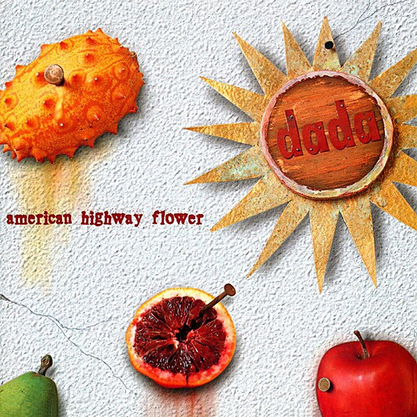

# American Highway Flower

By **dada**

## Album Data

- **Catalog:** Beets
- **Format:** Digital, Album
- **Album:** American Highway Flower
- **Artist:** Dada
- **Albumartist:** dada
- **Genre:** Progressive Rock
- **MusicBrainz Album Artist ID:** [0c90c74b-a53b-4740-a508-c0669b2cb74d](https://musicbrainz.org/artist/0c90c74b-a53b-4740-a508-c0669b2cb74d)
- **MusicBrainz Album ID:** [b048bdf7-8d7b-469c-b5f1-9f3e1b0b9b67](https://musicbrainz.org/release/b048bdf7-8d7b-469c-b5f1-9f3e1b0b9b67)
- **MusicBrainz Release Group ID:** [bb329764-bc2e-3da4-b130-58eef8ef36de](https://musicbrainz.org/release-group/bb329764-bc2e-3da4-b130-58eef8ef36de)
- **Year:** 1994
- **Catalog #:** 
- **Label:** 
- **Total Tracks:** 11

## Album Tracks

### Track 01 - Big Dipper

- **Artist:** Dada
- **Format:** MP3
- **Genre:** Progressive Rock
- **Length:** 4:12
- **MusicBrainz Track ID:** [2c89ee92-4a56-4c09-8cf4-15099bd20600](https://musicbrainz.org/recording/2c89ee92-4a56-4c09-8cf4-15099bd20600)
- **Title:** Big Dipper
- **Track:** 01
- **Year:** 1970

### Track 02 - The Last Time

- **Artist:** Dada
- **Format:** MP3
- **Genre:** Progressive Rock
- **Length:** 3:44
- **MusicBrainz Track ID:** [d7e85800-1250-47fd-b618-87f6126646da](https://musicbrainz.org/recording/d7e85800-1250-47fd-b618-87f6126646da)
- **Title:** The Last Time
- **Track:** 02
- **Year:** 1970

### Track 03 - This Is My Song

- **Artist:** Dada
- **Format:** MP3
- **Genre:** Progressive Rock
- **Length:** 4:39
- **MusicBrainz Track ID:** [bc97c652-7d1f-4538-ab29-5df4fd5d79b8](https://musicbrainz.org/recording/bc97c652-7d1f-4538-ab29-5df4fd5d79b8)
- **Title:** This Is My Song
- **Track:** 03
- **Year:** 1970

### Track 04 - Seed of Peace

- **Artist:** Dada
- **Format:** MP3
- **Genre:** Progressive Rock
- **Length:** 3:30
- **MusicBrainz Track ID:** [ffa0f2eb-ed71-4a5a-af30-2e029bdcb351](https://musicbrainz.org/recording/ffa0f2eb-ed71-4a5a-af30-2e029bdcb351)
- **Title:** Seed of Peace
- **Track:** 04
- **Year:** 1970

### Track 05 - Organ Interlude

- **Artist:** Dada
- **Format:** MP3
- **Genre:** Progressive Rock
- **Length:** 0:56
- **MusicBrainz Track ID:** [0ad6a2b9-cd4f-4332-82d7-4e7ecceb8371](https://musicbrainz.org/recording/0ad6a2b9-cd4f-4332-82d7-4e7ecceb8371)
- **Title:** Organ Interlude
- **Track:** 05
- **Year:** 1970

### Track 06 - Tonite Is

- **Artist:** Dada
- **Format:** MP3
- **Genre:** Progressive Rock
- **Length:** 1:00
- **MusicBrainz Track ID:** [4c2766e3-1c54-4909-9298-925bf3df448a](https://musicbrainz.org/recording/4c2766e3-1c54-4909-9298-925bf3df448a)
- **Title:** Tonite Is
- **Track:** 06
- **Year:** 1970

### Track 07 - She Walks Away

- **Artist:** Dada
- **Format:** MP3
- **Genre:** Progressive Rock
- **Length:** 3:27
- **MusicBrainz Track ID:** [b57e48e9-f9b5-4bd5-8a03-d236ab913c99](https://musicbrainz.org/recording/b57e48e9-f9b5-4bd5-8a03-d236ab913c99)
- **Title:** She Walks Away
- **Track:** 07
- **Year:** 1970

### Track 08 - Aspen, Colorado

- **Artist:** Dada
- **Format:** MP3
- **Genre:** Progressive Rock
- **Length:** 5:03
- **MusicBrainz Track ID:** [a1d12ec9-5d5e-4415-81bb-3ef63d3df130](https://musicbrainz.org/recording/a1d12ec9-5d5e-4415-81bb-3ef63d3df130)
- **Title:** Aspen, Colorado
- **Track:** 08
- **Year:** 1970

### Track 09 - Eyes of the Warren

- **Artist:** Dada
- **Format:** MP3
- **Genre:** Progressive Rock
- **Length:** 4:14
- **MusicBrainz Track ID:** [ba0bf873-4eec-4044-9202-62bac68c5420](https://musicbrainz.org/recording/ba0bf873-4eec-4044-9202-62bac68c5420)
- **Title:** Eyes of the Warren
- **Track:** 09
- **Year:** 1970

### Track 10 - Jasamin

- **Artist:** Dada
- **Format:** MP3
- **Genre:** Progressive Rock
- **Length:** 2:40
- **MusicBrainz Track ID:** [2903c6da-9079-4273-aa22-3d640ca3a361](https://musicbrainz.org/recording/2903c6da-9079-4273-aa22-3d640ca3a361)
- **Title:** Jasamin
- **Track:** 10
- **Year:** 1970

### Track 11 - Dada

- **Artist:** Dada
- **Format:** MP3
- **Genre:** Progressive Rock
- **Length:** 3:54
- **MusicBrainz Track ID:** [78a55b60-2f6f-4324-815e-03e2143d9a71](https://musicbrainz.org/recording/78a55b60-2f6f-4324-815e-03e2143d9a71)
- **Title:** Dada
- **Track:** 11
- **Year:** 1970

## See also

- [Dada](Dada.md)
- [El Subliminoso](El_Subliminoso.md)
- [How to Be Found](How_to_Be_Found.md)
- [Live](Live.md)
- [Puzzle](Puzzle.md)
- [CD: American Highway Flower](../../CD/Dada/American_Highway_Flower.md)
- [CD: ](../../CD/Dada/Dada.md)
- [CD: El Subliminoso](../../CD/Dada/El_Subliminoso.md)
- [Roon: American Highway Flower](../../Roon/Dada/American_Highway_Flower.md)
- [Roon: Best Of The IRS Years](../../Roon/Dada/Best_Of_The_IRS_Years.md)
- [Roon: dada](../../Roon/Dada/dada.md)
- [Roon: El Subliminoso](../../Roon/Dada/El_Subliminoso.md)
- [Roon: How to Be Found](../../Roon/Dada/How_to_Be_Found.md)
- [Roon: Live](../../Roon/Dada/Live-_Official_Bootleg__Vol_1.md)
- [Roon: Puzzle](../../Roon/Dada/Puzzle.md)
