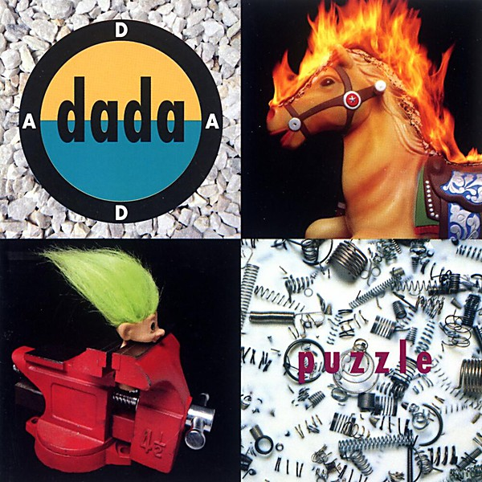

# Puzzle

By **Dada**

## Album Data

- **Catalog:** Beets
- **Format:** Digital, Album
- **Album:** Puzzle
- **Artist:** Dada
- **Albumartist:** Dada
- **Genre:** Alternative Rock
- **MusicBrainz Album Artist ID:** 
- **MusicBrainz Album ID:** 
- **MusicBrainz Release Group ID:** 
- **Year:** 1992
- **Catalog #:** 
- **Label:** 
- **Total Tracks:** 12

## Album Tracks

### Track 01 - Dorina

- **Artist:** Dada
- **Format:** ALAC
- **Genre:** Alternative Rock
- **Length:** 6:08
- **MusicBrainz Track ID:** 
- **Title:** Dorina
- **Track:** 01
- **Year:** 1992

### Track 02 - Mary Sunshine Rain

- **Artist:** Dada
- **Format:** ALAC
- **Genre:** Alternative Rock
- **Length:** 4:41
- **MusicBrainz Track ID:** 
- **Title:** Mary Sunshine Rain
- **Track:** 02
- **Year:** 1992

### Track 03 - Dog

- **Artist:** Dada
- **Format:** ALAC
- **Genre:** Alternative Rock
- **Length:** 4:15
- **MusicBrainz Track ID:** 
- **Title:** Dog
- **Track:** 03
- **Year:** 1992

### Track 04 - Dizz Knee Land

- **Artist:** Dada
- **Format:** ALAC
- **Genre:** Jangle Pop
- **Length:** 4:08
- **MusicBrainz Track ID:** 
- **Title:** Dizz Knee Land
- **Track:** 04
- **Year:** 1992

### Track 06 - Here Today, Gone Tomorrow

- **Artist:** Dada
- **Format:** ALAC
- **Genre:** Alternative Rock
- **Length:** 4:44
- **MusicBrainz Track ID:** 
- **Title:** Here Today, Gone Tomorrow
- **Track:** 06
- **Year:** 1992

### Track 07 - Posters

- **Artist:** Dada
- **Format:** ALAC
- **Genre:** Blues
- **Length:** 4:07
- **MusicBrainz Track ID:** 
- **Title:** Posters
- **Track:** 07
- **Year:** 1992

### Track 08 - Timothy

- **Artist:** Dada
- **Format:** ALAC
- **Genre:** Alternative Rock
- **Length:** 4:00
- **MusicBrainz Track ID:** 
- **Title:** Timothy
- **Track:** 08
- **Year:** 1992

## See also

- [American Highway Flower](American_Highway_Flower.md)
- [Dada](Dada.md)
- [El Subliminoso](El_Subliminoso.md)
- [How to Be Found](How_to_Be_Found.md)
- [Live](Live.md)
- [CD: American Highway Flower](../../CD/Dada/American_Highway_Flower.md)
- [CD: ](../../CD/Dada/Dada.md)
- [CD: El Subliminoso](../../CD/Dada/El_Subliminoso.md)
- [Roon: American Highway Flower](../../Roon/Dada/American_Highway_Flower.md)
- [Roon: Best Of The IRS Years](../../Roon/Dada/Best_Of_The_IRS_Years.md)
- [Roon: dada](../../Roon/Dada/dada.md)
- [Roon: El Subliminoso](../../Roon/Dada/El_Subliminoso.md)
- [Roon: How to Be Found](../../Roon/Dada/How_to_Be_Found.md)
- [Roon: Live](../../Roon/Dada/Live-_Official_Bootleg__Vol_1.md)
- [Roon: Puzzle](../../Roon/Dada/Puzzle.md)
