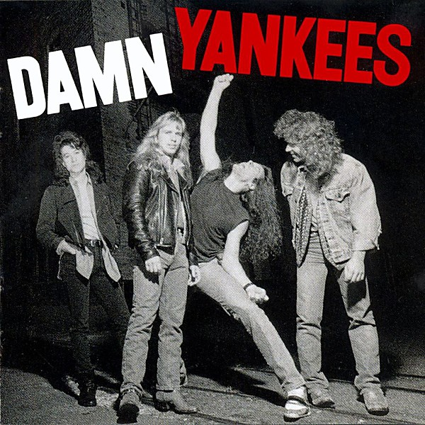

# Damn Yankees

By **Damn Yankees**

## Album Data

- **Catalog:** Beets
- **Format:** Digital, Album
- **Album:** Damn Yankees
- **Artist:** Damn Yankees
- **Albumartist:** Damn Yankees
- **Genre:** Thrash Metal
- **MusicBrainz Album Artist ID:** [5c585e27-c9f2-4441-8f6c-60e3edeacd0b](https://musicbrainz.org/artist/5c585e27-c9f2-4441-8f6c-60e3edeacd0b)
- **MusicBrainz Album ID:** [f1fbc256-2d4e-4be3-9f55-2732482e9742](https://musicbrainz.org/release/f1fbc256-2d4e-4be3-9f55-2732482e9742)
- **MusicBrainz Release Group ID:** [f5e11206-1d43-3332-acc8-107efbcc661d](https://musicbrainz.org/release-group/f5e11206-1d43-3332-acc8-107efbcc661d)
- **Year:** 1990
- **Catalog #:** 26159-2
- **Label:** Warner Bros. Records
- **Total Tracks:** 10

## Album Tracks

### Track 01 - Coming of Age

- **Artist:** Damn Yankees
- **Format:** ALAC
- **Genre:** Hard Rock
- **Length:** 4:20
- **MusicBrainz Track ID:** [55844acf-6414-40ba-9c8d-479997947a7c](https://musicbrainz.org/recording/55844acf-6414-40ba-9c8d-479997947a7c)
- **Title:** Coming of Age
- **Track:** 01
- **Year:** 1990

### Track 02 - Bad Reputation

- **Artist:** Damn Yankees
- **Format:** ALAC
- **Genre:** Thrash Metal
- **Length:** 4:30
- **MusicBrainz Track ID:** [d76a040f-9254-45d1-8d09-37188a208043](https://musicbrainz.org/recording/d76a040f-9254-45d1-8d09-37188a208043)
- **Title:** Bad Reputation
- **Track:** 02
- **Year:** 1990

### Track 03 - Runaway

- **Artist:** Damn Yankees
- **Format:** ALAC
- **Genre:** Glam Metal
- **Length:** 4:04
- **MusicBrainz Track ID:** [18e6ee38-e6cd-45c7-9a55-30c89845725f](https://musicbrainz.org/recording/18e6ee38-e6cd-45c7-9a55-30c89845725f)
- **Title:** Runaway
- **Track:** 03
- **Year:** 1990

### Track 04 - High Enough

- **Artist:** Damn Yankees
- **Format:** ALAC
- **Genre:** Heavy Metal
- **Length:** 4:45
- **MusicBrainz Track ID:** [14e23a6e-f382-441c-a131-9bd4cdf264b6](https://musicbrainz.org/recording/14e23a6e-f382-441c-a131-9bd4cdf264b6)
- **Title:** High Enough
- **Track:** 04
- **Year:** 1990

### Track 05 - Damn Yankees

- **Artist:** Damn Yankees
- **Format:** ALAC
- **Genre:** Thrash Metal
- **Length:** 4:39
- **MusicBrainz Track ID:** [b9b6f365-8b02-42de-8dd7-aa61c132e9c5](https://musicbrainz.org/recording/b9b6f365-8b02-42de-8dd7-aa61c132e9c5)
- **Title:** Damn Yankees
- **Track:** 05
- **Year:** 1990

### Track 06 - Come Again

- **Artist:** Damn Yankees
- **Format:** ALAC
- **Genre:** Heavy Metal
- **Length:** 5:40
- **MusicBrainz Track ID:** [20db80a3-81a2-4605-91cc-995a6843acdf](https://musicbrainz.org/recording/20db80a3-81a2-4605-91cc-995a6843acdf)
- **Title:** Come Again
- **Track:** 06
- **Year:** 1990

### Track 07 - Mystified

- **Artist:** Damn Yankees
- **Format:** ALAC
- **Genre:** Thrash Metal
- **Length:** 4:15
- **MusicBrainz Track ID:** [670d9a9f-1174-472a-8947-11d3de52dba9](https://musicbrainz.org/recording/670d9a9f-1174-472a-8947-11d3de52dba9)
- **Title:** Mystified
- **Track:** 07
- **Year:** 1990

### Track 08 - Rock City

- **Artist:** Damn Yankees
- **Format:** ALAC
- **Genre:** Glam Metal
- **Length:** 4:27
- **MusicBrainz Track ID:** [fcc85e87-38b4-4837-9998-c4332cd0a1a7](https://musicbrainz.org/recording/fcc85e87-38b4-4837-9998-c4332cd0a1a7)
- **Title:** Rock City
- **Track:** 08
- **Year:** 1990

### Track 09 - Tell Me How You Want It

- **Artist:** Damn Yankees
- **Format:** ALAC
- **Genre:** Heavy Metal
- **Length:** 4:35
- **MusicBrainz Track ID:** [feb0fb3a-7aa8-4bad-9078-148ca8e0d8da](https://musicbrainz.org/recording/feb0fb3a-7aa8-4bad-9078-148ca8e0d8da)
- **Title:** Tell Me How You Want It
- **Track:** 09
- **Year:** 1990

### Track 10 - Piledriver

- **Artist:** Damn Yankees
- **Format:** ALAC
- **Genre:** Glam Metal
- **Length:** 4:27
- **MusicBrainz Track ID:** [07247d56-17b2-417f-b509-68c1faab2fff](https://musicbrainz.org/recording/07247d56-17b2-417f-b509-68c1faab2fff)
- **Title:** Piledriver
- **Track:** 10
- **Year:** 1990

## See also

- [Roon: Damn Yankees](../../Roon/Damn_Yankees/Damn_Yankees.md)
