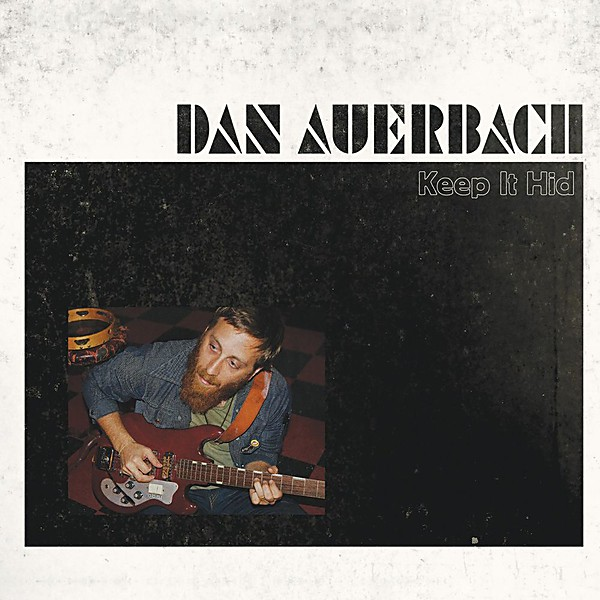

# Keep It Hid

By **Dan Auerbach**

## Album Data

- **Catalog:** Beets
- **Format:** Digital, Album
- **Album:** Keep It Hid
- **Artist:** Dan Auerbach
- **Albumartist:** Dan Auerbach
- **Genre:** Indie Rock
- **MusicBrainz Album Artist ID:** 
- **MusicBrainz Album ID:** 
- **MusicBrainz Release Group ID:** 
- **Year:** 2009
- **Catalog #:** 
- **Label:** 
- **Total Tracks:** 14

## Album Tracks

### Track 01 - Trouble Weighs a Ton

- **Artist:** Dan Auerbach
- **Format:** MP3
- **Genre:** Garage Rock
- **Length:** 2:17
- **MusicBrainz Track ID:** 
- **Title:** Trouble Weighs a Ton
- **Track:** 01
- **Year:** 2009

### Track 02 - I Want Some More

- **Artist:** Dan Auerbach
- **Format:** MP3
- **Genre:** Garage Rock
- **Length:** 3:46
- **MusicBrainz Track ID:** 
- **Title:** I Want Some More
- **Track:** 02
- **Year:** 2009

### Track 03 - Heartbroken, In Disrepair

- **Artist:** Dan Auerbach
- **Format:** MP3
- **Genre:** Rock
- **Length:** 3:21
- **MusicBrainz Track ID:** 
- **Title:** Heartbroken, In Disrepair
- **Track:** 03
- **Year:** 2009

### Track 04 - Because I Should

- **Artist:** Dan Auerbach
- **Format:** MP3
- **Genre:** Garage Rock
- **Length:** 0:53
- **MusicBrainz Track ID:** 
- **Title:** Because I Should
- **Track:** 04
- **Year:** 2009

### Track 05 - Whispered Words (Pretty Lies)

- **Artist:** Dan Auerbach
- **Format:** MP3
- **Genre:** Soft Rock
- **Length:** 4:06
- **MusicBrainz Track ID:** 
- **Title:** Whispered Words (Pretty Lies)
- **Track:** 05
- **Year:** 2009

### Track 05 - Whispered Words

- **Artist:** Dan Auerbach
- **Format:** AAC
- **Genre:** Soft Rock
- **Length:** 4:06
- **MusicBrainz Track ID:** 
- **Title:** Whispered Words
- **Track:** 05
- **Year:** 2009

### Track 06 - Real Desire

- **Artist:** Dan Auerbach
- **Format:** MP3
- **Genre:** Garage Rock
- **Length:** 4:22
- **MusicBrainz Track ID:** 
- **Title:** Real Desire
- **Track:** 06
- **Year:** 2009

### Track 07 - When the Night Comes

- **Artist:** Dan Auerbach
- **Format:** MP3
- **Genre:** Garage Rock
- **Length:** 3:56
- **MusicBrainz Track ID:** 
- **Title:** When the Night Comes
- **Track:** 07
- **Year:** 2009

### Track 08 - Mean Monsoon

- **Artist:** Dan Auerbach
- **Format:** MP3
- **Genre:** Rock
- **Length:** 3:45
- **MusicBrainz Track ID:** 
- **Title:** Mean Monsoon
- **Track:** 08
- **Year:** 2009

### Track 09 - The Prowl

- **Artist:** Dan Auerbach
- **Format:** MP3
- **Genre:** Stoner Rock
- **Length:** 3:15
- **MusicBrainz Track ID:** 
- **Title:** The Prowl
- **Track:** 09
- **Year:** 2009

### Track 10 - Keep It Hid

- **Artist:** Dan Auerbach
- **Format:** MP3
- **Genre:** Punk Blues
- **Length:** 3:39
- **MusicBrainz Track ID:** 
- **Title:** Keep It Hid
- **Track:** 10
- **Year:** 2009

### Track 11 - My Last Mistake

- **Artist:** Dan Auerbach
- **Format:** MP3
- **Genre:** Garage Rock
- **Length:** 3:12
- **MusicBrainz Track ID:** 
- **Title:** My Last Mistake
- **Track:** 11
- **Year:** 2009

### Track 12 - When I Left the Room

- **Artist:** Dan Auerbach
- **Format:** MP3
- **Genre:** Garage Rock
- **Length:** 4:01
- **MusicBrainz Track ID:** 
- **Title:** When I Left the Room
- **Track:** 12
- **Year:** 2009

### Track 13 - Street Walkin'

- **Artist:** Dan Auerbach
- **Format:** MP3
- **Genre:** Alternative Rock
- **Length:** 3:52
- **MusicBrainz Track ID:** 
- **Title:** Street Walkin'
- **Track:** 13
- **Year:** 2009

### Track 14 - Goin' Home

- **Artist:** Dan Auerbach
- **Format:** MP3
- **Genre:** Techno
- **Length:** 4:56
- **MusicBrainz Track ID:** 
- **Title:** Goin' Home
- **Track:** 14
- **Year:** 2009

## See also

- [Roon: Keep It Hid](../../Roon/Dan_Auerbach/Keep_It_Hid.md)
