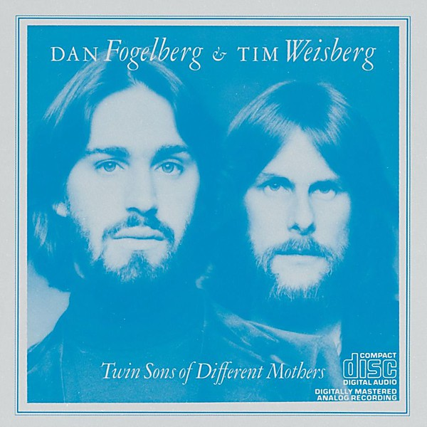

# Twin Sons of Different Mothers

By **Dan Fogelberg**

## Album Data

- **Catalog:** Beets
- **Format:** Digital, Album
- **Album:** Twin Sons of Different Mothers
- **Artist:** Dan Fogelberg
- **Albumartist:** Dan Fogelberg
- **Genre:** Soft Rock
- **MusicBrainz Album Artist ID:** 
- **MusicBrainz Album ID:** 
- **MusicBrainz Release Group ID:** 
- **Year:** 1978
- **Catalog #:** 
- **Label:** 
- **Total Tracks:** 10

## Album Tracks

### Track 01 - Twins Theme - Intimidation

- **Artist:** Dan Fogelberg
- **Format:** MP3
- **Genre:** Soft Rock
- **Length:** 4:44
- **MusicBrainz Track ID:** 
- **Title:** Twins Theme - Intimidation
- **Track:** 01
- **Year:** 1978

### Track 03 - Lazy Susan

- **Artist:** Dan Fogelberg
- **Format:** MP3
- **Genre:** Soft Rock
- **Length:** 2:32
- **MusicBrainz Track ID:** 
- **Title:** Lazy Susan
- **Track:** 03
- **Year:** 1978

### Track 04 - Guitar Etude No. 3

- **Artist:** Dan Fogelberg
- **Format:** MP3
- **Genre:** Soft Rock
- **Length:** 2:51
- **MusicBrainz Track ID:** 
- **Title:** Guitar Etude No. 3
- **Track:** 04
- **Year:** 1978

### Track 05 - Tell Me to My Face

- **Artist:** Dan Fogelberg
- **Format:** MP3
- **Genre:** Soft Rock
- **Length:** 7:08
- **MusicBrainz Track ID:** 
- **Title:** Tell Me to My Face
- **Track:** 05
- **Year:** 1978

### Track 06 - Hurtwood Alley

- **Artist:** Dan Fogelberg
- **Format:** MP3
- **Genre:** Soft Rock
- **Length:** 2:45
- **MusicBrainz Track ID:** 
- **Title:** Hurtwood Alley
- **Track:** 06
- **Year:** 1978

### Track 07 - Lahaina Luna

- **Artist:** Dan Fogelberg
- **Format:** MP3
- **Genre:** Soft Rock
- **Length:** 3:15
- **MusicBrainz Track ID:** 
- **Title:** Lahaina Luna
- **Track:** 07
- **Year:** 1978

### Track 08 - Paris Nocturne

- **Artist:** Dan Fogelberg
- **Format:** MP3
- **Genre:** Soft Rock
- **Length:** 3:34
- **MusicBrainz Track ID:** 
- **Title:** Paris Nocturne
- **Track:** 08
- **Year:** 1978

### Track 09 - Since You've Asked

- **Artist:** Dan Fogelberg
- **Format:** MP3
- **Genre:** Soft Rock
- **Length:** 2:37
- **MusicBrainz Track ID:** 
- **Title:** Since You've Asked
- **Track:** 09
- **Year:** 1978

### Track 10 - The Power of Gold

- **Artist:** Dan Fogelberg
- **Format:** MP3
- **Genre:** Soft Rock
- **Length:** 4:23
- **MusicBrainz Track ID:** 
- **Title:** The Power of Gold
- **Track:** 10
- **Year:** 1978

## See also

- [Roon: Nether Lands](../../Roon/Dan_Fogelberg/Nether_Lands.md)
- [Roon: Souvenirs](../../Roon/Dan_Fogelberg/Souvenirs.md)
