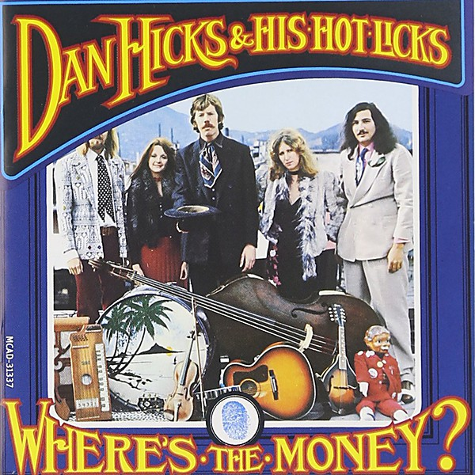

# Where's The Money?

By **Dan Hicks and The Hot Licks**

## Album Data

- **Catalog:** Beets
- **Format:** Digital, Album
- **Album:** Where's The Money?
- **Artist:** Dan Hicks And The Hot Licks
- **Albumartist:** Dan Hicks and The Hot Licks
- **Genre:** Boogie
- **MusicBrainz Album Artist ID:** [536b108a-9887-49f9-bd35-96d0840daaf0](https://musicbrainz.org/artist/536b108a-9887-49f9-bd35-96d0840daaf0)
- **MusicBrainz Album ID:** [2523cc55-c627-4195-aa8a-4d75bc0cd53d](https://musicbrainz.org/release/2523cc55-c627-4195-aa8a-4d75bc0cd53d)
- **MusicBrainz Release Group ID:** [81fef8dc-6057-3864-a6b8-bc2f1b422c93](https://musicbrainz.org/release-group/81fef8dc-6057-3864-a6b8-bc2f1b422c93)
- **Year:** 2021
- **Catalog #:** 
- **Label:** Geffen Records
- **Total Tracks:** 12

## Album Tracks

### Track 01 - I Feel Like Singing

- **Artist:** Dan Hicks and The Hot Licks
- **Format:** AAC
- **Genre:** Western Swing
- **Length:** 3:03
- **MusicBrainz Track ID:** [66be22a3-a6b5-4a01-8f24-80309805146d](https://musicbrainz.org/recording/66be22a3-a6b5-4a01-8f24-80309805146d)
- **Title:** I Feel Like Singing
- **Track:** 01
- **Year:** 2021

### Track 02 - Coast to Coast

- **Artist:** Dan Hicks and The Hot Licks
- **Format:** AAC
- **Genre:** Boogie
- **Length:** 2:45
- **MusicBrainz Track ID:** [1b7d3b24-7235-4487-bbb4-c9c3b46ba75f](https://musicbrainz.org/recording/1b7d3b24-7235-4487-bbb4-c9c3b46ba75f)
- **Title:** Coast to Coast
- **Track:** 02
- **Year:** 2021

### Track 03 - News From Up the Street

- **Artist:** Dan Hicks and The Hot Licks
- **Format:** AAC
- **Genre:** Boogie
- **Length:** 4:55
- **MusicBrainz Track ID:** [a03c7255-9d74-45b1-8f1f-7dfc219e1b64](https://musicbrainz.org/recording/a03c7255-9d74-45b1-8f1f-7dfc219e1b64)
- **Title:** News From Up the Street
- **Track:** 03
- **Year:** 2021

### Track 04 - Where's the Money?

- **Artist:** Dan Hicks and The Hot Licks
- **Format:** AAC
- **Genre:** Boogie
- **Length:** 2:59
- **MusicBrainz Track ID:** [cf19de14-12dd-4a4f-acb9-b78d24165d89](https://musicbrainz.org/recording/cf19de14-12dd-4a4f-acb9-b78d24165d89)
- **Title:** Where's the Money?
- **Track:** 04
- **Year:** 2021

### Track 05 - Caught in the Rain

- **Artist:** Dan Hicks and The Hot Licks
- **Format:** AAC
- **Genre:** Boogie
- **Length:** 3:08
- **MusicBrainz Track ID:** [a4986c09-ee24-4a20-be1f-bb9d18b6cfd4](https://musicbrainz.org/recording/a4986c09-ee24-4a20-be1f-bb9d18b6cfd4)
- **Title:** Caught in the Rain
- **Track:** 05
- **Year:** 2021

### Track 06 - Shorty Falls in Love

- **Artist:** Dan Hicks and The Hot Licks
- **Format:** AAC
- **Genre:** Boogie
- **Length:** 2:57
- **MusicBrainz Track ID:** [9eb14f78-9684-4178-9964-ccd1a95f54ff](https://musicbrainz.org/recording/9eb14f78-9684-4178-9964-ccd1a95f54ff)
- **Title:** Shorty Falls in Love
- **Track:** 06
- **Year:** 2021

### Track 07 - By Hook or by Crook

- **Artist:** Dan Hicks and The Hot Licks
- **Format:** AAC
- **Genre:** Boogie
- **Length:** 3:30
- **MusicBrainz Track ID:** [b2754795-67e9-41dd-9967-7ef77ea2e533](https://musicbrainz.org/recording/b2754795-67e9-41dd-9967-7ef77ea2e533)
- **Title:** By Hook or by Crook
- **Track:** 07
- **Year:** 2021

### Track 08 - Reelin' Down

- **Artist:** Dan Hicks and The Hot Licks
- **Format:** AAC
- **Genre:** Boogie
- **Length:** 3:19
- **MusicBrainz Track ID:** [86259b77-1ce6-4be2-be0c-7a6156744a8b](https://musicbrainz.org/recording/86259b77-1ce6-4be2-be0c-7a6156744a8b)
- **Title:** Reelin' Down
- **Track:** 08
- **Year:** 2021

### Track 09 - The Buzzard Was Their Friend

- **Artist:** Dan Hicks and The Hot Licks
- **Format:** AAC
- **Genre:** Boogie
- **Length:** 3:03
- **MusicBrainz Track ID:** [e2726358-d1f8-474d-ae54-8bb4f4f1e7b7](https://musicbrainz.org/recording/e2726358-d1f8-474d-ae54-8bb4f4f1e7b7)
- **Title:** The Buzzard Was Their Friend
- **Track:** 09
- **Year:** 2021

### Track 10 - Traffic Jam

- **Artist:** Dan Hicks and The Hot Licks
- **Format:** AAC
- **Genre:** Boogie
- **Length:** 3:27
- **MusicBrainz Track ID:** [8eb37656-114e-425b-a2db-e6f40bf0b95d](https://musicbrainz.org/recording/8eb37656-114e-425b-a2db-e6f40bf0b95d)
- **Title:** Traffic Jam
- **Track:** 10
- **Year:** 2021

### Track 11 - Is This My Happy Home?

- **Artist:** Dan Hicks and The Hot Licks
- **Format:** AAC
- **Genre:** Boogie
- **Length:** 3:54
- **MusicBrainz Track ID:** [ef92ac35-efe3-43e6-9e55-7219bdd4e58c](https://musicbrainz.org/recording/ef92ac35-efe3-43e6-9e55-7219bdd4e58c)
- **Title:** Is This My Happy Home?
- **Track:** 11
- **Year:** 2021

### Track 12 - Dig a Little Deeper

- **Artist:** Dan Hicks and The Hot Licks
- **Format:** AAC
- **Genre:** Boogie
- **Length:** 3:18
- **MusicBrainz Track ID:** [33d7a45f-ba5b-4cd0-8990-3ff8c4e4a1fa](https://musicbrainz.org/recording/33d7a45f-ba5b-4cd0-8990-3ff8c4e4a1fa)
- **Title:** Dig a Little Deeper
- **Track:** 12
- **Year:** 2021

