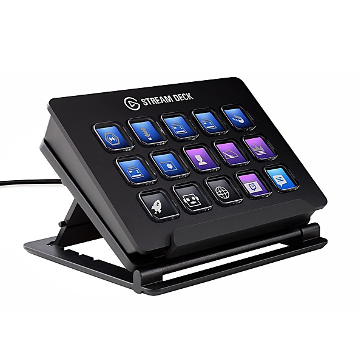

# Best of Bootie 2009 v.2

By **Dan Mei & Marc Johnce**

## Album Data

- **Catalog:** Beets
- **Format:** Digital, Album
- **Album:** Best of Bootie 2009 v.2
- **Artist:** Dan Mei & Marc Johnce
- **Albumartist:** Dan Mei & Marc Johnce
- **Genre:** Unknown
- **MusicBrainz Album Artist ID:** 
- **MusicBrainz Album ID:** 
- **MusicBrainz Release Group ID:** 
- **Year:** 2009
- **Catalog #:** 
- **Label:** 
- **Total Tracks:** 22

## Album Tracks

### Track 12 - My Life on the Crazy Train Sucks (So What?) (Kelly Clarkson vs. Ozzy Osbourne vs. Pink vs. Daft Punk)

- **Artist:** Dan Mei & Marc Johnce
- **Format:** MP3
- **Genre:** Unknown
- **Length:** 3:30
- **MusicBrainz Track ID:** [7d04f6be-c0c1-4a9e-81c7-510c293053c3](https://musicbrainz.org/recording/7d04f6be-c0c1-4a9e-81c7-510c293053c3)
- **Title:** My Life on the Crazy Train Sucks (So What?) (Kelly Clarkson vs. Ozzy Osbourne vs. Pink vs. Daft Punk)
- **Track:** 12
- **Year:** 2009

### Track 22 - Chasing Cars That Way (Backstreet Boys vs. Snow Patrol)

- **Artist:** Dan Mei & Marc Johnce
- **Format:** MP3
- **Genre:** Unknown
- **Length:** 4:07
- **MusicBrainz Track ID:** [3d7efac1-0311-4fdc-9d76-5067d98f058c](https://musicbrainz.org/recording/3d7efac1-0311-4fdc-9d76-5067d98f058c)
- **Title:** Chasing Cars That Way (Backstreet Boys vs. Snow Patrol)
- **Track:** 22
- **Year:** 2009

