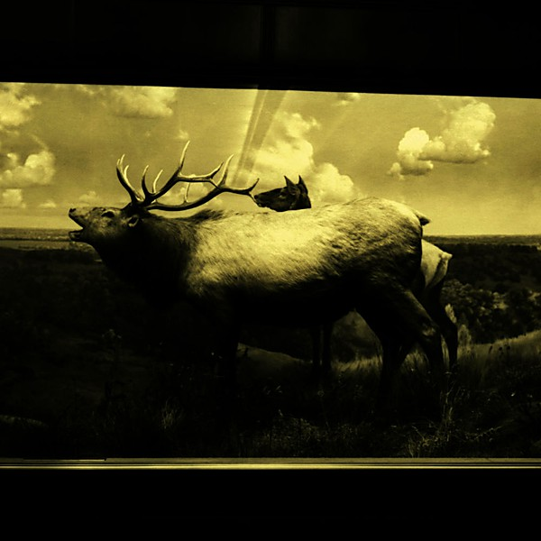

# The Snow Magic

By **Dark Dark Dark**

## Album Data

- **Catalog:** Beets
- **Format:** Digital, Album
- **Album:** The Snow Magic
- **Artist:** Dark Dark Dark
- **Albumartist:** Dark Dark Dark
- **Genre:** Americana
- **MusicBrainz Album Artist ID:** 
- **MusicBrainz Album ID:** 
- **MusicBrainz Release Group ID:** 
- **Year:** 0000
- **Catalog #:** 
- **Label:** 
- **Total Tracks:** 14

## Album Tracks

### Track 01 - Ashes

- **Artist:** Dark Dark Dark
- **Format:** MP3
- **Genre:** Americana
- **Length:** 1:13
- **MusicBrainz Track ID:** 
- **Title:** Ashes
- **Track:** 01
- **Year:** 0000

### Track 02 - Ashes

- **Artist:** Dark Dark Dark
- **Format:** MP3
- **Genre:** Americana
- **Length:** 3:11
- **MusicBrainz Track ID:** 
- **Title:** Ashes
- **Track:** 02
- **Year:** 0000

### Track 03 - Benefit of the Doubt

- **Artist:** Dark Dark Dark
- **Format:** MP3
- **Genre:** Indie Folk
- **Length:** 3:58
- **MusicBrainz Track ID:** 
- **Title:** Benefit of the Doubt
- **Track:** 03
- **Year:** 0000

### Track 04 - A Cloud Story

- **Artist:** Dark Dark Dark
- **Format:** MP3
- **Genre:** Americana
- **Length:** 4:34
- **MusicBrainz Track ID:** 
- **Title:** A Cloud Story
- **Track:** 04
- **Year:** 0000

### Track 05 - Colors

- **Artist:** Dark Dark Dark
- **Format:** MP3
- **Genre:** Indie Folk
- **Length:** 4:53
- **MusicBrainz Track ID:** 
- **Title:** Colors
- **Track:** 05
- **Year:** 0000

### Track 06 - Dig A Grave

- **Artist:** Dark Dark Dark
- **Format:** MP3
- **Genre:** Indie Folk
- **Length:** 5:18
- **MusicBrainz Track ID:** 
- **Title:** Dig A Grave
- **Track:** 06
- **Year:** 0000

### Track 07 - Ferment In Dm

- **Artist:** Dark Dark Dark
- **Format:** MP3
- **Genre:** Americana
- **Length:** 3:52
- **MusicBrainz Track ID:** 
- **Title:** Ferment In Dm
- **Track:** 07
- **Year:** 0000

### Track 08 - Junk Bones

- **Artist:** Dark Dark Dark
- **Format:** MP3
- **Genre:** Indie Pop
- **Length:** 2:47
- **MusicBrainz Track ID:** 
- **Title:** Junk Bones
- **Track:** 08
- **Year:** 0000

### Track 09 - New York Song

- **Artist:** Dark Dark Dark
- **Format:** MP3
- **Genre:** Indie Folk
- **Length:** 3:37
- **MusicBrainz Track ID:** 
- **Title:** New York Song
- **Track:** 09
- **Year:** 0000

### Track 10 - A Spell For Letting Go

- **Artist:** Dark Dark Dark
- **Format:** MP3
- **Genre:** Indie Folk
- **Length:** 3:02
- **MusicBrainz Track ID:** 
- **Title:** A Spell For Letting Go
- **Track:** 10
- **Year:** 0000

### Track 11 - That Light

- **Artist:** Dark Dark Dark
- **Format:** MP3
- **Genre:** Americana
- **Length:** 3:34
- **MusicBrainz Track ID:** 
- **Title:** That Light
- **Track:** 11
- **Year:** 0000

### Track 12 - Trouble No More

- **Artist:** Dark Dark Dark
- **Format:** MP3
- **Genre:** Americana
- **Length:** 4:43
- **MusicBrainz Track ID:** 
- **Title:** Trouble No More
- **Track:** 12
- **Year:** 0000

### Track 13 - Winter Coat

- **Artist:** Dark Dark Dark
- **Format:** MP3
- **Genre:** Indie Folk
- **Length:** 3:03
- **MusicBrainz Track ID:** 
- **Title:** Winter Coat
- **Track:** 13
- **Year:** 0000

### Track 14 - All The Things

- **Artist:** Dark Dark Dark
- **Format:** MP3
- **Genre:** Indie Folk
- **Length:** 4:01
- **MusicBrainz Track ID:** 
- **Title:** All The Things
- **Track:** 14
- **Year:** 0000

