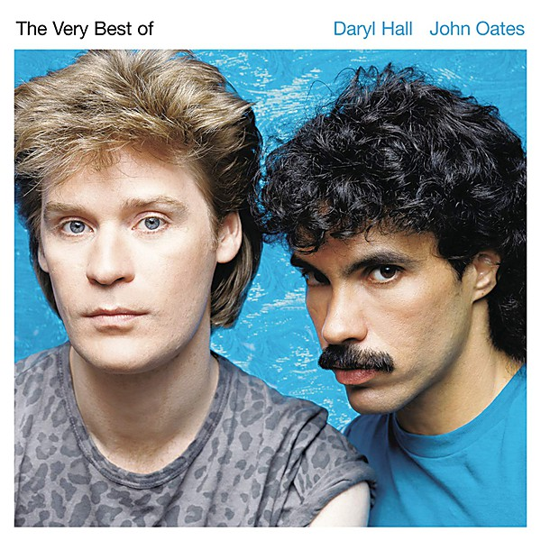

# The Very Best of Daryl Hall & John Oates

By **Daryl Hall & John Oates**

## Album Data

- **Catalog:** Beets
- **Format:** Digital, Album
- **Album:** The Very Best of Daryl Hall & John Oates
- **Artist:** Daryl Hall & John Oates
- **Albumartist:** Daryl Hall & John Oates
- **Genre:** Blue-Eyed Soul
- **MusicBrainz Album Artist ID:** [debabff3-2559-46e5-862d-ef2a906d7010](https://musicbrainz.org/artist/debabff3-2559-46e5-862d-ef2a906d7010)
- **MusicBrainz Album ID:** [8c531ff6-8984-430c-b0ed-a3c583413981](https://musicbrainz.org/release/8c531ff6-8984-430c-b0ed-a3c583413981)
- **MusicBrainz Release Group ID:** [f5344bda-31a7-3500-981f-4c84805c16ec](https://musicbrainz.org/release-group/f5344bda-31a7-3500-981f-4c84805c16ec)
- **Year:** 2001
- **Catalog #:** 07863 69319-2
- **Label:** RCA
- **Total Tracks:** 18

## Album Tracks

### Track 01 - Sara Smile

- **Artist:** Daryl Hall & John Oates
- **Format:** MP3
- **Genre:** Blue-Eyed Soul
- **Length:** 3:06
- **MusicBrainz Track ID:** [9dad909a-84ab-4528-bdc0-23375708c180](https://musicbrainz.org/recording/9dad909a-84ab-4528-bdc0-23375708c180)
- **Title:** Sara Smile
- **Track:** 01
- **Year:** 2001

### Track 02 - Rich Girl

- **Artist:** Daryl Hall & John Oates
- **Format:** MP3
- **Genre:** Soul
- **Length:** 2:25
- **MusicBrainz Track ID:** [eaaf5c69-b3f5-494f-bdb5-5bf0510a5cfc](https://musicbrainz.org/recording/eaaf5c69-b3f5-494f-bdb5-5bf0510a5cfc)
- **Title:** Rich Girl
- **Track:** 02
- **Year:** 2001

### Track 03 - It’s a Laugh (single version)

- **Artist:** Daryl Hall & John Oates
- **Format:** MP3
- **Genre:** Blue-Eyed Soul
- **Length:** 3:45
- **MusicBrainz Track ID:** [3a0f333c-bfd9-4f1b-bc51-5ceb7a59701b](https://musicbrainz.org/recording/3a0f333c-bfd9-4f1b-bc51-5ceb7a59701b)
- **Title:** It’s a Laugh (single version)
- **Track:** 03
- **Year:** 2001

### Track 04 - Wait for Me

- **Artist:** Daryl Hall & John Oates
- **Format:** MP3
- **Genre:** Blue-Eyed Soul
- **Length:** 4:05
- **MusicBrainz Track ID:** [3ca38c58-811f-4353-a1d2-b3971a9a1305](https://musicbrainz.org/recording/3ca38c58-811f-4353-a1d2-b3971a9a1305)
- **Title:** Wait for Me
- **Track:** 04
- **Year:** 2001

### Track 05 - You’ve Lost That Lovin’ Feeling

- **Artist:** Daryl Hall & John Oates
- **Format:** MP3
- **Genre:** Blue-Eyed Soul
- **Length:** 4:36
- **MusicBrainz Track ID:** [cc27c0f9-d297-4987-a69f-89a2a4b39152](https://musicbrainz.org/recording/cc27c0f9-d297-4987-a69f-89a2a4b39152)
- **Title:** You’ve Lost That Lovin’ Feeling
- **Track:** 05
- **Year:** 2001

### Track 06 - Kiss on My List

- **Artist:** Daryl Hall & John Oates
- **Format:** MP3
- **Genre:** Soft Rock
- **Length:** 4:16
- **MusicBrainz Track ID:** [4d8c74f9-4b81-423c-8822-f40ecaa4f940](https://musicbrainz.org/recording/4d8c74f9-4b81-423c-8822-f40ecaa4f940)
- **Title:** Kiss on My List
- **Track:** 06
- **Year:** 2001

### Track 07 - You Make My Dreams

- **Artist:** Daryl Hall & John Oates
- **Format:** MP3
- **Genre:** Soul
- **Length:** 3:07
- **MusicBrainz Track ID:** [db3fbde4-9f06-4af9-854b-96d6c1b41df0](https://musicbrainz.org/recording/db3fbde4-9f06-4af9-854b-96d6c1b41df0)
- **Title:** You Make My Dreams
- **Track:** 07
- **Year:** 2001

### Track 08 - Private Eyes

- **Artist:** Daryl Hall & John Oates
- **Format:** MP3
- **Genre:** Soft Rock
- **Length:** 3:37
- **MusicBrainz Track ID:** [d6ed4759-0f9c-420f-8256-3f1ab854bbc1](https://musicbrainz.org/recording/d6ed4759-0f9c-420f-8256-3f1ab854bbc1)
- **Title:** Private Eyes
- **Track:** 08
- **Year:** 2001

### Track 09 - I Can’t Go for That (No Can Do)

- **Artist:** Daryl Hall & John Oates
- **Format:** MP3
- **Genre:** Blue-Eyed Soul
- **Length:** 5:09
- **MusicBrainz Track ID:** [1f6eaa57-5298-4c8b-94cd-1903f40f34c3](https://musicbrainz.org/recording/1f6eaa57-5298-4c8b-94cd-1903f40f34c3)
- **Title:** I Can’t Go for That (No Can Do)
- **Track:** 09
- **Year:** 2001

### Track 10 - Did It in a Minute

- **Artist:** Daryl Hall & John Oates
- **Format:** MP3
- **Genre:** Blue-Eyed Soul
- **Length:** 3:37
- **MusicBrainz Track ID:** [4f4bc2eb-b935-4575-95a8-a02281929cc1](https://musicbrainz.org/recording/4f4bc2eb-b935-4575-95a8-a02281929cc1)
- **Title:** Did It in a Minute
- **Track:** 10
- **Year:** 2001

### Track 11 - Maneater

- **Artist:** Daryl Hall & John Oates
- **Format:** MP3
- **Genre:** Blue-Eyed Soul
- **Length:** 4:32
- **MusicBrainz Track ID:** [d84143a8-b7fc-4bba-91ff-b354cb3cebfa](https://musicbrainz.org/recording/d84143a8-b7fc-4bba-91ff-b354cb3cebfa)
- **Title:** Maneater
- **Track:** 11
- **Year:** 2001

### Track 12 - One on One

- **Artist:** Daryl Hall & John Oates
- **Format:** MP3
- **Genre:** Soul
- **Length:** 4:17
- **MusicBrainz Track ID:** [a6b910b4-6474-4bba-a8da-7ce7b4369cb5](https://musicbrainz.org/recording/a6b910b4-6474-4bba-a8da-7ce7b4369cb5)
- **Title:** One on One
- **Track:** 12
- **Year:** 2001

### Track 13 - Family Man

- **Artist:** Daryl Hall & John Oates
- **Format:** MP3
- **Genre:** Blue-Eyed Soul
- **Length:** 3:25
- **MusicBrainz Track ID:** [9d45e226-201c-47fc-a8d8-fcc080180804](https://musicbrainz.org/recording/9d45e226-201c-47fc-a8d8-fcc080180804)
- **Title:** Family Man
- **Track:** 13
- **Year:** 2001

### Track 14 - Say It Isn’t So

- **Artist:** Daryl Hall & John Oates
- **Format:** MP3
- **Genre:** Blue-Eyed Soul
- **Length:** 4:17
- **MusicBrainz Track ID:** [fa440c67-f13f-482e-ab83-e9d89b32513b](https://musicbrainz.org/recording/fa440c67-f13f-482e-ab83-e9d89b32513b)
- **Title:** Say It Isn’t So
- **Track:** 14
- **Year:** 2001

### Track 15 - Adult Education (promotional 12″)

- **Artist:** Daryl Hall & John Oates
- **Format:** MP3
- **Genre:** Blue-Eyed Soul
- **Length:** 4:34
- **MusicBrainz Track ID:** [770bbd36-6b8a-44bf-a380-b1aa93142220](https://musicbrainz.org/recording/770bbd36-6b8a-44bf-a380-b1aa93142220)
- **Title:** Adult Education (promotional 12″)
- **Track:** 15
- **Year:** 2001

### Track 16 - Out of Touch (single version)

- **Artist:** Daryl Hall & John Oates
- **Format:** MP3
- **Genre:** Rock
- **Length:** 4:09
- **MusicBrainz Track ID:** [966aa2c5-2d9a-4a58-b96e-62e7540b18c7](https://musicbrainz.org/recording/966aa2c5-2d9a-4a58-b96e-62e7540b18c7)
- **Title:** Out of Touch (single version)
- **Track:** 16
- **Year:** 2001

### Track 17 - Method of Modern Love

- **Artist:** Daryl Hall & John Oates
- **Format:** MP3
- **Genre:** Pop
- **Length:** 5:33
- **MusicBrainz Track ID:** [09b0b26f-1c71-4c2d-9114-6874a6e1cf59](https://musicbrainz.org/recording/09b0b26f-1c71-4c2d-9114-6874a6e1cf59)
- **Title:** Method of Modern Love
- **Track:** 17
- **Year:** 2001

### Track 18 - Some Things Are Better Left Unsaid

- **Artist:** Daryl Hall & John Oates
- **Format:** MP3
- **Genre:** Dance-Rock
- **Length:** 5:25
- **MusicBrainz Track ID:** [633ad7e3-72ad-4188-8482-bc01fe1f0d35](https://musicbrainz.org/recording/633ad7e3-72ad-4188-8482-bc01fe1f0d35)
- **Title:** Some Things Are Better Left Unsaid
- **Track:** 18
- **Year:** 2001

## See also

- [Vinyl: Bigger Than Both Of Us](../../Vinyl/Daryl_Hall_and_John_Oates/Bigger_Than_Both_Of_Us.md)
- [Vinyl: ](../../Vinyl/Daryl_Hall_and_John_Oates/Daryl_Hall_and_John_Oates.md)
