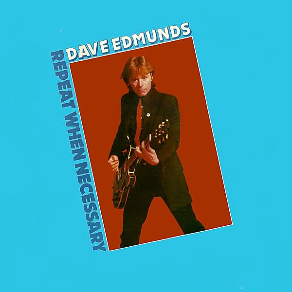

# Repeat When Necessary

By **Dave Edmunds**

## Album Data

- **Catalog:** Beets
- **Format:** Digital, Album
- **Album:** Repeat When Necessary
- **Artist:** Dave Edmunds
- **Albumartist:** Dave Edmunds
- **Genre:** Rockabilly
- **MusicBrainz Album Artist ID:** [ec4b6d29-527c-4cc0-89bb-8a4775f350d0](https://musicbrainz.org/artist/ec4b6d29-527c-4cc0-89bb-8a4775f350d0)
- **MusicBrainz Album ID:** [008d0260-e655-4b2c-94a7-bef967c48a75](https://musicbrainz.org/release/008d0260-e655-4b2c-94a7-bef967c48a75)
- **MusicBrainz Release Group ID:** [17b6f43e-0f1b-3e24-84e7-c01ae0dbc047](https://musicbrainz.org/release-group/17b6f43e-0f1b-3e24-84e7-c01ae0dbc047)
- **Year:** 2020
- **Catalog #:** 
- **Label:** President Records
- **Total Tracks:** 11

## Album Tracks

### Track 01 - Girls Talk

- **Artist:** Dave Edmunds
- **Format:** AAC
- **Genre:** Power Pop
- **Length:** 3:29
- **MusicBrainz Track ID:** [60fad146-c2a5-474e-b604-2687fa4682cb](https://musicbrainz.org/recording/60fad146-c2a5-474e-b604-2687fa4682cb)
- **Title:** Girls Talk
- **Track:** 01
- **Year:** 2020

### Track 02 - Crawling from the Wreckage

- **Artist:** Dave Edmunds
- **Format:** AAC
- **Genre:** Rockabilly
- **Length:** 2:56
- **MusicBrainz Track ID:** [21d42258-5c6a-42d7-acf7-cd341a831aad](https://musicbrainz.org/recording/21d42258-5c6a-42d7-acf7-cd341a831aad)
- **Title:** Crawling from the Wreckage
- **Track:** 02
- **Year:** 2020

### Track 03 - The Creature from the Black Lagoon

- **Artist:** Dave Edmunds
- **Format:** AAC
- **Genre:** Power Pop
- **Length:** 3:45
- **MusicBrainz Track ID:** [0d8e61d9-9ab4-49e3-bf58-50b8c3143f0e](https://musicbrainz.org/recording/0d8e61d9-9ab4-49e3-bf58-50b8c3143f0e)
- **Title:** The Creature from the Black Lagoon
- **Track:** 03
- **Year:** 2020

### Track 04 - Sweet Little Lisa

- **Artist:** Dave Edmunds
- **Format:** AAC
- **Genre:** Rock And Roll
- **Length:** 3:42
- **MusicBrainz Track ID:** [6ea7d847-c2c2-432d-913b-64f160e439d9](https://musicbrainz.org/recording/6ea7d847-c2c2-432d-913b-64f160e439d9)
- **Title:** Sweet Little Lisa
- **Track:** 04
- **Year:** 2020

### Track 05 - Dynamite

- **Artist:** Dave Edmunds
- **Format:** AAC
- **Genre:** Rock
- **Length:** 2:36
- **MusicBrainz Track ID:** [2a93535e-7de5-4546-b7a8-ae8ae3f3fbeb](https://musicbrainz.org/recording/2a93535e-7de5-4546-b7a8-ae8ae3f3fbeb)
- **Title:** Dynamite
- **Track:** 05
- **Year:** 2020

### Track 06 - Queen of Hearts

- **Artist:** Dave Edmunds
- **Format:** AAC
- **Genre:** Rock
- **Length:** 3:21
- **MusicBrainz Track ID:** [ca2dca2b-e3c5-498a-8e8b-34948aedc9db](https://musicbrainz.org/recording/ca2dca2b-e3c5-498a-8e8b-34948aedc9db)
- **Title:** Queen of Hearts
- **Track:** 06
- **Year:** 2020

### Track 07 - Home in My Hand

- **Artist:** Dave Edmunds
- **Format:** AAC
- **Genre:** Rockabilly
- **Length:** 3:22
- **MusicBrainz Track ID:** [09ae4f14-320a-4bef-aca7-4c64c2351d86](https://musicbrainz.org/recording/09ae4f14-320a-4bef-aca7-4c64c2351d86)
- **Title:** Home in My Hand
- **Track:** 07
- **Year:** 2020

### Track 08 - Goodbye Mr. Good Guy

- **Artist:** Dave Edmunds
- **Format:** AAC
- **Genre:** Rockabilly
- **Length:** 2:45
- **MusicBrainz Track ID:** [5af770bf-db41-4e9f-be4e-90e90d8bdc67](https://musicbrainz.org/recording/5af770bf-db41-4e9f-be4e-90e90d8bdc67)
- **Title:** Goodbye Mr. Good Guy
- **Track:** 08
- **Year:** 2020

### Track 09 - Take Me for a Little While

- **Artist:** Dave Edmunds
- **Format:** AAC
- **Genre:** Soft Rock
- **Length:** 2:42
- **MusicBrainz Track ID:** [f8ccf778-9210-45b9-8c63-aa8f04c8084b](https://musicbrainz.org/recording/f8ccf778-9210-45b9-8c63-aa8f04c8084b)
- **Title:** Take Me for a Little While
- **Track:** 09
- **Year:** 2020

### Track 10 - We Were Both Wrong

- **Artist:** Dave Edmunds
- **Format:** AAC
- **Genre:** Rockabilly
- **Length:** 2:46
- **MusicBrainz Track ID:** [5fb67a1e-5be0-4aec-8eb2-4d32eccfc9ee](https://musicbrainz.org/recording/5fb67a1e-5be0-4aec-8eb2-4d32eccfc9ee)
- **Title:** We Were Both Wrong
- **Track:** 10
- **Year:** 2020

### Track 11 - Bad Is Bad

- **Artist:** Dave Edmunds
- **Format:** AAC
- **Genre:** Rockabilly
- **Length:** 3:11
- **MusicBrainz Track ID:** [9963373b-b0df-4e1f-afe1-cc3f5dca4133](https://musicbrainz.org/recording/9963373b-b0df-4e1f-afe1-cc3f5dca4133)
- **Title:** Bad Is Bad
- **Track:** 11
- **Year:** 2020

