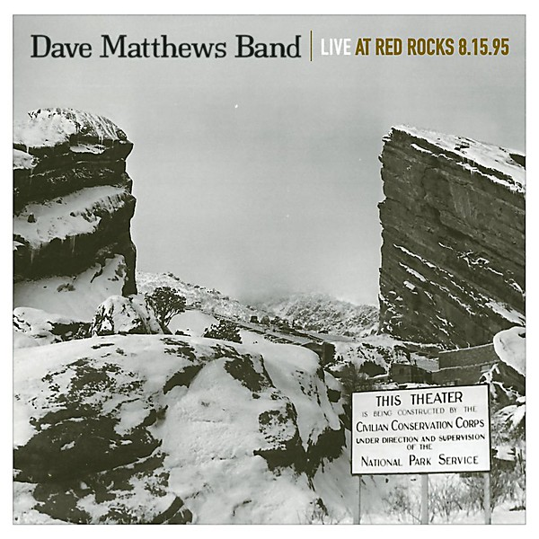

# Live at Red Rocks 8.15.95

By **Dave Matthews Band**

## Album Data

- **Catalog:** Beets
- **Format:** Digital, Album
- **Album:** Live at Red Rocks 8.15.95
- **Artist:** Dave Matthews Band
- **Albumartist:** Dave Matthews Band
- **Genre:** Americana
- **MusicBrainz Album Artist ID:** [07e748f1-075e-428d-85dc-ce3be434e906](https://musicbrainz.org/artist/07e748f1-075e-428d-85dc-ce3be434e906)
- **MusicBrainz Album ID:** [6a7f0256-30aa-4926-8992-586cc9c2ad93](https://musicbrainz.org/release/6a7f0256-30aa-4926-8992-586cc9c2ad93)
- **MusicBrainz Release Group ID:** [be121282-e352-3b81-aeb1-e495fd84c038](https://musicbrainz.org/release-group/be121282-e352-3b81-aeb1-e495fd84c038)
- **Year:** 2008
- **Catalog #:** 
- **Label:** Legacy
- **Total Tracks:** 17

## Album Tracks

### Track 01 - Seek Up

- **Artist:** Dave Matthews Band
- **Format:** ALAC
- **Genre:** Alternative Rock
- **Length:** 13:29
- **MusicBrainz Track ID:** [4c0e8e9c-1b22-4fa1-bda9-879952cdc47c](https://musicbrainz.org/recording/4c0e8e9c-1b22-4fa1-bda9-879952cdc47c)
- **Title:** Seek Up
- **Track:** 01
- **Year:** 2008

### Track 02 - Proudest Monkey

- **Artist:** Dave Matthews Band
- **Format:** ALAC
- **Genre:** Alternative Rock
- **Length:** 7:04
- **MusicBrainz Track ID:** [0a9af907-a1d9-4327-8d2b-db55a5f1a34d](https://musicbrainz.org/recording/0a9af907-a1d9-4327-8d2b-db55a5f1a34d)
- **Title:** Proudest Monkey
- **Track:** 02
- **Year:** 2008

### Track 03 - Satellite

- **Artist:** Dave Matthews Band
- **Format:** ALAC
- **Genre:** Alternative Rock
- **Length:** 5:07
- **MusicBrainz Track ID:** [69f4b6f6-71b6-4e5e-837b-4e4361e2db08](https://musicbrainz.org/recording/69f4b6f6-71b6-4e5e-837b-4e4361e2db08)
- **Title:** Satellite
- **Track:** 03
- **Year:** 2008

### Track 04 - Two Step

- **Artist:** Dave Matthews Band
- **Format:** ALAC
- **Genre:** Alternative Rock
- **Length:** 9:21
- **MusicBrainz Track ID:** [3ac0a2ed-8484-4c76-84b1-2622ff82e45a](https://musicbrainz.org/recording/3ac0a2ed-8484-4c76-84b1-2622ff82e45a)
- **Title:** Two Step
- **Track:** 04
- **Year:** 2008

### Track 05 - Best of What’s Around

- **Artist:** Dave Matthews Band
- **Format:** ALAC
- **Genre:** Americana
- **Length:** 6:18
- **MusicBrainz Track ID:** [440e2ae5-31b8-4ef2-9c03-593162a34c4f](https://musicbrainz.org/recording/440e2ae5-31b8-4ef2-9c03-593162a34c4f)
- **Title:** Best of What’s Around
- **Track:** 05
- **Year:** 2008

### Track 06 - Recently

- **Artist:** Dave Matthews Band
- **Format:** ALAC
- **Genre:** Alternative Rock
- **Length:** 6:12
- **MusicBrainz Track ID:** [3daa0595-0594-4add-95f1-ccf136639661](https://musicbrainz.org/recording/3daa0595-0594-4add-95f1-ccf136639661)
- **Title:** Recently
- **Track:** 06
- **Year:** 2008

### Track 07 - Lie in Our Graves

- **Artist:** Dave Matthews Band
- **Format:** ALAC
- **Genre:** Soft Rock
- **Length:** 8:19
- **MusicBrainz Track ID:** [bbf0f762-86c2-4c65-8c70-91e34ed8ebee](https://musicbrainz.org/recording/bbf0f762-86c2-4c65-8c70-91e34ed8ebee)
- **Title:** Lie in Our Graves
- **Track:** 07
- **Year:** 2008

### Track 08 - Dancing Nancies

- **Artist:** Dave Matthews Band
- **Format:** ALAC
- **Genre:** Soft Rock
- **Length:** 9:12
- **MusicBrainz Track ID:** [a3ee9101-cef4-4a13-885b-b4d857b067db](https://musicbrainz.org/recording/a3ee9101-cef4-4a13-885b-b4d857b067db)
- **Title:** Dancing Nancies
- **Track:** 08
- **Year:** 2008

### Track 09 - Warehouse

- **Artist:** Dave Matthews Band
- **Format:** ALAC
- **Genre:** Alternative Rock
- **Length:** 8:04
- **MusicBrainz Track ID:** [22ae3aa0-5ce5-49a7-b630-3b8022f9e966](https://musicbrainz.org/recording/22ae3aa0-5ce5-49a7-b630-3b8022f9e966)
- **Title:** Warehouse
- **Track:** 09
- **Year:** 2008

### Track 10 - Tripping Billies

- **Artist:** Dave Matthews Band
- **Format:** ALAC
- **Genre:** Alternative Rock
- **Length:** 4:49
- **MusicBrainz Track ID:** [04501484-7023-447b-92cf-e6db2fb60d27](https://musicbrainz.org/recording/04501484-7023-447b-92cf-e6db2fb60d27)
- **Title:** Tripping Billies
- **Track:** 10
- **Year:** 2008

### Track 11 - Drive In, Drive Out

- **Artist:** Dave Matthews Band
- **Format:** ALAC
- **Genre:** Britpop
- **Length:** 6:20
- **MusicBrainz Track ID:** [7af854ad-20e7-4b30-9158-6fdd5e0e53bf](https://musicbrainz.org/recording/7af854ad-20e7-4b30-9158-6fdd5e0e53bf)
- **Title:** Drive In, Drive Out
- **Track:** 11
- **Year:** 2008

### Track 12 - Lover Lay Down

- **Artist:** Dave Matthews Band
- **Format:** ALAC
- **Genre:** Pop Rock
- **Length:** 6:22
- **MusicBrainz Track ID:** [32a778e5-de51-4fe3-a2eb-3d12a6d68028](https://musicbrainz.org/recording/32a778e5-de51-4fe3-a2eb-3d12a6d68028)
- **Title:** Lover Lay Down
- **Track:** 12
- **Year:** 2008

### Track 13 - Rhyme & Reason

- **Artist:** Dave Matthews Band
- **Format:** ALAC
- **Genre:** Progressive Rock
- **Length:** 7:03
- **MusicBrainz Track ID:** [c26a9e20-d0c7-4585-99fc-ec93297190f7](https://musicbrainz.org/recording/c26a9e20-d0c7-4585-99fc-ec93297190f7)
- **Title:** Rhyme & Reason
- **Track:** 13
- **Year:** 2008

### Track 14 - #36

- **Artist:** Dave Matthews Band
- **Format:** ALAC
- **Genre:** Progressive Rock
- **Length:** 12:55
- **MusicBrainz Track ID:** [3d088cbb-456b-48ea-8e22-de68826b57f3](https://musicbrainz.org/recording/3d088cbb-456b-48ea-8e22-de68826b57f3)
- **Title:** #36
- **Track:** 14
- **Year:** 2008

### Track 15 - Ants Marching

- **Artist:** Dave Matthews Band
- **Format:** ALAC
- **Genre:** Alternative Rock
- **Length:** 6:54
- **MusicBrainz Track ID:** [7e8ba188-bf0b-4186-8d96-cc66eb30bc8e](https://musicbrainz.org/recording/7e8ba188-bf0b-4186-8d96-cc66eb30bc8e)
- **Title:** Ants Marching
- **Track:** 15
- **Year:** 2008

### Track 16 - Typical Situation

- **Artist:** Dave Matthews Band
- **Format:** ALAC
- **Genre:** Alternative Rock
- **Length:** 7:01
- **MusicBrainz Track ID:** [ccc9a85b-1826-4981-bdec-eae3ac24b3f9](https://musicbrainz.org/recording/ccc9a85b-1826-4981-bdec-eae3ac24b3f9)
- **Title:** Typical Situation
- **Track:** 16
- **Year:** 2008

### Track 17 - All Along the Watchtower

- **Artist:** Dave Matthews Band
- **Format:** ALAC
- **Genre:** Alternative Rock
- **Length:** 6:57
- **MusicBrainz Track ID:** [26abcd85-4252-410a-b8a5-a8577bef7aa5](https://musicbrainz.org/recording/26abcd85-4252-410a-b8a5-a8577bef7aa5)
- **Title:** All Along the Watchtower
- **Track:** 17
- **Year:** 2008

