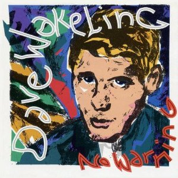

# No Warning

By **Dave Wakeling**

## Album Data

- **Catalog:** Beets
- **Format:** Digital, Album
- **Album:** No Warning
- **Artist:** Dave Wakeling
- **Albumartist:** Dave Wakeling
- **Genre:** Ska
- **MusicBrainz Album Artist ID:** [6356a56d-ce24-48aa-9d40-48613627bad1](https://musicbrainz.org/artist/6356a56d-ce24-48aa-9d40-48613627bad1)
- **MusicBrainz Album ID:** [c5943615-beb4-4ae8-8df5-d3ecd4c22a05](https://musicbrainz.org/release/c5943615-beb4-4ae8-8df5-d3ecd4c22a05)
- **MusicBrainz Release Group ID:** [3ceb4860-170e-35b4-90cc-62a3f4a40a69](https://musicbrainz.org/release-group/3ceb4860-170e-35b4-90cc-62a3f4a40a69)
- **Year:** 1991
- **Catalog #:** X2 13085
- **Label:** I.R.S. Records
- **Total Tracks:** 10

## Album Tracks

### Track 01 - I Want More

- **Artist:** Dave Wakeling
- **Format:** MP3
- **Genre:** Rock
- **Length:** 4:15
- **MusicBrainz Track ID:** [51d3160c-3334-4741-bd01-22c866f5702a](https://musicbrainz.org/recording/51d3160c-3334-4741-bd01-22c866f5702a)
- **Title:** I Want More
- **Track:** 01
- **Year:** 1991

### Track 02 - No Warning

- **Artist:** Dave Wakeling
- **Format:** MP3
- **Genre:** Ska
- **Length:** 4:52
- **MusicBrainz Track ID:** [99c4e386-823d-4c89-991d-3ede2ea70a7b](https://musicbrainz.org/recording/99c4e386-823d-4c89-991d-3ede2ea70a7b)
- **Title:** No Warning
- **Track:** 02
- **Year:** 1991

### Track 03 - Remember in the Dark

- **Artist:** Dave Wakeling
- **Format:** MP3
- **Genre:** Ska
- **Length:** 5:22
- **MusicBrainz Track ID:** [3b37ebaa-7a16-4a5e-bd5a-6878b848b956](https://musicbrainz.org/recording/3b37ebaa-7a16-4a5e-bd5a-6878b848b956)
- **Title:** Remember in the Dark
- **Track:** 03
- **Year:** 1991

### Track 04 - Everytime You Look at Me That Way

- **Artist:** Dave Wakeling
- **Format:** MP3
- **Genre:** Ska
- **Length:** 4:12
- **MusicBrainz Track ID:** [b2065917-338f-4133-89e4-5f8e350ea664](https://musicbrainz.org/recording/b2065917-338f-4133-89e4-5f8e350ea664)
- **Title:** Everytime You Look at Me That Way
- **Track:** 04
- **Year:** 1991

### Track 05 - Sensation

- **Artist:** Dave Wakeling
- **Format:** MP3
- **Genre:** Ska
- **Length:** 4:03
- **MusicBrainz Track ID:** [5b18da3e-2421-485b-899b-df0851bdbf92](https://musicbrainz.org/recording/5b18da3e-2421-485b-899b-df0851bdbf92)
- **Title:** Sensation
- **Track:** 05
- **Year:** 1991

### Track 06 - Freedom Fighter

- **Artist:** Dave Wakeling
- **Format:** MP3
- **Genre:** Ska
- **Length:** 5:52
- **MusicBrainz Track ID:** [1e894c72-6210-41ec-88cc-ad3917f12b35](https://musicbrainz.org/recording/1e894c72-6210-41ec-88cc-ad3917f12b35)
- **Title:** Freedom Fighter
- **Track:** 06
- **Year:** 1991

### Track 07 - One + One + One

- **Artist:** Dave Wakeling
- **Format:** MP3
- **Genre:** Ska
- **Length:** 5:14
- **MusicBrainz Track ID:** [1e79dce1-e9f3-4a8e-8242-14a479f295a7](https://musicbrainz.org/recording/1e79dce1-e9f3-4a8e-8242-14a479f295a7)
- **Title:** One + One + One
- **Track:** 07
- **Year:** 1991

### Track 08 - Sex With You

- **Artist:** Dave Wakeling
- **Format:** MP3
- **Genre:** Ska
- **Length:** 3:31
- **MusicBrainz Track ID:** [2a3652c2-913b-4124-ba2b-cd4a8fffc8e4](https://musicbrainz.org/recording/2a3652c2-913b-4124-ba2b-cd4a8fffc8e4)
- **Title:** Sex With You
- **Track:** 08
- **Year:** 1991

### Track 09 - I'm Not Ready

- **Artist:** Dave Wakeling
- **Format:** MP3
- **Genre:** Ska
- **Length:** 3:57
- **MusicBrainz Track ID:** [8654a117-00e8-46e9-9a17-8cd68a18aaa2](https://musicbrainz.org/recording/8654a117-00e8-46e9-9a17-8cd68a18aaa2)
- **Title:** I'm Not Ready
- **Track:** 09
- **Year:** 1991

### Track 10 - She's Having a Baby

- **Artist:** Dave Wakeling
- **Format:** MP3
- **Genre:** Ska
- **Length:** 3:44
- **MusicBrainz Track ID:** [c0453592-8d71-4338-8986-d1160fa42a9d](https://musicbrainz.org/recording/c0453592-8d71-4338-8986-d1160fa42a9d)
- **Title:** She's Having a Baby
- **Track:** 10
- **Year:** 1991

