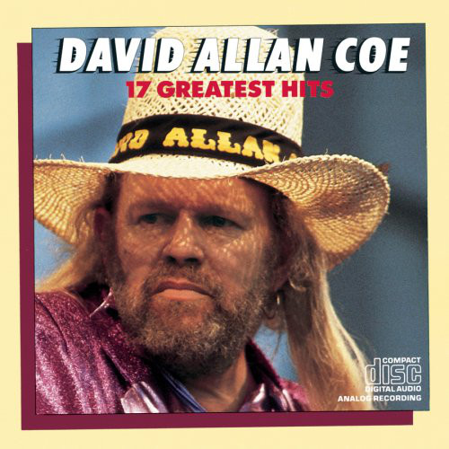

# 17 Greatest Hits

By **David Allan Coe**

## Album Data

- **Catalog:** Beets
- **Format:** Digital, Album
- **Album:** 17 Greatest Hits
- **Artist:** David Allan Coe
- **Albumartist:** David Allan Coe
- **Genre:** Southern Rock
- **MusicBrainz Album Artist ID:** [d6ad0ad1-2a7c-4d5f-8776-331a3732360c](https://musicbrainz.org/artist/d6ad0ad1-2a7c-4d5f-8776-331a3732360c)
- **MusicBrainz Album ID:** [f2f0c46b-722e-440d-909d-145b0bb14efe](https://musicbrainz.org/release/f2f0c46b-722e-440d-909d-145b0bb14efe)
- **MusicBrainz Release Group ID:** [322183d7-901e-3d2a-b11c-7990d0fb07d0](https://musicbrainz.org/release-group/322183d7-901e-3d2a-b11c-7990d0fb07d0)
- **Year:** 1985
- **Catalog #:** CK 40185
- **Label:** Columbia
- **Total Tracks:** 17

## Album Tracks

### Track 01 - She Used to Love Me a Lot

- **Artist:** David Allan Coe
- **Format:** ALAC
- **Genre:** Southern Rock
- **Length:** 3:04
- **MusicBrainz Track ID:** [5ca6c6eb-a9d8-483f-acab-70ffe479ba17](https://musicbrainz.org/recording/5ca6c6eb-a9d8-483f-acab-70ffe479ba17)
- **Title:** She Used to Love Me a Lot
- **Track:** 01
- **Year:** 1985

### Track 02 - Mona Lisa Lost Her Smile

- **Artist:** David Allan Coe
- **Format:** ALAC
- **Genre:** Outlaw Country
- **Length:** 3:40
- **MusicBrainz Track ID:** [ca202d0d-27e7-4bd6-8ead-d149e61e3463](https://musicbrainz.org/recording/ca202d0d-27e7-4bd6-8ead-d149e61e3463)
- **Title:** Mona Lisa Lost Her Smile
- **Track:** 02
- **Year:** 1985

### Track 03 - The Ride

- **Artist:** David Allan Coe
- **Format:** ALAC
- **Genre:** Outlaw Country
- **Length:** 3:08
- **MusicBrainz Track ID:** [3f3f7344-8518-457a-ab0b-948e8ada04b1](https://musicbrainz.org/recording/3f3f7344-8518-457a-ab0b-948e8ada04b1)
- **Title:** The Ride
- **Track:** 03
- **Year:** 1985

### Track 04 - Now I Lay Me Down to Cheat

- **Artist:** David Allan Coe
- **Format:** ALAC
- **Genre:** Outlaw Country
- **Length:** 3:25
- **MusicBrainz Track ID:** [5bd46cfa-5297-48bc-bd1b-7cc791917c84](https://musicbrainz.org/recording/5bd46cfa-5297-48bc-bd1b-7cc791917c84)
- **Title:** Now I Lay Me Down to Cheat
- **Track:** 04
- **Year:** 1985

### Track 05 - Tennessee Whiskey

- **Artist:** David Allan Coe
- **Format:** ALAC
- **Genre:** Outlaw Country
- **Length:** 2:59
- **MusicBrainz Track ID:** [baabd120-87a1-400f-9c9a-c44fb9a69b3f](https://musicbrainz.org/recording/baabd120-87a1-400f-9c9a-c44fb9a69b3f)
- **Title:** Tennessee Whiskey
- **Track:** 05
- **Year:** 1985

### Track 06 - If That Ain’t Country

- **Artist:** David Allan Coe
- **Format:** ALAC
- **Genre:** Southern Rock
- **Length:** 4:51
- **MusicBrainz Track ID:** [8c3731d1-ea9e-438d-89d6-23d1c76fd3e2](https://musicbrainz.org/recording/8c3731d1-ea9e-438d-89d6-23d1c76fd3e2)
- **Title:** If That Ain’t Country
- **Track:** 06
- **Year:** 1985

### Track 07 - Longhaired Redneck

- **Artist:** David Allan Coe
- **Format:** ALAC
- **Genre:** Outlaw Country
- **Length:** 3:23
- **MusicBrainz Track ID:** [e2022c99-bb56-4e3a-b06f-b18c030b9ab4](https://musicbrainz.org/recording/e2022c99-bb56-4e3a-b06f-b18c030b9ab4)
- **Title:** Longhaired Redneck
- **Track:** 07
- **Year:** 1985

### Track 08 - Jody Like a Melody

- **Artist:** David Allan Coe
- **Format:** ALAC
- **Genre:** Outlaw Country
- **Length:** 3:05
- **MusicBrainz Track ID:** [059a4de9-ec31-45df-a681-d4cbc885668e](https://musicbrainz.org/recording/059a4de9-ec31-45df-a681-d4cbc885668e)
- **Title:** Jody Like a Melody
- **Track:** 08
- **Year:** 1985

### Track 09 - Please Come to Boston

- **Artist:** David Allan Coe
- **Format:** ALAC
- **Genre:** Outlaw Country
- **Length:** 4:20
- **MusicBrainz Track ID:** [c5814ba9-90a3-40c4-9766-8357c49d4a5d](https://musicbrainz.org/recording/c5814ba9-90a3-40c4-9766-8357c49d4a5d)
- **Title:** Please Come to Boston
- **Track:** 09
- **Year:** 1985

### Track 10 - You Never Even Called Me by My Name

- **Artist:** David Allan Coe
- **Format:** ALAC
- **Genre:** Outlaw Country
- **Length:** 5:15
- **MusicBrainz Track ID:** [f1b384df-82c2-4b4b-aeaf-771e9e45981a](https://musicbrainz.org/recording/f1b384df-82c2-4b4b-aeaf-771e9e45981a)
- **Title:** You Never Even Called Me by My Name
- **Track:** 10
- **Year:** 1985

### Track 12 - Would You Lay With Me (in a Field of Stone)

- **Artist:** David Allan Coe
- **Format:** ALAC
- **Genre:** Outlaw Country
- **Length:** 2:52
- **MusicBrainz Track ID:** [7f2e58c7-fafa-4459-a89f-3f5a50f20d8c](https://musicbrainz.org/recording/7f2e58c7-fafa-4459-a89f-3f5a50f20d8c)
- **Title:** Would You Lay With Me (in a Field of Stone)
- **Track:** 12
- **Year:** 1985

### Track 13 - Jack Daniels, If You Please

- **Artist:** David Allan Coe
- **Format:** ALAC
- **Genre:** Humor
- **Length:** 3:18
- **MusicBrainz Track ID:** [4556878b-27da-46ff-855a-79a6a367c6c6](https://musicbrainz.org/recording/4556878b-27da-46ff-855a-79a6a367c6c6)
- **Title:** Jack Daniels, If You Please
- **Track:** 13
- **Year:** 1985

### Track 14 - Take This Job and Shove It

- **Artist:** David Allan Coe
- **Format:** ALAC
- **Genre:** Outlaw Country
- **Length:** 2:59
- **MusicBrainz Track ID:** [635025a7-b2e9-42ae-8414-9423f00fd7e1](https://musicbrainz.org/recording/635025a7-b2e9-42ae-8414-9423f00fd7e1)
- **Title:** Take This Job and Shove It
- **Track:** 14
- **Year:** 1985

### Track 15 - Wille, Waylon, and Me

- **Artist:** David Allan Coe
- **Format:** ALAC
- **Genre:** Southern Rock
- **Length:** 3:15
- **MusicBrainz Track ID:** [ad16a3f3-cd1a-422f-9c22-4b471abbeeaf](https://musicbrainz.org/recording/ad16a3f3-cd1a-422f-9c22-4b471abbeeaf)
- **Title:** Wille, Waylon, and Me
- **Track:** 15
- **Year:** 1985

### Track 16 - Pledging My Love

- **Artist:** David Allan Coe
- **Format:** ALAC
- **Genre:** Outlaw Country
- **Length:** 3:57
- **MusicBrainz Track ID:** [d56e2b99-64a6-4c80-bb22-0698b0d201f9](https://musicbrainz.org/recording/d56e2b99-64a6-4c80-bb22-0698b0d201f9)
- **Title:** Pledging My Love
- **Track:** 16
- **Year:** 1985

### Track 17 - Hank Williams Junior – Junior

- **Artist:** David Allan Coe with Dickey Betts & Kris Kristofferson
- **Format:** ALAC
- **Genre:** Southern Rock
- **Length:** 2:43
- **MusicBrainz Track ID:** [8d1fd5db-99b4-4881-b121-4f9c1f66c0e4](https://musicbrainz.org/recording/8d1fd5db-99b4-4881-b121-4f9c1f66c0e4)
- **Title:** Hank Williams Junior – Junior
- **Track:** 17
- **Year:** 1985

### Track 11 - This Bottle (in My Hand)

- **Artist:** David Allan Coe with George Jones
- **Format:** ALAC
- **Genre:** Outlaw Country
- **Length:** 2:51
- **MusicBrainz Track ID:** [399dbf34-bf04-4fb2-a547-c0b8b9f448c8](https://musicbrainz.org/recording/399dbf34-bf04-4fb2-a547-c0b8b9f448c8)
- **Title:** This Bottle (in My Hand)
- **Track:** 11
- **Year:** 1985

## See also

- [Roon: David Allan Coe - 16 Biggest Hits](../../Roon/David_Allan_Coe/David_Allan_Coe_-_16_Biggest_Hits.md)
