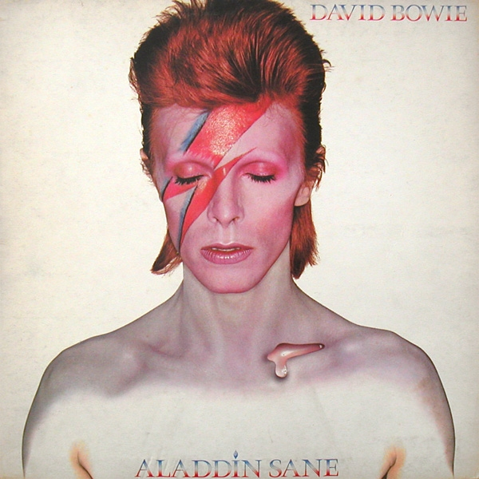

# Aladdin Sane

By **David Bowie**

## Album Data

- **Catalog:** Beets
- **Format:** Digital, Album
- **Album:** Aladdin Sane
- **Artist:** David Bowie
- **Albumartist:** David Bowie
- **Genre:** Glam Rock
- **MusicBrainz Album Artist ID:** [5441c29d-3602-4898-b1a1-b77fa23b8e50](https://musicbrainz.org/artist/5441c29d-3602-4898-b1a1-b77fa23b8e50)
- **MusicBrainz Album ID:** [68ba8f1e-8977-4b7c-8d96-dff798148717](https://musicbrainz.org/release/68ba8f1e-8977-4b7c-8d96-dff798148717)
- **MusicBrainz Release Group ID:** [50f8710f-3ae6-319b-85a7-afe783f13449](https://musicbrainz.org/release-group/50f8710f-3ae6-319b-85a7-afe783f13449)
- **Year:** 2013
- **Catalog #:** 
- **Label:** Parlophone Music Denmark
- **Total Tracks:** 11

## Album Tracks

### Track 01 - Space Oddity

- **Artist:** David Bowie
- **Format:** MP3
- **Genre:** Progressive Rock
- **Length:** 5:18
- **MusicBrainz Track ID:** [84649f3b-6da6-4da6-8e33-a7a990b69516](https://musicbrainz.org/recording/84649f3b-6da6-4da6-8e33-a7a990b69516)
- **Title:** Space Oddity
- **Track:** 01
- **Year:** 2016

### Track 02 - John, I’m Only Dancing

- **Artist:** David Bowie
- **Format:** MP3
- **Genre:** Blue-Eyed Soul
- **Length:** 2:46
- **MusicBrainz Track ID:** [0cf83641-0fe2-4a20-9527-6b87f261b3f0](https://musicbrainz.org/recording/0cf83641-0fe2-4a20-9527-6b87f261b3f0)
- **Title:** John, I’m Only Dancing
- **Track:** 02
- **Year:** 2016

### Track 03 - Changes

- **Artist:** David Bowie
- **Format:** MP3
- **Genre:** Glam Rock
- **Length:** 3:37
- **MusicBrainz Track ID:** [e7b022c5-bce7-4bee-8136-7889af2f4162](https://musicbrainz.org/recording/e7b022c5-bce7-4bee-8136-7889af2f4162)
- **Title:** Changes
- **Track:** 03
- **Year:** 2016

### Track 04 - Ziggy Stardust

- **Artist:** David Bowie
- **Format:** MP3
- **Genre:** Glam Rock
- **Length:** 3:13
- **MusicBrainz Track ID:** [a0ca0cc0-cc0d-431c-8a36-dd917ea0dfa2](https://musicbrainz.org/recording/a0ca0cc0-cc0d-431c-8a36-dd917ea0dfa2)
- **Title:** Ziggy Stardust
- **Track:** 04
- **Year:** 2016

### Track 05 - Suffragette City

- **Artist:** David Bowie
- **Format:** MP3
- **Genre:** Glam Rock
- **Length:** 3:28
- **MusicBrainz Track ID:** [4ce20795-0558-4302-943a-7f621f49aad6](https://musicbrainz.org/recording/4ce20795-0558-4302-943a-7f621f49aad6)
- **Title:** Suffragette City
- **Track:** 05
- **Year:** 2016

### Track 06 - The Jean Genie

- **Artist:** David Bowie
- **Format:** MP3
- **Genre:** Glam Rock
- **Length:** 4:08
- **MusicBrainz Track ID:** [f18b8945-9784-417a-bb43-53508b73d612](https://musicbrainz.org/recording/f18b8945-9784-417a-bb43-53508b73d612)
- **Title:** The Jean Genie
- **Track:** 06
- **Year:** 2016

### Track 07 - Diamond Dogs

- **Artist:** David Bowie
- **Format:** MP3
- **Genre:** Glam Rock
- **Length:** 6:06
- **MusicBrainz Track ID:** [e4f7bb95-3b9b-4d5c-ac71-df0585de00c6](https://musicbrainz.org/recording/e4f7bb95-3b9b-4d5c-ac71-df0585de00c6)
- **Title:** Diamond Dogs
- **Track:** 07
- **Year:** 2016

### Track 08 - Rebel Rebel

- **Artist:** David Bowie
- **Format:** MP3
- **Genre:** Glam Rock
- **Length:** 4:33
- **MusicBrainz Track ID:** [11bd860a-4447-4140-813d-64834ae02ca8](https://musicbrainz.org/recording/11bd860a-4447-4140-813d-64834ae02ca8)
- **Title:** Rebel Rebel
- **Track:** 08
- **Year:** 2016

### Track 09 - Young Americans

- **Artist:** David Bowie
- **Format:** MP3
- **Genre:** Blue-Eyed Soul
- **Length:** 5:13
- **MusicBrainz Track ID:** [dbb7b213-782b-432c-9cd9-0081e73765e9](https://musicbrainz.org/recording/dbb7b213-782b-432c-9cd9-0081e73765e9)
- **Title:** Young Americans
- **Track:** 09
- **Year:** 2016

### Track 10 - Fame

- **Artist:** David Bowie
- **Format:** MP3
- **Genre:** Uk Garage
- **Length:** 4:24
- **MusicBrainz Track ID:** [04c5d4a8-b6b7-4421-81ab-e5efb52d9197](https://musicbrainz.org/recording/04c5d4a8-b6b7-4421-81ab-e5efb52d9197)
- **Title:** Fame
- **Track:** 10
- **Year:** 2016

### Track 11 - Golden Years

- **Artist:** David Bowie
- **Format:** MP3
- **Genre:** Blue-Eyed Soul
- **Length:** 4:03
- **MusicBrainz Track ID:** [b615c13e-e745-477e-8fba-1c22e7f11166](https://musicbrainz.org/recording/b615c13e-e745-477e-8fba-1c22e7f11166)
- **Title:** Golden Years
- **Track:** 11
- **Year:** 2016

## See also

- [Best Of Bowie](Best_Of_Bowie.md)
- [Bowie At The Beeb [Disc 1]](Bowie_At_The_Beeb_[Disc_1].md)
- [Bowie At The Beeb [Disc 2]](Bowie_At_The_Beeb_[Disc_2].md)
- [Bowie At The Beeb [Disc 3]](Bowie_At_The_Beeb_[Disc_3].md)
- [ChangesOneBowie](ChangesOneBowie.md)
- [Cracked Actor (Live Los Angeles '74)](Cracked_Actor_Live_Los_Angeles_74.md)
- [Earthling](Earthling.md)
- [Heathen](Heathen.md)
- [Hunky Dory](Hunky_Dory.md)
- [Life On Mars 45](Life_On_Mars_45.md)
- [The Man Who Sold The World (2015 Remastered Version)](The_Man_Who_Sold_The_World_2015_Remastered_Version.md)
- [The Man Who Sold the World](The_Man_Who_Sold_the_World.md)
- [The Next Day Extra](The_Next_Day_Extra.md)
- [The Next Day](The_Next_Day.md)
- [Young Americans](Young_Americans.md)
- [CD: Bowie At The Beeb (Disc 3)](../../CD/David_Bowie/Bowie_At_The_Beeb_Disc_3.md)
- [CD: ](../../CD/David_Bowie/David_Bowie.md)
- [Roon: Aladdin Sane (2013 Remaster)](../../Roon/David_Bowie/Aladdin_Sane_2013_Remaster.md)
- [Roon: Bowie at the Beeb (The Best of the BBC Sessions 1968-1972)](../../Roon/David_Bowie/Bowie_at_the_Beeb_The_Best_of_the_BBC_Sessions_1968-1972.md)
- [Roon: Brilliant Adventure (1992 – 2001)](../../Roon/David_Bowie/Brilliant_Adventure_1992_–_2001.md)
- [Roon: ChangesOneBowie](../../Roon/David_Bowie/ChangesOneBowie.md)
- [Roon: Cracked Actor (Live, Los Angeles '74)](../../Roon/David_Bowie/Cracked_Actor_Live__Los_Angeles_74.md)
- [Roon: Diamond Dogs (2016 Remaster)](../../Roon/David_Bowie/Diamond_Dogs_2016_Remaster.md)
- [Roon: Glastonbury 2000 (Live)](../../Roon/David_Bowie/Glastonbury_2000_Live.md)
- [Roon: Hunky Dory (2015 Remaster)](../../Roon/David_Bowie/Hunky_Dory_2015_Remaster.md)
- [Roon: Low (2017 Remaster)](../../Roon/David_Bowie/Low_2017_Remaster.md)
- [Roon: Space Oddity (2019 Mix)](../../Roon/David_Bowie/Space_Oddity_2019_Mix.md)
- [Roon: Station to Station (2016 Remaster)](../../Roon/David_Bowie/Station_to_Station_2016_Remaster.md)
- [Roon: The Rise and Fall of Ziggy Stardust and the Spiders from Mars (2012 Remaster)](../../Roon/David_Bowie/The_Rise_and_Fall_of_Ziggy_Stardust_and_the_Spiders_from_Mars_2012_Remaster.md)
- [Roon: Toy (Toy](../../Roon/David_Bowie/Toy_Toy-Box.md)
- [Roon: Young Americans (2016 Remaster)](../../Roon/David_Bowie/Young_Americans_2016_Remaster.md)
- [Vinyl: Aladdin Sane](../../Vinyl/David_Bowie/Aladdin_Sane.md)
- [Vinyl: ChangesOneBowie](../../Vinyl/David_Bowie/ChangesOneBowie.md)
- [Vinyl: Cracked Actor (Live Los Angeles '74)](../../Vinyl/David_Bowie/Cracked_Actor_Live_Los_Angeles_74.md)
- [Vinyl: ](../../Vinyl/David_Bowie/David_Bowie_index.md)
- [Vinyl: David Bowie](../../Vinyl/David_Bowie/David_Bowie.md)
- [Vinyl: Hunky Dory](../../Vinyl/David_Bowie/Hunky_Dory.md)
- [Vinyl: Life On Mars?](../../Vinyl/David_Bowie/Life_On_Mars.md)
- [Vinyl: The Man Who Sold The World](../../Vinyl/David_Bowie/The_Man_Who_Sold_The_World.md)
- [Vinyl: The Rise And Fall Of Ziggy Stardust And The Spiders From Mars](../../Vinyl/David_Bowie/The_Rise_And_Fall_Of_Ziggy_Stardust_And_The_Spiders_From_Mars.md)
- [Vinyl: Young Americans](../../Vinyl/David_Bowie/Young_Americans.md)
