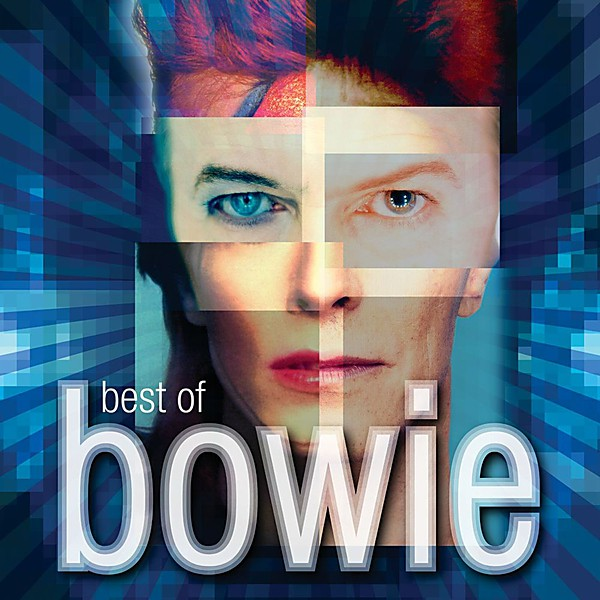

# Best Of Bowie

By **David Bowie**

## Album Data

- **Catalog:** Beets
- **Format:** Digital, Album
- **Album:** Best Of Bowie
- **Artist:** David Bowie
- **Albumartist:** David Bowie
- **Genre:** Glam Rock
- **MusicBrainz Album Artist ID:** 
- **MusicBrainz Album ID:** 
- **MusicBrainz Release Group ID:** 
- **Year:** 1969
- **Catalog #:** 
- **Label:** 
- **Total Tracks:** 18

## Album Tracks

### Track 01 - In The Heat Of The Morning

- **Artist:** David Bowie
- **Format:** ALAC
- **Genre:** Glam Rock
- **Length:** 3:02
- **MusicBrainz Track ID:** 
- **Title:** In The Heat Of The Morning
- **Track:** 01
- **Year:** 2000

### Track 02 - London Bye Ta Ta

- **Artist:** David Bowie
- **Format:** ALAC
- **Genre:** Psychedelic Rock
- **Length:** 2:36
- **MusicBrainz Track ID:** 
- **Title:** London Bye Ta Ta
- **Track:** 02
- **Year:** 2000

### Track 03 - Karma Man

- **Artist:** David Bowie
- **Format:** ALAC
- **Genre:** Blue-Eyed Soul
- **Length:** 3:00
- **MusicBrainz Track ID:** 
- **Title:** Karma Man
- **Track:** 03
- **Year:** 2000

### Track 04 - Silly Boy Blue

- **Artist:** David Bowie
- **Format:** ALAC
- **Genre:** Britpop
- **Length:** 6:08
- **MusicBrainz Track ID:** 
- **Title:** Silly Boy Blue
- **Track:** 04
- **Year:** 2000

### Track 05 - Let Me Sleep Beside You

- **Artist:** David Bowie
- **Format:** ALAC
- **Genre:** Pop Rock
- **Length:** 3:17
- **MusicBrainz Track ID:** 
- **Title:** Let Me Sleep Beside You
- **Track:** 05
- **Year:** 2000

### Track 06 - Janine

- **Artist:** David Bowie
- **Format:** ALAC
- **Genre:** Soft Rock
- **Length:** 3:24
- **MusicBrainz Track ID:** 
- **Title:** Janine
- **Track:** 06
- **Year:** 2000

### Track 07 - Amsterdam

- **Artist:** David Bowie
- **Format:** ALAC
- **Genre:** Glam Rock
- **Length:** 3:18
- **MusicBrainz Track ID:** 
- **Title:** Amsterdam
- **Track:** 07
- **Year:** 2000

### Track 08 - God Knows I'm Good

- **Artist:** David Bowie
- **Format:** ALAC
- **Genre:** Progressive Rock
- **Length:** 3:35
- **MusicBrainz Track ID:** 
- **Title:** God Knows I'm Good
- **Track:** 08
- **Year:** 2000

### Track 09 - The Width Of A Circle

- **Artist:** David Bowie
- **Format:** ALAC
- **Genre:** Psychedelic Rock
- **Length:** 5:21
- **MusicBrainz Track ID:** 
- **Title:** The Width Of A Circle
- **Track:** 09
- **Year:** 2000

### Track 10 - Unwashed And Somewhat Slightly Dazed

- **Artist:** David Bowie
- **Format:** ALAC
- **Genre:** Psychedelic Rock
- **Length:** 5:07
- **MusicBrainz Track ID:** 
- **Title:** Unwashed And Somewhat Slightly Dazed
- **Track:** 10
- **Year:** 2000

### Track 11 - Cygnet Committee

- **Artist:** David Bowie
- **Format:** ALAC
- **Genre:** Britpop
- **Length:** 9:07
- **MusicBrainz Track ID:** 
- **Title:** Cygnet Committee
- **Track:** 11
- **Year:** 2000

### Track 12 - Memory Of A Free Festival

- **Artist:** David Bowie
- **Format:** ALAC
- **Genre:** Psychedelic Rock
- **Length:** 3:18
- **MusicBrainz Track ID:** 
- **Title:** Memory Of A Free Festival
- **Track:** 12
- **Year:** 2000

### Track 13 - Wild Eyed Boy From Freecloud

- **Artist:** David Bowie
- **Format:** ALAC
- **Genre:** Soft Rock
- **Length:** 5:55
- **MusicBrainz Track ID:** 
- **Title:** Wild Eyed Boy From Freecloud
- **Track:** 13
- **Year:** 2000

### Track 14 - Bombers

- **Artist:** David Bowie
- **Format:** ALAC
- **Genre:** Pop Rock
- **Length:** 3:19
- **MusicBrainz Track ID:** 
- **Title:** Bombers
- **Track:** 14
- **Year:** 2000

### Track 15 - Looking For A Friend

- **Artist:** David Bowie
- **Format:** ALAC
- **Genre:** Blue-Eyed Soul
- **Length:** 3:33
- **MusicBrainz Track ID:** 
- **Title:** Looking For A Friend
- **Track:** 15
- **Year:** 2000

### Track 16 - Almost Grown

- **Artist:** David Bowie
- **Format:** ALAC
- **Genre:** Rock And Roll
- **Length:** 2:43
- **MusicBrainz Track ID:** 
- **Title:** Almost Grown
- **Track:** 16
- **Year:** 2000

### Track 17 - Kooks

- **Artist:** David Bowie
- **Format:** ALAC
- **Genre:** Hard Rock
- **Length:** 3:32
- **MusicBrainz Track ID:** 
- **Title:** Kooks
- **Track:** 17
- **Year:** 2000

### Track 18 - It Ain't Easy

- **Artist:** David Bowie
- **Format:** ALAC
- **Genre:** Glam Rock
- **Length:** 2:51
- **MusicBrainz Track ID:** 
- **Title:** It Ain't Easy
- **Track:** 18
- **Year:** 2000

## See also

- [Aladdin Sane](Aladdin_Sane.md)
- [Bowie At The Beeb [Disc 1]](Bowie_At_The_Beeb_[Disc_1].md)
- [Bowie At The Beeb [Disc 2]](Bowie_At_The_Beeb_[Disc_2].md)
- [Bowie At The Beeb [Disc 3]](Bowie_At_The_Beeb_[Disc_3].md)
- [ChangesOneBowie](ChangesOneBowie.md)
- [Cracked Actor (Live Los Angeles '74)](Cracked_Actor_Live_Los_Angeles_74.md)
- [Earthling](Earthling.md)
- [Heathen](Heathen.md)
- [Hunky Dory](Hunky_Dory.md)
- [Life On Mars 45](Life_On_Mars_45.md)
- [The Man Who Sold The World (2015 Remastered Version)](The_Man_Who_Sold_The_World_2015_Remastered_Version.md)
- [The Man Who Sold the World](The_Man_Who_Sold_the_World.md)
- [The Next Day Extra](The_Next_Day_Extra.md)
- [The Next Day](The_Next_Day.md)
- [Young Americans](Young_Americans.md)
- [CD: Bowie At The Beeb (Disc 3)](../../CD/David_Bowie/Bowie_At_The_Beeb_Disc_3.md)
- [CD: ](../../CD/David_Bowie/David_Bowie.md)
- [Roon: Aladdin Sane (2013 Remaster)](../../Roon/David_Bowie/Aladdin_Sane_2013_Remaster.md)
- [Roon: Bowie at the Beeb (The Best of the BBC Sessions 1968-1972)](../../Roon/David_Bowie/Bowie_at_the_Beeb_The_Best_of_the_BBC_Sessions_1968-1972.md)
- [Roon: Brilliant Adventure (1992 – 2001)](../../Roon/David_Bowie/Brilliant_Adventure_1992_–_2001.md)
- [Roon: ChangesOneBowie](../../Roon/David_Bowie/ChangesOneBowie.md)
- [Roon: Cracked Actor (Live, Los Angeles '74)](../../Roon/David_Bowie/Cracked_Actor_Live__Los_Angeles_74.md)
- [Roon: Diamond Dogs (2016 Remaster)](../../Roon/David_Bowie/Diamond_Dogs_2016_Remaster.md)
- [Roon: Glastonbury 2000 (Live)](../../Roon/David_Bowie/Glastonbury_2000_Live.md)
- [Roon: Hunky Dory (2015 Remaster)](../../Roon/David_Bowie/Hunky_Dory_2015_Remaster.md)
- [Roon: Low (2017 Remaster)](../../Roon/David_Bowie/Low_2017_Remaster.md)
- [Roon: Space Oddity (2019 Mix)](../../Roon/David_Bowie/Space_Oddity_2019_Mix.md)
- [Roon: Station to Station (2016 Remaster)](../../Roon/David_Bowie/Station_to_Station_2016_Remaster.md)
- [Roon: The Rise and Fall of Ziggy Stardust and the Spiders from Mars (2012 Remaster)](../../Roon/David_Bowie/The_Rise_and_Fall_of_Ziggy_Stardust_and_the_Spiders_from_Mars_2012_Remaster.md)
- [Roon: Toy (Toy](../../Roon/David_Bowie/Toy_Toy-Box.md)
- [Roon: Young Americans (2016 Remaster)](../../Roon/David_Bowie/Young_Americans_2016_Remaster.md)
- [Vinyl: Aladdin Sane](../../Vinyl/David_Bowie/Aladdin_Sane.md)
- [Vinyl: ChangesOneBowie](../../Vinyl/David_Bowie/ChangesOneBowie.md)
- [Vinyl: Cracked Actor (Live Los Angeles '74)](../../Vinyl/David_Bowie/Cracked_Actor_Live_Los_Angeles_74.md)
- [Vinyl: ](../../Vinyl/David_Bowie/David_Bowie_index.md)
- [Vinyl: David Bowie](../../Vinyl/David_Bowie/David_Bowie.md)
- [Vinyl: Hunky Dory](../../Vinyl/David_Bowie/Hunky_Dory.md)
- [Vinyl: Life On Mars?](../../Vinyl/David_Bowie/Life_On_Mars.md)
- [Vinyl: The Man Who Sold The World](../../Vinyl/David_Bowie/The_Man_Who_Sold_The_World.md)
- [Vinyl: The Rise And Fall Of Ziggy Stardust And The Spiders From Mars](../../Vinyl/David_Bowie/The_Rise_And_Fall_Of_Ziggy_Stardust_And_The_Spiders_From_Mars.md)
- [Vinyl: Young Americans](../../Vinyl/David_Bowie/Young_Americans.md)
