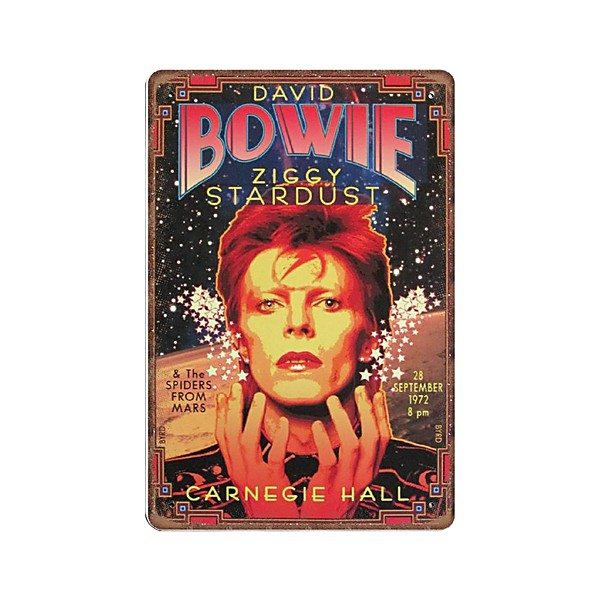

# Bowie At The Beeb [Disc 1]

By **David Bowie**

## Album Data

- **Catalog:** Beets
- **Format:** Digital, Album
- **Album:** Bowie At The Beeb [Disc 1]
- **Artist:** David Bowie
- **Albumartist:** David Bowie
- **Genre:** Glam Rock
- **MusicBrainz Album Artist ID:** 
- **MusicBrainz Album ID:** 
- **MusicBrainz Release Group ID:** 
- **Year:** 2000
- **Catalog #:** 
- **Label:** 
- **Total Tracks:** 19

## Album Tracks

### Track 01 - The Supermen

- **Artist:** David Bowie
- **Format:** ALAC
- **Genre:** Progressive Rock
- **Length:** 2:51
- **MusicBrainz Track ID:** 
- **Title:** The Supermen
- **Track:** 01
- **Year:** 2000

### Track 02 - Eight Line Poem

- **Artist:** David Bowie
- **Format:** ALAC
- **Genre:** Glam Rock
- **Length:** 2:56
- **MusicBrainz Track ID:** 
- **Title:** Eight Line Poem
- **Track:** 02
- **Year:** 2000

### Track 03 - Hang On To Yourself

- **Artist:** David Bowie
- **Format:** ALAC
- **Genre:** Glam Rock
- **Length:** 2:50
- **MusicBrainz Track ID:** 
- **Title:** Hang On To Yourself
- **Track:** 03
- **Year:** 2000

### Track 04 - Ziggy Stardust

- **Artist:** David Bowie
- **Format:** ALAC
- **Genre:** Glam Rock
- **Length:** 3:26
- **MusicBrainz Track ID:** 
- **Title:** Ziggy Stardust
- **Track:** 04
- **Year:** 2000

### Track 05 - Queen Bitch

- **Artist:** David Bowie
- **Format:** ALAC
- **Genre:** Glam Rock
- **Length:** 2:59
- **MusicBrainz Track ID:** 
- **Title:** Queen Bitch
- **Track:** 05
- **Year:** 2000

### Track 06 - Waiting For The Man

- **Artist:** David Bowie
- **Format:** ALAC
- **Genre:** New Wave
- **Length:** 5:24
- **MusicBrainz Track ID:** 
- **Title:** Waiting For The Man
- **Track:** 06
- **Year:** 2000

### Track 07 - Five Years

- **Artist:** David Bowie
- **Format:** ALAC
- **Genre:** Glam Rock
- **Length:** 4:24
- **MusicBrainz Track ID:** 
- **Title:** Five Years
- **Track:** 07
- **Year:** 2000

### Track 08 - White Light/White Heat

- **Artist:** David Bowie
- **Format:** ALAC
- **Genre:** Glam Rock
- **Length:** 3:48
- **MusicBrainz Track ID:** 
- **Title:** White Light/White Heat
- **Track:** 08
- **Year:** 2000

### Track 09 - Moonage Daydream

- **Artist:** David Bowie
- **Format:** ALAC
- **Genre:** Glam Rock
- **Length:** 4:58
- **MusicBrainz Track ID:** 
- **Title:** Moonage Daydream
- **Track:** 09
- **Year:** 2000

### Track 10 - Hang On To Yourself

- **Artist:** David Bowie
- **Format:** ALAC
- **Genre:** Glam Rock
- **Length:** 2:50
- **MusicBrainz Track ID:** 
- **Title:** Hang On To Yourself
- **Track:** 10
- **Year:** 2000

### Track 11 - Sufragette City

- **Artist:** David Bowie
- **Format:** ALAC
- **Genre:** Punk Rock
- **Length:** 3:28
- **MusicBrainz Track ID:** 
- **Title:** Sufragette City
- **Track:** 11
- **Year:** 2000

### Track 12 - Ziggy Stardust

- **Artist:** David Bowie
- **Format:** ALAC
- **Genre:** Glam Rock
- **Length:** 3:24
- **MusicBrainz Track ID:** 
- **Title:** Ziggy Stardust
- **Track:** 12
- **Year:** 2000

### Track 13 - Starman

- **Artist:** David Bowie
- **Format:** ALAC
- **Genre:** Glam Rock
- **Length:** 4:05
- **MusicBrainz Track ID:** 
- **Title:** Starman
- **Track:** 13
- **Year:** 2000

### Track 14 - Space Oddity

- **Artist:** David Bowie
- **Format:** ALAC
- **Genre:** Progressive Rock
- **Length:** 4:16
- **MusicBrainz Track ID:** 
- **Title:** Space Oddity
- **Track:** 14
- **Year:** 2000

### Track 15 - Changes

- **Artist:** David Bowie
- **Format:** ALAC
- **Genre:** Glam Rock
- **Length:** 3:29
- **MusicBrainz Track ID:** 
- **Title:** Changes
- **Track:** 15
- **Year:** 2000

### Track 16 - Oh! You Pretty Things

- **Artist:** David Bowie
- **Format:** ALAC
- **Genre:** Glam Rock
- **Length:** 2:57
- **MusicBrainz Track ID:** 
- **Title:** Oh! You Pretty Things
- **Track:** 16
- **Year:** 2000

### Track 17 - Andy Warhol

- **Artist:** David Bowie
- **Format:** ALAC
- **Genre:** New Wave
- **Length:** 3:14
- **MusicBrainz Track ID:** 
- **Title:** Andy Warhol
- **Track:** 17
- **Year:** 2000

### Track 18 - Lady Stardust

- **Artist:** David Bowie
- **Format:** ALAC
- **Genre:** Glam Rock
- **Length:** 3:20
- **MusicBrainz Track ID:** 
- **Title:** Lady Stardust
- **Track:** 18
- **Year:** 2000

### Track 19 - Rock 'n' Roll Suicide

- **Artist:** David Bowie
- **Format:** ALAC
- **Genre:** Glam Rock
- **Length:** 3:08
- **MusicBrainz Track ID:** 
- **Title:** Rock 'n' Roll Suicide
- **Track:** 19
- **Year:** 2000

