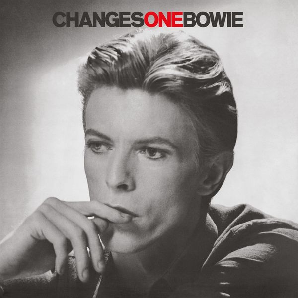

# ChangesOneBowie

By **David Bowie**

## Album Data

- **Catalog:** Beets
- **Format:** Digital, Album
- **Album:** ChangesOneBowie
- **Artist:** David Bowie
- **Albumartist:** David Bowie
- **Genre:** Blue-Eyed Soul
- **MusicBrainz Album Artist ID:** [5441c29d-3602-4898-b1a1-b77fa23b8e50](https://musicbrainz.org/artist/5441c29d-3602-4898-b1a1-b77fa23b8e50)
- **MusicBrainz Album ID:** [2402e72b-b8d6-4b6d-bb3e-893af2fb20c1](https://musicbrainz.org/release/2402e72b-b8d6-4b6d-bb3e-893af2fb20c1)
- **MusicBrainz Release Group ID:** [16c74734-083d-3913-a622-402216677a82](https://musicbrainz.org/release-group/16c74734-083d-3913-a622-402216677a82)
- **Year:** 2016
- **Catalog #:** 7243 8 42627 2 3
- **Label:** Virgin Records America, Inc.
- **Total Tracks:** 09

## Album Tracks

### Track 01 - Little Wonder

- **Artist:** David Bowie
- **Format:** ALAC
- **Genre:** Glam Rock
- **Length:** 6:02
- **MusicBrainz Track ID:** [7bd8e93c-ab7b-4fa5-a3f0-d15212fb9d86](https://musicbrainz.org/recording/7bd8e93c-ab7b-4fa5-a3f0-d15212fb9d86)
- **Title:** Little Wonder
- **Track:** 01
- **Year:** 1997

### Track 02 - Looking for Satellites

- **Artist:** David Bowie
- **Format:** ALAC
- **Genre:** Industrial Rock
- **Length:** 5:20
- **MusicBrainz Track ID:** [e495293c-5bd7-4f6d-ae6b-0ce891b0a031](https://musicbrainz.org/recording/e495293c-5bd7-4f6d-ae6b-0ce891b0a031)
- **Title:** Looking for Satellites
- **Track:** 02
- **Year:** 1997

### Track 03 - Battle for Britain (The Letter)

- **Artist:** David Bowie
- **Format:** ALAC
- **Genre:** Industrial Rock
- **Length:** 4:48
- **MusicBrainz Track ID:** [d8783d03-8a3b-4269-8261-00709d2cfee8](https://musicbrainz.org/recording/d8783d03-8a3b-4269-8261-00709d2cfee8)
- **Title:** Battle for Britain (The Letter)
- **Track:** 03
- **Year:** 1997

### Track 04 - Seven Years in Tibet

- **Artist:** David Bowie
- **Format:** ALAC
- **Genre:** Industrial Rock
- **Length:** 6:21
- **MusicBrainz Track ID:** [e22ebace-d4f8-4432-96da-a2a41eff0c14](https://musicbrainz.org/recording/e22ebace-d4f8-4432-96da-a2a41eff0c14)
- **Title:** Seven Years in Tibet
- **Track:** 04
- **Year:** 1997

### Track 05 - Dead Man Walking

- **Artist:** David Bowie
- **Format:** ALAC
- **Genre:** Industrial Rock
- **Length:** 6:50
- **MusicBrainz Track ID:** [ebb7cab3-2c81-47a6-a2bf-e0902b3ceafe](https://musicbrainz.org/recording/ebb7cab3-2c81-47a6-a2bf-e0902b3ceafe)
- **Title:** Dead Man Walking
- **Track:** 05
- **Year:** 1997

### Track 06 - Telling Lies

- **Artist:** David Bowie
- **Format:** ALAC
- **Genre:** Emo
- **Length:** 4:49
- **MusicBrainz Track ID:** [e398afc8-5339-4d36-9d88-7ef2bae5b52c](https://musicbrainz.org/recording/e398afc8-5339-4d36-9d88-7ef2bae5b52c)
- **Title:** Telling Lies
- **Track:** 06
- **Year:** 1997

### Track 07 - The Last Thing You Should Do

- **Artist:** David Bowie
- **Format:** ALAC
- **Genre:** Post-Rock
- **Length:** 4:57
- **MusicBrainz Track ID:** [011c3a6d-416c-4fbd-b1d1-8a05450a29e8](https://musicbrainz.org/recording/011c3a6d-416c-4fbd-b1d1-8a05450a29e8)
- **Title:** The Last Thing You Should Do
- **Track:** 07
- **Year:** 1997

### Track 08 - I’m Afraid of Americans

- **Artist:** David Bowie
- **Format:** ALAC
- **Genre:** Industrial Rock
- **Length:** 5:00
- **MusicBrainz Track ID:** [b76064da-62d7-4a1f-be4b-209d1fb48eed](https://musicbrainz.org/recording/b76064da-62d7-4a1f-be4b-209d1fb48eed)
- **Title:** I’m Afraid of Americans
- **Track:** 08
- **Year:** 1997

### Track 09 - Law (Earthlings on Fire)

- **Artist:** David Bowie
- **Format:** ALAC
- **Genre:** Industrial Rock
- **Length:** 4:48
- **MusicBrainz Track ID:** [cdf08c68-0f51-4725-b3b1-22ca9c1bd539](https://musicbrainz.org/recording/cdf08c68-0f51-4725-b3b1-22ca9c1bd539)
- **Title:** Law (Earthlings on Fire)
- **Track:** 09
- **Year:** 1997

## See also

- [Aladdin Sane](Aladdin_Sane.md)
- [Best Of Bowie](Best_Of_Bowie.md)
- [Bowie At The Beeb [Disc 1]](Bowie_At_The_Beeb_[Disc_1].md)
- [Bowie At The Beeb [Disc 2]](Bowie_At_The_Beeb_[Disc_2].md)
- [Bowie At The Beeb [Disc 3]](Bowie_At_The_Beeb_[Disc_3].md)
- [Cracked Actor (Live Los Angeles '74)](Cracked_Actor_Live_Los_Angeles_74.md)
- [Earthling](Earthling.md)
- [Heathen](Heathen.md)
- [Hunky Dory](Hunky_Dory.md)
- [Life On Mars 45](Life_On_Mars_45.md)
- [The Man Who Sold The World (2015 Remastered Version)](The_Man_Who_Sold_The_World_2015_Remastered_Version.md)
- [The Man Who Sold the World](The_Man_Who_Sold_the_World.md)
- [The Next Day Extra](The_Next_Day_Extra.md)
- [The Next Day](The_Next_Day.md)
- [Young Americans](Young_Americans.md)
- [CD: Bowie At The Beeb (Disc 3)](../../CD/David_Bowie/Bowie_At_The_Beeb_Disc_3.md)
- [CD: ](../../CD/David_Bowie/David_Bowie.md)
- [Roon: Aladdin Sane (2013 Remaster)](../../Roon/David_Bowie/Aladdin_Sane_2013_Remaster.md)
- [Roon: Bowie at the Beeb (The Best of the BBC Sessions 1968-1972)](../../Roon/David_Bowie/Bowie_at_the_Beeb_The_Best_of_the_BBC_Sessions_1968-1972.md)
- [Roon: Brilliant Adventure (1992 – 2001)](../../Roon/David_Bowie/Brilliant_Adventure_1992_–_2001.md)
- [Roon: ChangesOneBowie](../../Roon/David_Bowie/ChangesOneBowie.md)
- [Roon: Cracked Actor (Live, Los Angeles '74)](../../Roon/David_Bowie/Cracked_Actor_Live__Los_Angeles_74.md)
- [Roon: Diamond Dogs (2016 Remaster)](../../Roon/David_Bowie/Diamond_Dogs_2016_Remaster.md)
- [Roon: Glastonbury 2000 (Live)](../../Roon/David_Bowie/Glastonbury_2000_Live.md)
- [Roon: Hunky Dory (2015 Remaster)](../../Roon/David_Bowie/Hunky_Dory_2015_Remaster.md)
- [Roon: Low (2017 Remaster)](../../Roon/David_Bowie/Low_2017_Remaster.md)
- [Roon: Space Oddity (2019 Mix)](../../Roon/David_Bowie/Space_Oddity_2019_Mix.md)
- [Roon: Station to Station (2016 Remaster)](../../Roon/David_Bowie/Station_to_Station_2016_Remaster.md)
- [Roon: The Rise and Fall of Ziggy Stardust and the Spiders from Mars (2012 Remaster)](../../Roon/David_Bowie/The_Rise_and_Fall_of_Ziggy_Stardust_and_the_Spiders_from_Mars_2012_Remaster.md)
- [Roon: Toy (Toy](../../Roon/David_Bowie/Toy_Toy-Box.md)
- [Roon: Young Americans (2016 Remaster)](../../Roon/David_Bowie/Young_Americans_2016_Remaster.md)
- [Vinyl: Aladdin Sane](../../Vinyl/David_Bowie/Aladdin_Sane.md)
- [Vinyl: ChangesOneBowie](../../Vinyl/David_Bowie/ChangesOneBowie.md)
- [Vinyl: Cracked Actor (Live Los Angeles '74)](../../Vinyl/David_Bowie/Cracked_Actor_Live_Los_Angeles_74.md)
- [Vinyl: ](../../Vinyl/David_Bowie/David_Bowie_index.md)
- [Vinyl: David Bowie](../../Vinyl/David_Bowie/David_Bowie.md)
- [Vinyl: Hunky Dory](../../Vinyl/David_Bowie/Hunky_Dory.md)
- [Vinyl: Life On Mars?](../../Vinyl/David_Bowie/Life_On_Mars.md)
- [Vinyl: The Man Who Sold The World](../../Vinyl/David_Bowie/The_Man_Who_Sold_The_World.md)
- [Vinyl: The Rise And Fall Of Ziggy Stardust And The Spiders From Mars](../../Vinyl/David_Bowie/The_Rise_And_Fall_Of_Ziggy_Stardust_And_The_Spiders_From_Mars.md)
- [Vinyl: Young Americans](../../Vinyl/David_Bowie/Young_Americans.md)
