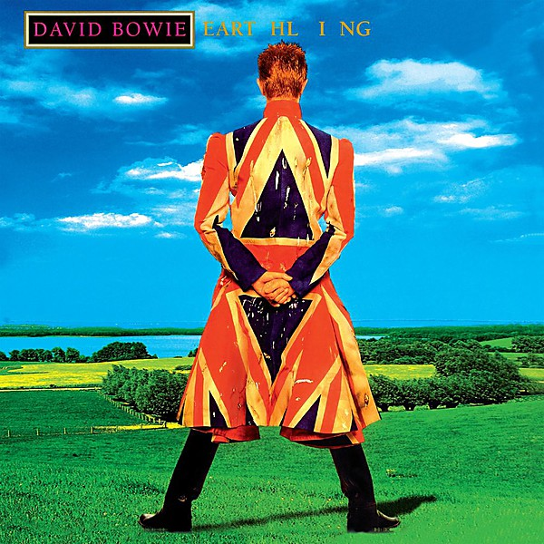

# Earthling

By **David Bowie**

## Album Data

- **Catalog:** Beets
- **Format:** Digital, Album
- **Album:** Earthling
- **Artist:** David Bowie
- **Albumartist:** David Bowie
- **Genre:** Industrial Rock
- **MusicBrainz Album Artist ID:** [5441c29d-3602-4898-b1a1-b77fa23b8e50](https://musicbrainz.org/artist/5441c29d-3602-4898-b1a1-b77fa23b8e50)
- **MusicBrainz Album ID:** [d0bf2459-477c-309d-b597-9130106f4a02](https://musicbrainz.org/release/d0bf2459-477c-309d-b597-9130106f4a02)
- **MusicBrainz Release Group ID:** [9a723e6e-2ede-371b-88bf-396cc362d77b](https://musicbrainz.org/release-group/9a723e6e-2ede-371b-88bf-396cc362d77b)
- **Year:** 1997
- **Catalog #:** 5082222000
- **Label:** Columbia
- **Total Tracks:** 12

## Album Tracks

### Track 01 - Sunday

- **Artist:** David Bowie
- **Format:** MP3
- **Genre:** Progressive Rock
- **Length:** 4:45
- **MusicBrainz Track ID:** [ecec7d71-42e3-4413-9007-71cf8b86b5a8](https://musicbrainz.org/recording/ecec7d71-42e3-4413-9007-71cf8b86b5a8)
- **Title:** Sunday
- **Track:** 01
- **Year:** 2002

### Track 02 - Cactus

- **Artist:** David Bowie
- **Format:** MP3
- **Genre:** Glam Rock
- **Length:** 2:54
- **MusicBrainz Track ID:** [29f38773-4a8e-49c1-9986-ed05f356a37d](https://musicbrainz.org/recording/29f38773-4a8e-49c1-9986-ed05f356a37d)
- **Title:** Cactus
- **Track:** 02
- **Year:** 2002

### Track 03 - Slip Away

- **Artist:** David Bowie
- **Format:** MP3
- **Genre:** Progressive Rock
- **Length:** 6:04
- **MusicBrainz Track ID:** [df6af7ed-c518-47b9-8c03-14bcfbd7f2be](https://musicbrainz.org/recording/df6af7ed-c518-47b9-8c03-14bcfbd7f2be)
- **Title:** Slip Away
- **Track:** 03
- **Year:** 2002

### Track 04 - Slow Burn

- **Artist:** David Bowie
- **Format:** MP3
- **Genre:** Glam Rock
- **Length:** 4:41
- **MusicBrainz Track ID:** [43e0a0ae-f773-4a45-815e-299c3b96c25a](https://musicbrainz.org/recording/43e0a0ae-f773-4a45-815e-299c3b96c25a)
- **Title:** Slow Burn
- **Track:** 04
- **Year:** 2002

### Track 05 - Afraid

- **Artist:** David Bowie
- **Format:** MP3
- **Genre:** Soft Rock
- **Length:** 3:28
- **MusicBrainz Track ID:** [fe7716af-c53c-43c3-8e0e-286ba1a68d59](https://musicbrainz.org/recording/fe7716af-c53c-43c3-8e0e-286ba1a68d59)
- **Title:** Afraid
- **Track:** 05
- **Year:** 2002

### Track 06 - I’ve Been Waiting for You

- **Artist:** David Bowie
- **Format:** MP3
- **Genre:** Glam Rock
- **Length:** 2:59
- **MusicBrainz Track ID:** [e83abc6e-d2a0-4594-beb5-f7bee06385be](https://musicbrainz.org/recording/e83abc6e-d2a0-4594-beb5-f7bee06385be)
- **Title:** I’ve Been Waiting for You
- **Track:** 06
- **Year:** 2002

### Track 07 - I Would Be Your Slave

- **Artist:** David Bowie
- **Format:** MP3
- **Genre:** Glam Rock
- **Length:** 5:13
- **MusicBrainz Track ID:** [fe4bb47c-1949-4fea-bd23-2d83a4c34676](https://musicbrainz.org/recording/fe4bb47c-1949-4fea-bd23-2d83a4c34676)
- **Title:** I Would Be Your Slave
- **Track:** 07
- **Year:** 2002

### Track 08 - I Took a Trip on a Gemini Spaceship

- **Artist:** David Bowie
- **Format:** MP3
- **Genre:** Glam Rock
- **Length:** 4:06
- **MusicBrainz Track ID:** [d0bcb936-fb7b-42d0-8c49-d50b92d0b836](https://musicbrainz.org/recording/d0bcb936-fb7b-42d0-8c49-d50b92d0b836)
- **Title:** I Took a Trip on a Gemini Spaceship
- **Track:** 08
- **Year:** 2002

### Track 09 - 5

- **Artist:** David Bowie
- **Format:** MP3
- **Genre:** Rock
- **Length:** 5:01
- **MusicBrainz Track ID:** [3137926b-e099-4d17-bdee-c92a6b4a39e1](https://musicbrainz.org/recording/3137926b-e099-4d17-bdee-c92a6b4a39e1)
- **Title:** 5
- **Track:** 09
- **Year:** 2002

### Track 10 - Everyone Says ‘Hi’

- **Artist:** David Bowie
- **Format:** MP3
- **Genre:** Glam Rock
- **Length:** 3:57
- **MusicBrainz Track ID:** [03102a38-fd1a-44f8-b174-f3640848ff51](https://musicbrainz.org/recording/03102a38-fd1a-44f8-b174-f3640848ff51)
- **Title:** Everyone Says ‘Hi’
- **Track:** 10
- **Year:** 2002

### Track 11 - A Better Future

- **Artist:** David Bowie
- **Format:** MP3
- **Genre:** Synthpop
- **Length:** 4:11
- **MusicBrainz Track ID:** [4ec9b4b1-fd07-4a9f-b65c-930ea4b892cc](https://musicbrainz.org/recording/4ec9b4b1-fd07-4a9f-b65c-930ea4b892cc)
- **Title:** A Better Future
- **Track:** 11
- **Year:** 2002

### Track 12 - Heathen (The Rays)

- **Artist:** David Bowie
- **Format:** MP3
- **Genre:** Post-Rock
- **Length:** 4:16
- **MusicBrainz Track ID:** [a6cdcecb-b987-48ce-b639-c733c8e73f4c](https://musicbrainz.org/recording/a6cdcecb-b987-48ce-b639-c733c8e73f4c)
- **Title:** Heathen (The Rays)
- **Track:** 12
- **Year:** 2002

## See also

- [Aladdin Sane](Aladdin_Sane.md)
- [Best Of Bowie](Best_Of_Bowie.md)
- [Bowie At The Beeb [Disc 1]](Bowie_At_The_Beeb_[Disc_1].md)
- [Bowie At The Beeb [Disc 2]](Bowie_At_The_Beeb_[Disc_2].md)
- [Bowie At The Beeb [Disc 3]](Bowie_At_The_Beeb_[Disc_3].md)
- [ChangesOneBowie](ChangesOneBowie.md)
- [Cracked Actor (Live Los Angeles '74)](Cracked_Actor_Live_Los_Angeles_74.md)
- [Heathen](Heathen.md)
- [Hunky Dory](Hunky_Dory.md)
- [Life On Mars 45](Life_On_Mars_45.md)
- [The Man Who Sold The World (2015 Remastered Version)](The_Man_Who_Sold_The_World_2015_Remastered_Version.md)
- [The Man Who Sold the World](The_Man_Who_Sold_the_World.md)
- [The Next Day Extra](The_Next_Day_Extra.md)
- [The Next Day](The_Next_Day.md)
- [Young Americans](Young_Americans.md)
- [CD: Bowie At The Beeb (Disc 3)](../../CD/David_Bowie/Bowie_At_The_Beeb_Disc_3.md)
- [CD: ](../../CD/David_Bowie/David_Bowie.md)
- [Roon: Aladdin Sane (2013 Remaster)](../../Roon/David_Bowie/Aladdin_Sane_2013_Remaster.md)
- [Roon: Bowie at the Beeb (The Best of the BBC Sessions 1968-1972)](../../Roon/David_Bowie/Bowie_at_the_Beeb_The_Best_of_the_BBC_Sessions_1968-1972.md)
- [Roon: Brilliant Adventure (1992 – 2001)](../../Roon/David_Bowie/Brilliant_Adventure_1992_–_2001.md)
- [Roon: ChangesOneBowie](../../Roon/David_Bowie/ChangesOneBowie.md)
- [Roon: Cracked Actor (Live, Los Angeles '74)](../../Roon/David_Bowie/Cracked_Actor_Live__Los_Angeles_74.md)
- [Roon: Diamond Dogs (2016 Remaster)](../../Roon/David_Bowie/Diamond_Dogs_2016_Remaster.md)
- [Roon: Glastonbury 2000 (Live)](../../Roon/David_Bowie/Glastonbury_2000_Live.md)
- [Roon: Hunky Dory (2015 Remaster)](../../Roon/David_Bowie/Hunky_Dory_2015_Remaster.md)
- [Roon: Low (2017 Remaster)](../../Roon/David_Bowie/Low_2017_Remaster.md)
- [Roon: Space Oddity (2019 Mix)](../../Roon/David_Bowie/Space_Oddity_2019_Mix.md)
- [Roon: Station to Station (2016 Remaster)](../../Roon/David_Bowie/Station_to_Station_2016_Remaster.md)
- [Roon: The Rise and Fall of Ziggy Stardust and the Spiders from Mars (2012 Remaster)](../../Roon/David_Bowie/The_Rise_and_Fall_of_Ziggy_Stardust_and_the_Spiders_from_Mars_2012_Remaster.md)
- [Roon: Toy (Toy](../../Roon/David_Bowie/Toy_Toy-Box.md)
- [Roon: Young Americans (2016 Remaster)](../../Roon/David_Bowie/Young_Americans_2016_Remaster.md)
- [Vinyl: Aladdin Sane](../../Vinyl/David_Bowie/Aladdin_Sane.md)
- [Vinyl: ChangesOneBowie](../../Vinyl/David_Bowie/ChangesOneBowie.md)
- [Vinyl: Cracked Actor (Live Los Angeles '74)](../../Vinyl/David_Bowie/Cracked_Actor_Live_Los_Angeles_74.md)
- [Vinyl: ](../../Vinyl/David_Bowie/David_Bowie_index.md)
- [Vinyl: David Bowie](../../Vinyl/David_Bowie/David_Bowie.md)
- [Vinyl: Hunky Dory](../../Vinyl/David_Bowie/Hunky_Dory.md)
- [Vinyl: Life On Mars?](../../Vinyl/David_Bowie/Life_On_Mars.md)
- [Vinyl: The Man Who Sold The World](../../Vinyl/David_Bowie/The_Man_Who_Sold_The_World.md)
- [Vinyl: The Rise And Fall Of Ziggy Stardust And The Spiders From Mars](../../Vinyl/David_Bowie/The_Rise_And_Fall_Of_Ziggy_Stardust_And_The_Spiders_From_Mars.md)
- [Vinyl: Young Americans](../../Vinyl/David_Bowie/Young_Americans.md)
