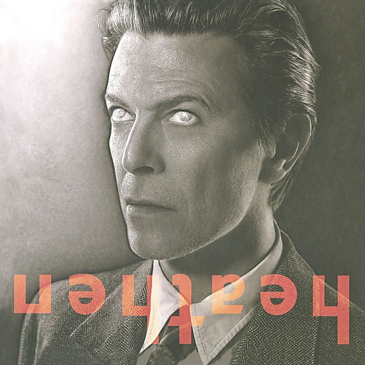

# Heathen

By **David Bowie**

## Album Data

- **Catalog:** Beets
- **Format:** Digital, Album
- **Album:** Heathen
- **Artist:** David Bowie
- **Albumartist:** David Bowie
- **Genre:** Glam Rock
- **MusicBrainz Album Artist ID:** [5441c29d-3602-4898-b1a1-b77fa23b8e50](https://musicbrainz.org/artist/5441c29d-3602-4898-b1a1-b77fa23b8e50)
- **MusicBrainz Album ID:** [74dee9a3-ffcd-3567-a8e1-8f306a7b94d4](https://musicbrainz.org/release/74dee9a3-ffcd-3567-a8e1-8f306a7b94d4)
- **MusicBrainz Release Group ID:** [fed49206-4869-307d-9bfa-08109424cb73](https://musicbrainz.org/release-group/fed49206-4869-307d-9bfa-08109424cb73)
- **Year:** 2002
- **Catalog #:** 521899 0
- **Label:** EMI
- **Total Tracks:** 11

## Album Tracks

### Track 01 - Changes

- **Artist:** David Bowie
- **Format:** MP3
- **Genre:** Glam Rock
- **Length:** 3:34
- **MusicBrainz Track ID:** [e7b022c5-bce7-4bee-8136-7889af2f4162](https://musicbrainz.org/recording/e7b022c5-bce7-4bee-8136-7889af2f4162)
- **Title:** Changes
- **Track:** 01
- **Year:** 1999

### Track 02 - Oh! You Pretty Things

- **Artist:** David Bowie
- **Format:** MP3
- **Genre:** Glam Rock
- **Length:** 3:12
- **MusicBrainz Track ID:** [2b8363c3-511c-4816-934b-fef55fb1e5ac](https://musicbrainz.org/recording/2b8363c3-511c-4816-934b-fef55fb1e5ac)
- **Title:** Oh! You Pretty Things
- **Track:** 02
- **Year:** 1999

### Track 03 - Eight Line Poem

- **Artist:** David Bowie
- **Format:** MP3
- **Genre:** Glam Rock
- **Length:** 2:55
- **MusicBrainz Track ID:** [6221a91a-0ef4-490d-89f5-a230d089f0d8](https://musicbrainz.org/recording/6221a91a-0ef4-490d-89f5-a230d089f0d8)
- **Title:** Eight Line Poem
- **Track:** 03
- **Year:** 1999

### Track 04 - Life on Mars?

- **Artist:** David Bowie
- **Format:** MP3
- **Genre:** Glam Rock
- **Length:** 3:43
- **MusicBrainz Track ID:** [e1f40fdd-7204-4022-ae93-8fc7c9a93119](https://musicbrainz.org/recording/e1f40fdd-7204-4022-ae93-8fc7c9a93119)
- **Title:** Life on Mars?
- **Track:** 04
- **Year:** 1999

### Track 05 - Kooks

- **Artist:** David Bowie
- **Format:** MP3
- **Genre:** Hard Rock
- **Length:** 2:53
- **MusicBrainz Track ID:** [3917f659-9339-4a72-9fe4-11eb88a65323](https://musicbrainz.org/recording/3917f659-9339-4a72-9fe4-11eb88a65323)
- **Title:** Kooks
- **Track:** 05
- **Year:** 1999

### Track 06 - Quicksand

- **Artist:** David Bowie
- **Format:** MP3
- **Genre:** Glam Rock
- **Length:** 5:06
- **MusicBrainz Track ID:** [05dc3833-6186-4fcd-9fb5-f31e0ac598dc](https://musicbrainz.org/recording/05dc3833-6186-4fcd-9fb5-f31e0ac598dc)
- **Title:** Quicksand
- **Track:** 06
- **Year:** 1999

### Track 07 - Fill Your Heart

- **Artist:** David Bowie
- **Format:** MP3
- **Genre:** Glam Rock
- **Length:** 3:07
- **MusicBrainz Track ID:** [c52822b8-6daa-458a-ae27-80ab12328ffb](https://musicbrainz.org/recording/c52822b8-6daa-458a-ae27-80ab12328ffb)
- **Title:** Fill Your Heart
- **Track:** 07
- **Year:** 1999

### Track 08 - Andy Warhol

- **Artist:** David Bowie
- **Format:** MP3
- **Genre:** New Wave
- **Length:** 3:56
- **MusicBrainz Track ID:** [51361c82-c06e-479c-ba93-bb07b366b5ba](https://musicbrainz.org/recording/51361c82-c06e-479c-ba93-bb07b366b5ba)
- **Title:** Andy Warhol
- **Track:** 08
- **Year:** 1999

### Track 09 - Song for Bob Dylan

- **Artist:** David Bowie
- **Format:** MP3
- **Genre:** Glam Rock
- **Length:** 4:12
- **MusicBrainz Track ID:** [e783c7ad-9b12-44f6-ac27-2a3c91afa223](https://musicbrainz.org/recording/e783c7ad-9b12-44f6-ac27-2a3c91afa223)
- **Title:** Song for Bob Dylan
- **Track:** 09
- **Year:** 1999

### Track 10 - Queen Bitch

- **Artist:** David Bowie
- **Format:** MP3
- **Genre:** Glam Rock
- **Length:** 3:15
- **MusicBrainz Track ID:** [131c5027-2037-4ee4-a284-7521ea362f27](https://musicbrainz.org/recording/131c5027-2037-4ee4-a284-7521ea362f27)
- **Title:** Queen Bitch
- **Track:** 10
- **Year:** 1999

### Track 11 - The Bewlay Brothers

- **Artist:** David Bowie
- **Format:** MP3
- **Genre:** Progressive Rock
- **Length:** 5:23
- **MusicBrainz Track ID:** [4545ff1f-f7fd-4dd9-862c-d0f88f2c4f4b](https://musicbrainz.org/recording/4545ff1f-f7fd-4dd9-862c-d0f88f2c4f4b)
- **Title:** The Bewlay Brothers
- **Track:** 11
- **Year:** 1999

## See also

- [Aladdin Sane](Aladdin_Sane.md)
- [Best Of Bowie](Best_Of_Bowie.md)
- [Bowie At The Beeb [Disc 1]](Bowie_At_The_Beeb_[Disc_1].md)
- [Bowie At The Beeb [Disc 2]](Bowie_At_The_Beeb_[Disc_2].md)
- [Bowie At The Beeb [Disc 3]](Bowie_At_The_Beeb_[Disc_3].md)
- [ChangesOneBowie](ChangesOneBowie.md)
- [Cracked Actor (Live Los Angeles '74)](Cracked_Actor_Live_Los_Angeles_74.md)
- [Earthling](Earthling.md)
- [Hunky Dory](Hunky_Dory.md)
- [Life On Mars 45](Life_On_Mars_45.md)
- [The Man Who Sold The World (2015 Remastered Version)](The_Man_Who_Sold_The_World_2015_Remastered_Version.md)
- [The Man Who Sold the World](The_Man_Who_Sold_the_World.md)
- [The Next Day Extra](The_Next_Day_Extra.md)
- [The Next Day](The_Next_Day.md)
- [Young Americans](Young_Americans.md)
- [CD: Bowie At The Beeb (Disc 3)](../../CD/David_Bowie/Bowie_At_The_Beeb_Disc_3.md)
- [CD: ](../../CD/David_Bowie/David_Bowie.md)
- [Roon: Aladdin Sane (2013 Remaster)](../../Roon/David_Bowie/Aladdin_Sane_2013_Remaster.md)
- [Roon: Bowie at the Beeb (The Best of the BBC Sessions 1968-1972)](../../Roon/David_Bowie/Bowie_at_the_Beeb_The_Best_of_the_BBC_Sessions_1968-1972.md)
- [Roon: Brilliant Adventure (1992 – 2001)](../../Roon/David_Bowie/Brilliant_Adventure_1992_–_2001.md)
- [Roon: ChangesOneBowie](../../Roon/David_Bowie/ChangesOneBowie.md)
- [Roon: Cracked Actor (Live, Los Angeles '74)](../../Roon/David_Bowie/Cracked_Actor_Live__Los_Angeles_74.md)
- [Roon: Diamond Dogs (2016 Remaster)](../../Roon/David_Bowie/Diamond_Dogs_2016_Remaster.md)
- [Roon: Glastonbury 2000 (Live)](../../Roon/David_Bowie/Glastonbury_2000_Live.md)
- [Roon: Hunky Dory (2015 Remaster)](../../Roon/David_Bowie/Hunky_Dory_2015_Remaster.md)
- [Roon: Low (2017 Remaster)](../../Roon/David_Bowie/Low_2017_Remaster.md)
- [Roon: Space Oddity (2019 Mix)](../../Roon/David_Bowie/Space_Oddity_2019_Mix.md)
- [Roon: Station to Station (2016 Remaster)](../../Roon/David_Bowie/Station_to_Station_2016_Remaster.md)
- [Roon: The Rise and Fall of Ziggy Stardust and the Spiders from Mars (2012 Remaster)](../../Roon/David_Bowie/The_Rise_and_Fall_of_Ziggy_Stardust_and_the_Spiders_from_Mars_2012_Remaster.md)
- [Roon: Toy (Toy](../../Roon/David_Bowie/Toy_Toy-Box.md)
- [Roon: Young Americans (2016 Remaster)](../../Roon/David_Bowie/Young_Americans_2016_Remaster.md)
- [Vinyl: Aladdin Sane](../../Vinyl/David_Bowie/Aladdin_Sane.md)
- [Vinyl: ChangesOneBowie](../../Vinyl/David_Bowie/ChangesOneBowie.md)
- [Vinyl: Cracked Actor (Live Los Angeles '74)](../../Vinyl/David_Bowie/Cracked_Actor_Live_Los_Angeles_74.md)
- [Vinyl: ](../../Vinyl/David_Bowie/David_Bowie_index.md)
- [Vinyl: David Bowie](../../Vinyl/David_Bowie/David_Bowie.md)
- [Vinyl: Hunky Dory](../../Vinyl/David_Bowie/Hunky_Dory.md)
- [Vinyl: Life On Mars?](../../Vinyl/David_Bowie/Life_On_Mars.md)
- [Vinyl: The Man Who Sold The World](../../Vinyl/David_Bowie/The_Man_Who_Sold_The_World.md)
- [Vinyl: The Rise And Fall Of Ziggy Stardust And The Spiders From Mars](../../Vinyl/David_Bowie/The_Rise_And_Fall_Of_Ziggy_Stardust_And_The_Spiders_From_Mars.md)
- [Vinyl: Young Americans](../../Vinyl/David_Bowie/Young_Americans.md)
