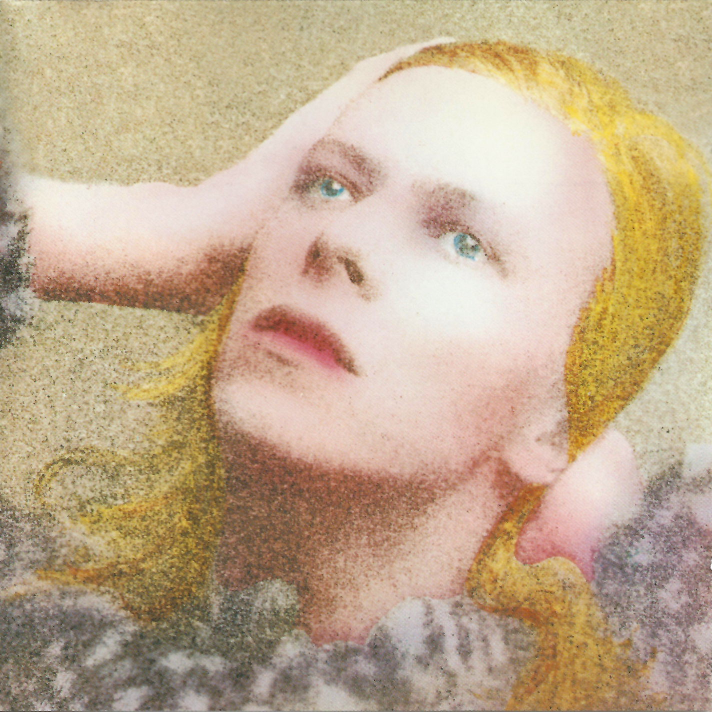

# Hunky Dory

By **David Bowie**

## Album Data

- **Catalog:** Beets
- **Format:** Digital, Album
- **Album:** Hunky Dory
- **Artist:** David Bowie
- **Albumartist:** David Bowie
- **Genre:** Glam Rock
- **MusicBrainz Album Artist ID:** [5441c29d-3602-4898-b1a1-b77fa23b8e50](https://musicbrainz.org/artist/5441c29d-3602-4898-b1a1-b77fa23b8e50)
- **MusicBrainz Album ID:** [0b4d90ba-edfe-3c00-83a6-77de469dab44](https://musicbrainz.org/release/0b4d90ba-edfe-3c00-83a6-77de469dab44)
- **MusicBrainz Release Group ID:** [743b0b2e-a23a-3182-950e-232f8cb0dfb7](https://musicbrainz.org/release-group/743b0b2e-a23a-3182-950e-232f8cb0dfb7)
- **Year:** 1999
- **Catalog #:** 7243 521901 0 2
- **Label:** Virgin Records America, Inc.
- **Total Tracks:** 09

## Album Tracks

### Track 01 - The Width of a Circle

- **Artist:** David Bowie
- **Format:** MP3
- **Genre:** Psychedelic Rock
- **Length:** 8:05
- **MusicBrainz Track ID:** [ff378417-ecfd-4b05-a864-a83149508a70](https://musicbrainz.org/recording/ff378417-ecfd-4b05-a864-a83149508a70)
- **Title:** The Width of a Circle
- **Track:** 01
- **Year:** 1999

### Track 02 - All the Madmen

- **Artist:** David Bowie
- **Format:** MP3
- **Genre:** Progressive Rock
- **Length:** 5:38
- **MusicBrainz Track ID:** [6f142b95-997c-4bc0-92f6-33c9c7c32a95](https://musicbrainz.org/recording/6f142b95-997c-4bc0-92f6-33c9c7c32a95)
- **Title:** All the Madmen
- **Track:** 02
- **Year:** 1999

### Track 03 - Black Country Rock

- **Artist:** David Bowie
- **Format:** MP3
- **Genre:** Hard Rock
- **Length:** 3:34
- **MusicBrainz Track ID:** [5eaf6d51-40a3-4a4e-ae85-a8cabc706744](https://musicbrainz.org/recording/5eaf6d51-40a3-4a4e-ae85-a8cabc706744)
- **Title:** Black Country Rock
- **Track:** 03
- **Year:** 1999

### Track 04 - After All

- **Artist:** David Bowie
- **Format:** MP3
- **Genre:** Psychedelic Rock
- **Length:** 3:52
- **MusicBrainz Track ID:** [6f45de1c-3471-4ff0-8d79-2bce81c95653](https://musicbrainz.org/recording/6f45de1c-3471-4ff0-8d79-2bce81c95653)
- **Title:** After All
- **Track:** 04
- **Year:** 1999

### Track 05 - Running Gun Blues

- **Artist:** David Bowie
- **Format:** MP3
- **Genre:** Progressive Rock
- **Length:** 3:12
- **MusicBrainz Track ID:** [b7abf067-a41a-4955-88ee-1cb79b826467](https://musicbrainz.org/recording/b7abf067-a41a-4955-88ee-1cb79b826467)
- **Title:** Running Gun Blues
- **Track:** 05
- **Year:** 1999

### Track 06 - Saviour Machine

- **Artist:** David Bowie
- **Format:** MP3
- **Genre:** Progressive Rock
- **Length:** 4:25
- **MusicBrainz Track ID:** [7933de8b-1c51-460b-9676-018fbc813ff4](https://musicbrainz.org/recording/7933de8b-1c51-460b-9676-018fbc813ff4)
- **Title:** Saviour Machine
- **Track:** 06
- **Year:** 1999

### Track 07 - She Shook Me Cold

- **Artist:** David Bowie
- **Format:** MP3
- **Genre:** Progressive Rock
- **Length:** 4:13
- **MusicBrainz Track ID:** [04670428-8d76-47aa-a7aa-77d5f84115b4](https://musicbrainz.org/recording/04670428-8d76-47aa-a7aa-77d5f84115b4)
- **Title:** She Shook Me Cold
- **Track:** 07
- **Year:** 1999

### Track 08 - The Man Who Sold the World

- **Artist:** David Bowie
- **Format:** MP3
- **Genre:** Glam Rock
- **Length:** 3:56
- **MusicBrainz Track ID:** [d0c234bd-cfdc-4f73-a19f-67c4be0dc071](https://musicbrainz.org/recording/d0c234bd-cfdc-4f73-a19f-67c4be0dc071)
- **Title:** The Man Who Sold the World
- **Track:** 08
- **Year:** 1999

### Track 09 - The Supermen

- **Artist:** David Bowie
- **Format:** MP3
- **Genre:** Progressive Rock
- **Length:** 3:40
- **MusicBrainz Track ID:** [10d4e086-2c7c-4dc0-9894-54e33e4e7f63](https://musicbrainz.org/recording/10d4e086-2c7c-4dc0-9894-54e33e4e7f63)
- **Title:** The Supermen
- **Track:** 09
- **Year:** 1999

## See also

- [Aladdin Sane](Aladdin_Sane.md)
- [Best Of Bowie](Best_Of_Bowie.md)
- [Bowie At The Beeb [Disc 1]](Bowie_At_The_Beeb_[Disc_1].md)
- [Bowie At The Beeb [Disc 2]](Bowie_At_The_Beeb_[Disc_2].md)
- [Bowie At The Beeb [Disc 3]](Bowie_At_The_Beeb_[Disc_3].md)
- [ChangesOneBowie](ChangesOneBowie.md)
- [Cracked Actor (Live Los Angeles '74)](Cracked_Actor_Live_Los_Angeles_74.md)
- [Earthling](Earthling.md)
- [Heathen](Heathen.md)
- [Life On Mars 45](Life_On_Mars_45.md)
- [The Man Who Sold The World (2015 Remastered Version)](The_Man_Who_Sold_The_World_2015_Remastered_Version.md)
- [The Man Who Sold the World](The_Man_Who_Sold_the_World.md)
- [The Next Day Extra](The_Next_Day_Extra.md)
- [The Next Day](The_Next_Day.md)
- [Young Americans](Young_Americans.md)
- [CD: Bowie At The Beeb (Disc 3)](../../CD/David_Bowie/Bowie_At_The_Beeb_Disc_3.md)
- [CD: ](../../CD/David_Bowie/David_Bowie.md)
- [Roon: Aladdin Sane (2013 Remaster)](../../Roon/David_Bowie/Aladdin_Sane_2013_Remaster.md)
- [Roon: Bowie at the Beeb (The Best of the BBC Sessions 1968-1972)](../../Roon/David_Bowie/Bowie_at_the_Beeb_The_Best_of_the_BBC_Sessions_1968-1972.md)
- [Roon: Brilliant Adventure (1992 – 2001)](../../Roon/David_Bowie/Brilliant_Adventure_1992_–_2001.md)
- [Roon: ChangesOneBowie](../../Roon/David_Bowie/ChangesOneBowie.md)
- [Roon: Cracked Actor (Live, Los Angeles '74)](../../Roon/David_Bowie/Cracked_Actor_Live__Los_Angeles_74.md)
- [Roon: Diamond Dogs (2016 Remaster)](../../Roon/David_Bowie/Diamond_Dogs_2016_Remaster.md)
- [Roon: Glastonbury 2000 (Live)](../../Roon/David_Bowie/Glastonbury_2000_Live.md)
- [Roon: Hunky Dory (2015 Remaster)](../../Roon/David_Bowie/Hunky_Dory_2015_Remaster.md)
- [Roon: Low (2017 Remaster)](../../Roon/David_Bowie/Low_2017_Remaster.md)
- [Roon: Space Oddity (2019 Mix)](../../Roon/David_Bowie/Space_Oddity_2019_Mix.md)
- [Roon: Station to Station (2016 Remaster)](../../Roon/David_Bowie/Station_to_Station_2016_Remaster.md)
- [Roon: The Rise and Fall of Ziggy Stardust and the Spiders from Mars (2012 Remaster)](../../Roon/David_Bowie/The_Rise_and_Fall_of_Ziggy_Stardust_and_the_Spiders_from_Mars_2012_Remaster.md)
- [Roon: Toy (Toy](../../Roon/David_Bowie/Toy_Toy-Box.md)
- [Roon: Young Americans (2016 Remaster)](../../Roon/David_Bowie/Young_Americans_2016_Remaster.md)
- [Vinyl: Aladdin Sane](../../Vinyl/David_Bowie/Aladdin_Sane.md)
- [Vinyl: ChangesOneBowie](../../Vinyl/David_Bowie/ChangesOneBowie.md)
- [Vinyl: Cracked Actor (Live Los Angeles '74)](../../Vinyl/David_Bowie/Cracked_Actor_Live_Los_Angeles_74.md)
- [Vinyl: ](../../Vinyl/David_Bowie/David_Bowie_index.md)
- [Vinyl: David Bowie](../../Vinyl/David_Bowie/David_Bowie.md)
- [Vinyl: Hunky Dory](../../Vinyl/David_Bowie/Hunky_Dory.md)
- [Vinyl: Life On Mars?](../../Vinyl/David_Bowie/Life_On_Mars.md)
- [Vinyl: The Man Who Sold The World](../../Vinyl/David_Bowie/The_Man_Who_Sold_The_World.md)
- [Vinyl: The Rise And Fall Of Ziggy Stardust And The Spiders From Mars](../../Vinyl/David_Bowie/The_Rise_And_Fall_Of_Ziggy_Stardust_And_The_Spiders_From_Mars.md)
- [Vinyl: Young Americans](../../Vinyl/David_Bowie/Young_Americans.md)
