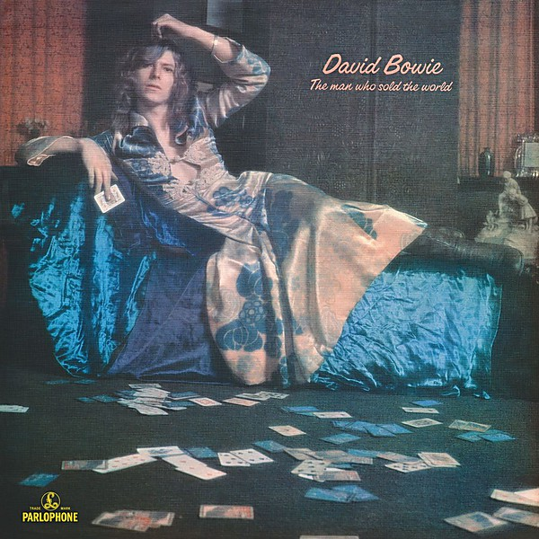

# The Man Who Sold the World

By **David Bowie**

## Album Data

- **Catalog:** Beets
- **Format:** Digital, Album
- **Album:** The Man Who Sold the World
- **Artist:** David Bowie
- **Albumartist:** David Bowie
- **Genre:** Heavy Metal
- **MusicBrainz Album Artist ID:** [5441c29d-3602-4898-b1a1-b77fa23b8e50](https://musicbrainz.org/artist/5441c29d-3602-4898-b1a1-b77fa23b8e50)
- **MusicBrainz Album ID:** [7c394517-1e1d-3720-b005-a17b0a6b07fa](https://musicbrainz.org/release/7c394517-1e1d-3720-b005-a17b0a6b07fa)
- **MusicBrainz Release Group ID:** [2536a41d-fde9-35d5-a6c6-cd4d94ffd916](https://musicbrainz.org/release-group/2536a41d-fde9-35d5-a6c6-cd4d94ffd916)
- **Year:** 1999
- **Catalog #:** 
- **Label:** ISO Records
- **Total Tracks:** 17

## Album Tracks

### Track 01 - The Next Day

- **Artist:** David Bowie
- **Format:** AAC
- **Genre:** Britpop
- **Length:** 3:26
- **MusicBrainz Track ID:** [54096aea-51b1-47c5-a0c5-4d034362535b](https://musicbrainz.org/recording/54096aea-51b1-47c5-a0c5-4d034362535b)
- **Title:** The Next Day
- **Track:** 01
- **Year:** 2013

### Track 02 - Dirty Boys

- **Artist:** David Bowie
- **Format:** AAC
- **Genre:** Glam Rock
- **Length:** 2:58
- **MusicBrainz Track ID:** [59e37b88-e122-4de3-8d5a-f2498edb0b14](https://musicbrainz.org/recording/59e37b88-e122-4de3-8d5a-f2498edb0b14)
- **Title:** Dirty Boys
- **Track:** 02
- **Year:** 2013

### Track 03 - The Stars (Are Out Tonight)

- **Artist:** David Bowie
- **Format:** AAC
- **Genre:** Glam Rock
- **Length:** 3:57
- **MusicBrainz Track ID:** [c0829a79-4898-4954-b5b7-e35dd6e89b1d](https://musicbrainz.org/recording/c0829a79-4898-4954-b5b7-e35dd6e89b1d)
- **Title:** The Stars (Are Out Tonight)
- **Track:** 03
- **Year:** 2013

### Track 04 - Love Is Lost

- **Artist:** David Bowie
- **Format:** AAC
- **Genre:** Britpop
- **Length:** 3:57
- **MusicBrainz Track ID:** [1b16737e-2aab-4f96-89ab-9a49f4816d41](https://musicbrainz.org/recording/1b16737e-2aab-4f96-89ab-9a49f4816d41)
- **Title:** Love Is Lost
- **Track:** 04
- **Year:** 2013

### Track 05 - Where Are We Now?

- **Artist:** David Bowie
- **Format:** AAC
- **Genre:** Britpop
- **Length:** 4:09
- **MusicBrainz Track ID:** [8b1fb6d4-a6d7-44d9-8b9f-fedf7bab62ed](https://musicbrainz.org/recording/8b1fb6d4-a6d7-44d9-8b9f-fedf7bab62ed)
- **Title:** Where Are We Now?
- **Track:** 05
- **Year:** 2013

### Track 06 - Valentine’s Day

- **Artist:** David Bowie
- **Format:** AAC
- **Genre:** Pop Rock
- **Length:** 3:02
- **MusicBrainz Track ID:** [6cdc6fc1-6b69-45a6-95ed-d3de6ee79b09](https://musicbrainz.org/recording/6cdc6fc1-6b69-45a6-95ed-d3de6ee79b09)
- **Title:** Valentine’s Day
- **Track:** 06
- **Year:** 2013

### Track 07 - If You Can See Me

- **Artist:** David Bowie
- **Format:** AAC
- **Genre:** Britpop
- **Length:** 3:12
- **MusicBrainz Track ID:** [0e93eccf-aef1-48a2-bcce-bb30768a9f1d](https://musicbrainz.org/recording/0e93eccf-aef1-48a2-bcce-bb30768a9f1d)
- **Title:** If You Can See Me
- **Track:** 07
- **Year:** 2013

### Track 08 - I’d Rather Be High

- **Artist:** David Bowie
- **Format:** AAC
- **Genre:** Glam Rock
- **Length:** 3:45
- **MusicBrainz Track ID:** [2fab8afe-0614-482b-8583-50cd5d3e1f1b](https://musicbrainz.org/recording/2fab8afe-0614-482b-8583-50cd5d3e1f1b)
- **Title:** I’d Rather Be High
- **Track:** 08
- **Year:** 2013

### Track 09 - Boss of Me

- **Artist:** David Bowie
- **Format:** AAC
- **Genre:** Britpop
- **Length:** 4:09
- **MusicBrainz Track ID:** [65fcf625-b110-4283-b8cd-15c4111dcc56](https://musicbrainz.org/recording/65fcf625-b110-4283-b8cd-15c4111dcc56)
- **Title:** Boss of Me
- **Track:** 09
- **Year:** 2013

### Track 10 - Dancing Out in Space

- **Artist:** David Bowie
- **Format:** AAC
- **Genre:** Post-Rock
- **Length:** 3:21
- **MusicBrainz Track ID:** [93713207-c28a-40f9-956b-b7836e42e615](https://musicbrainz.org/recording/93713207-c28a-40f9-956b-b7836e42e615)
- **Title:** Dancing Out in Space
- **Track:** 10
- **Year:** 2013

### Track 11 - How Does the Grass Grow?

- **Artist:** David Bowie
- **Format:** AAC
- **Genre:** Glam Rock
- **Length:** 4:34
- **MusicBrainz Track ID:** [b94247ac-4a03-4077-99c7-d44f48951659](https://musicbrainz.org/recording/b94247ac-4a03-4077-99c7-d44f48951659)
- **Title:** How Does the Grass Grow?
- **Track:** 11
- **Year:** 2013

### Track 12 - (You Will) Set the World on Fire

- **Artist:** David Bowie
- **Format:** AAC
- **Genre:** Britpop
- **Length:** 3:32
- **MusicBrainz Track ID:** [f6776ad4-221c-4a77-8b83-161b15abed45](https://musicbrainz.org/recording/f6776ad4-221c-4a77-8b83-161b15abed45)
- **Title:** (You Will) Set the World on Fire
- **Track:** 12
- **Year:** 2013

### Track 13 - You Feel So Lonely You Could Die

- **Artist:** David Bowie
- **Format:** AAC
- **Genre:** Britpop
- **Length:** 4:37
- **MusicBrainz Track ID:** [23ca8d07-7492-492a-b78a-e2d8e23e9f3e](https://musicbrainz.org/recording/23ca8d07-7492-492a-b78a-e2d8e23e9f3e)
- **Title:** You Feel So Lonely You Could Die
- **Track:** 13
- **Year:** 2013

### Track 14 - Heat

- **Artist:** David Bowie
- **Format:** AAC
- **Genre:** Shoegaze
- **Length:** 4:25
- **MusicBrainz Track ID:** [d309b725-69a8-41ca-9247-bcc02baeeb0f](https://musicbrainz.org/recording/d309b725-69a8-41ca-9247-bcc02baeeb0f)
- **Title:** Heat
- **Track:** 14
- **Year:** 2013

### Track 15 - So She

- **Artist:** David Bowie
- **Format:** AAC
- **Genre:** Britpop
- **Length:** 2:31
- **MusicBrainz Track ID:** [287763f1-5672-45a3-a05e-d777c00ebb6f](https://musicbrainz.org/recording/287763f1-5672-45a3-a05e-d777c00ebb6f)
- **Title:** So She
- **Track:** 15
- **Year:** 2013

### Track 16 - Plan

- **Artist:** David Bowie
- **Format:** AAC
- **Genre:** Hard Rock
- **Length:** 2:02
- **MusicBrainz Track ID:** [c59f4caa-54b8-46c7-ab64-fa59d0c6feee](https://musicbrainz.org/recording/c59f4caa-54b8-46c7-ab64-fa59d0c6feee)
- **Title:** Plan
- **Track:** 16
- **Year:** 2013

### Track 17 - I’ll Take You There

- **Artist:** David Bowie
- **Format:** AAC
- **Genre:** Art Rock
- **Length:** 2:41
- **MusicBrainz Track ID:** [20dd59f8-b390-410b-b7d9-6e50940fb1aa](https://musicbrainz.org/recording/20dd59f8-b390-410b-b7d9-6e50940fb1aa)
- **Title:** I’ll Take You There
- **Track:** 17
- **Year:** 2013

## See also

- [Aladdin Sane](Aladdin_Sane.md)
- [Best Of Bowie](Best_Of_Bowie.md)
- [Bowie At The Beeb [Disc 1]](Bowie_At_The_Beeb_[Disc_1].md)
- [Bowie At The Beeb [Disc 2]](Bowie_At_The_Beeb_[Disc_2].md)
- [Bowie At The Beeb [Disc 3]](Bowie_At_The_Beeb_[Disc_3].md)
- [ChangesOneBowie](ChangesOneBowie.md)
- [Cracked Actor (Live Los Angeles '74)](Cracked_Actor_Live_Los_Angeles_74.md)
- [Earthling](Earthling.md)
- [Heathen](Heathen.md)
- [Hunky Dory](Hunky_Dory.md)
- [Life On Mars 45](Life_On_Mars_45.md)
- [The Man Who Sold The World (2015 Remastered Version)](The_Man_Who_Sold_The_World_2015_Remastered_Version.md)
- [The Next Day Extra](The_Next_Day_Extra.md)
- [The Next Day](The_Next_Day.md)
- [Young Americans](Young_Americans.md)
- [CD: Bowie At The Beeb (Disc 3)](../../CD/David_Bowie/Bowie_At_The_Beeb_Disc_3.md)
- [CD: ](../../CD/David_Bowie/David_Bowie.md)
- [Roon: Aladdin Sane (2013 Remaster)](../../Roon/David_Bowie/Aladdin_Sane_2013_Remaster.md)
- [Roon: Bowie at the Beeb (The Best of the BBC Sessions 1968-1972)](../../Roon/David_Bowie/Bowie_at_the_Beeb_The_Best_of_the_BBC_Sessions_1968-1972.md)
- [Roon: Brilliant Adventure (1992 – 2001)](../../Roon/David_Bowie/Brilliant_Adventure_1992_–_2001.md)
- [Roon: ChangesOneBowie](../../Roon/David_Bowie/ChangesOneBowie.md)
- [Roon: Cracked Actor (Live, Los Angeles '74)](../../Roon/David_Bowie/Cracked_Actor_Live__Los_Angeles_74.md)
- [Roon: Diamond Dogs (2016 Remaster)](../../Roon/David_Bowie/Diamond_Dogs_2016_Remaster.md)
- [Roon: Glastonbury 2000 (Live)](../../Roon/David_Bowie/Glastonbury_2000_Live.md)
- [Roon: Hunky Dory (2015 Remaster)](../../Roon/David_Bowie/Hunky_Dory_2015_Remaster.md)
- [Roon: Low (2017 Remaster)](../../Roon/David_Bowie/Low_2017_Remaster.md)
- [Roon: Space Oddity (2019 Mix)](../../Roon/David_Bowie/Space_Oddity_2019_Mix.md)
- [Roon: Station to Station (2016 Remaster)](../../Roon/David_Bowie/Station_to_Station_2016_Remaster.md)
- [Roon: The Rise and Fall of Ziggy Stardust and the Spiders from Mars (2012 Remaster)](../../Roon/David_Bowie/The_Rise_and_Fall_of_Ziggy_Stardust_and_the_Spiders_from_Mars_2012_Remaster.md)
- [Roon: Toy (Toy](../../Roon/David_Bowie/Toy_Toy-Box.md)
- [Roon: Young Americans (2016 Remaster)](../../Roon/David_Bowie/Young_Americans_2016_Remaster.md)
- [Vinyl: Aladdin Sane](../../Vinyl/David_Bowie/Aladdin_Sane.md)
- [Vinyl: ChangesOneBowie](../../Vinyl/David_Bowie/ChangesOneBowie.md)
- [Vinyl: Cracked Actor (Live Los Angeles '74)](../../Vinyl/David_Bowie/Cracked_Actor_Live_Los_Angeles_74.md)
- [Vinyl: ](../../Vinyl/David_Bowie/David_Bowie_index.md)
- [Vinyl: David Bowie](../../Vinyl/David_Bowie/David_Bowie.md)
- [Vinyl: Hunky Dory](../../Vinyl/David_Bowie/Hunky_Dory.md)
- [Vinyl: Life On Mars?](../../Vinyl/David_Bowie/Life_On_Mars.md)
- [Vinyl: The Man Who Sold The World](../../Vinyl/David_Bowie/The_Man_Who_Sold_The_World.md)
- [Vinyl: The Rise And Fall Of Ziggy Stardust And The Spiders From Mars](../../Vinyl/David_Bowie/The_Rise_And_Fall_Of_Ziggy_Stardust_And_The_Spiders_From_Mars.md)
- [Vinyl: Young Americans](../../Vinyl/David_Bowie/Young_Americans.md)
