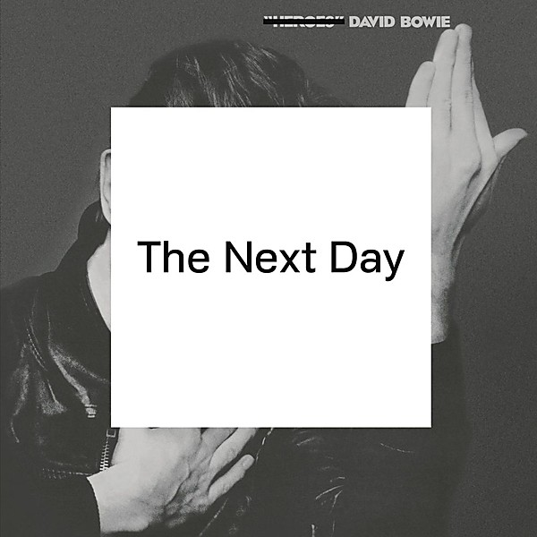

# The Next Day

By **David Bowie**

## Album Data

- **Catalog:** Beets
- **Format:** Digital, Album
- **Album:** The Next Day
- **Artist:** David Bowie
- **Albumartist:** David Bowie
- **Genre:** Art Rock
- **MusicBrainz Album Artist ID:** [5441c29d-3602-4898-b1a1-b77fa23b8e50](https://musicbrainz.org/artist/5441c29d-3602-4898-b1a1-b77fa23b8e50)
- **MusicBrainz Album ID:** [47f6caf4-0818-4bde-a506-be1341fe84f1](https://musicbrainz.org/release/47f6caf4-0818-4bde-a506-be1341fe84f1)
- **MusicBrainz Release Group ID:** [c20be759-d767-4a7c-96c5-7a870ebc3a30](https://musicbrainz.org/release-group/c20be759-d767-4a7c-96c5-7a870ebc3a30)
- **Year:** 2013
- **Catalog #:** 
- **Label:** Warner Music
- **Total Tracks:** 08

## Album Tracks

### Track 01 - Young Americans

- **Artist:** David Bowie
- **Format:** MP3
- **Genre:** Blue-Eyed Soul
- **Length:** 5:13
- **MusicBrainz Track ID:** [dbb7b213-782b-432c-9cd9-0081e73765e9](https://musicbrainz.org/recording/dbb7b213-782b-432c-9cd9-0081e73765e9)
- **Title:** Young Americans
- **Track:** 01
- **Year:** 2016

### Track 02 - Win

- **Artist:** David Bowie
- **Format:** MP3
- **Genre:** Blue-Eyed Soul
- **Length:** 4:47
- **MusicBrainz Track ID:** [e3529c28-a50e-4870-832c-6b11943f1ddc](https://musicbrainz.org/recording/e3529c28-a50e-4870-832c-6b11943f1ddc)
- **Title:** Win
- **Track:** 02
- **Year:** 2016

### Track 03 - Fascination

- **Artist:** David Bowie
- **Format:** MP3
- **Genre:** Blue-Eyed Soul
- **Length:** 5:48
- **MusicBrainz Track ID:** [9d9f87c3-a08c-4594-a70e-a6b1c897841f](https://musicbrainz.org/recording/9d9f87c3-a08c-4594-a70e-a6b1c897841f)
- **Title:** Fascination
- **Track:** 03
- **Year:** 2016

### Track 04 - Right

- **Artist:** David Bowie
- **Format:** MP3
- **Genre:** Blue-Eyed Soul
- **Length:** 4:22
- **MusicBrainz Track ID:** [1bd4cc32-26a1-4d59-82c0-1adde11dc9f6](https://musicbrainz.org/recording/1bd4cc32-26a1-4d59-82c0-1adde11dc9f6)
- **Title:** Right
- **Track:** 04
- **Year:** 2016

### Track 05 - Somebody Up There Likes Me

- **Artist:** David Bowie
- **Format:** MP3
- **Genre:** Blue-Eyed Soul
- **Length:** 6:36
- **MusicBrainz Track ID:** [65e291fc-1bfa-4f06-a7e3-767b5951454b](https://musicbrainz.org/recording/65e291fc-1bfa-4f06-a7e3-767b5951454b)
- **Title:** Somebody Up There Likes Me
- **Track:** 05
- **Year:** 2016

### Track 06 - Across the Universe

- **Artist:** David Bowie
- **Format:** MP3
- **Genre:** Blue-Eyed Soul
- **Length:** 4:33
- **MusicBrainz Track ID:** [bd1f11a5-287a-4ff3-b4ed-2bc8855ca206](https://musicbrainz.org/recording/bd1f11a5-287a-4ff3-b4ed-2bc8855ca206)
- **Title:** Across the Universe
- **Track:** 06
- **Year:** 2016

### Track 07 - Can You Hear Me

- **Artist:** David Bowie
- **Format:** MP3
- **Genre:** Blue-Eyed Soul
- **Length:** 5:08
- **MusicBrainz Track ID:** [bb5714d3-bafe-497d-9bbf-1b47e7b06b0a](https://musicbrainz.org/recording/bb5714d3-bafe-497d-9bbf-1b47e7b06b0a)
- **Title:** Can You Hear Me
- **Track:** 07
- **Year:** 2016

### Track 08 - Fame

- **Artist:** David Bowie
- **Format:** MP3
- **Genre:** Uk Garage
- **Length:** 4:21
- **MusicBrainz Track ID:** [04c5d4a8-b6b7-4421-81ab-e5efb52d9197](https://musicbrainz.org/recording/04c5d4a8-b6b7-4421-81ab-e5efb52d9197)
- **Title:** Fame
- **Track:** 08
- **Year:** 2016

## See also

- [Aladdin Sane](Aladdin_Sane.md)
- [Best Of Bowie](Best_Of_Bowie.md)
- [Bowie At The Beeb [Disc 1]](Bowie_At_The_Beeb_[Disc_1].md)
- [Bowie At The Beeb [Disc 2]](Bowie_At_The_Beeb_[Disc_2].md)
- [Bowie At The Beeb [Disc 3]](Bowie_At_The_Beeb_[Disc_3].md)
- [ChangesOneBowie](ChangesOneBowie.md)
- [Cracked Actor (Live Los Angeles '74)](Cracked_Actor_Live_Los_Angeles_74.md)
- [Earthling](Earthling.md)
- [Heathen](Heathen.md)
- [Hunky Dory](Hunky_Dory.md)
- [Life On Mars 45](Life_On_Mars_45.md)
- [The Man Who Sold The World (2015 Remastered Version)](The_Man_Who_Sold_The_World_2015_Remastered_Version.md)
- [The Man Who Sold the World](The_Man_Who_Sold_the_World.md)
- [The Next Day Extra](The_Next_Day_Extra.md)
- [Young Americans](Young_Americans.md)
- [CD: Bowie At The Beeb (Disc 3)](../../CD/David_Bowie/Bowie_At_The_Beeb_Disc_3.md)
- [CD: ](../../CD/David_Bowie/David_Bowie.md)
- [Roon: Aladdin Sane (2013 Remaster)](../../Roon/David_Bowie/Aladdin_Sane_2013_Remaster.md)
- [Roon: Bowie at the Beeb (The Best of the BBC Sessions 1968-1972)](../../Roon/David_Bowie/Bowie_at_the_Beeb_The_Best_of_the_BBC_Sessions_1968-1972.md)
- [Roon: Brilliant Adventure (1992 – 2001)](../../Roon/David_Bowie/Brilliant_Adventure_1992_–_2001.md)
- [Roon: ChangesOneBowie](../../Roon/David_Bowie/ChangesOneBowie.md)
- [Roon: Cracked Actor (Live, Los Angeles '74)](../../Roon/David_Bowie/Cracked_Actor_Live__Los_Angeles_74.md)
- [Roon: Diamond Dogs (2016 Remaster)](../../Roon/David_Bowie/Diamond_Dogs_2016_Remaster.md)
- [Roon: Glastonbury 2000 (Live)](../../Roon/David_Bowie/Glastonbury_2000_Live.md)
- [Roon: Hunky Dory (2015 Remaster)](../../Roon/David_Bowie/Hunky_Dory_2015_Remaster.md)
- [Roon: Low (2017 Remaster)](../../Roon/David_Bowie/Low_2017_Remaster.md)
- [Roon: Space Oddity (2019 Mix)](../../Roon/David_Bowie/Space_Oddity_2019_Mix.md)
- [Roon: Station to Station (2016 Remaster)](../../Roon/David_Bowie/Station_to_Station_2016_Remaster.md)
- [Roon: The Rise and Fall of Ziggy Stardust and the Spiders from Mars (2012 Remaster)](../../Roon/David_Bowie/The_Rise_and_Fall_of_Ziggy_Stardust_and_the_Spiders_from_Mars_2012_Remaster.md)
- [Roon: Toy (Toy](../../Roon/David_Bowie/Toy_Toy-Box.md)
- [Roon: Young Americans (2016 Remaster)](../../Roon/David_Bowie/Young_Americans_2016_Remaster.md)
- [Vinyl: Aladdin Sane](../../Vinyl/David_Bowie/Aladdin_Sane.md)
- [Vinyl: ChangesOneBowie](../../Vinyl/David_Bowie/ChangesOneBowie.md)
- [Vinyl: Cracked Actor (Live Los Angeles '74)](../../Vinyl/David_Bowie/Cracked_Actor_Live_Los_Angeles_74.md)
- [Vinyl: ](../../Vinyl/David_Bowie/David_Bowie_index.md)
- [Vinyl: David Bowie](../../Vinyl/David_Bowie/David_Bowie.md)
- [Vinyl: Hunky Dory](../../Vinyl/David_Bowie/Hunky_Dory.md)
- [Vinyl: Life On Mars?](../../Vinyl/David_Bowie/Life_On_Mars.md)
- [Vinyl: The Man Who Sold The World](../../Vinyl/David_Bowie/The_Man_Who_Sold_The_World.md)
- [Vinyl: The Rise And Fall Of Ziggy Stardust And The Spiders From Mars](../../Vinyl/David_Bowie/The_Rise_And_Fall_Of_Ziggy_Stardust_And_The_Spiders_From_Mars.md)
- [Vinyl: Young Americans](../../Vinyl/David_Bowie/Young_Americans.md)
