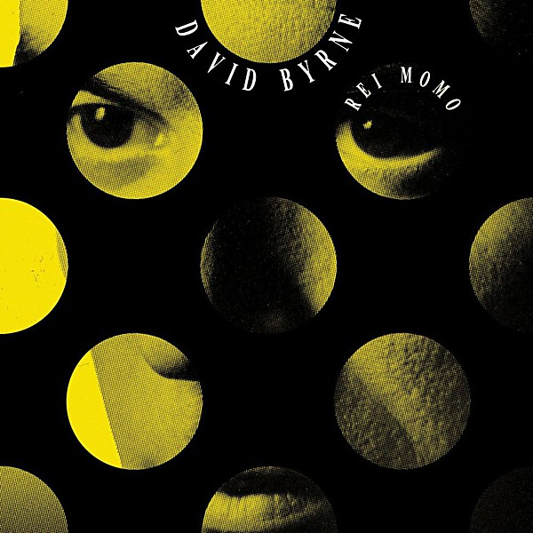

# Rei Momo

By **David Byrne**

## Album Data

- **Catalog:** Beets
- **Format:** Digital, Album
- **Album:** Rei Momo
- **Artist:** David Byrne
- **Albumartist:** David Byrne
- **Genre:** Samba
- **MusicBrainz Album Artist ID:** [d4659efb-b8eb-4f03-95e9-f69ce35967a9](https://musicbrainz.org/artist/d4659efb-b8eb-4f03-95e9-f69ce35967a9)
- **MusicBrainz Album ID:** [e27b981d-709c-4df5-b9ed-b89b5889ca8b](https://musicbrainz.org/release/e27b981d-709c-4df5-b9ed-b89b5889ca8b)
- **MusicBrainz Release Group ID:** [46cc3982-01c5-3beb-bc5d-92bd4fa9c5e9](https://musicbrainz.org/release-group/46cc3982-01c5-3beb-bc5d-92bd4fa9c5e9)
- **Year:** 1989
- **Catalog #:** 9 25990-2
- **Label:** Luaka Bop
- **Total Tracks:** 15

## Album Tracks

### Track 01 - Independence Day

- **Artist:** David Byrne
- **Format:** AAC
- **Genre:** Cumbia
- **Length:** 5:45
- **MusicBrainz Track ID:** [697a2246-3be1-4aa9-92b4-be4bf0efbf85](https://musicbrainz.org/recording/697a2246-3be1-4aa9-92b4-be4bf0efbf85)
- **Title:** Independence Day
- **Track:** 01
- **Year:** 1989

### Track 02 - Make Believe Mambo

- **Artist:** David Byrne
- **Format:** AAC
- **Genre:** World Fusion
- **Length:** 5:23
- **MusicBrainz Track ID:** [eb190eb7-1621-4372-bf5b-3b283dfcfae9](https://musicbrainz.org/recording/eb190eb7-1621-4372-bf5b-3b283dfcfae9)
- **Title:** Make Believe Mambo
- **Track:** 02
- **Year:** 1989

### Track 03 - The Call of the Wild

- **Artist:** David Byrne
- **Format:** AAC
- **Genre:** Pop
- **Length:** 4:53
- **MusicBrainz Track ID:** [86ea93f8-28d3-473a-8855-345da4dad607](https://musicbrainz.org/recording/86ea93f8-28d3-473a-8855-345da4dad607)
- **Title:** The Call of the Wild
- **Track:** 03
- **Year:** 1989

### Track 04 - Dirty Old Town

- **Artist:** David Byrne
- **Format:** AAC
- **Genre:** Pop
- **Length:** 4:13
- **MusicBrainz Track ID:** [8ada1bcd-c34e-479b-8b55-64a281a32593](https://musicbrainz.org/recording/8ada1bcd-c34e-479b-8b55-64a281a32593)
- **Title:** Dirty Old Town
- **Track:** 04
- **Year:** 1989

### Track 05 - The Rose Tattoo

- **Artist:** David Byrne
- **Format:** AAC
- **Genre:** Worldbeat
- **Length:** 3:51
- **MusicBrainz Track ID:** [4f21bc02-b152-4142-8715-2e73f611b0e2](https://musicbrainz.org/recording/4f21bc02-b152-4142-8715-2e73f611b0e2)
- **Title:** The Rose Tattoo
- **Track:** 05
- **Year:** 1989

### Track 06 - Loco De Amor

- **Artist:** David Byrne
- **Format:** AAC
- **Genre:** Worldbeat
- **Length:** 3:46
- **MusicBrainz Track ID:** [685f76b4-c695-4cab-8693-cdb428328dfe](https://musicbrainz.org/recording/685f76b4-c695-4cab-8693-cdb428328dfe)
- **Title:** Loco De Amor
- **Track:** 06
- **Year:** 1989

### Track 07 - The Dream Police

- **Artist:** David Byrne
- **Format:** AAC
- **Genre:** Pop
- **Length:** 3:00
- **MusicBrainz Track ID:** [a1a6e146-48ce-4d94-aa08-e40fce6207d1](https://musicbrainz.org/recording/a1a6e146-48ce-4d94-aa08-e40fce6207d1)
- **Title:** The Dream Police
- **Track:** 07
- **Year:** 1989

### Track 08 - Don't Want to Be Part of Your World

- **Artist:** David Byrne
- **Format:** AAC
- **Genre:** Pop
- **Length:** 4:57
- **MusicBrainz Track ID:** [3374ad68-ae2c-4ccf-acff-363cd66e5487](https://musicbrainz.org/recording/3374ad68-ae2c-4ccf-acff-363cd66e5487)
- **Title:** Don't Want to Be Part of Your World
- **Track:** 08
- **Year:** 1989

### Track 09 - Marching Through the Wilderness

- **Artist:** David Byrne
- **Format:** AAC
- **Genre:** Rock
- **Length:** 4:30
- **MusicBrainz Track ID:** [bacaad82-4110-4692-acfc-660ea6111661](https://musicbrainz.org/recording/bacaad82-4110-4692-acfc-660ea6111661)
- **Title:** Marching Through the Wilderness
- **Track:** 09
- **Year:** 1989

### Track 10 - Good and Evil

- **Artist:** David Byrne
- **Format:** AAC
- **Genre:** Pop
- **Length:** 4:34
- **MusicBrainz Track ID:** [baaa84b1-702b-425e-a9a3-e5905c7fa676](https://musicbrainz.org/recording/baaa84b1-702b-425e-a9a3-e5905c7fa676)
- **Title:** Good and Evil
- **Track:** 10
- **Year:** 1989

### Track 11 - Lie to Me

- **Artist:** David Byrne
- **Format:** AAC
- **Genre:** Pop
- **Length:** 3:37
- **MusicBrainz Track ID:** [3a8cd070-21ab-4ce5-baca-350ad177617a](https://musicbrainz.org/recording/3a8cd070-21ab-4ce5-baca-350ad177617a)
- **Title:** Lie to Me
- **Track:** 11
- **Year:** 1989

### Track 12 - Office Cowboy

- **Artist:** David Byrne
- **Format:** AAC
- **Genre:** Pagode
- **Length:** 3:41
- **MusicBrainz Track ID:** [a3d95be5-71bf-47eb-87b1-2b340f6acff8](https://musicbrainz.org/recording/a3d95be5-71bf-47eb-87b1-2b340f6acff8)
- **Title:** Office Cowboy
- **Track:** 12
- **Year:** 1989

### Track 13 - Women vs. Men

- **Artist:** David Byrne
- **Format:** AAC
- **Genre:** Pop
- **Length:** 4:05
- **MusicBrainz Track ID:** [6295346f-dbce-43b4-8649-e1776955faf8](https://musicbrainz.org/recording/6295346f-dbce-43b4-8649-e1776955faf8)
- **Title:** Women vs. Men
- **Track:** 13
- **Year:** 1989

### Track 14 - Carnival Eyes

- **Artist:** David Byrne
- **Format:** AAC
- **Genre:** Rock
- **Length:** 4:04
- **MusicBrainz Track ID:** [9f60b731-4d9f-4eb7-bc8f-5fbed4deb2f5](https://musicbrainz.org/recording/9f60b731-4d9f-4eb7-bc8f-5fbed4deb2f5)
- **Title:** Carnival Eyes
- **Track:** 14
- **Year:** 1989

### Track 15 - I Know Sometimes a Man Is Wrong

- **Artist:** David Byrne
- **Format:** AAC
- **Genre:** Rock
- **Length:** 3:11
- **MusicBrainz Track ID:** [0fd117cb-166d-460d-8a60-72bbbf54ae21](https://musicbrainz.org/recording/0fd117cb-166d-460d-8a60-72bbbf54ae21)
- **Title:** I Know Sometimes a Man Is Wrong
- **Track:** 15
- **Year:** 1989

## See also

- [CD: ](../../CD/David_Byrne/David_Byrne.md)
- [CD: Rei Momo](../../CD/David_Byrne/Rei_Momo.md)
- [Roon: Rei Momo](../../Roon/David_Byrne/Rei_Momo.md)
