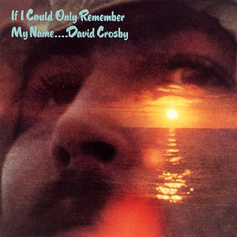

# If I Could Only Remember My Name

By **David Crosby**

## Album Data

- **Catalog:** Beets
- **Format:** Digital, Album
- **Album:** If I Could Only Remember My Name
- **Artist:** David Crosby
- **Albumartist:** David Crosby
- **Genre:** Soft Rock
- **MusicBrainz Album Artist ID:** 
- **MusicBrainz Album ID:** 
- **MusicBrainz Release Group ID:** 
- **Year:** 1971
- **Catalog #:** 
- **Label:** 
- **Total Tracks:** 00

## Album Tracks

### Track 01 - Music Is Love

- **Artist:** David Crosby
- **Format:** MP3
- **Genre:** Folk Rock
- **Length:** 3:23
- **MusicBrainz Track ID:** 
- **Title:** Music Is Love
- **Track:** 01
- **Year:** 1971

### Track 02 - Cowboy Movie

- **Artist:** David Crosby
- **Format:** MP3
- **Genre:** Soft Rock
- **Length:** 8:16
- **MusicBrainz Track ID:** 
- **Title:** Cowboy Movie
- **Track:** 02
- **Year:** 1971

### Track 03 - Tamalpais High (at about 3)

- **Artist:** David Crosby
- **Format:** MP3
- **Genre:** Soft Rock
- **Length:** 3:33
- **MusicBrainz Track ID:** 
- **Title:** Tamalpais High (at about 3)
- **Track:** 03
- **Year:** 1971

### Track 04 - Laughing

- **Artist:** David Crosby
- **Format:** MP3
- **Genre:** Southern Rock
- **Length:** 5:27
- **MusicBrainz Track ID:** 
- **Title:** Laughing
- **Track:** 04
- **Year:** 1971

### Track 05 - What Are Their Names

- **Artist:** David Crosby
- **Format:** MP3
- **Genre:** Folk Rock
- **Length:** 4:17
- **MusicBrainz Track ID:** 
- **Title:** What Are Their Names
- **Track:** 05
- **Year:** 1971

### Track 06 - Traction in the Rain

- **Artist:** David Crosby
- **Format:** MP3
- **Genre:** Lo-Fi
- **Length:** 3:46
- **MusicBrainz Track ID:** 
- **Title:** Traction in the Rain
- **Track:** 06
- **Year:** 1971

### Track 07 - Song with No Words (Tree with No Leaves)

- **Artist:** David Crosby
- **Format:** MP3
- **Genre:** Rock And Roll
- **Length:** 6:05
- **MusicBrainz Track ID:** 
- **Title:** Song with No Words (Tree with No Leaves)
- **Track:** 07
- **Year:** 1971

### Track 08 - Orléans

- **Artist:** David Crosby
- **Format:** MP3
- **Genre:** Soft Rock
- **Length:** 2:01
- **MusicBrainz Track ID:** 
- **Title:** Orléans
- **Track:** 08
- **Year:** 1971

### Track 09 - I'd Swear There Was Somebody Here

- **Artist:** David Crosby
- **Format:** MP3
- **Genre:** Soft Rock
- **Length:** 1:24
- **MusicBrainz Track ID:** 
- **Title:** I'd Swear There Was Somebody Here
- **Track:** 09
- **Year:** 1971

### Track 01 - Music Is Love

- **Artist:** David Crosby
- **Format:** MP3
- **Genre:** Folk Rock
- **Length:** 3:22
- **MusicBrainz Track ID:** 
- **Title:** Music Is Love
- **Track:** 01
- **Year:** 2005

### Track 02 - Cowboy Movie

- **Artist:** David Crosby
- **Format:** MP3
- **Genre:** Soft Rock
- **Length:** 8:11
- **MusicBrainz Track ID:** 
- **Title:** Cowboy Movie
- **Track:** 02
- **Year:** 2005

### Track 03 - Tamalpais High (At About 3)

- **Artist:** David Crosby
- **Format:** MP3
- **Genre:** Soft Rock
- **Length:** 3:32
- **MusicBrainz Track ID:** 
- **Title:** Tamalpais High (At About 3)
- **Track:** 03
- **Year:** 2005

### Track 04 - Laughing

- **Artist:** David Crosby
- **Format:** MP3
- **Genre:** Southern Rock
- **Length:** 5:25
- **MusicBrainz Track ID:** 
- **Title:** Laughing
- **Track:** 04
- **Year:** 2005

### Track 05 - What Are Their Names

- **Artist:** David Crosby
- **Format:** MP3
- **Genre:** Folk Rock
- **Length:** 4:14
- **MusicBrainz Track ID:** 
- **Title:** What Are Their Names
- **Track:** 05
- **Year:** 2005

### Track 06 - Traction In The Rain

- **Artist:** David Crosby
- **Format:** MP3
- **Genre:** Lo-Fi
- **Length:** 3:46
- **MusicBrainz Track ID:** 
- **Title:** Traction In The Rain
- **Track:** 06
- **Year:** 2005

### Track 07 - Song With No Words (Tree With No Leaves)

- **Artist:** David Crosby
- **Format:** MP3
- **Genre:** Rock And Roll
- **Length:** 6:00
- **MusicBrainz Track ID:** 
- **Title:** Song With No Words (Tree With No Leaves)
- **Track:** 07
- **Year:** 2005

### Track 08 - Orleans

- **Artist:** David Crosby
- **Format:** MP3
- **Genre:** Folk Rock
- **Length:** 1:56
- **MusicBrainz Track ID:** 
- **Title:** Orleans
- **Track:** 08
- **Year:** 2005

### Track 09 - I'd Swear There Was Somebody Here

- **Artist:** David Crosby
- **Format:** MP3
- **Genre:** Soft Rock
- **Length:** 1:19
- **MusicBrainz Track ID:** 
- **Title:** I'd Swear There Was Somebody Here
- **Track:** 09
- **Year:** 2005

## See also

- [Roon: Graham Nash David Crosby](../../Roon/David_Crosby/Graham_Nash_David_Crosby.md)
- [Roon: If I Could Only Remember My Name (50th Anniversary Edition; 2021 Remaster)](../../Roon/David_Crosby/If_I_Could_Only_Remember_My_Name_50th_Anniversary_Edition;_2021_Remaster.md)
- [Roon: If I Could Only Remember My Name](../../Roon/David_Crosby/If_I_Could_Only_Remember_My_Name.md)
- [Vinyl: ](../../Vinyl/David_Crosby/David_Crosby.md)
- [Vinyl: If I Could Only Remember My Name](../../Vinyl/David_Crosby/If_I_Could_Only_Remember_My_Name.md)
