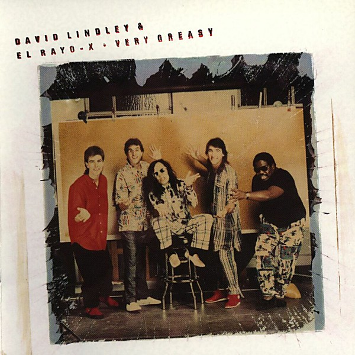

# Very Greasy

By **David Lindley & El Rayo-X**

## Album Data

- **Catalog:** Beets
- **Format:** Digital, Album
- **Album:** Very Greasy
- **Artist:** David Lindley & El Rayo-x
- **Albumartist:** David Lindley & El Rayo-X
- **Genre:** Americana
- **MusicBrainz Album Artist ID:** [acc8a592-5a38-48c7-9bd2-0c2987ab514c](https://musicbrainz.org/artist/acc8a592-5a38-48c7-9bd2-0c2987ab514c)
- **MusicBrainz Album ID:** [119b71c7-44f1-49fa-8672-f9222f1cbd4d](https://musicbrainz.org/release/119b71c7-44f1-49fa-8672-f9222f1cbd4d)
- **MusicBrainz Release Group ID:** [2d033321-7ded-4671-9b33-8cab1961301d](https://musicbrainz.org/release-group/2d033321-7ded-4671-9b33-8cab1961301d)
- **Year:** 1988
- **Catalog #:** 9 60768-2
- **Label:** Elektra
- **Total Tracks:** 10

## Album Tracks

### Track 01 - Gimme Da 'Ting

- **Artist:** David Lindley & El Rayo-X
- **Format:** ALAC
- **Genre:** Americana
- **Length:** 4:44
- **MusicBrainz Track ID:** [731c316a-f2eb-43d7-bf7d-9730de40f55a](https://musicbrainz.org/recording/731c316a-f2eb-43d7-bf7d-9730de40f55a)
- **Title:** Gimme Da 'Ting
- **Track:** 01
- **Year:** 1988

### Track 02 - I Just Can't Work No Longer

- **Artist:** David Lindley & El Rayo-X
- **Format:** ALAC
- **Genre:** Americana
- **Length:** 3:41
- **MusicBrainz Track ID:** [e25f2f74-9e44-4be6-91b1-4d96f510aa6d](https://musicbrainz.org/recording/e25f2f74-9e44-4be6-91b1-4d96f510aa6d)
- **Title:** I Just Can't Work No Longer
- **Track:** 02
- **Year:** 1988

### Track 03 - Do Ya' Wanna Dance?

- **Artist:** David Lindley & El Rayo-X
- **Format:** ALAC
- **Genre:** Americana
- **Length:** 3:52
- **MusicBrainz Track ID:** [0bec2756-ce1d-48ee-a768-4fe189789d78](https://musicbrainz.org/recording/0bec2756-ce1d-48ee-a768-4fe189789d78)
- **Title:** Do Ya' Wanna Dance?
- **Track:** 03
- **Year:** 1988

### Track 04 - Talk About You

- **Artist:** David Lindley & El Rayo-X
- **Format:** ALAC
- **Genre:** Americana
- **Length:** 3:06
- **MusicBrainz Track ID:** [a59d23a8-77c9-4712-a73d-8a196037d3a3](https://musicbrainz.org/recording/a59d23a8-77c9-4712-a73d-8a196037d3a3)
- **Title:** Talk About You
- **Track:** 04
- **Year:** 1988

### Track 05 - Papa Was a Rolling Stone

- **Artist:** David Lindley & El Rayo-X
- **Format:** ALAC
- **Genre:** Americana
- **Length:** 5:00
- **MusicBrainz Track ID:** [3bbdbf2f-4953-4472-9e94-7781bd351e6e](https://musicbrainz.org/recording/3bbdbf2f-4953-4472-9e94-7781bd351e6e)
- **Title:** Papa Was a Rolling Stone
- **Track:** 05
- **Year:** 1988

### Track 06 - Werewolves of London

- **Artist:** David Lindley & El Rayo-X
- **Format:** ALAC
- **Genre:** Americana
- **Length:** 3:43
- **MusicBrainz Track ID:** [47e60aa2-2d1e-4b53-aaff-555cf8617547](https://musicbrainz.org/recording/47e60aa2-2d1e-4b53-aaff-555cf8617547)
- **Title:** Werewolves of London
- **Track:** 06
- **Year:** 1988

### Track 07 - Texas Tango

- **Artist:** David Lindley & El Rayo-X
- **Format:** ALAC
- **Genre:** Americana
- **Length:** 3:25
- **MusicBrainz Track ID:** [f53bad1d-5663-42aa-943c-2c8b8567f0ea](https://musicbrainz.org/recording/f53bad1d-5663-42aa-943c-2c8b8567f0ea)
- **Title:** Texas Tango
- **Track:** 07
- **Year:** 1988

### Track 08 - Never Knew Her

- **Artist:** David Lindley & El Rayo-X
- **Format:** ALAC
- **Genre:** Americana
- **Length:** 3:52
- **MusicBrainz Track ID:** [6c39e161-02be-4a3b-90d3-75e931a9a7a7](https://musicbrainz.org/recording/6c39e161-02be-4a3b-90d3-75e931a9a7a7)
- **Title:** Never Knew Her
- **Track:** 08
- **Year:** 1988

### Track 09 - Talkin' to the Wino Too

- **Artist:** David Lindley & El Rayo-X
- **Format:** ALAC
- **Genre:** Americana
- **Length:** 3:14
- **MusicBrainz Track ID:** [eaed589c-64f1-4e1f-a7fb-a8b31e406c5e](https://musicbrainz.org/recording/eaed589c-64f1-4e1f-a7fb-a8b31e406c5e)
- **Title:** Talkin' to the Wino Too
- **Track:** 09
- **Year:** 1988

### Track 10 - Tiki Torches at Twilight

- **Artist:** David Lindley & El Rayo-X
- **Format:** ALAC
- **Genre:** Americana
- **Length:** 3:49
- **MusicBrainz Track ID:** [cae60165-89a3-41f0-909b-5500082559f2](https://musicbrainz.org/recording/cae60165-89a3-41f0-909b-5500082559f2)
- **Title:** Tiki Torches at Twilight
- **Track:** 10
- **Year:** 1988

